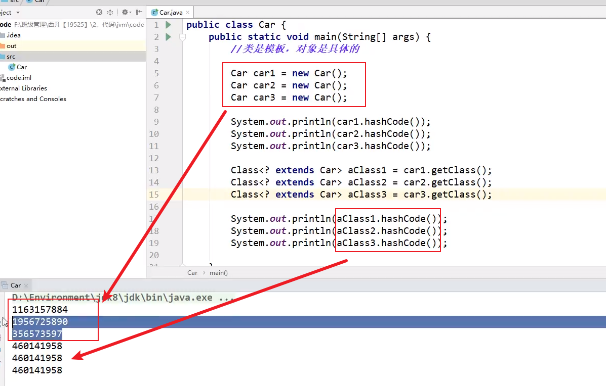
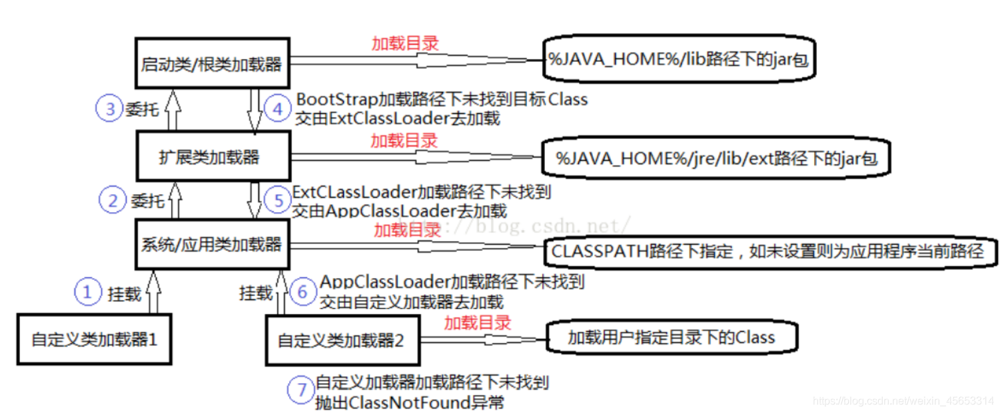
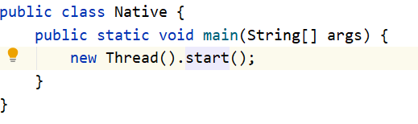
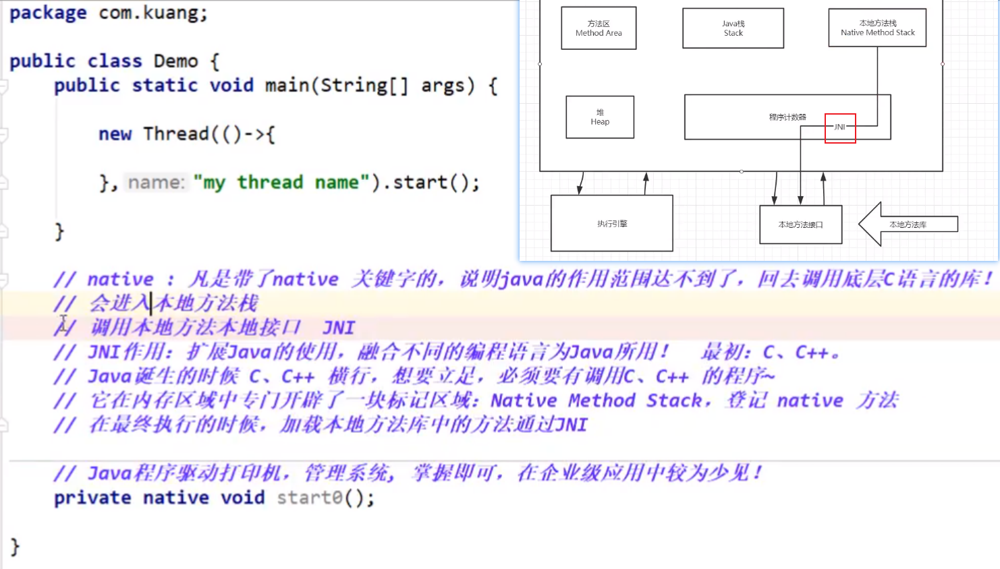
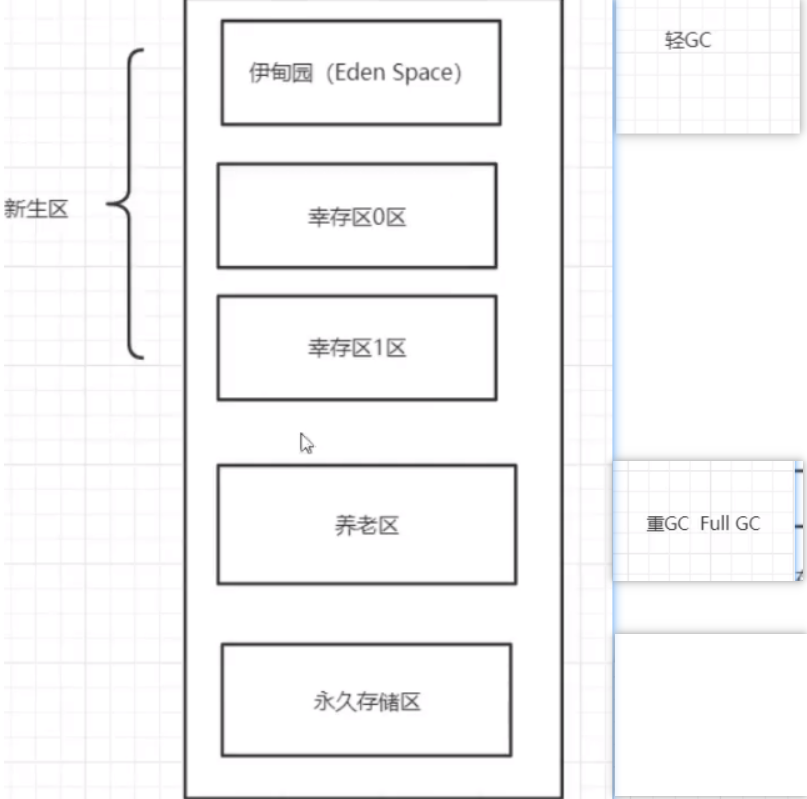
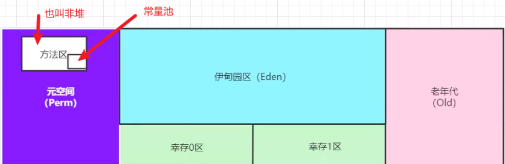
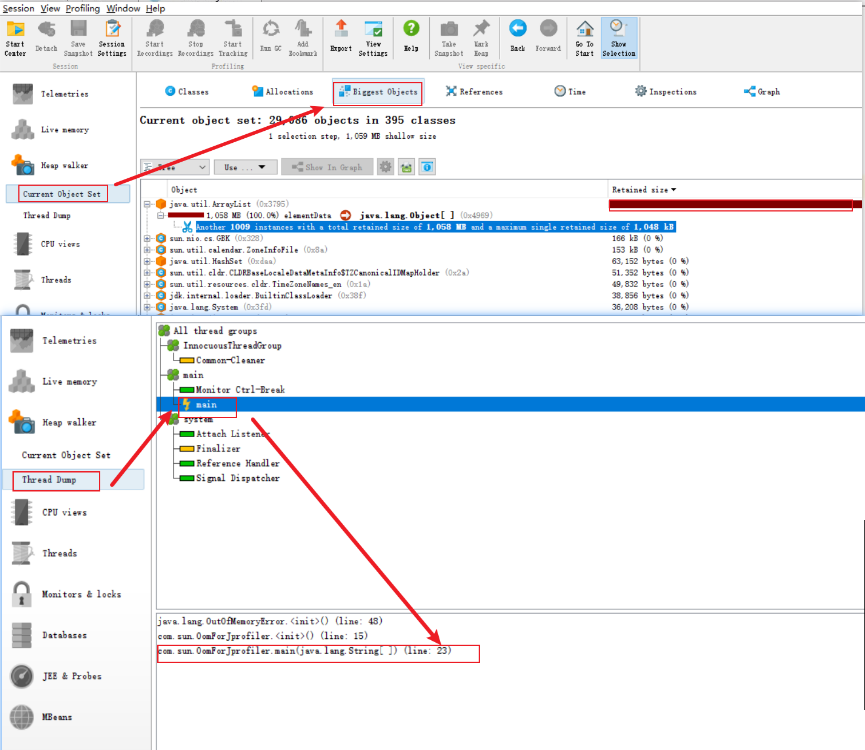
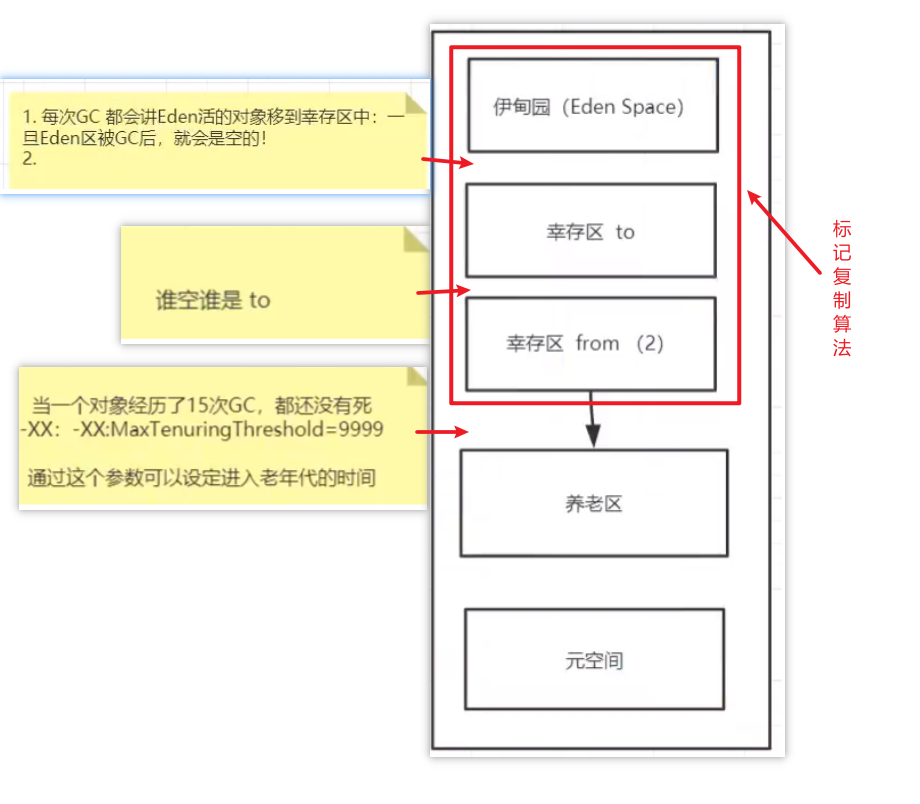
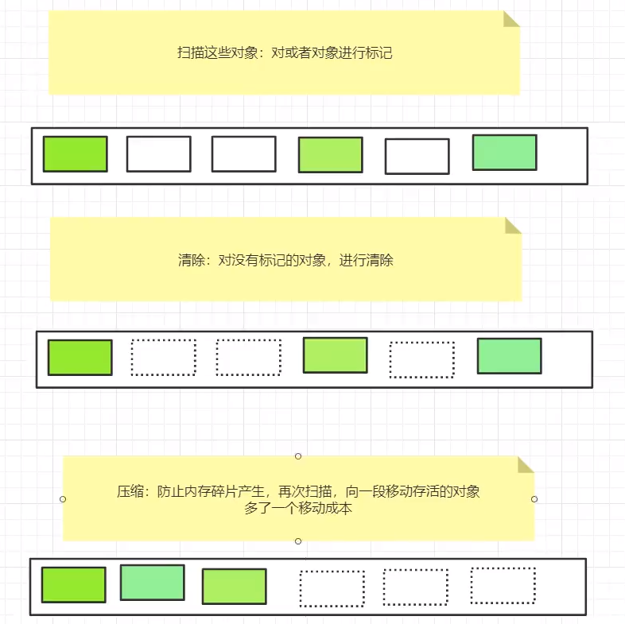

# JVM探索

网上改造过的KuangShen JVM 笔记来源：https://github.com/xudongyin1/Study-Notes/blob/master/Java/JVM.md

接近原笔记，但微微改动：https://blog.csdn.net/weixin_45653314/article/details/111145660

- [JVM内存模型-详细版](https://www.processon.com/view/5ea567b163768974669293f3)
- [jvm内存模型](https://www.processon.com/view/5c31d6e2e4b0fa03ce8d3017)：画的超级好


- 请你谈谈你对JVM的理解？java8虚拟机和之前的变化更新？
- 什么是OOM，什么是栈溢出StackOverFlowError？怎么分析？
- JVM的常用调优参数有哪些？
- 内存快照如何抓取，怎么分析Dump文件？知道吗？
- 谈谈JVM中，类加载器你的认识？


## 1JVM的位置

- java程序泡在jvm上面，jre-jvm， 在操作系统之上，最底下是硬件系统。
- linux上跑jar,但不开发，可以直接安装jre就可以了，不必安装JDK


## 2 JVM的体系结构


- [体系结构](https://www.processon.com/view/5ea567b163768974669293f3)
- [jvm内存模型](https://www.processon.com/view/5c31d6e2e4b0fa03ce8d3017)：画的超级好
- jvm调优：主要说调“方法区”和“堆“（99% 是堆），==而”栈“、”本地方法栈“、”程序计数器“不存在垃圾回收一事==
- 虚拟机试图使用最大内存为电脑内存的1/4, 而jvm初始化内存为1/64（**-Xms1024m -Xmx1024m -XX:+PrintGCDetails**）


## 3 类加载器

- 定义： 类的加载指的是将类的.class文件中的二进制数据读入到内存中，将其放在运行时数据区的方法区内，然后在堆区创建一个 java.lang.Class对象，用来封装类在方法区内的数据结构
- 作用：加载类文件，引用在栈中，具体实例在堆中





虚拟器自带三种类加载器

- 启动类加载器（根，Bootstrap）

- 扩展类加载器，Ext

- 应用程序加载器（系统类加载器SystemAppClass 或者叫 Applicaton）

- CustomClassLoader（用户自定义类加载器）

  `java`编写,用户自定义的类加载器,可加载指定路径的`class`文件


## 4 双亲委派机制

### Java类加载机制：

[Java类加载机制，你理解了吗](https://baijiahao.baidu.com/s？id=1636309817155065432&wfr=spider&for=pc)

### Java双亲委派机制及作用：

[面试官：java双亲委派机制及作用](https://www.jianshu.com/p/1e4011617650)

1. 防止重复加载同一个`.class`。通过委托去向上面问一问，加载过了，就不用再加载一遍。
2. 保证数据安全。保证核心`.class`不能被篡改。通过委托方式，==不会去篡改核心`.class`==，即使篡改也不会去加载，即使加载也不会是同一个`.class`对象了。


- 当某个类加载器需要加载某个`.class`文件时，它首先把这个任务委托给他的上级类加载器，递归这个操作，如果上级的类加载器没有加载，自己才会去加载这个类。


>note： 程序员故意写java.lang.String，经过双亲委派机制，确保安全加载，都这报错。


```java
public class Student {
    @Override
    public String toString() {
        return "Student{}";
    }

    public static void main(String[] args) {
        Student student = new Student();
        System.out.println(student.getClass().getClassLoader().toString()); // AppClassLoader
    }

    /**
     * 1. 类加载器收到请求，AppClassLoader  ---> ExtClassLoader（D:Environment\java\jre\lib\ext)  ---> Bootstrap
     * 2. 讲这个请求委托给父类去完成，一直向上委托，直到启动类加载器（Bootstrap)
     * 3. 启动器检查 是否能够加载当前类，能够就加载结束，使用当前类，否则不能够就跑出异常。
     * 4. 重复步骤3.
     *
     * Class Not found: 是
     * null：
     */
}
```


当一个类收到了类加载请求，他首先不会尝试自己去加载这个类，而是把这个请求委派给父类去完成，每一个层次类加载器都是如此，因此
所有的加载请求都应该传送到启动类加载其中，只有当父类加载器反馈自己无法完成这个请求的时候（在它的加载路径下没有找到所需加载
的Class）， 子类加载器才会尝试自己去加载。
采用双亲委派的一个好处是比如加载位于 rt.jar 包中的类 java.lang.Object，不管是哪个加载器加载这个类，最终都是委托给顶层的启动类
加载器进行加载，这样就保证了使用不同的类加载器最终得到的都是同样一个 Object 对象


双亲委派的好处：把自己编写的类放入java.lang包，自己定义的，不是jar包里面的。这样会报错，因为加载自己编写的类会被委托到BootStrap,这个加载器会把jar包里面的String类加载进内存，所以加载不到自己的类。可以把自己的类写进去bin/ext包


## 5 沙箱安全机制

- Java安全模型核心
- 沙箱：限制程序的运行时环境
- 域Domain概念
- 将java代码限定在虚拟机特定的运行范围内，严格限制代码对本地系统资源的访问，这样措施保证对代码的有效隔离，防止对本地系统的破坏


ava安全模型的核心就是Java沙箱(sandbox) , ？

什么是沙箱？沙箱是一个限制程序运行的环境。沙箱机制就是将Java代码限定在虚拟机(JVM)特定的运行范围中，并且严格限制代码对本地系统资源访问，通过这样的措施来保证对代码的有效隔离，防止对本地系统造成破坏。

沙箱主要限制系统资源访问，那系统资源包括什么？ CPU、内存、文件系统、网络。不同级别的沙箱对这些资源访问的限制也可以不一样。 所有的Java程序运行都可以指定沙箱，可以定制安全策略。

在Java中将执行程序分成本地代码和远程代码两种，本地代码默认视为可信任的，而远程代码则被看作是不受信的。对于授信的本地代码,可以访问一切本地资源。而对于非授信的远程代码在早期的Java实现中，安全依赖于沙箱Sandbox)机制。如下图所示JDK1.0安全模型 

图 JDK1.0安全模型

但如此严格的安全机制也给程序的功能扩展带来障碍，比如当用户希望远程代码访问本地系统的文件时候，就无法实现。因此在后续的Java1.1版本中，针对安全机制做了改进，增加了安全策略，允许用户指定代码对本地资源的访问权限。

图 JDK1.1安全模型

在Java1.2版本中，再次改进了安全机制，增加了代码签名。不论本地代码或是远程代码，都会按照用户的安全策略设定，由类加载器加载到虚拟机中权限不同的运行空间，来实现差异化的代码执行权限控制

图 JDK1.2安全模型

当前最新的安全机制实现，则引入了域(Domain)的概念。虚拟机会把所有代码加载到不同的系统域和应用域,系统域部分专门负责与关键资源进行交互，而各个应用域部分则通过系统域的部分代理来对各种需要的资源进行访问。虚拟机中不同的受保护域(Protected Domain),对应不一样的权限(Permission)。存在于不同域中的类文件就具有了当前域的全部权限


组成沙箱的基本组件

- 字节码校验器(bytecode verifier)：确保Java类文件遵循Java语言规范。这样可以帮助Java程序实现内存保护。但并不是所有的类文件都会经过字节码校验，比如核心类。 
- 类�b载器(class loader)：
  - 其中类装载器在3个方面对Java沙箱起作用 
    -  它防止恶意代码去干涉善意的代码;
    -  它守护了被信任的类库边界; 
    -  它将代码归入保护域,确定了代码可以进行哪些操作。 
  - 虚拟机为不同的类加载器载入的类提供不同的命名空间，命名空间由一系列唯一的名称组成， 每一个被装载的类将有一个名字，这个命名空间是由Java虚拟机为每一个类装载器维护的，它们互相之间甚至不可见。 类装载器采用的机制是双亲委派模式。 
    - 从最内层JVM自带类加载器开始加载,外层恶意同名类得不到加载从而无法使用;
    - 由于严格通过包来区分了访问域,外层恶意的类通过内置代码也无法获得权限访问到内层类，破坏代码就自然无法生效。
- 存取控制器(access controller)：存取控制器可以控制核心API对操作系统的存取权限，而这个控制的策略设定,可以由用户指定。
- 安全管理器(security manager)： 是核心API和操作系统之间的主要接口。实现权限控制，比存取控制器优先级高。
- 安全软件包(security package)： java.security下的类和扩展包下的类，允许用户为自己的应用增加新的安全特性，包括:  安全提供者 \ 消息摘要 \ 数字签名 \ 加密 \ 鉴别


## 6 Native

- 调用底层c，c++语言库
- native -> jni -> 本地方法接口 -> 本地方法库


- 本地方法栈
- 一般用的不多，硬件开发用的多


理解：

如图，线程级别的就是java处理不了的。点进start()方法，里面会调用一个抽象方法。假如自己编写一个不是抽象类，在里面编写一个抽象方法会报错，假如假如native关键字不会报错，但运行不了。


？ native：凡是带了native关键字的，说明java的作用范围达不到了，回去调用底层c语言的库! ？ 会进入本地方法栈 ？ 调用本地方法本地接口 JNI (Java Native Interface) ？ JNI作用:开拓Java的使用，融合不同的编程语言为Java所用!最初: C、C++ ？ Java诞生的时候C、C++横行，想要立足，必须要有调用C、C++的程序 ？ 它在内存区域中专门开辟了一块标记区域: Native Method Stack，登记native方法 ？ 在最终执行的时候，加载本地方法库中的方法通过JNI ？ 例如：Java程序驱动打印机，管理系统，掌握即可，在企业级应用比较少 ？ private native void start0(); ？ //调用其他接口:Socket. . WebService~. .http~

Native Method Stack
？它的具体做法是Native Method Stack中登记native方法，在( Execution Engine )执行引擎执行的时候加载Native Libraies。[本地库]

Native Interface本地接口
？本地接口的作用是融合不同的编程语言为Java所用，它的初衷是融合C/C++程序, Java在诞生的时候是C/C++横行的时候，想要立足，必须有调用C、C++的程序，于是就在内存中专门开辟了块区域处理标记为native的代码，它的具体做法是在**Native Method Stack 中登记native方法**,在( Execution Engine )执行引擎执行的时候加载Native Libraies。 ？目前该方法使用的越来越少了，除非是与硬件有关的应用，比如通过Java程序驱动打印机或者Java系统管理生产设备，在企业级应用中已经比较少见。因为现在的异构领域间通信很发达，比如可以使用Socket通信,也可以使用Web Service




## 7 PC程序计数器

- pc寄存器
- 程序计数器Program Counter Register
- 每个线程都有一个程序计数器，线程私有，就是一个指针，指向方法区中的方法字节码（用来存储指向下一条指令的地址， 也即即将要执行的指令代码）
- 非常狭小的空间 --可以忽略不计

## 8 方法区

- 所有线程共享

- ==静态变量，常量，类信息（构造方法，接口定义）、运行时的常量池也存在方法区中，但是实例变量存在堆内存中，和方法区无关==

  > static、final 、Class(类模板)、运行时的常量池

## 9 栈

- 栈：先进后出，后进先出，堆：先进先出，后进后出
- 线程结束，栈内存释放

> sun：main也是线程，一旦线程结束，栈就结束了


- 主管程序的运行
- 栈里面存放的东西：8大基本类型，实例方法，对象引用（Ox8888)
- 栈帧：父帧子帧，每一个在执行的方法都会产生栈帧


- 栈满报错：StackOverflowError

==画出1个对象实例化的过程，栈，堆，方法区的实力关系==


==对象实例化的过程，new的过程：==

1. 先丢1个常量，到栈里面
2. 在丢1个具体实例的引用，到堆里面
3. 对实例指向静态常量池，里面1个常量


### 疑问

1. 栈里面存了那些东西，怎么存的？
2. 方法区，里面存了什么东西？


## 10 三种JVM

- SUN 公司 - HotSpot （使我们主要研究的）
- BEA 公司 JRocket（世界上最快的JVM，适合军事，）
- IBM 公司 J9

## 11 堆

- 一个JVM只有一个堆内存

- 保存我们所有引用类型的真实对象

- 3个区域

  - 新生区（伊甸园）: 所有的对象都new在了伊甸园去，从中出生
    - 伊甸园满了，就轻GC，有些变量会移动到幸存区
    - 幸存区满了，会出发重GC，还剩下的，就到了老年区。
    - 总的来说，到老年区的占所有new的，不到1%。
  - 养老区-- 老年区 --从新生区（幸存0幸存1）中顺下来的，干不掉，杀不死
  - ==永久区==
    - 永久区是一个常驻内存区域，用于存放JDK自身携带的Class对象，Interface元数据，==存储的是Java运行的一些环境==
    - 版本：
      - jdk1.6之前：叫永久代，常量池是在`方法区`
      - jdk1.7：永久代（提出要慢慢退化，去永久代），常量池在`堆`中 
      - jdk1.8之后：无永久代，常量池在`元空间`
    - 那些情况可能会在永久区，就一下子崩掉了：
      - 此区域不存在垃圾回收，但是也会崩（ 启动了大量第三方jar） 
      - 大量动态生成的反射类
      - Tomcat部署了太多应用
    - 关闭虚拟机就会释放这块内存

  





### 堆的结构（1.8以后包含方法区）



元空间：==逻辑上存在，物理上不存在==

- PSYoungGen + ParOldGen  = 981.5？，故而发现，元空间（Metaspace）在物理上并没有分配内存。


- gc垃圾回收主要针对新生区（伊甸园区）和养老区

  ```shell
  max:981.5M
  total:981.5M
  Heap
   PSYoungGen      total 305664K, used 15729K [0x00000000eab00000, 0x0000000100000000, 0x0000000100000000)
    eden space 262144K, 6% used [0x00000000eab00000,0x00000000eba5c420,0x00000000fab00000)
    from space 43520K, 0% used [0x00000000fd580000,0x00000000fd580000,0x0000000100000000)
    to   space 43520K, 0% used [0x00000000fab00000,0x00000000fab00000,0x00000000fd580000)
   ParOldGen       total 699392K, used 0K [0x00000000c0000000, 0x00000000eab00000, 0x00000000eab00000)
    object space 699392K, 0% used [0x00000000c0000000,0x00000000c0000000,0x00000000eab00000)
   Metaspace       used 2998K, capacity 4496K, committed 4864K, reserved 1056768K
    class space    used 322K, capacity 388K, committed 512K, reserved 1048576K
  
  ```

- 抛出OOM demo演示

```java
package com.xiaofan;

import java.util.Random;

public class Main {

    public static void main(String[] args) {
        String a = "kuangshensayjava";
        while(true) {
            a += a + new Random().nextInt(999999999) + new Random().nextInt(999999999);
        }
    }
}
```


```java
D:\jdk1.8\bin\java.exe -Xms8m -Xmx8m -XX:+PrintGCDetails -javaagent:E:\idea_ultimate\IntelliJ_IDEA_2020_2\lib\idea_rt.jar=50684:E:\idea_ultimate\IntelliJ_IDEA_2020_2\bin -Dfile.encoding=UTF-8 -classpath D:\jdk1.8\jre\lib\charsets.jar;D:\jdk1.8\jre\lib\deploy.jar;D:\jdk1.8\jre\lib\ext\access-bridge-64.jar;D:\jdk1.8\jre\lib\ext\cldrdata.jar;D:\jdk1.8\jre\lib\ext\dnsns.jar;D:\jdk1.8\jre\lib\ext\jaccess.jar;D:\jdk1.8\jre\lib\ext\jfxrt.jar;D:\jdk1.8\jre\lib\ext\localedata.jar;D:\jdk1.8\jre\lib\ext\nashorn.jar;D:\jdk1.8\jre\lib\ext\sunec.jar;D:\jdk1.8\jre\lib\ext\sunjce_provider.jar;D:\jdk1.8\jre\lib\ext\sunmscapi.jar;D:\jdk1.8\jre\lib\ext\sunpkcs11.jar;D:\jdk1.8\jre\lib\ext\zipfs.jar;D:\jdk1.8\jre\lib\javaws.jar;D:\jdk1.8\jre\lib\jce.jar;D:\jdk1.8\jre\lib\jfr.jar;D:\jdk1.8\jre\lib\jfxswt.jar;D:\jdk1.8\jre\lib\jsse.jar;D:\jdk1.8\jre\lib\management-agent.jar;D:\jdk1.8\jre\lib\plugin.jar;D:\jdk1.8\jre\lib\resources.jar;D:\jdk1.8\jre\lib\rt.jar;E:\idea_ultimate\Project\Hello\out\production\Hello com.xiaofan.Main
[GC (Allocation Failure) [PSYoungGen: 1520K->504K(2048K)] 1520K->632K(7680K), 0.0008567 secs] [Times: user=0.00 sys=0.00, real=0.00 secs] 
[GC (Allocation Failure) [PSYoungGen: 1973K->488K(2048K)] 2101K->1314K(7680K), 0.0006303 secs] [Times: user=0.00 sys=0.00, real=0.00 secs] 
[GC (Allocation Failure) [PSYoungGen: 1578K->488K(2048K)] 2404K->1619K(7680K), 0.0004381 secs] [Times: user=0.00 sys=0.00, real=0.00 secs] 
[GC (Allocation Failure) [PSYoungGen: 1576K->224K(2048K)] 3766K->2944K(7680K), 0.0006442 secs] [Times: user=0.00 sys=0.00, real=0.00 secs] 
[GC (Allocation Failure) [PSYoungGen: 782K->224K(2048K)] 4562K->4004K(7680K), 0.0004239 secs] [Times: user=0.03 sys=0.02, real=0.00 secs] 
[GC (Allocation Failure) [PSYoungGen: 224K->224K(2048K)] 4004K->4004K(7680K), 0.0004558 secs] [Times: user=0.00 sys=0.00, real=0.00 secs] 
[Full GC (Allocation Failure) [PSYoungGen: 224K->0K(2048K)] [ParOldGen: 3780K->2165K(5632K)] 4004K->2165K(7680K), [Metaspace: 2947K->2947K(1056768K)], 0.0064615 secs] [Times: user=0.00 sys=0.00, real=0.01 secs] 
[Full GC (Ergonomics) [PSYoungGen: 1134K->0K(2048K)] [ParOldGen: 5345K->2697K(5632K)] 6480K->2697K(7680K), [Metaspace: 2963K->2963K(1056768K)], 0.0057346 secs] [Times: user=0.00 sys=0.00, real=0.01 secs] 
[GC (Allocation Failure) [PSYoungGen: 39K->160K(2048K)] 4856K->4976K(7680K), 0.0003290 secs] [Times: user=0.02 sys=0.00, real=0.00 secs] 
[GC (Allocation Failure) [PSYoungGen: 160K->160K(2048K)] 4976K->4976K(7680K), 0.0002194 secs] [Times: user=0.00 sys=0.00, real=0.00 secs] 
[Full GC (Allocation Failure) [PSYoungGen: 160K->0K(2048K)] [ParOldGen: 4816K->3760K(5632K)] 4976K->3760K(7680K), [Metaspace: 2966K->2966K(1056768K)], 0.0020017 secs] [Times: user=0.00 sys=0.00, real=0.00 secs] 
[GC (Allocation Failure) [PSYoungGen: 0K->0K(2048K)] 3760K->3760K(7680K), 0.0002045 secs] [Times: user=0.00 sys=0.00, real=0.00 secs] 
[Full GC (Allocation Failure) [PSYoungGen: 0K->0K(2048K)] [ParOldGen: 3760K->3741K(5632K)] 3760K->3741K(7680K), [Metaspace: 2966K->2966K(1056768K)], 0.0064159 secs] [Times: user=0.00 sys=0.00, real=0.01 secs] 
Heap
 PSYoungGen      total 2048K, used 131K [0x00000000ffd80000, 0x0000000100000000, 0x0000000100000000)
  eden space 1536K, 8% used [0x00000000ffd80000,0x00000000ffda0c38,0x00000000fff00000)
  from space 512K, 0% used [0x00000000fff00000,0x00000000fff00000,0x00000000fff80000)
  to   space 512K, 0% used [0x00000000fff80000,0x00000000fff80000,0x0000000100000000)
 ParOldGen       total 5632K, used 3741K [0x00000000ff800000, 0x00000000ffd80000, 0x00000000ffd80000)
  object space 5632K, 66% used [0x00000000ff800000,0x00000000ffba7700,0x00000000ffd80000)
 Metaspace       used 3075K, capacity 4496K, committed 4864K, reserved 1056768K
  class space    used 332K, capacity 388K, committed 512K, reserved 1048576K
Exception in thread "main" java.lang.OutOfMemoryError: Java heap space
	at java.util.Arrays.copyOf(Arrays.java:3332)
	at java.lang.AbstractStringBuilder.ensureCapacityInternal(AbstractStringBuilder.java:124)
	at java.lang.AbstractStringBuilder.append(AbstractStringBuilder.java:674)
	at java.lang.StringBuilder.append(StringBuilder.java:208)
	at com.xiaofan.Main.main(Main.java:10)
```


```java
OOM:
    1. 尝试扩大 堆内存，查看结果
    2. 分析内存， 看一下那些地方 出了问题（专业工具）

调优命令：
    -Xms 设置Java程序启动时的初始堆大小-- 初始化内存大小
    -Xmx 设置java程序能获得的最大堆大小-- 最大内存大小
    -XX:+HeapDumpOnOutOfMemoryError 使用改参数可以在内存溢出时导出这个堆信息
    -XX:+HeapDumpPath， 可以设置导出堆的存放路径
    -XX:+PrintGCDetails 打印GC垃圾回收信息
    -Xlog:gc*           用这个。
```


## 12 堆内存调优

- 报OOM时，首次按尝试扩大堆内存空间查看结果，分析内存，查看一下哪个地方出现问题（JProfiler）
- JProfiler作用：分析DumpN内存文件，快速定位内存泄漏，获得堆中的数据，获取大的对象。
- 虚拟机基本配置参数
  - -Xms 设置Java程序启动时的初始堆大小-- 初始化内存大小
  - -Xmx 设置java程序能获得的最大堆大小-- 最大内存大小
  - -XX:+HeapDumpOnOutOfMemoryError 使用改参数可以在内存溢出时导出这个堆信息
  - -XX:+HeapDumpPath， 可以设置导出堆的存放路径
  - -XX:+PrintGCDetails 打印GC垃圾回收信息
  - 举例 ----- -Xms1m -Xmx1m -XX:+HeapDumpOnOutOfMemoryError -XX:HeapDumpPath=d:/Test3.dump


内存快照分析工具：JProfiler、MAT工具分析OOM的原因：

- 分析Dump文件，快速定位内存泄露
- 获取堆中的数据
- 获得大的对象

```xml
OOM:
    1. 尝试扩大 堆内存，查看结果
    2. 分析内存， 看一下那些地方 出了问题（专业工具）

调优命令：
    -Xms 设置Java程序启动时的初始堆大小-- 初始化内存大小
    -Xmx 设置java程序能获得的最大堆大小-- 最大内存大小
    -XX:+HeapDumpOnOutOfMemoryError 使用改参数可以在内存溢出时导出这个堆信息
    -XX:+HeapDumpPath， 可以设置导出堆的存放路径
    -XX:+PrintGCDetails 打印GC垃圾回收信息
    -Xlog:gc*           用这个。
```


### Jprofiler

```java
/*
    -Xms 设置初始化内存大小
    -Xmx 设置最大分配内存
    -XX:+HeapDumpOnOutOfMemoryError
    -XX:+PrintGCDetails

    -Xms1m -Xms2m -XX:+HeapDumpOnOutOfMemoryError
 */

public class OomForJprofiler {
    byte[] array = new byte[1024*1024];

    public static void main(String[] args) {
        ArrayList<OomForJprofiler> list = new ArrayList<>();
        int count = 0;

        try{
            while (true){
                list.add(new OomForJprofiler());
                count++;
            }
        }catch (Error e){
            System.out.println("Error " + count);
            e.printStackTrace();
        }
    }
}
```


Profiler分析日志的步骤：

1. 去看大文件，看看那个大文件经常出错
2. 看线程，看看那个线程使用到了这个对象。



## 13 GC

- 垃圾回收为自动，手动只能提醒

- GC作用于堆+方法区

- GC大部分针对新生代
  - 轻GC ----- 普通GC
  - 重GC ----- 全局GC
  
- 主要的应用

  - 标记复制算法 --- 新生代算法       ----  CMS收集器
  - 标记整理（标记压缩）算法       ------ 老年代算法

- GC算法详情
  - 1 复制算法 ---[GC算法-复制算法](https://www.cnblogs.com/hujingnb/p/12642079.html)
    
    - 该算法将内存平均分成两部分，然后每次只使用其中的一部分，当这部分内存满的时候，将内存中所有存活的对象复制到另一个内存中，然后将之前的内存清空，只使用这部分内存，循环下去
      - 幸存区01， from...to...， 0和1互相不断交换，进行gc进行复制算法
      
      
      
      - 若一直没有死进入到养老区
        - 优点：实现简单，不产生内存碎片
        - 缺点：浪费一半的内存空间
        
        
    
  - 2 标记清除算法 -----扫描对象，对活着的对象进行标记， 对没有标记的对象进行清除
    
    - 优点：不需要额外空间，优于复制算法
    - 两次扫描，浪费时间，会存在内存碎片
    - ==标记压缩算法== ----- 再优化，压缩：防止碎片的产生， 方法： 向一端移动活的对象，多了一个移动成本
    
    
    
  - 3 标记清除压缩算法 ----- 先标记清除几次再进行压缩，等碎片多了之后

  - 4 引用计数算法 ------ 每个对象一个计数器，一般不用，因为计数器有消耗，用过多次的不删，0次的就删除了 ---引用出现+1,引用删除-1

  
  
- 总结：
  - 内存效率：复制算法 > 标记清除 >标记压缩（时间复杂度）
  - 内存整齐度：复制算法=标记压缩>标记清除（没有压缩）
  - 内存利用率： 标记压缩=标记清除 > 复制算法（to中是空闲的）
  - 分代收集算法（JVM调优）： 没有最好的算法，只有最合适的
    - 年轻代 ----- 存活率低，复制算法
    - 老年代 ----- 存活率高， 标记清除与标记压缩混合实现


### GC面试题目：


## ==14 JMM？==

1. 什么是JMM（Java Memory Model的缩写）

   类似于 缓存一致性协议，用于定义数据的读写规则（遵守！）。Java内存模型（Java Memory Model ,JMM）就是一种符合内存模型规范的，屏蔽了各种硬件和操作系统的访问差异的，保证了Java程序在各种平台下对内存的访问都能保证效果一致的机制及规范

2. JMM到底是做什么的。官网、博客、视频

   - `volatile`关键字会禁止指令重排，解决可见性问题。
   - `synchronized`关键字保证同一时刻只允许一条线程操作，解决禁止指令重排问题。
   - ==个人总结：==JMM解决了共享内存的（可见性，有序性，原子性）的问题，并对程序员提供诸如 `volatile` `synchronized`等等关键字的方式，类似于缓存一致性协议。

   

3. JMM面试题答案：

   - 线程之间如何通信、同步？java并发采用的是共享内存模型


### 线程之间的通信

- 共享内存的并发模型里，线程之间共享程序的公共状态
- 消息传递的并发模型里


### 解决在并发下的问题

1）内存屏障――禁止重排序

2）临界区（synchronized？）

2.5 Happens-Before：

仅仅要求前一个操作（执行的结果）对后一个操作可见，且前一个操作按顺序排在第二个操作之前


### **JMM内存模型三大特性**

1、原子性

- AtomicInteger
- 使用 synchronized 互斥锁来保证操作的原子性

2、可见性：

- volatile，会强制将该变量自己和当时其他变量的状态都刷出缓存。（不能保证线程安全）

  - 可见性。对一个volatile变量的读，总是能看到（任意线程）对这个volatile变量最后的写入。

    原子性：对任意单个volatile变量的读/写具有原子性，但类似于volatile++这种复合操作不具有原子性。

- synchronized，对一个变量执行 unlock 操作之前，必须把变量值同步回主内存。

- final，被 final 关键字修饰的字段在构造器中一旦初始化完成，并且没有发生 this 逃逸（其它线程通过 this 引用访问到初始化了一半的对象），那么其它线程就能看见 final 字段的值。

==3、有序性？？==

源代码 -> 编译器优化的重排 -> 指令并行的重排 -> 内存系统的重排 ->最终执行的命令

重排序过程不会影响到单线程程序的执行，却会影响到多线程并发执行的正确性

处理器在进行重排时必须考虑数据的依赖性，多线程环境线程交替执行，由于编译器优化重排的存在，两个线程中使用的变量能否保证一致性是无法确定的。


==链接：==

终于有人把Java内存模型JMM说清楚了：https://www.jianshu.com/p/8420ade6ff76

JMM和底层实现原理：https://www.jianshu.com/p/8a58d8335270


BAT经典面试题，深入理解Java内存模型JMM：http://www.hellojava.com/a/77344.html


JMM（Java Memory Model，Java内存模型）


- Java Memory Model: Java内存模型 -- 抽象概念， 理论
- 定义了线程工作内存和主内存之间的抽象关系
  - 线程之间的共享变量存储在主内存中 ----MAIN MEMORY
  - 每个线程都有一个私有的本地内存 ---- LOCAL MEMORY
- 与并发相关


## 15 OOM的种类和原因

- java.lang.OutOfMemoryError
- 内存泄漏（memory leak） 是指程序中一动态分配的堆内存由于某种原因程序未释放，造成系统内存的浪费，导致程序运行减慢甚至系统奔溃等严重后果
- 内存溢出（out of memory）是指程序申请内存时， 没有足够的内存供申请者使用，说白就是内存不够用，此时就会报错OOM,即所谓的内存溢出
- OOM种类和原因
  - java堆溢出 ---- 既然堆是存放实例对象的，那就无限创建实例对象
  - 虚拟机栈溢出 ----- 虚拟机栈描述的是java方法执行的内存模型， 每个方法在执行的时候都会创建一个栈帧用于存储局部变量表，操作数栈、动态链接、方法出口等信息，本地方法栈和虚拟栈的区别是，虚拟机栈为虚拟机运行java方法服务，而本地方法栈为虚拟机提供native方法服务；在单线程的操作中，无论是由于栈帧太大，还是虚拟栈空间太小，当占空间无法分配时，虚拟机抛出的都是StackOverflowError，而不会得到OutOfMemoryError异常，在多线程情况下，则会抛出OutOfMemoryError异常
  - 本地方法栈溢出！
  - 方法区和运行时常量池溢出 - java堆和方法区： java堆区主要存放对象实例和数组等，方法区保存类信息，静态变量等等，运行时常量也是方法区的一部分， 这两块区域是线程共享的区域，只会抛出OutOfMemeryError。
  - 本机内存直接溢出 -- NIO有关（New input/Output）,引入了一种基于通道与缓存区的I/O方式，可是native函数库直接分配堆外内存， 然后通过一个存储在java堆中的对象作为这块内存的应用进行操作。这样能在一些场景中显著提高性能，因为避免了再Java堆和Native堆中来回复制数据

	1. 百度

 	2. 思维导图


