## [Mybatis-9.28](https://www.bilibili.com/video/BV1NE411Q7Nx?p=1)

## 学习时间

| 时间                                | 次数       |
| ----------------------------------- | ---------- |
| 2020年12月6日-2020年12月8日17:36:07 | 第一次学习 |
|                                     |            |


环境：

- JDK1.8
- Mysql 5.7
- maven 3.6.1
- IDEA

回顾：

- JDBC
- Mysql
- Java基础
- Maven
- Junit


SSM框架：配置文件的。  最好的方式：看官网文档；

## 1、简介

### 1.1、什么是Mybatis


- MyBatis 是一款优秀的**持久层框架**
- 它支持定制化 SQL、存储过程以及高级映射。
- MyBatis 避免了几乎所有的 JDBC 代码和手动设置参数以及获取结果集。
- MyBatis 可以使用简单的 XML 或注解来配置和映射原生类型、接口和 Java 的 POJO（Plain Old Java Objects，普通老式 Java 对象）为数据库中的记录。
- MyBatis 本是[apache](https://baike.baidu.com/item/apache/6265)的一个开源项目[iBatis](https://baike.baidu.com/item/iBatis), 2010年这个项目由apache software foundation 迁移到了google code，并且改名为MyBatis 。
- 2013年11月迁移到Github。


如何获得Mybatis？

- maven仓库：

  ```xml
  <!-- https://mvnrepository.com/artifact/org.mybatis/mybatis -->
  <dependency>
      <groupId>org.mybatis</groupId>
      <artifactId>mybatis</artifactId>
      <version>3.5.2</version>
  </dependency>
  ```

- Github ： https://github.com/mybatis/mybatis-3/releases

- 中文文档：https://mybatis.org/mybatis-3/zh/index.html


### 1.2、持久化

数据持久化

- 持久化就是将程序的数据在持久状态和瞬时状态转化的过程
- 内存：**断电即失**
- 数据库(Jdbc)，io文件持久化。
- 生活：冷藏. 罐头。

**为什么需要需要持久化？**

- 有一些对象，不能让他丢掉。

- 内存太贵了


### 1.3、持久层

Dao层，Service层，Controller层….

- 完成持久化工作的代码块
- 层界限十分明显。


### 1.4 为什么需要Mybatis？

- 帮助程序猿将数据存入到数据库中。
- 方便
- 传统的JDBC代码太复杂了。简化。框架。自动化。
- 不用Mybatis也可以。更容易上手。 **技术没有高低之分**
- 优点：
  - 简单易学
  - 灵活
  - sql和代码的分离，提高了可维护性。
  - 提供映射标签，支持对象与数据库的orm字段关系映射
  - 提供对象关系映射标签，支持对象关系组建维护
  - 提供xml标签，支持编写动态sql。


**最重要的一点：使用的人多！**

Spring   SpringMVC    SpringBoot


## 2、第一个Mybatis程序

思路：搭建环境-->导入Mybatis-->编写代码-->测试！

### 2.1、搭建环境

搭建数据库

```java
CREATE DATABASE `mybatis`;

USE `mybatis`;

CREATE TABLE `user`(
  `id` INT(20) NOT NULL PRIMARY KEY,
  `name` VARCHAR(30) DEFAULT NULL,
  `pwd` VARCHAR(30) DEFAULT NULL
)ENGINE=INNODB DEFAULT CHARSET=utf8;

INSERT INTO `user`(`id`,`name`,`pwd`) VALUES 
(1,'狂神','123456'),
(2,'张三','123456'),
(3,'李四','123890')
```

新建项目

1. 新建一个普通的maven项目

2. 删除src目录

3. 导入maven依赖

   ```xml
   <!--导入依赖-->
   <dependencies>
       <!--mysql驱动-->
       <dependency>
           <groupId>mysql</groupId>
           <artifactId>mysql-connector-java</artifactId>
           <version>5.1.47</version>
       </dependency>
       <!--mybatis-->
       <!-- https://mvnrepository.com/artifact/org.mybatis/mybatis -->
       <dependency>
           <groupId>org.mybatis</groupId>
           <artifactId>mybatis</artifactId>
           <version>3.5.2</version>
       </dependency>
       <!--junit-->
       <dependency>
           <groupId>junit</groupId>
           <artifactId>junit</artifactId>
           <version>4.12</version>
       </dependency>
   </dependencies>
   ```

### 2.2、创建一个模块

- 编写mybatis的核心配置文件

  ```xml
  <?xml version="1.0" encoding="UTF-8" ?>
  <!DOCTYPE configuration
          PUBLIC "-//mybatis.org//DTD Config 3.0//EN"
          "http://mybatis.org/dtd/mybatis-3-config.dtd">
  <!--configuration核心配置文件-->
  <configuration>
  
      <environments default="development">
          <environment id="development">
              <transactionManager type="JDBC"/>
              <dataSource type="POOLED">
                  <property name="driver" value="com.mysql.jdbc.Driver"/>
                  <property name="url" value="jdbc:mysql://localhost:3306/mybatis?useSSL=true&amp;useUnicode=true&amp;characterEncoding=UTF-8"/>
                  <property name="username" value="root"/>
                  <property name="password" value="123456"/>
              </dataSource>
          </environment>
      </environments>
      
  <!--    导入相关Mapper-->
  
  </configuration>
  ```

- 编写mybatis工具类

  ```java
  //sqlSessionFactory --> sqlSession
  public class MybatisUtils {
  
      private static SqlSessionFactory sqlSessionFactory;
  
      static{
          try {
              //使用Mybatis第一步：获取sqlSessionFactory对象
              String resource = "mybatis-config.xml";
              InputStream inputStream = Resources.getResourceAsStream(resource);
              sqlSessionFactory = new SqlSessionFactoryBuilder().build(inputStream);
          } catch (IOException e) {
              e.printStackTrace();
          }
  
      }
  
      //既然有了 SqlSessionFactory，顾名思义，我们就可以从中获得 SqlSession 的实例了。
      // SqlSession 完全包含了面向数据库执行 SQL 命令所需的所有方法。
      public static SqlSession  getSqlSession(){
          return sqlSessionFactory.openSession();
      }
  
  }
  
  ```

### 2.3、编写代码

- 实体类

  ```java
  package com.kuang.pojo;
  
  //实体类
  public class User {
      private int id;
      private String name;
      private String pwd;
  
      public User() {
      }
  
      public User(int id, String name, String pwd) {
          this.id = id;
          this.name = name;
          this.pwd = pwd;
      }
  
      public int getId() {
          return id;
      }
  
      public void setId(int id) {
          this.id = id;
      }
  
      public String getName() {
          return name;
      }
  
      public void setName(String name) {
          this.name = name;
      }
  
      public String getPwd() {
          return pwd;
      }
  
      public void setPwd(String pwd) {
          this.pwd = pwd;
      }
  
      @Override
      public String toString() {
          return "User{" +
                  "id=" + id +
                  ", name='" + name + '\'' +
                  ", pwd='" + pwd + '\'' +
                  '}';
      }
  }
  
  ```

- Dao接口

  ```java
  public interface UserDao {
      List<User> getUserList();
  }
  ```

- 接口实现类由原来的UserDaoImpl转变为一个 Mapper配置文件.

  - 原来的UserDaoImpl如下：
  
    
  
  ```xml
  <?xml version="1.0" encoding="UTF-8" ?>
          <!DOCTYPE mapper
                  PUBLIC "-//mybatis.org//DTD Mapper 3.0//EN"
                  "http://mybatis.org/dtd/mybatis-3-mapper.dtd">
          <!--namespace=绑定一个对应的Dao/Mapper接口-->
  <mapper namespace="com.kuang.dao.UserDao">
  
  <!--select查询语句-->
     <select id="getUserList" resultType="com.kuang.pojo.User">
         select * from mybatis.user
     </select>
  
  </mapper>
  ```

### 2.4、测试

注意点：

org.apache.ibatis.binding.BindingException: Type interface com.kuang.dao.UserDao is not known to the MapperRegistry.

**MapperRegistry是什么？**

== 核心配置文件中注册 mappers== 


- junit测试

  ```java
  @Test
  public void test(){
      //第一步：获得SqlSession对象
      SqlSession sqlSession = MybatisUtils.getSqlSession();
  
      //方式一：getMapper
      UserDao userDao = sqlSession.getMapper(UserDao.class);
      List<User> userList = userDao.getUserList();
  
      for (User user : userList) {
          System.out.println(user);
      }
  
      //关闭SqlSession
      sqlSession.close();
  }
  ```


你们可以能会遇到的问题：

1. 配置文件没有注册

2. 绑定接口错误。

3. 方法名不对

4. 返回类型不对

5. Maven导出资源问题

   - Could not find resource com/kuang/dao/userMapper.xml
     - 解答：**Maven默认的资源在resource里面，在其他位置需要配置导入**

   

6. SqlSession作用域的问题

> SqlSession 的实例不是线程安全的，因此是不能被共享的，所以它的最佳的作用域是请求或方法作用域。 绝对不能将 SqlSession 实例的引用放在一个类的静态域，甚至一个类的实例变量也不行。最好将映射器放在方法作用域内。就像下面的例子一样：

```java
try (SqlSession session = sqlSessionFactory.openSession()) {
  BlogMapper mapper = session.getMapper(BlogMapper.class);
  // 你的应用逻辑代码
}
```


## 3、CRUD

### 1、namespace

namespace中的包名要和 Dao/mapper 接口的包名一致！

### 2、select

选择，查询语句;

- id : 就是对应的namespace中的方法名；
- resultType：Sql语句执行的返回值！
- parameterType ： 参数类型！


1. 编写接口

   ```java
   //根据ID查询用户
   User getUserById(int id);
   ```
   
2. 编写对应的mapper中的sql语句

   ```java
   <select id="getUserById" parameterType="int" resultType="com.kuang.pojo.User">
           select * from mybatis.user where id = #{id}
   </select>
   
   ```

3. 测试

   ```java
   @Test
   public void getUserById() {
       SqlSession sqlSession = MybatisUtils.getSqlSession();
   
       UserMapper mapper = sqlSession.getMapper(UserMapper.class);
   
       User user = mapper.getUserById(1);
       System.out.println(user);
   
       sqlSession.close();
   }
   ```

### 3、Insert

```xml
<!--对象中的属性，可以直接取出来-->
<insert id="addUser" parameterType="com.kuang.pojo.User">
    insert into mybatis.user (id, name, pwd) values (#{id},#{name},#{pwd});
</insert>
```

### 4、update

```xml
<update id="updateUser" parameterType="com.kuang.pojo.User">
    update mybatis.user set name=#{name},pwd=#{pwd}  where id = #{id} ;
</update>
```

### 5、delete

```xml
<delete id="deleteUser" parameterType="int">
    delete from mybatis.user where id = #{id};
</delete>
```


注意点：

- **增删改需要提交事务！**

```java
try(SqlSession sqlSession = MybatisUtils.getSqlSession()){
    UserMapper mapper = sqlSession.getMapper(UserMapper.class);
    int res = mapper.addUser(new User(88,"sunyd", "abc"));
    assert res > 0: "插入不成功";

    // 增删改一定要 commit, commit!!!!!!!!!!!!!!!!!!
    sqlSession.commit();
}
```


### 6、分析错误

- 标签不要匹配错
- resource 绑定mapper，需要使用路径！
- 程序配置文件必须符合规范！
- NullPointerException，没有注册到资源!
- 输出的xml文件中存在中文乱码问题！
- maven资源没有导出问题！


### 7、万能Map

假设，我们的实体类，或者数据库中的表，字段或者参数过多，我们应当考虑使用Map！

```java
//万能的Map
int addUser2(Map<String,Object> map);
```

```xml
<!--对象中的属性，可以直接取出来    传递map的key-->
<insert id="addUser" parameterType="map">
    insert into mybatis.user (id, pwd) values (#{userid},#{passWord});
</insert>
```

```xml
@Test
public void addUser2(){
SqlSession sqlSession = MybatisUtils.getSqlSession();

UserMapper mapper = sqlSession.getMapper(UserMapper.class);

Map<String, Object> map = new HashMap<String, Object>();
    map.put("userid",5);
    map.put("passWord","2222333");

    mapper.addUser2(map);

    sqlSession.close();
}
```


Map传递参数，直接在sql中取出key即可！    【parameterType="map"】

对象传递参数，直接在sql中取对象的属性即可！【parameterType="Object"】

只有一个基本类型参数（int,string等等）的情况下，可以直接在sql中取到！

**多个参数，用Map，或者注解！**


### 8、思考题

模糊查询怎么写？

此处

1. Java代码执行的时候，传递通配符 % %

   ```java
   List<User> userList = mapper.getUserLike("%李%");
   ```

2. 在sql拼接中，使用通配符！

   ```java
   // SQL注入
   // select * from mybatis.user where name id = ?
   // select * from mybatis.user where name id = 1 or 1=1 
   select * from mybatis.user where name like "%"#{value}"%"
   ```


## 4、配置解析(mybatis-config.xml)

### 1、核心配置文件

- mybatis-config.xml

- MyBatis 的配置文件包含了会深深影响 MyBatis 行为的设置和属性信息。 

- 

  ```xml
  configuration（配置）
  properties（属性）
  settings（设置）
  typeAliases（类型别名）
  typeHandlers（类型处理器）
  objectFactory（对象工厂）
  plugins（插件）
  environments（环境配置）
  environment（环境变量）
  transactionManager（事务管理器）
  dataSource（数据源）
  databaseIdProvider（数据库厂商标识）
  mappers（映射器）
  ```

### 2、环境配置（environments）

MyBatis 可以配置成适应多种环境

**不过要记住：尽管可以配置多个环境，但每个 SqlSessionFactory 实例只能选择一种环境。**

学会使用配置多套运行环境！

Mybatis默认的事务管理器就是 JDBC  ， 连接池 ： POOLED（有连接池）

```xml
<environments default="development">
  <environment id="development">
      <!--type: 事务管理器、JDBC or 	MANAGED -->
    <transactionManager type="JDBC">
      <property name="..." value="..."/>
    </transactionManager>
      
      <!--type: 数据源配置 POOLED  UNPOOLED JNDI 等等 -->
    <dataSource type="POOLED">
      <property name="driver" value="${driver}"/>
      <property name="url" value="${url}"/>
      <property name="username" value="${username}"/>
      <property name="password" value="${password}"/>
    </dataSource>
  </environment>
</environments>
```


### 3、属性（properties）

我们可以通过properties属性来实现引用配置文件

这些属性都是可外部配置且可动态替换的，既可以在典型的 Java 属性文件中配置，亦可通过 properties 元素的子元素来传递。【db.properties】

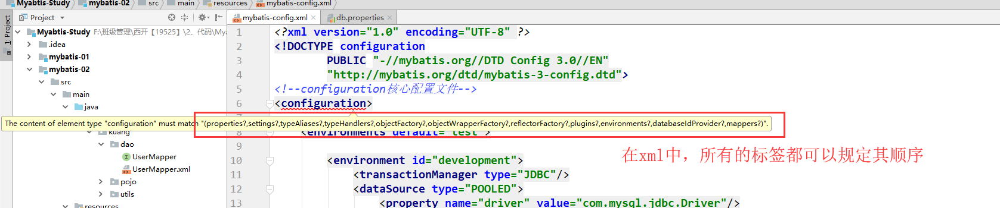

编写一个配置文件`db.properties`

```properties
driver=com.mysql.jdbc.Driver
url=jdbc:mysql://localhost:3306/mybatis?useSSL=true&useUnicode=true&characterEncoding=UTF-8
username=root
password=123456
```

在核心配置文件中映入

```xml
<!--引入外部配置文件-->
<properties resource="db.properties">
    <property name="username" value="root"/>
    <property name="pwd" value="11111"/>
</properties>
```

- 可以直接引入外部文件
- 可以在其中增加一些属性配置
- **如果两个文件有同一个字段，优先使用外部配置文件的！**


### 4、类型别名（typeAliases）

- 类型别名是为 Java 类型设置一个短的名字。‘
- 存在的意义仅在于用来减少类完全限定名的冗余。在 `mybatis.config.xml` 为实体类com.sun.pojo.User配置别名，就是为了在UserMapper中写起来，不那么麻烦而已。

```xml
<!--可以给实体类起别名-->
<typeAliases>
    <typeAlias type="com.kuang.pojo.User" alias="User"/>
</typeAliases>
```

也可以指定一个包名，MyBatis 会在包名下面搜索需要的 Java Bean，比如：

扫描实体类的包，它的默认别名就为这个类的 类名，==首字母小写！==

```xml
<!--可以给实体类起别名-->
<typeAliases>
    <package name="com.kuang.pojo"/>  <!-- user 为别名-->
</typeAliases>
```


推荐如何 使用别名：

1. 在实体类比较少的时候：使用第一种方式。

2. 如果实体类十分多：建议使用第二种。

3. 第一种可以DIY别名，第二种则·不行·，如果非要改，需要在实体上增加注解


```java
@Alias("user")
public class User {}
```

### 5、设置

孙：

这是 MyBatis 中极为重要的调整设置，它们**会改变 MyBatis 的运行时行为**。 

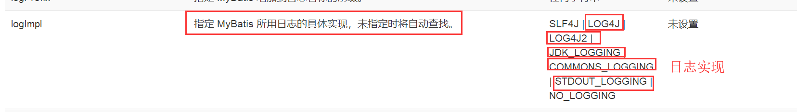

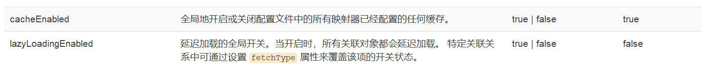

### 6、其他配置

- [typeHandlers（类型处理器）](https://mybatis.org/mybatis-3/zh/configuration.html#typeHandlers)
- [objectFactory（对象工厂）](https://mybatis.org/mybatis-3/zh/configuration.html#objectFactory)
- plugins插件
  - mybatis-generator-core：根据数据库，生成mapper，实体类之类的东西。
  - mybatis-plus
  - 通用mapper

### 7、映射器（mappers）

MapperRegistry：注册绑定我们的Mapper文件；

方式一： 【推荐使用】

```xml
<!--每一个Mapper.XML都需要在Mybatis核心配置文件中注册！-->
<mappers>
    <mapper resource="com/kuang/dao/UserMapper.xml"/>
</mappers>
```

==方式二：使用class文件绑定注册，通常是一二混用，可以使用注解开发==

```xml
<!--每一个Mapper.XML都需要在Mybatis核心配置文件中注册！-->
<mappers>
    <mapper class="com.kuang.dao.UserMapper"/>
</mappers>
```

==方式二 与 方式三 的注意点==

- 接口和他的Mapper配置文件必须同名！
- 接口和他的Mapper配置文件必须在同一个包下！


方式三：使用扫描包进行注入绑定

```xml
<!--每一个Mapper.XML都需要在Mybatis核心配置文件中注册！-->
<mappers>
    <package name="com.kuang.dao"/>
</mappers>
```

注意点：

- 接口和他的Mapper配置文件必须同名！
- 接口和他的Mapper配置文件必须在同一个包下！


练习时间：

- 将数据库配置文件外部引入
- 实体类别名
- 保证UserMapper 接口 和 UserMapper .xml 改为一致！并且放在同一个包下！


### 8、生命周期和作用域

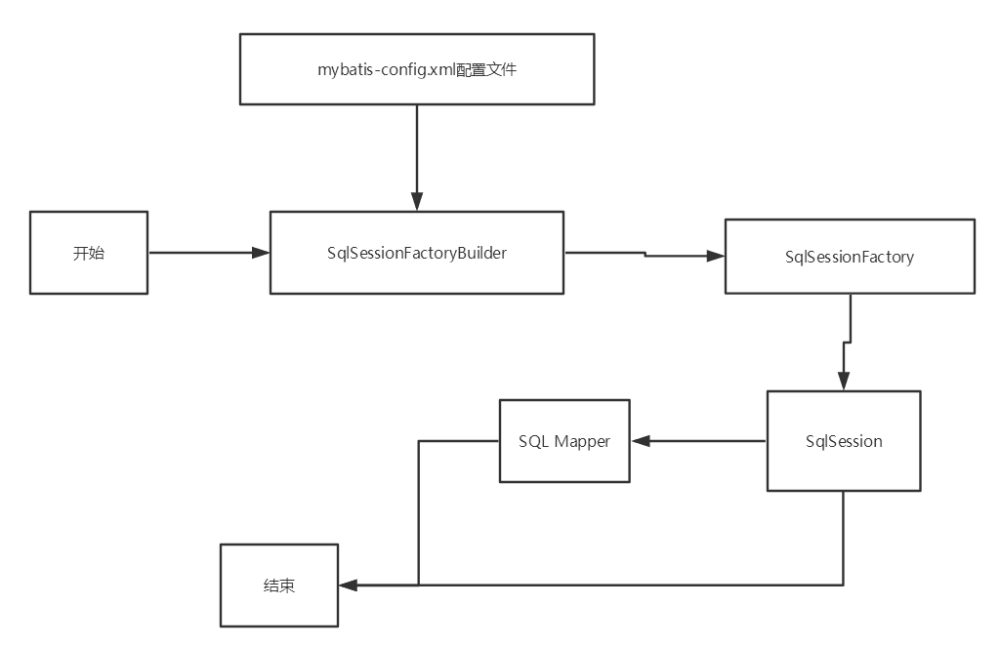

生命周期，和作用域，是至关重要的，因为错误的使用会导致非常严重的**并发问题**。

**SqlSessionFactoryBuilder：**

- 一旦创建了 SqlSessionFactory，就不再需要它了
- 局部变量

**SqlSessionFactory：**

- 说白了就是可以想象为 ：数据库连接池
- SqlSessionFactory 一旦被创建就应该在应用的运行期间一直存在，**一旦创建就，没有任何理由丢弃它或重新创建另一个实例。** 
- 因此 SqlSessionFactory 的最佳作用域是应用作用域。 
- 最简单的就是使用**单例模式**或者静态单例模式。

**SqlSession**

- 连接到连接池的一个请求！
- SqlSession 的实例不是线程安全的，因此是不能被共享的，所以它的最佳的作用域是请求或方法作用域。
- 用完之后需要赶紧关闭，否则资源被占用！

``` java
try (SqlSession session = sqlSessionFactory.openSession()) {
  // 你的应用逻辑代码
}
```


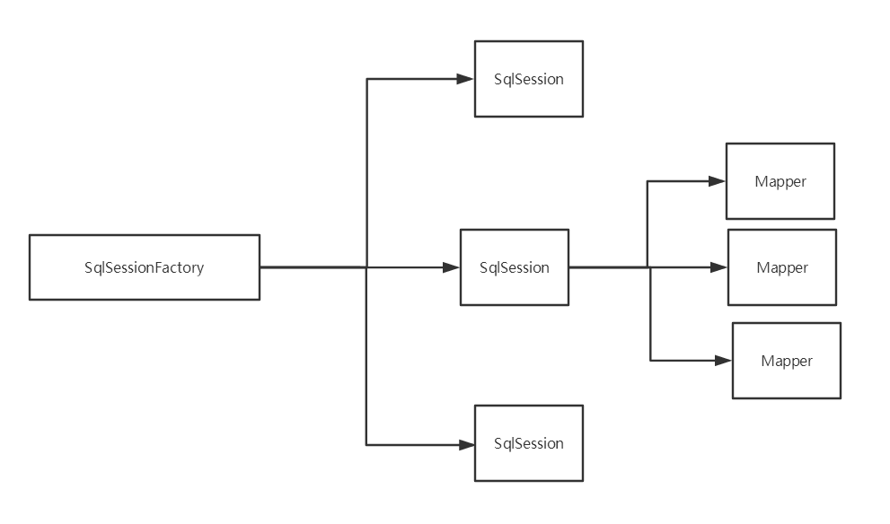

这里面的每一个Mapper，就代表一个具体的业务！


## 5、解决属性名和字段名不一致的问题

### 1、 问题

数据库中的字段

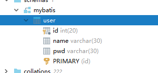

新建一个项目，拷贝之前的，测试实体类字段不一致的情况

```java
public class User {
    private int id;
    private String name;
    private String password;
}
```

测试出现问题

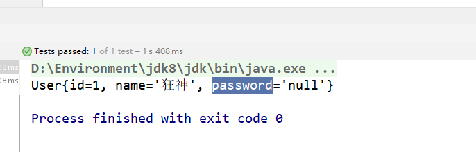


```xml
//    select * from mybatis.user where id = #{id}
//类型处理器
//    select id,name,pwd from mybatis.user where id = #{id}
```


解决方法：

- 起别名

  ```xml
  <select id="getUserById" resultType="com.kuang.pojo.User">
      select id,name,pwd as password from mybatis.user where id = #{id}
  </select>
  ```


### 2、resultMap

结果集映射

```
id   name   pwd
id   name   password
```

```xml
<!--结果集映射-->
<resultMap id="UserMap" type="User">
    <!--column数据库中的字段，property实体类中的属性-->
    <result column="id" property="id"/>
    <result column="name" property="name"/>
    <result column="pwd" property="password"/>
</resultMap>

<select id="getUserById" resultMap="UserMap">
    select * from mybatis.user where id = #{id}
</select>
```

- `resultMap` 元素是 MyBatis 中最重要最强大的元素
- ResultMap 的设计思想是，对于简单的语句根本不需要配置显式的结果映射，而对于复杂一点的语句只需要描述它们的关系就行了。
- `ResultMap` 最优秀的地方在于，虽然你已经对它相当了解了，但是根本就不需要显式地用到他们。
-  如果世界总是这么简单就好了 。


sun的图，`UserMapper.xml` 看一下


## 6、日志

### 6.1、日志工厂

如果一个数据库操作，出现了异常，我们需要排错。日志就是最好的助手！

曾经：sout 、debug

现在：日志工厂！

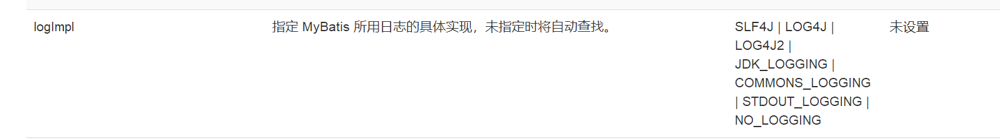

- SLF4J 

- LOG4J  【掌握】
- LOG4J2
-  JDK_LOGGING
- COMMONS_LOGGING
- STDOUT_LOGGING   【掌握】
- NO_LOGGING


在Mybatis中具体使用那个一日志实现，在设置中设定！

**STDOUT_LOGGING标准日志输出**

在mybatis核心配置文件中，配置我们的日志！

```xml
<settings>
    <!--      官网》XML配置》Settings中： 标准的日志实现-->
    <setting name="logImpl" value="STDOUT_LOGGING"/>
</settings>
```

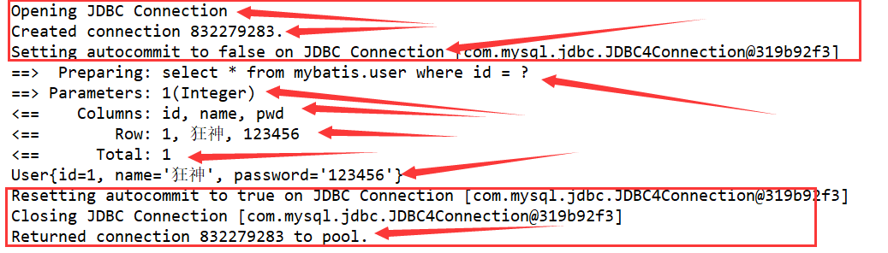


### 6.2、Log4j

什么是Log4j？

- Log4j是[Apache](https://baike.baidu.com/item/Apache/8512995)的一个开源项目，通过使用Log4j，我们可以控制日志信息输送的目的地是[控制台](https://baike.baidu.com/item/控制台/2438626)、文件、[GUI](https://baike.baidu.com/item/GUI)组件
- 我们也可以控制每一条日志的输出格式；
- 通过定义每一条日志信息的级别，我们能够更加细致地控制日志的生成过程。
- 通过一个[配置文件](https://baike.baidu.com/item/配置文件/286550)来灵活地进行配置，而不需要修改应用的代码。


1. 先导入log4j的包

   ```xml
   <!-- https://mvnrepository.com/artifact/log4j/log4j -->
   <dependency>
       <groupId>log4j</groupId>
       <artifactId>log4j</artifactId>
       <version>1.2.17</version>
   </dependency>
   ```

2. log4j.properties

   ```properties
   #将等级为DEBUG的日志信息输出到console和file这两个目的地，console和file的定义在下面的代码
   log4j.rootLogger=DEBUG,console,file
   
   #控制台输出的相关设置
   log4j.appender.console = org.apache.log4j.ConsoleAppender
   log4j.appender.console.Target = System.out
   log4j.appender.console.Threshold=DEBUG
   log4j.appender.console.layout = org.apache.log4j.PatternLayout
   log4j.appender.console.layout.ConversionPattern=[%c]-%m%n
   
   #文件输出的相关设置
   log4j.appender.file = org.apache.log4j.RollingFileAppender
   log4j.appender.file.File=./log/kuang.log
   log4j.appender.file.MaxFileSize=10mb
   log4j.appender.file.Threshold=DEBUG
   log4j.appender.file.layout=org.apache.log4j.PatternLayout
   log4j.appender.file.layout.ConversionPattern=[%p][%d{yy-MM-dd}][%c]%m%n
   
   #日志输出级别
   log4j.logger.org.mybatis=DEBUG
   log4j.logger.java.sql=DEBUG
   log4j.logger.java.sql.Statement=DEBUG
   log4j.logger.java.sql.ResultSet=DEBUG
   log4j.logger.java.sql.PreparedStatement=DEBUG
   ```

3. 配置log4j为日志的实现

   ```xml
   <settings>
       <setting name="logImpl" value=""/>
   </settings>
   ```

4. Log4j的使用！，直接测试运行刚才的查询

   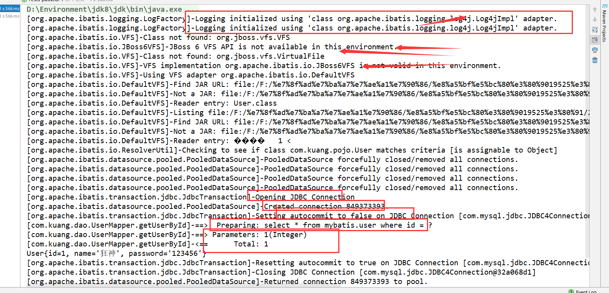


**简单使用**

1. 在要使用Log4j 的类中，导入包  import org.apache.log4j.Logger;

2. 日志对象，参数为当前类的class

   ```java
   static Logger logger = Logger.getLogger(UserDaoTest.class);
   ```

3. 日志级别

   ```java
   logger.info("info:进入了testLog4j");
   logger.debug("debug:进入了testLog4j");
   logger.error("error:进入了testLog4j");
   ```


## 7、分页

**思考：为什么要分页？**

- 减少数据的处理量


### 7.1、使用Limit分页

```sql
语法：SELECT * from user limit startIndex,pageSize;
SELECT * from user limit 3;  #[0,n]
```


使用Mybatis实现分页，核心SQL

1. 接口

   ```java
   //分页
   List<User> getUserByLimit(Map<String,Integer> map);
   ```

2. Mapper.xml

   ```xml
   <!--//分页-->
   <select id="getUserByLimit" parameterType="map" resultMap="UserMap">
       select * from  mybatis.user limit #{startIndex},#{pageSize}
   </select>
   ```

3. 测试

   ```java
   @Test
   public void getUserByLimit(){
   SqlSession sqlSession = MybatisUtils.getSqlSession();
   UserMapper mapper = sqlSession.getMapper(UserMapper.class);
   
   HashMap<String, Integer> map = new HashMap<String, Integer>();
       map.put("startIndex",1);
       map.put("pageSize",2);
   
       List<User> userList =  mapper.getUserByLimit(map);
       for (User user : userList) {
       System.out.println(user);
       }
   
       sqlSession.close();
   }
   ```
   


### 7.2、RowBounds分页

不再使用SQL实现分页

1. 接口

   ```java
   //分页2
   List<User> getUserByRowBounds();
   ```

2. mapper.xml

   ```xml
   <!--分页2-->
   <select id="getUserByRowBounds" resultMap="UserMap">
       select * from  mybatis.user
   </select>
   ```

3. 测试

   ```java
   @Test
   public void getUserByRowBounds(){
       SqlSession sqlSession = MybatisUtils.getSqlSession();
   
       //RowBounds实现
       RowBounds rowBounds = new RowBounds(1, 2);
   
       //通过Java代码层面实现分页
       List<User> userList = sqlSession.selectList("com.kuang.dao.UserMapper.getUserByRowBounds",null,rowBounds);
   
       for (User user : userList) {
           System.out.println(user);
       }
   
       sqlSession.close();
   }
   ```

   

### 7.3、分页插件

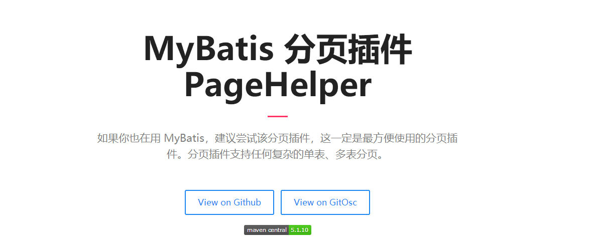

了解即可，万一 以后公司的架构师，说要使用，你需要知道它是什么东西！


## 8、使用注解开发

### 8.1、面向接口编程

\- 大家之前都学过面向对象编程，也学习过接口，但在真正的开发中，很多时候我们会选择面向接口编程
\- **根本原因 :  ==解  耦== , 可拓展 , 提高复用 , 分层开发中 , 上层不用管具体的实现 , 大家都遵守共同的标准 , 使得开发变得容易 , 规范性更好**
\- 在一个面向对象的系统中，系统的各种功能是由许许多多的不同对象协作完成的。在这种情况下，各个对象内部是如何实现自己的,对系统设计人员来讲就不那么重要了；
\- 而各个对象之间的协作关系则成为系统设计的关键。小到不同类之间的通信，大到各模块之间的交互，在系统设计之初都是要着重考虑的，这也是系统设计的主要工作内容。面向接口编程就是指按照这种思想来编程。


**关于接口的理解**

\- 接口从更深层次的理解，应是定义（规范，约束）与实现（名实分离的原则）的分离。
\- 接口的本身反映了系统设计人员对系统的抽象理解。
\- 接口应有两类：
  \- 第一类是对一个个体的抽象，它可对应为一个抽象体(abstract class)；
  \- 第二类是对一个个体某一方面的抽象，即形成一个抽象面（interface）；
\- 一个体有可能有多个抽象面。抽象体与抽象面是有区别的。


**三个面向区别**

\- 面向对象是指，我们考虑问题时，以对象为单位，考虑它的属性及方法 .
\- 面向过程是指，我们考虑问题时，以一个具体的流程（事务过程）为单位，考虑它的实现 .
\- 接口设计与非接口设计是针对复用技术而言的，与面向对象（过程）不是一个问题.更多的体现就是对系统整体的架构

### 8.2、使用注解开发

==简单的可以用注解。但是设计到表列名和结果的映射的时候，就不太方便，复杂的用XML==

1. 注解在接口上实现

   ```java
   @Select("select * from user")
   List<User> getUsers();
   ```

2. 需要再核心配置文件中绑定接口！

   ```xml
   <!--绑定接口-->
   <mappers>
       <mapper class="com.kuang.dao.UserMapper"/>
   </mappers>
   ```

3. 测试

本质：反射机制实现，可以看看==狂神的反射==

底层：动态代理！

 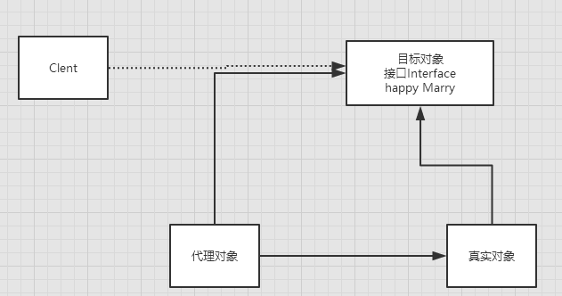


**Mybatis详细的执行流程！**

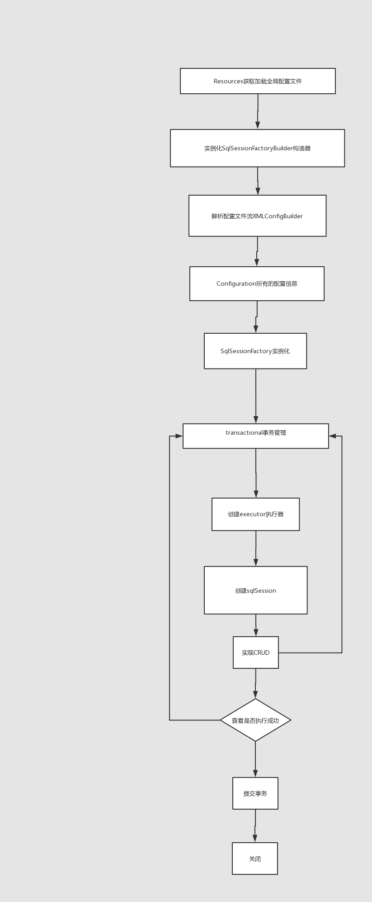


### 8.3、CRUD

我们可以在工具类创建的时候实现自动提交事务！

```java
public static SqlSession  getSqlSession(){
    return sqlSessionFactory.openSession(true);
}
```


编写接口，增加注解

```java
public interface UserMapper {

    @Select("select * from user")
    List<User> getUsers();

    // 方法存在多个参数，所有的参数前面必须加上 @Param("id")注解
    @Select("select * from user where id = #{id}")
    User getUserByID(@Param("id") int id);


    @Insert("insert into user(id,name,pwd) values (#{id},#{name},#{password})")
    int addUser(User user);

    
    @Update("update user set name=#{name},pwd=#{password} where id = #{id}")
    int updateUser(User user);

    
    @Delete("delete from user where id = #{uid}")
    int deleteUser(@Param("uid") int id);
}
```

测试类

【注意：我们必须要讲接口注册绑定到我们的核心配置文件中！】，==参考8.2.2==

**关于@Param() 注解**

- 基本类型的参数或者String类型，需要加上
- 引用类型不需要加
- 如果只有一个基本类型的话，可以忽略，但是建议大家都加上！
- 我们在SQL中引用的就是我们这里的 @Param() 中设定的属性名！

**#{}     ${} 区别**


## 9、==Lombo，太好用了==

```java
Project Lombok is a java library that automatically plugs into your editor and build tools, spicing up your java.
Never write another getter or equals method again, with one annotation your class has a fully featured builder, Automate your logging variables, and much more.
```

- java library
- plugs
- build tools
- with one annotation your class


使用步骤：

1. 在IDEA中安装Lombok插件！

2. 在项目中导入lombok的jar包

   ```xml
   <dependency>
       <groupId>org.projectlombok</groupId>
       <artifactId>lombok</artifactId>
       <version>1.18.10</version>
   </dependency>
   ```

3. 在实体类上加注解即可！

   ```java
   @Data
   @AllArgsConstructor
   @NoArgsConstructor
   ```


```java
@Getter and @Setter
@FieldNameConstants
@ToString
@EqualsAndHashCode
@AllArgsConstructor, @RequiredArgsConstructor and @NoArgsConstructor
@Log, @Log4j, @Log4j2, @Slf4j, @XSlf4j, @CommonsLog, @JBossLog, @Flogger
@Data
@Builder
@Singular
@Delegate
@Value
@Accessors
@Wither
@SneakyThrows
```

说明：

```
@Data：无参构造，get、set、tostring、hashcode，equals
@AllArgsConstructor
@NoArgsConstructor
@EqualsAndHashCode
@ToString
@Getter
```


## 10、多对一处理

==许多个学生，关联1个授课老师，故多对一关系==


多对一：

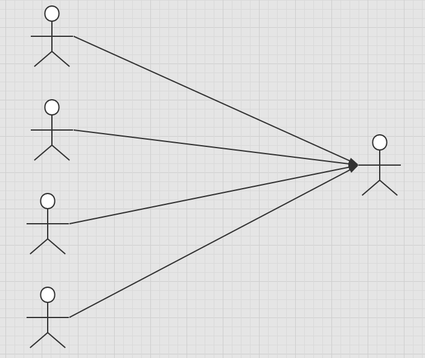

- 多个学生，对应一个老师
- 对于学生这边而言，  **关联** ..  多个学生，关联一个老师  【多对一】
- 对于老师而言， **集合** ， 一个老师，有很多学生 【一对多】

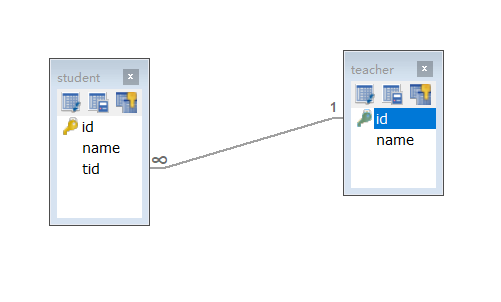

SQL：

```sql
CREATE TABLE `teacher` (
  `id` INT(10) NOT NULL,
  `name` VARCHAR(30) DEFAULT NULL,
  PRIMARY KEY (`id`)
) ENGINE=INNODB DEFAULT CHARSET=utf8

INSERT INTO teacher(`id`, `name`) VALUES (1, '秦老师'); 

CREATE TABLE `student` (
  `id` INT(10) NOT NULL,
  `name` VARCHAR(30) DEFAULT NULL,
  `tid` INT(10) DEFAULT NULL,
  PRIMARY KEY (`id`),
  KEY `fktid` (`tid`),
  CONSTRAINT `fktid` FOREIGN KEY (`tid`) REFERENCES `teacher` (`id`)
) ENGINE=INNODB DEFAULT CHARSET=utf8


INSERT INTO `student` (`id`, `name`, `tid`) VALUES ('1', '小明', '1'); 
INSERT INTO `student` (`id`, `name`, `tid`) VALUES ('2', '小红', '1'); 
INSERT INTO `student` (`id`, `name`, `tid`) VALUES ('3', '小张', '1'); 
INSERT INTO `student` (`id`, `name`, `tid`) VALUES ('4', '小李', '1'); 
INSERT INTO `student` (`id`, `name`, `tid`) VALUES ('5', '小王', '1');
```


### 测试环境搭建

1. 导入lombok
2. 新建实体类 Teacher，Student
3. 建立Mapper接口
4. 建立Mapper.XML文件
5. 在核心配置文件中绑定注册我们的Mapper接口或者文件！【方式很多，随心选】
6. 测试查询是否能够成功！

### 按照结果嵌套处理

```xml
<!--按结果嵌套查询-->
<select id="getTeacher" resultMap="TeacherStudent">
    select s.id sid, s.name sname, t.id tid, t.name tname
    from student s,teacher t
    where s.tid = t.id
</select>

<resultMap id="studentTeacher2" type="Student">
    <result column="sid" property="id" />
    <result column="sname" property="name" />
    <association column="tid" property="teacher" javaType="Teacher">
        <result column="tid" property="id" />
        <result column="tname" property="name" />
    </association>
</resultMap>
```


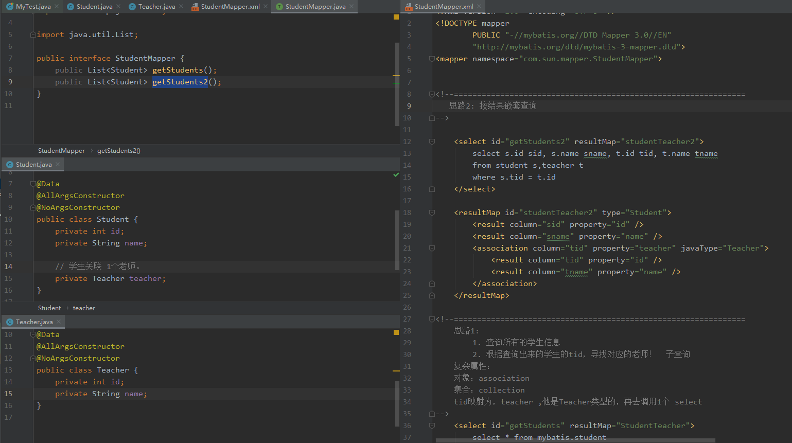

### 

### 按照查询嵌套处理

```xml
<!--
思路:
    1. 查询所有的学生信息
    2. 根据查询出来的学生的tid，寻找对应的老师！  子查询
-->

<select id="getStudent" resultMap="StudentTeacher">
    select * from student
</select>

<resultMap id="StudentTeacher" type="Student">
    <result property="id" column="id"/>
    <result property="name" column="name"/>
    <!--复杂的属性，我们需要单独处理 对象： association 集合： collection -->
    <association property="teacher" column="tid" javaType="Teacher" select="getTeacher"/>
</resultMap>

<select id="getTeacher" resultType="Teacher">
    select * from teacher where id = #{id}
</select>
```


### 

回顾Mysql 多对一查询方式：

- 子查询
- 联表查询


## 11、一对多处理

比如：一个老师拥有多个学生！

对于老师而言，就是一对多的关系!


### 环境搭建

1. 环境搭建，和刚才一样

**实体类**

```java
@Data
public class Student {
    private int id;
    private String name;
    private int tid;Pa
}
```

```java
@Data
public class Teacher {
    private int id;
    private String name;

    //一个老师拥有多个学生
    private List<Student> students;
}
```


### 按照结果嵌套处理

```xml
<!--按结果嵌套查询-->
<select id="getTeacher" resultMap="TeacherStudent">
    select s.id sid, s.name sname, t.name tname,t.id tid
    from student s,teacher t
    where s.tid = t.id and t.id = #{tid}
</select>

<resultMap id="TeacherStudent" type="Teacher">
    <result property="id" column="tid"/>
    <result property="name" column="tname"/>
    <!--复杂的属性，我们需要单独处理 对象： association 集合： collection
        javaType="" 指定属性的类型！
        集合中的泛型信息，我们使用ofType获取
        -->
    <collection property="students" ofType="Student">
        <result property="id" column="sid"/>
        <result property="name" column="sname"/>
        <result property="tid" column="tid"/>
    </collection>
</resultMap>
```

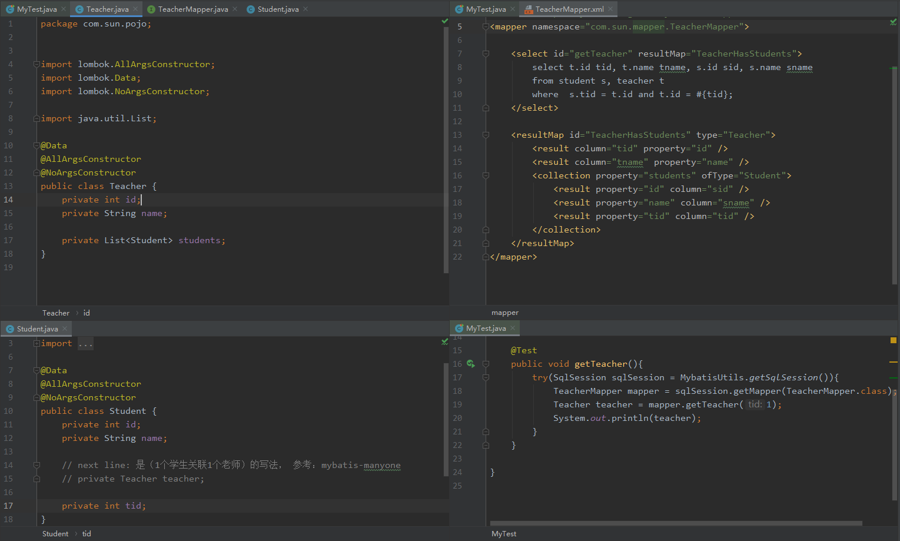

### 按照查询嵌套处理

```xml
<select id="getTeacher2" resultMap="TeacherStudent2">
    select * from mybatis.teacher where id = #{tid}
</select>

<resultMap id="TeacherStudent2" type="Teacher">
    <collection property="students" javaType="ArrayList" ofType="Student" select="getStudentByTeacherId" column="id"/>
</resultMap>

<select id="getStudentByTeacherId" resultType="Student">
    select * from mybatis.student where tid = #{tid}
</select>
```


### 小结

1. 关联 - association   【多对一】
2. 集合 - collection   【一对多】
3. javaType    &   ofType
   1. JavaType  用来指定实体类中属性的类型
   2. ofType  用来指定映射到List或者集合中的 pojo类型，泛型中的约束类型！

```java
// ofType: Student
// JavaType: List -- > 默认写成：ArrayList
public List<Student> students;
```


注意点：

- 保证SQL的可读性，尽量保证通俗易懂
- 注意一对多和多对一中，属性名和字段的问题！
- 如果问题不好排查错误，可以使用日志 ， 建议使用 Log4j


**慢SQL       1s        1000s**      

面试高频

- ==Mysql引擎==
- ==InnoDB底层原理==
- ==索引==
- ==索引优化！==


## 12、==动态 SQL==

==**什么是动态SQL：动态SQL就是指根据不同的条件生成不同的SQL语句**==

利用动态 SQL 这一特性可以彻底摆脱这种痛苦。

```xml
动态 SQL 元素和 JSTL 或基于类似 XML 的文本处理器相似。在 MyBatis 之前的版本中，有很多元素需要花时间了解。MyBatis 3 大大精简了元素种类，现在只需学习原来一半的元素便可。MyBatis 采用功能强大的基于 OGNL 的表达式来淘汰其它大部分元素。

if
choose (when, otherwise)
trim (where, set)
foreach
```


### 搭建环境

```sql
CREATE TABLE `blog` (
  `id` varchar(50) NOT NULL COMMENT '博客id',
  `title` varchar(100) NOT NULL COMMENT '博客标题',
  `author` varchar(30) NOT NULL COMMENT '博客作者',
  `create_time` datetime NOT NULL COMMENT '创建时间',
  `views` int(30) NOT NULL COMMENT '浏览量'
) ENGINE=InnoDB DEFAULT CHARSET=utf8
```


创建一个基础工程

1. 导包

2. 编写配置文件

3. 编写实体类

   ```java
   @Data
   public class Blog {
       private String id;
       private String title;
       private String author;
       private Date createTime;
       private int views;
   }
   ```
   
4. 编写实体类对应Mapper接口 和 Mapper.XML文件


### IF

```xml
<select id="queryBlogIF" parameterType="map" resultType="blog">
    select * from mybatis.blog where 1=1
    <if test="title != null">
        and title = #{title}
    </if>
    <if test="author != null">
        and author = #{author}
    </if>
</select>
```

### choose (when, otherwise)

```xml
<select id="queryBlogChoose" parameterType="map" resultType="blog">
    select * from mybatis.blog
    <where>
        <choose>
            <when test="title != null">
                title = #{title}
            </when>
            <when test="author != null">
                and author = #{author}
            </when>
            <otherwise>
                and views = #{views}
            </otherwise>
        </choose>
    </where>
</select>
```


### trim (where,set)

```xml
select * from mybatis.blog
<where>
    <if test="title != null">
        title = #{title}
    </if>
    <if test="author != null">
        and author = #{author}
    </if>
</where>
```

```xml
<update id="updateBlog" parameterType="map">
    update mybatis.blog
    <set>
        <if test="title != null">
            title = #{title},
        </if>
        <if test="author != null">
            author = #{author}
        </if>
    </set>
    where id = #{id}
</update>
```

==**所谓的动态SQL，本质还是SQL语句 ， 只是我们可以在SQL层面，去执行一个逻辑代码**==

if

where ， set  ， choose ，when


### SQL片段

==有的时候，我们可能会将一些功能的部分抽取出来，方便复用！==

1. 使用SQL标签抽取公共的部分

   ```xml
   <sql id="if-title-author">
       <if test="title != null">
           title = #{title}
       </if>
       <if test="author != null">
           and author = #{author}
       </if>
   </sql>
   ```

2. 在需要使用的地方使用Include标签引用即可

   ```xml
   <select id="queryBlogIF" parameterType="map" resultType="blog">
       select * from mybatis.blog
       <where>
           <include refid="if-title-author"></include>
       </where>
   </select>
   ```

   

注意事项：

- 最好基于单表来定义SQL片段！
- 不要存在where标签


### Foreach

```sql
select * from user where 1=1 and 

<foreach item="id" collection="ids"
      open="(" separator="or" close=")">
        #{id}
</foreach>

(id=1 or id=2 or id=3)
```

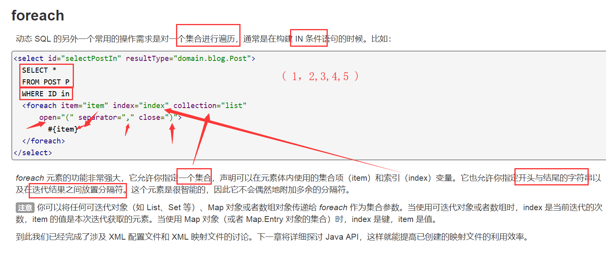

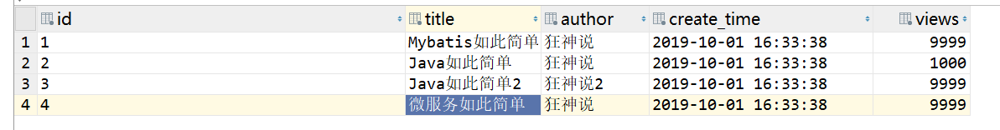

```xml
<!--    包含：<where> 等等标签的
    select * from mybatis.blog where (id='1' or id='2' or id='3');
    ids: 是一个集合ArrayList
-->
<select id="queryByForEach" parameterType="map" resultType="Blog">
    select * from mybatis.blog
    <where>
        <foreach collection="ids" open="(" close=")" separator="or" item="id">
            id= #{id}
        </foreach>
    </where>
</select>
```


==动态SQL就是在拼接SQL语句，我们只要保证SQL的正确性，按照SQL的格式，去排列组合就可以了==

建议：

- 现在Mysql中写出完整的SQL,再对应的去修改成为我们的动态SQL实现通用即可！

## Sun总结

- IF：就是and 追加，choose（when，otherwise)匹配1个when就break，都不匹配，就执行otherwise。


## 13、缓存 （了解）

### 13.1、简介

```
查询  ：  连接数据库 ，耗资源！
	一次查询的结果，给他暂存在一个可以直接取到的地方！--> 内存 ： 缓存
	
我们再次查询相同数据的时候，直接走缓存，就不用走数据库了
```


1. 什么是缓存 [ Cache ]？
   - 存在内存中的临时数据。
   - 将用户经常查询的数据放在缓存（内存）中，用户去查询数据就不用从磁盘上(关系型数据库数据文件)查询，从缓存中查询，从而提高查询效率，解决了高并发系统的性能问题。
2. 为什么使用缓存？
   
   - 减少和数据库的交互次数，减少系统开销，提高系统效率。
3. 什么样的数据能使用缓存？
   
   - 经常查询并且不经常改变的数据。【可以使用缓存】
   
     

### 13.2、Mybatis缓存

- MyBatis包含一个非常强大的查询缓存特性，它可以非常方便地定制和配置缓存。缓存可以极大的提升查询效率。
- MyBatis系统中默认定义了两级缓存：**一级缓存**和**二级缓存**
  - 默认情况下，只有一级缓存开启。（SqlSession级别的缓存，也称为本地缓存）
  
    
  
  - 二级缓存需要手动开启和配置，他是基于namespace级别的缓存。
  
  - 为了提高扩展性，MyBatis定义了缓存接口Cache。我们可以通过实现Cache接口来自定义二级缓存
  
    

### 13.3、一级缓存

- 一级缓存也叫本地缓存：  SqlSession
  - 与数据库同一次会话期间查询到的数据会放在本地缓存中。
  - 以后如果需要获取相同的数据，直接从缓存中拿，没必须再去查询数据库；

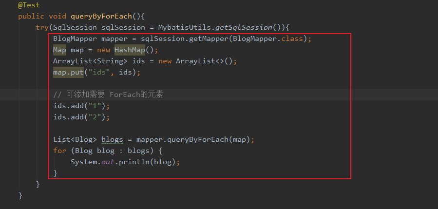


测试步骤：

1. 开启日志！
2. 测试在一个Sesion中查询两次相同记录
3. 查看日志输出

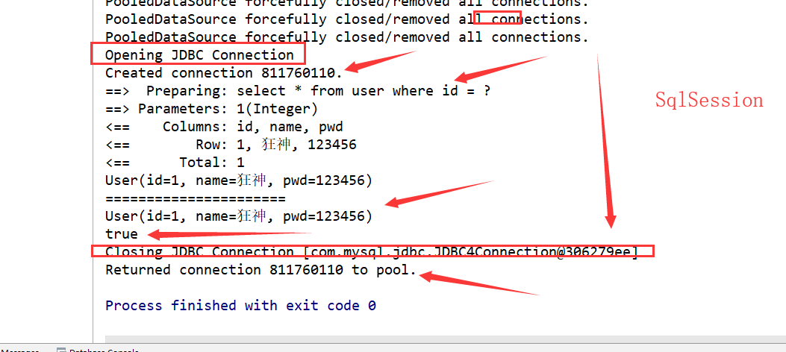


==缓存失效的情况：==

原地址：https://mybatis.org/mybatis-3/zh/sqlmap-xml.html

1. 查询不同的东西（查询User1,User2)

2. 增删改操作，可能会改变原来的数据，所以必定会刷新缓存！

   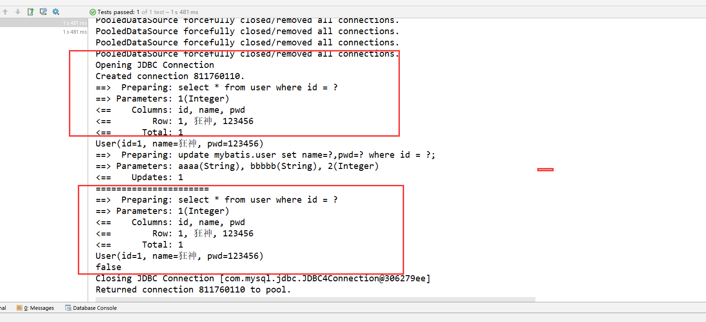

3. 查询不同的Mapper.xml

4. 手动清理缓存！

   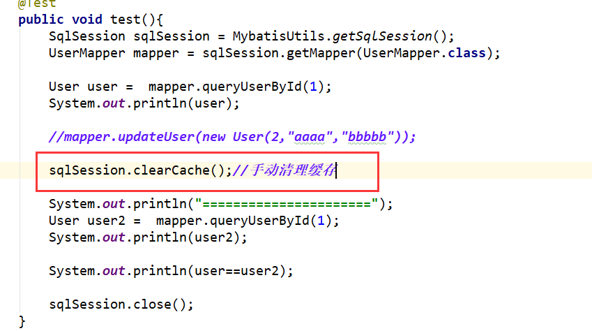


小结：

- 一级缓存默认是开启的，只在一次SqlSession中有效，也就是拿到连接到关闭连接这个区间段！
- 一级缓存，sqlSession把结果放在一个Map，在1个sqlSession中，查询多少次，都是1个map。除非出现缓存更新的情况。


### 13.4、二级缓存

- 二级缓存也叫全局缓存，一级缓存作用域太低了，所以诞生了二级缓存
- 基于namespace级别的缓存，一个名称空间，对应一个二级缓存；
- 工作机制
  - 一个会话查询一条数据，这个数据就会被放在当前会话的一级缓存中；
  - 如果当前会话关闭了，这个会话对应的一级缓存就没了；但是我们想要的是，会话关闭了，一级缓存中的数据被保存到二级缓存中；
  - 新的会话查询信息，就可以从二级缓存中获取内容；
  - 不同的mapper查出的数据会放在自己对应的缓存（map）中；


步骤：

1. 开启全局缓存

   ```xml
   <!--显示（默认也是开启的）地开启全局缓存-->
   <setting name="cacheEnabled" value="true"/>
   ```

2. 在要使用二级缓存的Mapper中开启

   ```xml
   <!--在当前Mapper.xml中使用二级缓存-->
   <cache/>
   ```

   也可以自定义参数

   ```xml
   <!--在当前Mapper.xml中使用二级缓存-->
   <cache  eviction="FIFO"
          flushInterval="60000"
          size="512"
          readOnly="true"/>
   ```

3. 测试

   1. 问题:我们需要将实体类序列化！否则就会报错！

      ```
      Caused by: java.io.NotSerializableException: com.kuang.pojo.User
      ```

小结：

- 只要开启了二级缓存，在同一个Mapper下就有效
- 所有的数据都会先放在一级缓存中；
- 只有当会话提交，或者关闭的时候，才会提交到二级缓冲中！


### 13.5、缓存原理

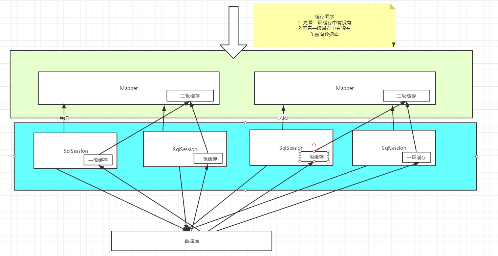


#### sun note:

同1个mapper，开启2级缓存，如果要先查user1, user2

- 在1个sqlSession中：
  - mapper先去查user1, 
  - cache中没有，故去mysql查user1，
  - 在查user2，cache没有，故去数据库
  - 关闭，会保存user1,user2
- 在另一个sqlsession中
  - 查user1，有cache2，直接走缓存。


### 13.6、自定义缓存-ehcache

```xml
Ehcache是一种广泛使用的开源Java分布式缓存。主要面向通用缓存
```

要在程序中使用ehcache，先要导包！

```xml
<!-- https://mvnrepository.com/artifact/org.mybatis.caches/mybatis-ehcache -->
<dependency>
    <groupId>org.mybatis.caches</groupId>
    <artifactId>mybatis-ehcache</artifactId>
    <version>1.1.0</version>
</dependency>
```

在mapper中指定使用我们的ehcache缓存实现！

```xml
<!--在当前Mapper.xml中使用二级缓存-->
<cache type="org.mybatis.caches.ehcache.EhcacheCache"/>
```

ehcache.xml

```xml
<?xml version="1.0" encoding="UTF-8"?>
<ehcache xmlns:xsi="http://www.w3.org/2001/XMLSchema-instance"
         xsi:noNamespaceSchemaLocation="http://ehcache.org/ehcache.xsd"
         updateCheck="false">
    <!--
       diskStore：为缓存路径，ehcache分为内存和磁盘两级，此属性定义磁盘的缓存位置。参数解释如下：
       user.home – 用户主目录
       user.dir  – 用户当前工作目录
       java.io.tmpdir – 默认临时文件路径
     -->
    <diskStore path="./tmpdir/Tmp_EhCache"/>
    
    <defaultCache
            eternal="false"
            maxElementsInMemory="10000"
            overflowToDisk="false"
            diskPersistent="false"
            timeToIdleSeconds="1800"
            timeToLiveSeconds="259200"
            memoryStoreEvictionPolicy="LRU"/>
 
    <cache
            name="cloud_user"
            eternal="false"
            maxElementsInMemory="5000"
            overflowToDisk="false"
            diskPersistent="false"
            timeToIdleSeconds="1800"
            timeToLiveSeconds="1800"
            memoryStoreEvictionPolicy="LRU"/>
    <!--
       defaultCache：默认缓存策略，当ehcache找不到定义的缓存时，则使用这个缓存策略。只能定义一个。
     -->
    <!--
      name:缓存名称。
      maxElementsInMemory:缓存最大数目
      maxElementsOnDisk：硬盘最大缓存个数。
      eternal:对象是否永久有效，一但设置了，timeout将不起作用。
      overflowToDisk:是否保存到磁盘，当系统当机时
      timeToIdleSeconds:设置对象在失效前的允许闲置时间（单位：秒）。仅当eternal=false对象不是永久有效时使用，可选属性，默认值是0，也就是可闲置时间无穷大。
      timeToLiveSeconds:设置对象在失效前允许存活时间（单位：秒）。最大时间介于创建时间和失效时间之间。仅当eternal=false对象不是永久有效时使用，默认是0.，也就是对象存活时间无穷大。
      diskPersistent：是否缓存虚拟机重启期数据 Whether the disk store persists between restarts of the Virtual Machine. The default value is false.
      diskSpoolBufferSizeMB：这个参数设置DiskStore（磁盘缓存）的缓存区大小。默认是30MB。每个Cache都应该有自己的一个缓冲区。
      diskExpiryThreadIntervalSeconds：磁盘失效线程运行时间间隔，默认是120秒。
      memoryStoreEvictionPolicy：当达到maxElementsInMemory限制时，Ehcache将会根据指定的策略去清理内存。默认策略是LRU（最近最少使用）。你可以设置为FIFO（先进先出）或是LFU（较少使用）。
      clearOnFlush：内存数量最大时是否清除。
      memoryStoreEvictionPolicy:可选策略有：LRU（最近最少使用，默认策略）、FIFO（先进先出）、LFU（最少访问次数）。
      FIFO，first in first out，这个是大家最熟的，先进先出。
      LFU， Less Frequently Used，就是上面例子中使用的策略，直白一点就是讲一直以来最少被使用的。如上面所讲，缓存的元素有一个hit属性，hit值最小的将会被清出缓存。
      LRU，Least Recently Used，最近最少使用的，缓存的元素有一个时间戳，当缓存容量满了，而又需要腾出地方来缓存新的元素的时候，那么现有缓存元素中时间戳离当前时间最远的元素将被清出缓存。
   -->

</ehcache>

```


Redis数据库来做缓存！  K-V


## 练习：29道练习题实战！


