# [1、Spring](https://www.bilibili.com/video/BV1WE411d7Dv?p=18)

## 1.1、简介

- Spring：春天----->给软件行业带来了春天！

- 2002，首次推出了Spring框架的雏形：interface21框架！

- Spring框架即以interface21框架为基础，经过重新设计，并不断丰富其内涵，于2004年3月24日，发布了1.0正式版。

- **Rod Johnson**，Spring Framework创始人，著名作者。很难想象Rod Johnson的学历，真的让好多人大吃一惊，他是[悉尼大学](https://baike.baidu.com/item/悉尼大学)的博士，然而他的专业不是计算机，而是音乐学。

- Spring理念：使现有的技术更加容易使用，本身是一个大杂烩，整合了现有的技术框架

  

- SSH：Struct2+Spring+Hibernate！

- SSM：SpringMVC+Spring+Mybatis！


官网：https://spring.io/projects/spring-framework

官方下载地址：https://repo.spring.io/release/org/springframework/spring/

GitHub：https://github.com/spring-projects/spring-framework/releases

Maven：

```xml
<!-- https://mvnrepository.com/artifact/org.springframework/spring-webmvc -->
<dependency>
    <groupId>org.springframework</groupId>
    <artifactId>spring-webmvc</artifactId>
    <version>5.2.2.RELEASE</version>
</dependency>

```

```xml
<!-- https://mvnrepository.com/artifact/org.springframework/spring-webmvc -->
<dependency>
    <groupId>org.springframework</groupId>
    <artifactId>spring-jdbc</artifactId>
    <version>5.2.2.RELEASE</version>
</dependency>


```

## 1.2、优点

- Spring是一个开源的免费的框架（容器）
- Spring是一个轻量级的、非入侵式的框架
- ==控制反转（IOC），面向切面编程（AOP）==
- 支持事务的处理，对框架整合的支持！


**总结一句话：Spring就是一个轻量级的控制反转（IOC）和面向切面编程**


## 1.3、组成

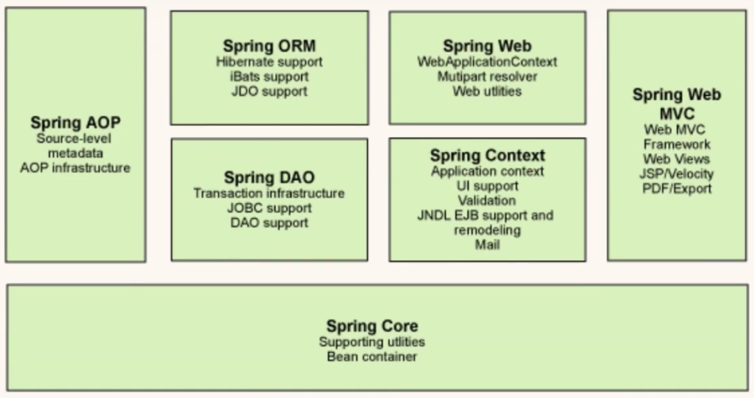


## 1.4、拓展

在Spring的官网有这个介绍：现代化的Java开发！说白了就是基于Spring开发！


- SpringBoot
  - 一个快速开发的脚手架。
  - 基于SpringBoot可以快速的开发单个微服务。
  - 约定大于配置！
- SpringCloud
  - SpringCloud是基于SpringBoot实现的。

现在大多数公司都在使用SpringBoot进行快速开发，学习SpringBoot的前提，需要完全掌握Spring及SpringMVC！承上启下的作用！ 


**弊端：发展了太久，违背了原来的理念！配置十分繁琐，人称：“配置地狱！”**


# 2、IOC理论推导

1. UserDao接口
2. UserDaoImpl实现类
3. UserService业务接口
4. UserServiceImpl业务实现类

在我们之间的业务中，用户的需求可能会影响我们原来的代码，我们需要根据用户的需求去修改原来的代码！如果程序代码量十分大，修改一次的成本十分昂贵！


我们使用一个Set接口实现，已经发生了革命性的变化！


```JAVA
private UserDao userDao;

//利用set进行动态实现值的注入
public void setUserDao(UserDao userDao) {
    this.userDao = userDao;
}
```

- 之前，程序是主动创建对象！控制权在程序员手上！
- 使用了set注入后，程序不在具有主动性，而是变成了被动的接收对象!

这种思想，从本质上解决了问题，我们程序员不用再去管理对象的创建了。系统的耦合性大大降低，可以更加专注的在业务的实现上！这是IOC的原型！


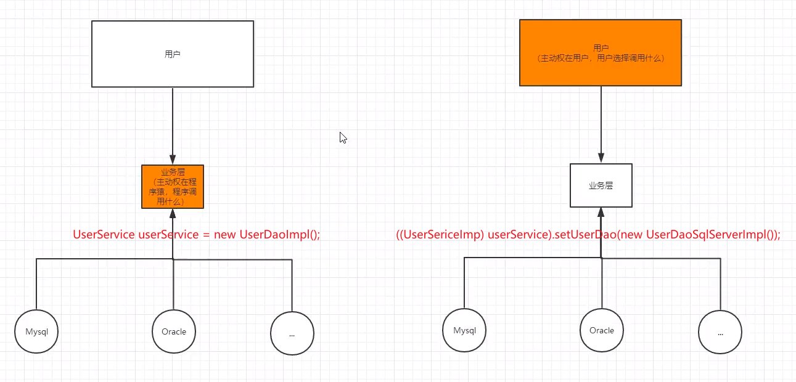

### IOC本质

**控制反转IoC(Inversion of Control)，是一种设计思想，DI(依赖注入)是实现IoC的一种方法**，也有人认为DI只是IoC的另一种说法。没有IoC的程序中 , 我们使用面向对象编程 , 对象的创建与对象间的依赖关系完全硬编码在程序中，对象的创建由程序自己控制，控制反转后将对象的创建转移给第三方，个人认为所谓控制反转就是：获得依赖对象的方式反转了。


采用XML方式配置Bean的时候，Bean的定义信息是和实现分离的，而采用注解的方式可以把两者合为一体，Bean的定义信息直接以注解的形式定义在实现类中，从而达到了零配置的目的。

==IOC的本质：==

==控制反转是一种通过描述（XML或注解）并通过第三方去生产或获取特定对象的方式。在Spring中实现控制反转的是IoC容器，其实现方法是依赖注入（Dependency Injection,DI）。==


# 3、HelloSpring

### 思考

- Hello 对象是谁创建的 ? 【 hello 对象是由Spring创建的 】
- Hello 对象的属性是怎么设置的 ? 【hello 对象的属性是由Spring容器设置的 】

这个过程就叫控制反转 :

- 控制 : 谁来控制对象的创建 , 传统应用程序的对象是由程序本身控制创建的 , 使用Spring后 , 对象是由Spring来创建的
- 反转 : 程序本身不创建对象 , 而变成被动的接收对象 .

依赖注入 : 就是利用set方法来进行注入的.

**IOC是一种编程思想，由主动的编程变成被动的接收**

可以通过newClassPathXmlApplicationContext去浏览一下底层源码 .


### 修改案例一

我们在案例一中， 新增一个Spring配置文件beans.xml

```xml
<?xml version="1.0" encoding="UTF-8"?>
<beans xmlns="http://www.springframework.org/schema/beans"
       xmlns:xsi="http://www.w3.org/2001/XMLSchema-instance"
       xsi:schemaLocation="http://www.springframework.org/schema/beans
        http://www.springframework.org/schema/beans/spring-beans.xsd">

    <bean id="MysqlImpl" class="com.kuang.dao.impl.UserDaoMySqlImpl"/>
    <bean id="OracleImpl" class="com.kuang.dao.impl.UserDaoOracleImpl"/>

    <bean id="ServiceImpl" class="com.kuang.service.impl.UserServiceImpl">
        <!--注意: 这里的name并不是属性 , 而是set方法后面的那部分 , 首字母小写-->
        <!--引用另外一个bean , 不是用value 而是用 ref-->
        <property name="userDao" ref="OracleImpl"/>
    </bean>

</beans>
```

测试！

```java
@Test
public void test2(){
    ApplicationContext context = new ClassPathXmlApplicationContext("beans.xml");
    UserServiceImpl serviceImpl = (UserServiceImpl) context.getBean("ServiceImpl");
    serviceImpl.getUser();
}
```

OK , 到了现在 , 我们彻底不用再程序中去改动了 , 要实现不同的操作 , 只需要在xml配置文件中进行修改 , 所谓的IoC,一句话搞定 : 对象由Spring 来创建 , 管理 , 装配 !

# 4、IOC创建对象的方式

1. 使用无参构造创建对象，默认！

2. 假设我们要使用有参构造创建对象

   1. 下标赋值

      ```XML
          <!--第一种，下标赋值-->
      <bean id="user" class="com.kuang.pojo.User">
          <constructor-arg index="0" value="狂神说Java"/>
      </bean>
      ```

   2. 通过类型赋值

      ```XML
      <!--第二种方式：通过类型创建，不建议使用-->
      <bean id="user" class="com.kuang.pojo.User">
          <constructor-arg type="java.lang.String" value="狂神"/>
      </bean>
      ```

   3. 通过属性名赋值

      ```XML
      <!--第三种，直接通过参数名实现赋值-->
      <bean id="user" class="com.kuang.pojo.User">
          <constructor-arg name="name" value="狂神"/>
      </bean>
      ```

总结：在配置文件加载的时候，容器中管理的对象就已经初始化了！

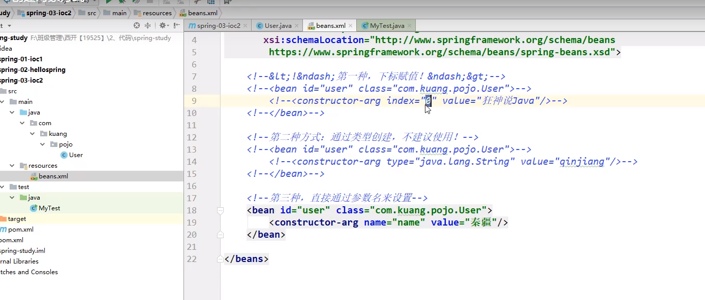

# 5、Spring配置

## 5.1、别名

```XML
<!--别名，如果添加了别名，我们也可以使用别名获取到这个对象-->
<alias name="user" alias="userAlias"/>
```

## 5.2、bean的配置

```Xml
<!--
id：bean的唯一标识符，也就是相当于我们学的对象名
class：bean对象所对应的全限定名：包名+类名
name:也是别名，而且name可以同时取多个别名
-->
<bean id="userT" class="com.kuang.pojo.UserT" name="user2 u2,u3;u4">
</bean>
```

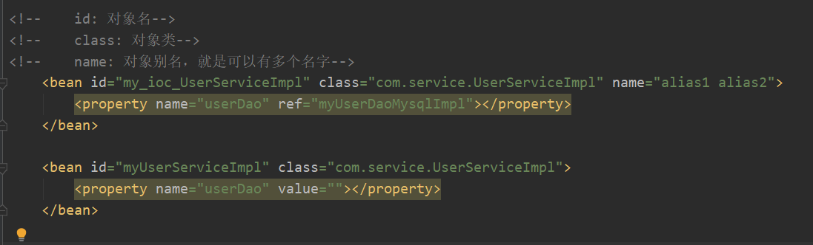

## 5.3、import

这个import，一般用于团队开发使用，他可以将多个配置文件，导入合并为一个

假设现在项目中有多个人开发，这三个人负责不同的类开发，不同的类需要注册在不同的bean中，我们可以利用import将所有人的beans.xml合并为一个总的！

- 张三
- 李四
- 王五
- applicationContext.xml

```XMl
<?xml version="1.0" encoding="UTF-8"?>
<beans xmlns="http://www.springframework.org/schema/beans"
       xmlns:xsi="http://www.w3.org/2001/XMLSchema-instance"
       xsi:schemaLocation="http://www.springframework.org/schema/beans
        https://www.springframework.org/schema/beans/spring-beans.xsd">
    <import resource="beans.xml"/>
    <import resource="beans2.xml"/>
    <import resource="beans3.xml"/>
</beans>
```

使用的时候，直接使用总的配置就可以了


# 6、依赖注入

## 6.1、构造器注入

前面已经说过

## 6.2、Set方式注入【重点】

- 依赖注入：Set注入！
  - 依赖：bean对象的创建依赖于容器
  - 注入：bean对象中的所有属性，由容器来注入！

【环境搭建】

1. 复杂类型

   ```JAVA
   package com.kuang.pojo;
   
   public class Address {
       private String address;
   
       public String getAddress() {
           return address;
       }
   
       public void setAddress(String address) {
           this.address = address;
       }
   }
   ```

2. 真实测试对象

   ```java
   package com.kuang.pojo;
   
   import java.util.*;
   
   public class Student {
       private String name;
       private Address address;
       private String[] books;
       private List<String> hobbys;
       private Map<String,String> card;
       private Set<String> games;
       private String wife;
       private Properties info;
   
       public String getName() {
           return name;
       }
   
       public void setName(String name) {
           this.name = name;
       }
   
       public Address getAddress() {
           return address;
       }
   
       public void setAddress(Address address) {
           this.address = address;
       }
   
       public String[] getBooks() {
           return books;
       }
   
       public void setBooks(String[] books) {
           this.books = books;
       }
   
       public List<String> getHobbys() {
           return hobbys;
       }
   
       public void setHobbys(List<String> hobbys) {
           this.hobbys = hobbys;
       }
   
       public Map<String, String> getCard() {
           return card;
       }
   
       public void setCard(Map<String, String> card) {
           this.card = card;
       }
   
       public Set<String> getGames() {
           return games;
       }
   
       public void setGames(Set<String> games) {
           this.games = games;
       }
   
       public String getWife() {
           return wife;
       }
   
       public void setWife(String wife) {
           this.wife = wife;
       }
   
       public Properties getInfo() {
           return info;
       }
   
       public void setInfo(Properties info) {
           this.info = info;
       }
   
       @Override
       public String toString() {
           return "Student{" +
                   "name='" + name + '\'' +
                   ", address=" + address +
                   ", books=" + Arrays.toString(books) +
                   ", hobbys=" + hobbys +
                   ", card=" + card +
                   ", games=" + games +
                   ", wife='" + wife + '\'' +
                   ", info=" + info +
                   '}';
       }
   }
   ```

3. beans.xml

   ```XML
   <?xml version="1.0" encoding="UTF-8"?>
   <beans xmlns="http://www.springframework.org/schema/beans"
          xmlns:xsi="http://www.w3.org/2001/XMLSchema-instance"
          xsi:schemaLocation="http://www.springframework.org/schema/beans
           https://www.springframework.org/schema/beans/spring-beans.xsd">
   <bean id="student" class="com.kuang.pojo.Student">
       <!--第一种，普通注入，value-->
       <property name="name" value="狂神"/>
   </bean>
   </beans>
   ```

4. 测试类

   ```JAVA
   package com.kuang;
   
   import com.kuang.pojo.Student;
   import org.springframework.context.ApplicationContext;
   import org.springframework.context.support.ClassPathXmlApplicationContext;
   
   public class MyTest {
       public static void main(String[] args) {
           ApplicationContext context = new ClassPathXmlApplicationContext("beans.xml");
           Student student = (Student) context.getBean("student");
           System.out.println(student.getName());
       }
   }
   ```

完善注入信息

```XML
<?xml version="1.0" encoding="UTF-8"?>
<beans xmlns="http://www.springframework.org/schema/beans"
       xmlns:xsi="http://www.w3.org/2001/XMLSchema-instance"
       xsi:schemaLocation="http://www.springframework.org/schema/beans
        https://www.springframework.org/schema/beans/spring-beans.xsd">

    <bean id="address" class="com.kuang.pojo.Address">
        <property name="address" value="杭州"></property>
    </bean>
<bean id="student" class="com.kuang.pojo.Student">
    <!--第一种，普通注入，value-->
    <property name="name" value="狂神"/>

    <!--第二种，Bean注入，ref-->
    <property name="address" ref="address"/>

    <!--数组注入,ref-->
    <property name="books">
        <array>
            <value>红楼梦</value>
            <value>西游记</value>
            <value>水浒传</value>
            <value>三国演义</value>
        </array>
    </property>

    <!--List-->
    <property name="hobbys">
        <list>
            <value>听歌</value>
            <value>敲代码</value>
            <value>看电影</value>
        </list>
    </property>

    <!--Map-->
    <property name="card">
        <map>
            <entry key="身份证" value="111222333344445555"/>
            <entry key="银行卡" value="11123123123123123123"/>
        </map>
    </property>
    <!--Set-->
    <property name="games">
        <set>
            <value>LOL</value>
            <value>COC</value>
            <value>BOB</value>
        </set>
    </property>

    <!--null-->
    <property name="wife">
        <null/>
    </property>

    <!--Properties-->
    <property name="info">
        <props>
            <prop key="driver">171030338</prop>
            <prop key="url">171030338</prop>
            <prop key="username">171030338</prop>
            <prop key="password">171030338</prop>
        </props>
    </property>
</bean>
</beans>
```


### 各种类型的注入：

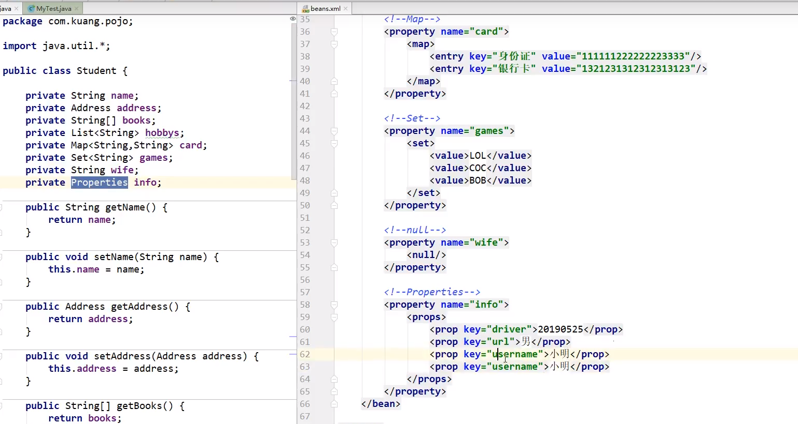

## 6.3、拓展方式注入

我们可以使用p命名空间和c命名空间进行注入

官方解释：

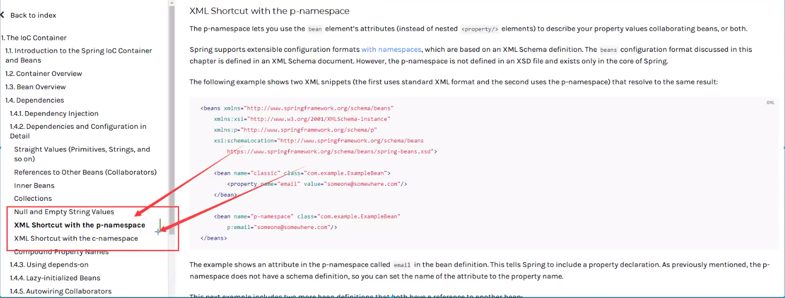

xml：

```xml
<?xml version="1.0" encoding="UTF-8"?>
<beans xmlns="http://www.springframework.org/schema/beans"
       xmlns:xsi="http://www.w3.org/2001/XMLSchema-instance"
       xmlns:p="http://www.springframework.org/schema/p"
       xmlns:c="http://www.springframework.org/schema/c"
       xsi:schemaLocation="http://www.springframework.org/schema/beans
        https://www.springframework.org/schema/beans/spring-beans.xsd">
    <!--p命名空间注入，可以直接注入属性的值：property-->
    <bean id="user" class="com.kuang.pojo.User" p:name="狂神" p:age="18"/>

    <!--c命名空间注入，通过构造器注入：construct-args-->
    <bean id="user2" class="com.kuang.pojo.User" c:age="18" c:name="狂神"/>
</beans>
```

测试：

```JAVA
@Test
public void test2() {
    ApplicationContext context = new ClassPathXmlApplicationContext("userbeans.xml");
    User user = (User) context.getBean("user2");
    System.out.println(user);
}
```


注意点：p命名空间和c命名空间不能直接使用，需要导入xml约束！

```xml
xmlns:p="http://www.springframework.org/schema/p"
xmlns:c="http://www.springframework.org/schema/c"
```

## 6.4、bean的作用域

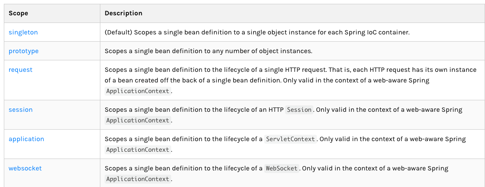

1. 单例模式（Spring默认机制）

   ```xml
       <bean id="user2" class="com.kuang.pojo.User" c:age="18" c:name="狂神" scope="singleton"/>
   ```

   

2. 原型模式:每次从容器中get的时候，都会产生一个新对象

   ```xml
       <bean id="user2" class="com.kuang.pojo.User" c:age="18" c:name="狂神" scope="prototype"/>
   
   ```

   

3. 其余的request、session、application、这些只能在web开发中用到！


# 7、bean的自动装配

- 自动装配是Spring满足bean依赖的一种方式！
- Spring会在上下文中自动寻找，并自动给bean装配属性！

在Spring中有三种装配的方式

1. 在xml中显示的配置
2. 在java中显示配置
3. 隐式的自动装配bean【重要】

## 7.1、自动装配

1. 环境搭建
   - 一个人有两个宠物！

## 7.2、ByName自动装配

```XML
<!--
byName：会自动在容器上下文中查找，和自己对象set方法后面的值对应的beanid！
-->
<bean id="people" class="com.kuang.pojo.People" autowire="byName">
    <property name="name" value="狂神"/>
</bean>
```

## 7.3、ByType自动装配

```xml
    <bean id="cat" class="com.kuang.pojo.Cat"/>
    <bean id="dog" class="com.kuang.pojo.Dog"/>
    <!--
    byName：会自动在容器上下文中查找，和自己对象set方法后面的值对应的beanid！
    byType：会自动在容器上下文中查找，和自己对象属性类型相同的bean！
    -->
    <bean id="people" class="com.kuang.pojo.People" autowire="byType">
        <property name="name" value="狂神"/>
    </bean>
```

小结：

- byname的时候，需要保证所有bean的id唯一，并且这个bean需要和注入的属性的set方法的值一致
- bytype的时候，需要保证所有bean的class唯一，并且这个bean需要和注入的属性的类型一致

## 7.4、使用注解实现自动装配

jdk1.5支持的注解，Spring2.5就支持注解了！

要使用注解须知：

1. 导入约束		context约束

2. **配置注解的支持：    <context:annotation-config/>**

   ```xml
   <?xml version="1.0" encoding="UTF-8"?>
   <beans xmlns="http://www.springframework.org/schema/beans"
       xmlns:xsi="http://www.w3.org/2001/XMLSchema-instance"
       xmlns:context="http://www.springframework.org/schema/context"
       xsi:schemaLocation="http://www.springframework.org/schema/beans
           https://www.springframework.org/schema/beans/spring-beans.xsd
           http://www.springframework.org/schema/context
           https://www.springframework.org/schema/context/spring-context.xsd">
   
       <context:annotation-config/>
   
   </beans>
   ```

   

@Autowired


直接在属性上用即可！也可以在set方式上使用！

使用Autowired我们可以不用使用Set方法了，前提是你这个自动装配的属性在IOC（Spring）容器中存在且符合名字（ByName）

科普：

```xml
@Nullable	字段标记了这个注解，说明这个字段可以为null
```

```JAVA
public @interface Autowired {
    boolean required() default true;
}
```

测试代码：

```JAVA
public class People {
    //如果显式的定义了AutoWired的required属性为false，说明这个对象可以为null，否则不允许为空
    @Autowired(required = false)
    private Cat cat;
    @Autowired
    private Dog dog;
    private String name;
```

如果@Autowired自动装配的环境比较复杂，自动装配无法通过一个注解【@Autowired】完成的时候、我们可以使用@Qualifier(value = "xxx")去配合@Autowired的使用，指定一个唯一的bean对象注入


**@Autowired注解**

```JAVA
public class people{
@Autowired
private Cat cat;
@Autowired
@Qualifier(value = "dog")
private Dog dog;
private String name;
}
```


**@Resource注解**

```java
public class people{
@Resource(name="cat")
private Cat cat;
@Resource
private Dog dog;
}
```


小结

@Resource和@Autowired的区别：

- 都是用来自动装配的，都可以放在属性字段上
- @Autowired通过byType的方式实现，而且必须要求这个对象存在！【常用】
- @Resource默认通过byname的方式实现，如果找不到名字，则通过byType实现！如果两个都找不到的情况下，就报错！
  - 执行顺序不同：@Autowired通过byType的方式实现				@Resource默认通过byname的方式实现


# 8、使用注解开发

在Spring4之后，要使用注解开发，必须要保证AOP包已经导入了

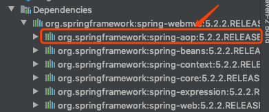

使用注解需要导入context约束，增加注解的支持!

```xml
<?xml version="1.0" encoding="UTF-8"?>
<beans xmlns="http://www.springframework.org/schema/beans"
       xmlns:xsi="http://www.w3.org/2001/XMLSchema-instance"
       xmlns:context="http://www.springframework.org/schema/context"
       xmlns:aop="http://www.springframework.org/schema/aop"
       xsi:schemaLocation="http://www.springframework.org/schema/beans
        https://www.springframework.org/schema/beans/spring-beans.xsd
        http://www.springframework.org/schema/context
        https://www.springframework.org/schema/context/spring-context.xsd
        http://www.springframework.org/schema/aop
        https://www.springframework.org/schema/aop/spring-aop.xsd">
    <!--开启注解的支持-->
    <context:annotation-config/>


</beans>
```

1. bean

2. 属性如何注入

   ```JAVA
   @Component
   public class User {
       //相当于 <property name="name" value="狂神"></property>
   
       @Value("狂神")
       public String name;
   ```

3. 衍生的注解
   @Component有几个衍生注解，我们在web开发中，会按照mvc三层架构分层！

   - dao	【@Repository】
   - service   【@Service】
   - controller  【@Controller】
     这四个注解功能都是一样的，都是代表将某个类注册到Spring中，装配Bean

4. 自动装配

   ```
   @Autowired:自动装配通过类型、名字
   如果Autowired不能唯一自动装配上属性，则需要通过@Qualifier(value="xxx")
   @Nullable：字段标记了这个注解，说明这个字段可以为null
   @Resource：自动装配通过名字、类型
   @Component：自动装配通过名字、类型
   ```

   

5. 作用域

   ```java
   @Component
   @Scope("prototype")
   public class User {
       //相当于 <property name="name" value="狂神"></property>
   
       @Value("狂神")
       public String name;
   }
   ```

   

6. 小结
   xml与注解：

   - xml更加万能，适用于任何场合！维护简单方便
   - 注解 不是自己类使用不了，维护相对复杂！

   xml与注解最佳实践

   - xml用来管理bean
   - 注解只负责完成属性的注入
   - 我们在使用的过程中，只需要注意一个问题：必须让注解生效，就需要开启注解的支持

# 9、使用Java的方式配置Spring

我们现在要完全不使用Spring的xml配置了，全权交给Java来做！

JavaConfig是Spring的一个子项目，在Spring4之后，它成为了一个核心功能

**实体类**

```java
//这里这个注解的意思，就是说明这个类被Spring接管了，注册到了容器中
@Component
public class User {
    private String name;

    @Override
    public String toString() {
        return "User{" +
                "name='" + name + '\'' +
                '}';
    }

    public String getName() {
        return name;
    }
    @Value("狂神")
    public void setName(String name) {
        this.name = name;
    }
}
```

**配置文件**

```java
package com.kuang.config;

import com.kuang.pojo.User;
import org.springframework.context.annotation.Bean;
import org.springframework.context.annotation.ComponentScan;
import org.springframework.context.annotation.Configuration;
import org.springframework.context.annotation.Import;

//这个也会被Spring容器托管，注册到容器中，因为它自身就是一个@Component，
// @Configuration代表这是一个配置类，就和我们之前看的beans.xml一样
@Configuration
@Import(kuangConfig2.class)
public class kuangConfig {

    //注册一个bean，就相当于我们之前写的一个bean标签
    //这个方法的名字，就相当于bean标签中的ID属性
    //这个方法的返回值，就相当于bean标签中的class属性
    @Bean
    public User getUser(){
        return new User();//就是返回要注入到bean的对象
    }
}
```

**测试类**

```java
public class MyTest {
    public static void main(String[] args) {

        //如果完全使用了配置类方式去做，我们就只能通过AnnotationConfig上下文来获取容器，通过配置类的class对象加载！
        ApplicationContext context = new AnnotationConfigApplicationContext(kuangConfig.class);
        User getUser = (User) context.getBean("getUser");
        System.out.println(getUser.getName());
    }
}
```

这种纯Java的配置方式，在SpringBoot中随处可见！

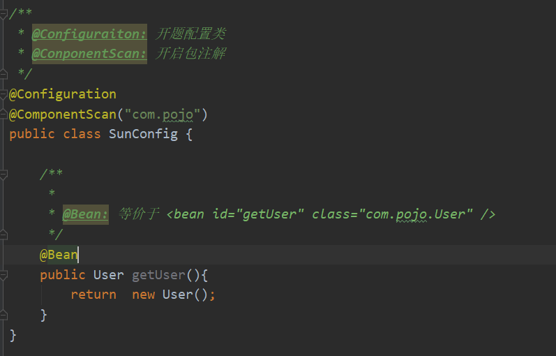

# 10、代理模式

为什么要学习代理模式？因为这就是SpringAOP的底层【SpringAOP和SpringMVC】

代理模式的分类：

- 静态代理
- 动态代理

## 10.1、静态代理

角色分析：

- 抽象角色：一般会使用接口或者抽象类来解决
- 真实角色：被代理的角色
- 代理角色：代理真实角色，代理真实角色后，我们一般会做一些附属操作
- 客户：访问代理对象的人！

代码步骤：

1. 接口

   ```JAVA
   //租房接口
   public interface Rent {
       public void rent();
   }
   ```

2. 真实角色

   ```JAVA
   //房东
   public class Host implements Rent {
       @Override
       public void rent(){
           System.out.println("房东要出租房子！🏠");
       }
   }
   ```

3. 代理角色

   ```JAVA
   package com.kuang.demo01;
   
   public class Proxy implements Rent {
       private Host host;
   
       public Proxy() {
       }
   
       public Proxy(Host host) {
           this.host = host;
       }
   
       @Override
       public void rent() {
           seeHouse();
           host.rent();
           hetong();
           fare();
       }
       //看房
       public void seeHouse(){
           System.out.println("中介带你看房");
       }
   
       //签署合同
       public void hetong(){
           System.out.println("签租赁合同");
       }
   
       //收取中介费
       public void fare(){
           System.out.println("收取中介费");
       }
   }
   ```

4. 客户端访问代理角色

   ```JAVA
   package com.kuang.demo01;
   
   public class Client {
       public static void main(String[] args) {
           //房东要租房子
           Host host = new Host();
           //代理，中介帮房东租房子，但是呢代理角色一般会有一些附属操作！
           Proxy proxy = new Proxy(host);
           //你不用面对房东，直接找中介租房即可！
           proxy.rent();
       }
   }
   ```

代理模式的好处：

- 可以使真实角色的操作更加纯粹！不用关注一些公共的业务
- 公共事情就交给代理角色！实现了业务的分工
- 公共业务发生扩展的时候，方便集中管理

缺点：

- ==因为1个需要Rend要1个代理，类似的都需要好多好多的代理，就更复杂了==


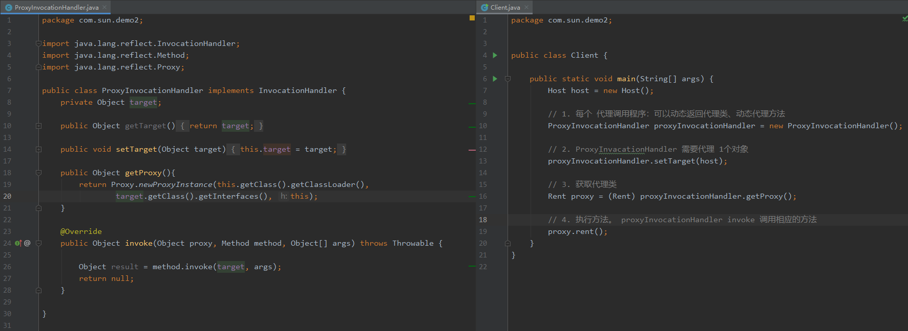


## 10.2、加深理解

代码：对应08-demo02

聊聊AOP

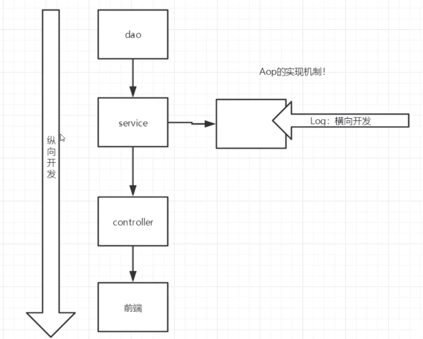


## 10.3、动态代理

- 动态代理和静态代理角色一样
- 动态代理的代理类是动态生成的，不是我们直接写好的！
- 动态代理也分为两大类：基于接口的动态代理，基于类的动态代理
  - 基于接口----JDK动态代理
  - 基于类：cglib
  - java字节码实现：javasist

需要了解两个类：Proxy（代理）、InvocationHandler（调用处理程序）

**InvocationHandler**

动态代理的好处：

- 可以使真实角色的操作更加纯粹！不用关注一些公共的业务
- 公共事情就交给代理角色！实现了业务的分工
- 公共业务发生扩展的时候，方便集中管理
- 一个动态代理类代理的是一个接口，一般就是对应的一类业务
- 一个动态代理类可以代理多个类，只要是实现了同一个接口即可


# 11、AOP

## 11.1、什么事AOP

AOP意为：面向切面编程，通过预编译方式和运行期动态代理实现程序功能的统一维护的一种技术。AOP是OOP的延续，是软件开发中的一个热点，也是Spring框架中的一个重要内容，是函数式编程的一种衍生范型。利用AOP可以对业务逻辑的各个部分进行隔离，从而使得业务逻辑部分之间的耦合度降低，提高程序的可重用性，同时提高了开发的效率。

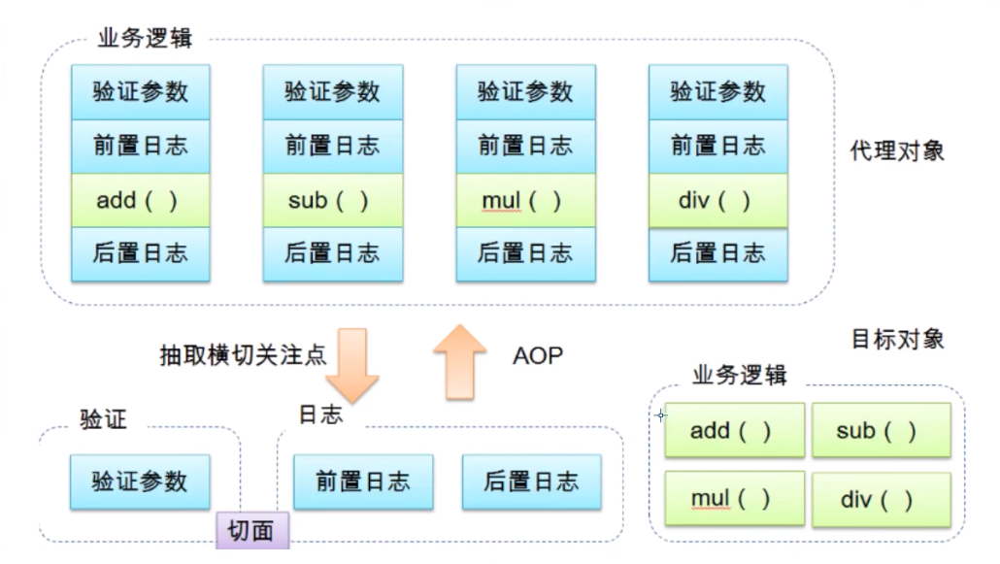

## 11.2、AOP在Spring中的作用

**提供声明式事务，允许用户自定义切面**

- 横切关注点：跨越应用程序多个模块的方法或功能。即是，与我们业务逻辑无关的，但是我们需要关注的部分，就是横切关注点。如日志，安全，缓存，事务等等....
- 切面（ASPECT）：横切关注点被模块化的特殊对象。即，它是一个类。
- 通知（Advice）：切面必须要完成的工作。即，它是类中的一个方法。
- 目标（Target）：被通知对象。
- 代理（Proxy）：向目标对象应用通知之后创建的对象。
- 切入点（PointCut）：切面通知执行的“地点“的定义
- 连接点（JointPoint）：与切入点匹配的执行点


## 11.3、使用Spring实现AOP

【重点】使用AOP织入，需要导入一个依赖包！

```xml
<!-- https://mvnrepository.com/artifact/org.aspectj/aspectjweaver -->
<dependency>
		<groupId>org.aspectj</groupId>
  	<artifactId>aspectjweaver</artifactId>
  	<version>1.9.4</version>
</dependency>
```


方式一：使用Spring的API接口【主要SpringAPI接口实现】

方式二：自定义类来实现AOP【主要是切面的定义】

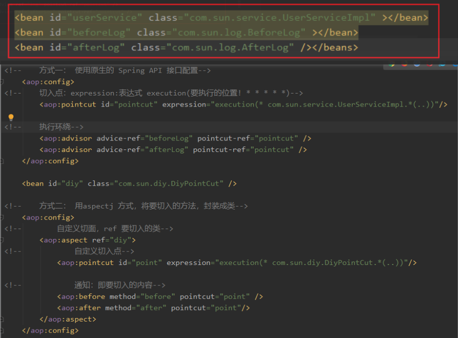

方式三：Spring注解的注入

- 定义Bean
- 开启注解支持

```xml
<bean id="annotationPointCur" class="com.sun.diy.AnnotationPointCut" />
<!--    开启注解支持 JDK(默认 proxy-target-class="false") cglib proxy-target-class="true" -->
<aop:aspectj-autoproxy proxy-target-class="false"/>
```

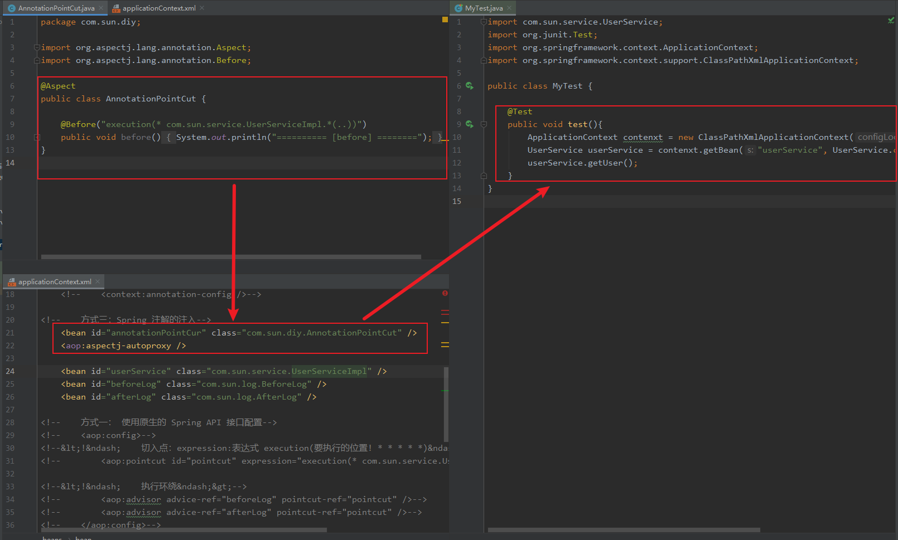


# 12、整合Mybatis

步骤：

1. 导入相关jar包
   - junit
   - mybatis
   - mysql数据库
   - spring相关
   - aop织入
   - mybatis-spring【new】
2. 编写配置文件
3. 测试

## 12.1、回忆mybatis

1. 编写实体类
2. 编写核心配置文件
3. 编写接口
4. 编写Mapper.xml
5. 测试


## 12.2、Mybatis-Spring

### ==sun:Mybatis-Spring整合思路==

1. pojo：声明实现类 User

2. mapper:  

   1. 为了面向接口变成：写UserMapper接口
   2. 为了使用Mybatis：写UserMapper.xml，里面包含Sql语句，用于查询
   3. 为了Spring创建Bean：写UserMapperImpl实现UserMapper接口，
      - ==为了使得 `public List<User> selectUsers()`方法能真正查询出结果：使用Mybtais中的sqlSession获取Mapper(UserMapp.class)类，并调用selectUsers()方法。==
      - 为什么要在这里使用SqlSession呢，这相当于一个测试类，去数据库查询相关的数据。测试类嘛，已经把真正的执行Sql语句封装进去了。

3. spring-dao.xml：为了使用数据库：

   1. 配置datasource
   2. 为了Mapper能够调用sqlSession：配置SqlSessionFactory

4. applicationContext.xml：声明Bean

   1. 为了控制反转：在这里面声明Bean，包括UserMapperImpl的Bean `userMapperImpl`
   2. 为了使用专业的数据库配置文件，导入`spring-dao.xml`

5. 测试：在任意地方

   1. 通过`applicationContext.xml` 加载 ApplicatonContext对象，获取对应的Bean `userMapperImpl`
   2. 该Bean调用自己的查询方法`selectUsers()` 方法即可，查询出结果。

   


### 实现思路

1. 导入相关包

   ```xml
   <!--        mybatis的包：-->
   <!-- https://mvnrepository.com/artifact/org.mybatis/mybatis -->
   <dependency>
    <groupId>org.mybatis</groupId>
    <artifactId>mybatis</artifactId>
    <version>3.5.2</version>
   </dependency>
   <!-- https://mvnrepository.com/artifact/org.mybatis/mybatis-spring -->
   <!--        spring整合mybatis的包-->
   <dependency>
       <groupId>org.mybatis</groupId>
       <artifactId>mybatis-spring</artifactId>
       <version>2.0.6</version>
   </dependency>
   ```

2. 编写数据源配置、sqlSessionFactory、sqlSessionTemplate。模板一般放在`spring-dao.xml`

   ```java
   <?xml version="1.0" encoding="UTF-8"?>
   <beans xmlns="http://www.springframework.org/schema/beans"
          xmlns:xsi="http://www.w3.org/2001/XMLSchema-instance"
          xmlns:p="http://www.springframework.org/schema/p"
          xmlns:c="http://www.springframework.org/schema/c"
          xmlns:aop="http://www.springframework.org/schema/aop"
          xmlns:context="http://www.springframework.org/schema/context"
          xsi:schemaLocation="http://www.springframework.org/schema/beans
               http://www.springframework.org/schema/beans/spring-beans.xsd
               http://www.springframework.org/schema/aop
               http://www.springframework.org/schema/aop/spring-aop.xsd
               http://www.springframework.org/schema/context
               http://www.springframework.org/schema/context/spring-context.xsd">
   
   <!--
       DataSource: 使用Spring 替换 c3p0 dbcp druid
       这里使用：org.springframework.jdbc.datasource
   -->
       <bean id="dataSource" class="org.springframework.jdbc.datasource.DriverManagerDataSource">
           <property name="driverClassName" value="com.mysql.jdbc.Driver" />
           <property name="url" value="jdbc:mysql://121.40.254.238:3306/mybatis?useSSL=true&amp;useUnicode=true&amp;characterEncoding=UTF-8" />
           <property name="username"  value="root" />
           <property name="password" value="1210" />
       </bean>
   
       <bean id="sqlSessionFactory" class="org.mybatis.spring.SqlSessionFactoryBean" >
           <property name="dataSource" ref="dataSource" />
           <property name="configLocation" value="classpath:mybatis-config.xml" />
   
   <!--        导入所有的：mybatis-sql映射-->
           <property name="mapperLocations" value="classpath:com/sun/mapper/*.xml" />
       </bean>
   
   <!--    SqlSessionTemplate: 就相当于Mybatis中的sqlSession -->
       <bean id="sqlSessionTemplate" class="org.mybatis.spring.SqlSessionTemplate">
           <constructor-arg index="0" ref="sqlSessionFactory" />
       </bean>
   
   <!--   方式一：UserMapperImpl转移：applicationContext.xml 中-->
   
   <!--   方式二：UserMapperImpl2 继承SqlSessionDaoSupport  -->
   
   </beans>
   ```

3. 需要给接口加实现类。UserMapper  --> UserMapperImpl

   ```java
   public class UserMapperImpl1 implements UserMapper {
   
    private SqlSessionTemplate sqlSessionTemplate;
   
    public void setSqlSessionTemplate(SqlSessionTemplate sqlSessionTemplate) {
        this.sqlSessionTemplate = sqlSessionTemplate;
    }
   
    @Override
    public List<User> selectUsers() {
        return sqlSessionTemplate.getMapper(UserMapper.class).selectUsers();
    }
   }
   ```

   ```java
   public class UserMapperImpl2 extends SqlSessionDaoSupport implements UserMapper {
   
       @Override
       public List<User> selectUsers() {
       	return this.getSqlSession().getMapper(UserMapper.class).selectUsers();
       }
   }
   ```

4. 将自己写的实现类，注入到spring中。`applicationContext.xml`

   ```java
   <?xml version="1.0" encoding="UTF-8"?>
   <beans xmlns="http://www.springframework.org/schema/beans"
          xmlns:xsi="http://www.w3.org/2001/XMLSchema-instance"
          xmlns:p="http://www.springframework.org/schema/p"
          xmlns:c="http://www.springframework.org/schema/c"
          xmlns:aop="http://www.springframework.org/schema/aop"
          xmlns:context="http://www.springframework.org/schema/context"
          xsi:schemaLocation="http://www.springframework.org/schema/beans
               http://www.springframework.org/schema/beans/spring-beans.xsd
               http://www.springframework.org/schema/aop
               http://www.springframework.org/schema/aop/spring-aop.xsd
               http://www.springframework.org/schema/context
               http://www.springframework.org/schema/context/spring-context.xsd">
   
       <import resource="spring-dao.xml" />
   
       <!--   方式一：UserMapperImpl 包含属性SqlSessionTemplate -->
       <bean id="UserMapper1" class="com.sun.mapper.UserMapperImpl1" >
           <property name="sqlSessionTemplate" ref="sqlSessionTemplate" />
       </bean>
   
       <!--   方式二：UserMapperImpl2 继承  -->
       <bean id="UserMapper2" class="com.sun.mapper.UserMapperImpl2" >
           <property name="sqlSessionFactory" ref="sqlSessionFactory" />
       </bean>
   
   </beans>
   ```

5. 测试类

   ```java
   @Test
       public void testUserMapperImpl1(){
           ApplicationContext contenxt = new ClassPathXmlApplicationContext("spring-dao.xml");
           UserMapper userMapper = contenxt.getBean("UserMapper1", UserMapper.class);
           List<User> users = userMapper.selectUsers();
           for (User user : users) {
               System.out.println(user);
           }
       }
   ```

   

### 公司常用

可能更简单，但都是基于这个封装的。

- Mybatis-plus
- 通用Mapper


# 13、声明式事务

## 1、回顾事务

- 把一组业务当成一个业务来做；要么都成功，要么都失败！
- 事务在项目开发中，十分重要，涉及到数据的一致性问题，不能马虎！
- 确保完整性和一致性


事务的ACID原则：

- 原子性
- 隔离性
  - 多个业务可以操作同一个资源，防止数据损坏
- 持久性
  - 事务一旦提交，无论系统发生什么问题，结果都不会再被影响，被持久化的写到存储器中！
- 一致性：一个事务必须使数据库从一个一致性状态变换到另一个一致性状态==（最终目标）==


## 2、spring中的事务管理

- ==声明式事务：AOP==
- 编程式事务：需要在代码中，进行事务的管理。==所以就不好用，不想改源代码==


步骤：

1. 在`spirng-dao.xml` 中声明事务、配置AOP
2. 添加UserMapper接口、配置UserMapper.xml接口的SQL语句
3. 书写实现类UserMapper1，并查看是否方法能够原子执行

```ml
<?xml version="1.0" encoding="UTF-8" ?>
<!DOCTYPE mapper
        PUBLIC "-//mybatis.org//DTD Mapper 3.0//EN"
        "http://mybatis.org/dtd/mybatis-3-mapper.dtd">
<mapper namespace="com.sun.mapper.UserMapper">

    <select id="selectUsers" resultType="user">
        select * from mybatis.user;
    </select>

    <insert id="addUser" parameterType="user">
        insert into mybatis.user (id, name, pwd) values (#{id},#{name},#{password});
    </insert>

    <delete id="deleteUser" parameterType="int">
        delete from mybatis.user where id = #{id};
    </delete>
</mapper>
```


```xml
<!--    配置事务声明-->
<bean id="transactionManager" class="org.springframework.jdbc.datasource.DataSourceTransactionManager">
    <property name="dataSource" ref="dataSource" />
</bean>

<!--结合AOP、实现事务的织入-->
<!--    配置事务通知，就是怎么用，是用还是不用，有7中事务属性-->
<tx:advice id="txAdvice" transaction-manager="transactionManager">
    <!--        配置事务的传播特性-->
    <tx:attributes>
        <tx:method name="add" propagation="REQUIRED"/>
        <tx:method name="delete" propagation="REQUIRED"/>
        <tx:method name="update" propagation="REQUIRED"/>
        <tx:method name="query" propagation="REQUIRED"/>
        <!--            一般一条就够了-->
        <tx:method name="*" propagation="REQUIRED"/>
    </tx:attributes>
</tx:advice>

<!--    配置事务的切入-->
<aop:config>
    <aop:pointcut id="txPointCut" expression="execution(* com.sun.mapper.*.*(..))"/>
    <aop:advisor advice-ref="txAdvice" pointcut-ref="txPointCut" />
</aop:config>
```


其中，7中事务的声明如下：

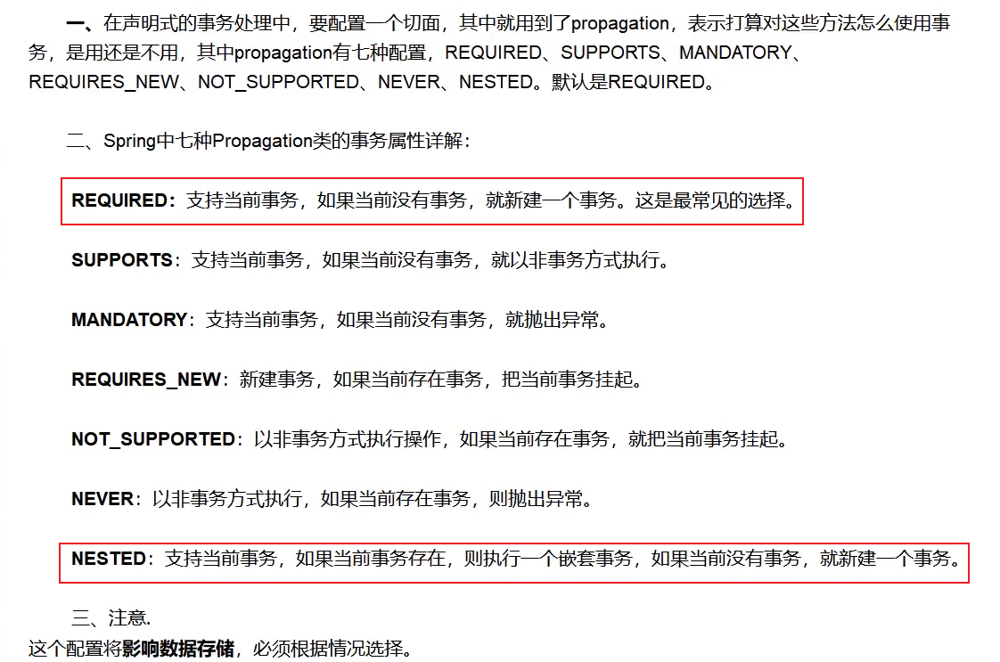


思考：为什么需要事务？

- 如果不配置事务，可能存在数据提交不一致的情况下；
- 如果我们不在spring中去配置声明式事务，我们就需要在代码中手动配置事务！
- 事务在项目的开发中十分重要，设计到数据的一致性和完整性问题，不容马虎！