# SpringMVC

SpringMVC官方文档：https://spring.io/guides/gs/serving-web-content/


## 1、回顾MVC


### 1.1、什么是MVC

- MVC是模型(dao,service，Model)、视图(View)、控制器(原来是Servlet，Controller)的简写，是一种软件设计规范。
- 是将业务逻辑、数据、显示分离的方法来组织代码。
- MVC主要作用是**降低了视图与业务逻辑间的双向偶合**。
- MVC不是一种设计模式，**MVC是一种架构模式**。当然不同的MVC存在差异。

**Model（模型）：**数据模型，提供要展示的数据，因此包含数据和行为，可以认为是领域模型或JavaBean组件（包含数据和行为），不过现在一般都分离开来：Value Object（数据Dao） 和 服务层（行为Service）。也就是模型提供了模型数据查询和模型数据的状态更新等功能，包括数据和业务。

**View（视图）：**负责进行模型的展示，一般就是我们见到的用户界面，客户想看到的东西。

**Controller（控制器）：**接收用户请求，委托给模型进行处理（状态改变），处理完毕后把返回的模型数据返回给视图，由视图负责展示。也就是说控制器做了个调度员的工作。

**最典型的MVC就是JSP + servlet + javabean的模式。**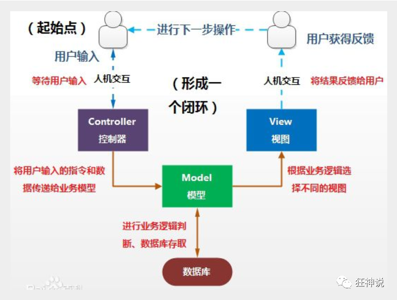

### 1.2、Model1时代

- 在web早期的开发中，通常采用的都是Model1。
- Model1中，主要分为两层，视图层和模型层。

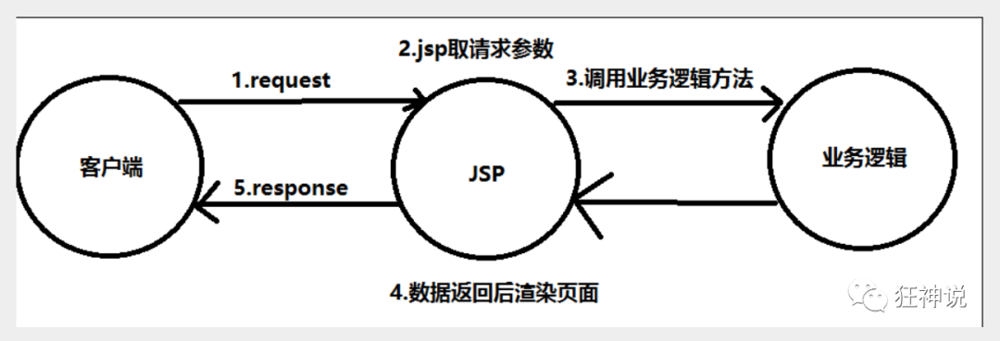

Model1优点：架构简单，比较适合小型项目开发；

Model1缺点：JSP职责不单一，职责过重，不便于维护；

### 1.3、Model2时代

Model2把一个项目分成三部分，包括**视图、控制、模型。**

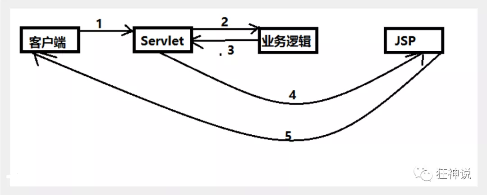

1. 用户发请求
2. Servlet接收请求数据，并调用对应的业务逻辑方法
3. 业务处理完毕，返回更新后的数据给servlet
4. servlet转向到JSP，由JSP来渲染页面
5. 响应给前端更新后的页面


sun: 一般架构都是演进的，几乎不能是设计好的。

阿里My

**职责分析：**

**Controller：控制器**

1. 取得表单数据
2. 调用业务逻辑
3. 转向指定的页面

**Model：模型**

1. 业务逻辑
2. 保存数据的状态

**View：视图**

1. 显示页面

Model2这样不仅提高的代码的复用率与项目的扩展性，且大大降低了项目的维护成本。Model 1模式的实现比较简单，适用于快速开发小规模项目，Model1中JSP页面身兼View和Controller两种角色，将控制逻辑和表现逻辑混杂在一起，从而导致代码的重用性非常低，增加了应用的扩展性和维护的难度。Model2消除了Model1的缺点。

### ==[1.4、回顾Servlet](https://www.bilibili.com/video/BV1aE41167Tu?p=3)==

1. 新建一个Maven工程当做父工程！pom依赖！

   ```xml
   <dependencies>
      <dependency>
          <groupId>junit</groupId>
          <artifactId>junit</artifactId>
          <version>4.12</version>
      </dependency>
      <dependency>
          <groupId>org.springframework</groupId>
          <artifactId>spring-webmvc</artifactId>
          <version>5.1.9.RELEASE</version>
      </dependency>
      <dependency>
          <groupId>javax.servlet</groupId>
          <artifactId>servlet-api</artifactId>
          <version>2.5</version>
      </dependency>
      <dependency>
          <groupId>javax.servlet.jsp</groupId>
          <artifactId>jsp-api</artifactId>
          <version>2.2</version>
      </dependency>
      <dependency>
          <groupId>javax.servlet</groupId>
          <artifactId>jstl</artifactId>
          <version>1.2</version>
      </dependency>
   </dependencies>
   ```

2. 建立一个Moudle：springmvc-01-servlet ， 添加Web app的支持！

   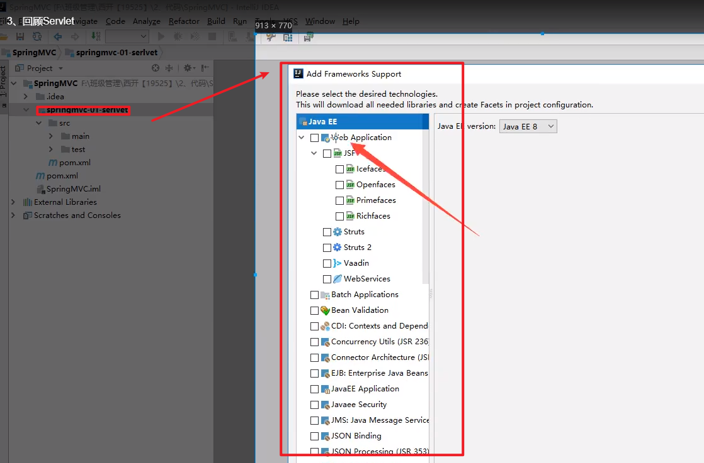

3. 导入servlet 和 jsp 的 jar 依赖

   ```xml
   <dependency>
      <groupId>javax.servlet</groupId>
      <artifactId>servlet-api</artifactId>
      <version>2.5</version>
   </dependency>
   <dependency>
      <groupId>javax.servlet.jsp</groupId>
      <artifactId>jsp-api</artifactId>
      <version>2.2</version>
   </dependency>
   ```

4. 编写一个Servlet类，用来处理用户的请求

   ```java
   package nuc.ss.servlet;
   
   //实现Servlet接口
   public class HelloServlet extends HttpServlet {
      @Override
      protected void doGet(HttpServletRequest req, HttpServletResponse resp) throws ServletException, IOException {
          //取得参数
          String method = req.getParameter("method");
          if (method.equals("add")){
              req.getSession().setAttribute("msg","执行了add方法");
         }
          if (method.equals("delete")){
              req.getSession().setAttribute("msg","执行了delete方法");
         }
          //业务逻辑
          //视图跳转
          req.getRequestDispatcher("/WEB-INF/jsp/hello.jsp").forward(req,resp);
     }
   
      @Override
      protected void doPost(HttpServletRequest req, HttpServletResponse resp) throws ServletException, IOException {
          doGet(req,resp);
     }
   }
   ```

5. 编写Hello.jsp，在WEB-INF目录下新建一个jsp的文件夹，新建hello.jsp

   ```html
   <%@ page contentType="text/html;charset=UTF-8" language="java" %>
       <html>
           <head>
               <title>Kuangshen</title>
           </head>
           <body>
               ${msg}
           </body>
       </html>
   ```

6. 在web.xml中注册Servlet

   ```xml
   <?xml version="1.0" encoding="UTF-8"?>
   <web-app xmlns="http://xmlns.jcp.org/xml/ns/javaee"
           xmlns:xsi="http://www.w3.org/2001/XMLSchema-instance"
           xsi:schemaLocation="http://xmlns.jcp.org/xml/ns/javaee http://xmlns.jcp.org/xml/ns/javaee/web-app_4_0.xsd"
           version="4.0">
      <servlet>
          <servlet-name>HelloServlet</servlet-name>
          <servlet-class>com.kuang.servlet.HelloServlet</servlet-class>
      </servlet>
       
     <!-- 访问/user时，会调到 HelloServlet 中，HelloServlet 进行相关发处理和转发 -->   
      <servlet-mapping>
          <servlet-name>HelloServlet</servlet-name>
          <url-pattern>/hello</url-pattern>
      </servlet-mapping>
   
   </web-app>
   ```

7. 配置Tomcat，并启动测试

   - localhost:9000/hello?method=add
   - localhost:9000/hello?method=delete

**MVC框架要做哪些事情**

1. 将url映射到java类或java类的方法 .
2. 封装用户提交的数据 .
3. 处理请求--调用相关的业务处理--封装响应数据 .
4. 将响应的数据进行渲染 . jsp / html 等表示层数据 .

**说明：**

​	常见的服务器端MVC框架有：Struts、Spring MVC、ASP.NET MVC、Zend Framework、JSF；常见前端MVC框架：vue、angularjs、react、backbone；由MVC演化出了另外一些模式如：MVP、MVVM 等等....


## 2、什么是SpringMVC

### 2.1、概述


<font color=red>Spring MVC是Spring Framework的一部分，是基于Java实现MVC的轻量级Web框架。</font>

查看官方文档：[https://docs.spring.io/spring/docs/5.2.0.RELEASE/spring-framework-reference/web.html#spring-web](https://docs.spring.io/spring/docs/5.2.0.RELEASE/spring-framework-reference/web.html#spring-web)

**我们为什么要学习SpringMVC呢?**

 Spring MVC的特点：

1. 轻量级，简单易学
2. 高效 , 基于请求响应的MVC框架
3. 与Spring兼容性好，无缝结合
4. 约定优于配置
5. 功能强大：RESTful、数据验证、格式化、本地化、主题等
6. 简洁灵活

Spring的web框架围绕**DispatcherServlet** [ 调度Servlet ] 设计。

DispatcherServlet的作用是将请求分发到不同的处理器。从Spring 2.5开始，使用Java 5或者以上版本的用户可以采用基于注解形式进行开发，十分简洁；

正因为SpringMVC好 , 简单 , 便捷 , 易学 , 天生和Spring无缝集成(使用SpringIoC和Aop) , 使用约定优于配置 . 能够进行简单的junit测试 . 支持Restful风格 .异常处理 , 本地化 , 国际化 , 数据验证 , 类型转换 , 拦截器 等等......所以我们要学习 .

**最重要的一点还是用的人多 , 使用的公司多 .** 

### 2.2、中心控制器

- Spring的web框架围绕DispatcherServlet设计。DispatcherServlet的作用是将请求分发到不同的处理器。从Spring 2.5开始，使用Java 5或者以上版本的用户可以采用基于注解的controller声明方式。

  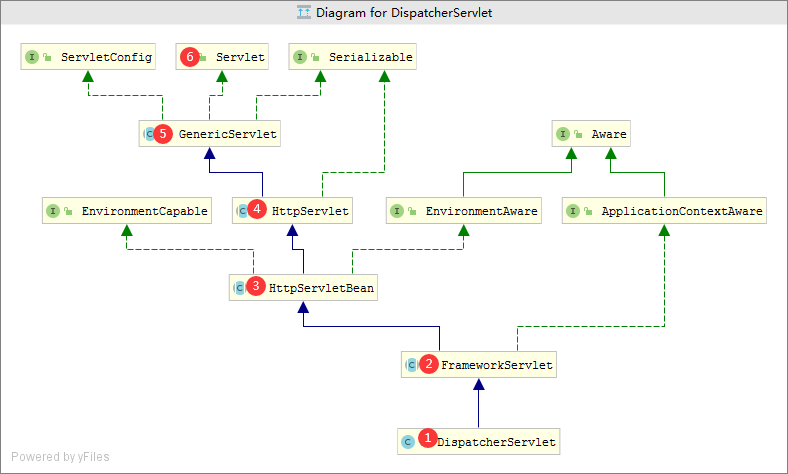

  Spring MVC框架像许多其他MVC框架一样, **以请求为驱动** , **围绕一个中心Servlet分派请求及提供其他功能**，**DispatcherServlet是一个实际的Servlet (它继承自HttpServlet 基类)**。

- SpringMVC的原理如下图所示：

  当发起请求时被前置的控制器拦截到请求，根据请求参数生成代理请求，找到请求对应的实际控制器，控制器处理请求，创建数据模型，访问数据库，将模型响应给中心控制器，控制器使用模型与视图渲染视图结果，将结果返回给中心控制器，再将结果返回给请求者。

  

  <font color=red>原图</font>

  

<font color=red>中文图</font>


### 2.3、SpringMVC执行原理

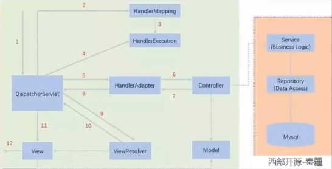

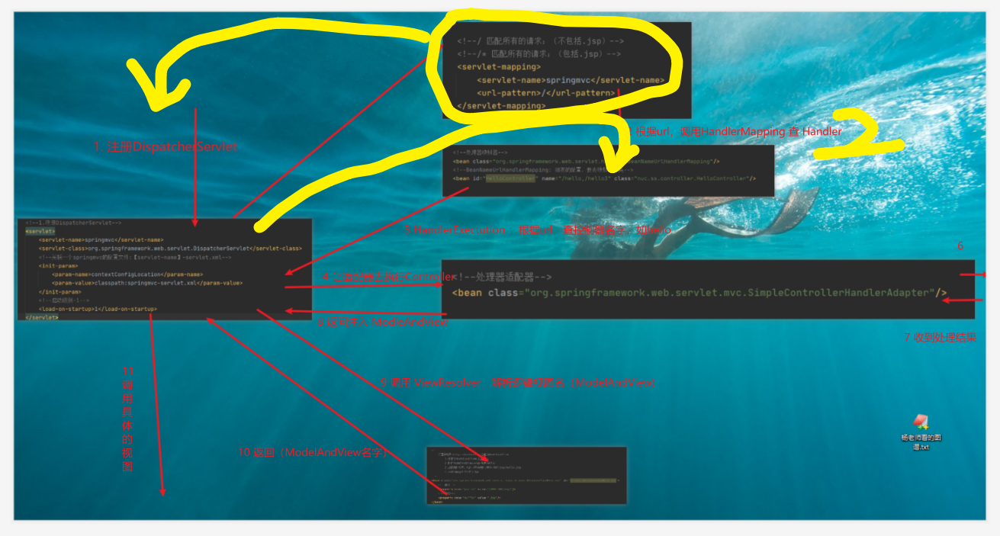

图为SpringMVC的一个较完整的流程图，实线表示SpringMVC框架提供的技术，不需要开发者实现，虚线表示需要开发者实现。

**简要分析执行流程**

1. DispatcherServlet表示前置控制器，是整个SpringMVC的控制中心。用户发出请求，DispatcherServlet接收请求并拦截请求。

   - 我们假设请求的url为 : http://localhost:9000/SpringMVC/hello

   - **如上url拆分成三部分：**

   - http://localhost:9000 ------> 服务器域名

   - SpringMVC ------> 部署在服务器上的web站点

   - hello ------> 表示控制器

   - 通过分析，如上url表示为：请求位于服务器localhost:9000上的SpringMVC站点的hello控制器。

2. HandlerMapping为处理器映射。DispatcherServlet调用HandlerMapping,HandlerMapping根据请求url查找Handler。

3. HandlerExecution表示具体的Handler,其主要作用是根据url查找控制器，如上url被查找控制器为：hello。

4. HandlerExecution将解析后的信息传递给DispatcherServlet,如解析控制器映射等。

5. HandlerAdapter表示处理器适配器，其按照特定的规则去执行Handler。

6. Handler让具体的Controller执行。

7. Controller将具体的执行信息返回给HandlerAdapter,如ModelAndView。

8. HandlerAdapter将视图逻辑名或模型传递给DispatcherServlet。

9. DispatcherServlet调用视图解析器(ViewResolver)来解析HandlerAdapter传递的逻辑视图名。

10. 视图解析器将解析的逻辑视图名传给DispatcherServlet。

11. DispatcherServlet根据视图解析器解析的视图结果，调用具体的视图。

12. 最终视图呈现给用户。


## 3、第一个MVC程序

### [3.1、配置版(深入学习SpringMVC)](https://www.bilibili.com/video/BV1aE41167Tu?p=6)

1. 新建一个Moudle ，==springmvc-02-hello== ， 添加web的支持！

2. 确定导入了SpringMVC 的依赖！

3. 配置web.xml  ， 注册DispatcherServlet

   ```xml
   <?xml version="1.0" encoding="UTF-8"?>
   <web-app xmlns="http://xmlns.jcp.org/xml/ns/javaee"
           xmlns:xsi="http://www.w3.org/2001/XMLSchema-instance"
           xsi:schemaLocation="http://xmlns.jcp.org/xml/ns/javaee http://xmlns.jcp.org/xml/ns/javaee/web-app_4_0.xsd"
           version="4.0">
   
      <!--1.注册DispatcherServlet-->
      <servlet>
          <servlet-name>springmvc</servlet-name>
          <servlet-class>org.springframework.web.servlet.DispatcherServlet</servlet-class>
          <!--关联一个springmvc的配置文件:【servlet-name】-servlet.xml-->
          <init-param>
              <param-name>contextConfigLocation</param-name>
              <param-value>classpath:springmvc-servlet.xml</param-value>
          </init-param>
          <!--启动级别-1，和服务器一起启动-->
          <load-on-startup>1</load-on-startup>
      </servlet>
   
      <!--/ 匹配所有的请求；（不包括.jsp）-->
      <!--/* 匹配所有的请求；（包括.jsp）-->
      <servlet-mapping>
          <servlet-name>springmvc</servlet-name>
          <url-pattern>/</url-pattern>
      </servlet-mapping>
   
   </web-app>
   ```
   
4. 编写SpringMVC 的 配置文件！名称：springmvc-servlet.xml  : [servletname]-servlet.xml

   说明，这里的名称要求是按照官方来的

   ```xml
   <?xml version="1.0" encoding="UTF-8"?>
   <beans xmlns="http://www.springframework.org/schema/beans"
         xmlns:xsi="http://www.w3.org/2001/XMLSchema-instance"
         xsi:schemaLocation="http://www.springframework.org/schema/beans
          http://www.springframework.org/schema/beans/spring-beans.xsd">
   
   </beans>
   ```

5. 添加 处理映射器（可省略）

   ```xml
   <bean class="org.springframework.web.servlet.handler.BeanNameUrlHandlerMapping"/>
   
   <!--BeanNameUrlHandlerMapping: 独有的配置，要去映射那个类-->
   。<bean id="HelloController" name="/hello,/hello3" class="nuc.ss.controller.HelloController"/>
   ```

6. 添加 处理器适配器（可省略）

   ```xml
   <bean class="org.springframework.web.servlet.mvc.SimpleControllerHandlerAdapter"/>
   ```

7. 添加 视图解析器

   ```xml
   <!--视图解析器:DispatcherServlet给他的ModelAndView-->
   <!-- 模板引擎：Thymeleaf Freemarker -->
   <bean class="org.springframework.web.servlet.view.InternalResourceViewResolver" id="InternalResourceViewResolver">
      <!--前缀-->
      <property name="prefix" value="/WEB-INF/jsp/"/>
      <!--后缀-->
      <property name="suffix" value=".jsp"/>
   </bean>
   ```
   
8. 编写我们要操作业务Controller ，要么实现Controller接口，要么增加注解；需要返回一个ModelAndView，装数据，封视图；

   ```java
   package nuc.ss.controller;
   
   import org.springframework.web.servlet.ModelAndView;
   import org.springframework.web.servlet.mvc.Controller;
   
   import javax.servlet.http.HttpServletRequest;
   import javax.servlet.http.HttpServletResponse;
   
   //注意：这里我们先导入Controller接口
   public class HelloController implements Controller {
   
      public ModelAndView handleRequest(HttpServletRequest request, HttpServletResponse response) throws Exception {
          //ModelAndView 模型和视图
          ModelAndView mv = new ModelAndView();
   
          //封装对象，放在ModelAndView中。Model
          mv.addObject("msg","HelloSpringMVC!");
          //封装要跳转的视图，放在ModelAndView中
          mv.setViewName("hello"); //: /WEB-INF/jsp/hello.jsp
          return mv;
     }
   }
   ```
   
9. 将自己的类交给SpringIOC容器，注册bean

   ```xml
   <!--Handler-->
   <bean id="/hello" class="nuc.ss.controller.HelloController"/>
   ```

10. 写要跳转的jsp页面，显示ModelandView存放的数据，以及我们的正常页面；

    ```html
    <%@ page contentType="text/html;charset=UTF-8" language="java" %>
        <html>
            <head>
                <title>Kuangshen</title>
            </head>
            <body>
                ${msg}
            </body>
        </html>
    ```

11. 配置Tomcat 启动测试！

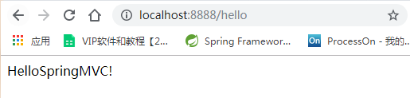

**可能遇到的问题：访问出现404，排查步骤：**

1. 查看控制台输出，看一下是不是缺少了什么jar包。

2. 如果jar包存在，显示无法输出，就在IDEA的项目发布中，添加lib依赖！

   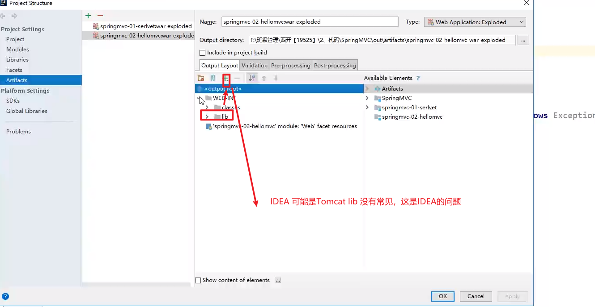

3. 重启Tomcat 即可解决！

小结：我们来看个注解版实现，这才是SpringMVC的精髓。


### 3.2、注解版

1. **新建一个Moudle，==springmvc-03-hello-annotation== 。添加web支持！**

2. 由于Maven可能存在资源过滤的问题，我们将配置完善

   ```xml
   <build>
      <resources>
          <resource>
              <directory>src/main/java</directory>
              <includes>
                  <include>**/*.properties</include>
                  <include>**/*.xml</include>
              </includes>
              <filtering>false</filtering>
          </resource>
          <resource>
              <directory>src/main/resources</directory>
              <includes>
                  <include>**/*.properties</include>
                  <include>**/*.xml</include>
              </includes>
              <filtering>false</filtering>
          </resource>
      </resources>
   </build>
   ```

3. 在pom.xml文件引入相关的依赖：主要有Spring框架核心库、Spring MVC、servlet , JSTL等。我们在父依赖中已经引入了！

4. **配置web.xml**

   注意点：

   ```xml
   <?xml version="1.0" encoding="UTF-8"?>
   <web-app xmlns="http://xmlns.jcp.org/xml/ns/javaee"
           xmlns:xsi="http://www.w3.org/2001/XMLSchema-instance"
           xsi:schemaLocation="http://xmlns.jcp.org/xml/ns/javaee http://xmlns.jcp.org/xml/ns/javaee/web-app_4_0.xsd"
           version="4.0">
   
      <!--1.注册servlet-->
      <servlet>
          <servlet-name>SpringMVC</servlet-name>
          <servlet-class>org.springframework.web.servlet.DispatcherServlet</servlet-class>
          <!--通过初始化参数指定SpringMVC配置文件的位置，进行关联-->
          <init-param>
              <param-name>contextConfigLocation</param-name>
              <param-value>classpath:springmvc-servlet.xml</param-value>
          </init-param>
          <!-- 启动顺序，数字越小，启动越早 -->
          <load-on-startup>1</load-on-startup>
      </servlet>
   
      <!--所有请求都会被springmvc拦截 -->
      <servlet-mapping>
          <servlet-name>SpringMVC</servlet-name>
          <url-pattern>/</url-pattern>
      </servlet-mapping>
   
   </web-app>
   ```

5. **/ 和 /\* 的区别：**

   - < url-pattern > / </ url-pattern > 不会匹配到.jsp， 只针对我们编写的请求；即：.jsp 不会进入spring的 DispatcherServlet类 。
   - < url-pattern > /* </ url-pattern > 会匹配 *.jsp，会出现返回 jsp视图 时再次进入spring的DispatcherServlet 类，导致找不到对应的controller所以报404错。

6. **添加Spring MVC配置文件**

   在resource目录下添加springmvc-servlet.xml配置文件，配置的形式与Spring容器配置基本类似，为了支持基于注解的IOC，设置了自动扫描包的功能，具体配置信息如下：

   ```xml
   <?xml version="1.0" encoding="UTF-8"?>
   <beans xmlns="http://www.springframework.org/schema/beans"
         xmlns:xsi="http://www.w3.org/2001/XMLSchema-instance"
         xmlns:context="http://www.springframework.org/schema/context"
         xmlns:mvc="http://www.springframework.org/schema/mvc"
         xsi:schemaLocation="http://www.springframework.org/schema/beans
          http://www.springframework.org/schema/beans/spring-beans.xsd
          http://www.springframework.org/schema/context
          https://www.springframework.org/schema/context/spring-context.xsd
          http://www.springframework.org/schema/mvc
          https://www.springframework.org/schema/mvc/spring-mvc.xsd">
   
      <!-- 自动扫描包，让指定包下的注解生效,由IOC容器统一管理 -->
      <context:component-scan base-package="nuc.ss.controller"/>
      <!-- 让Spring MVC不处理静态资源，css, js, png等等-->
      <mvc:default-servlet-handler />
       
      <!--
      支持mvc注解驱动
          在spring中一般采用@RequestMapping注解来完成映射关系
          要想使@RequestMapping注解生效
          必须向上下文中注册DefaultAnnotationHandlerMapping
          和一个AnnotationMethodHandlerAdapter实例
          这两个实例分别在类级别和方法级别处理。
          而annotation-driven配置帮助我们自动完成上述两个实例的注入。
       -->
      <mvc:annotation-driven />  = HadlerMapping + HandlerAdapter
   
      <!-- 视图解析器 -->
      <bean class="org.springframework.web.servlet.view.InternalResourceViewResolver"
            id="internalResourceViewResolver">
          <!-- 前缀 -->
          <property name="prefix" value="/WEB-INF/jsp/" />
          <!-- 后缀 -->
          <property name="suffix" value=".jsp" />
      </bean>
   
   </beans>
   ```
   

在视图解析器中我们把所有的视图都存放在/WEB-INF/目录下，这样可以保证视图安全，因为这个目录下的文件，客户端不能直接访问。

- 让IOC的注解生效
  
- 静态资源过滤 ：HTML . JS . CSS . 图片 ， 视频 .....
   - MVC的注解驱动
   - 配置视图解析器
   
7. **创建Controller**

   编写一个Java控制类：nuc.ss.controller.HelloController , 注意编码规范

   ```java
   package nuc.ss.controller;
   
   import org.springframework.stereotype.Controller;
   import org.springframework.ui.Model;
   import org.springframework.web.bind.annotation.RequestMapping;
   
   @Controller
   @RequestMapping("/HelloController")
   public class HelloController {
   
      //真实访问地址 : 项目名/HelloController/hello
      @RequestMapping("/hello")
      public String sayHello(Model model){
          //向模型中添加属性msg与值，可以在JSP页面中取出并渲染
          model.addAttribute("msg","hello,SpringMVC");
          
          //web-inf/jsp/hello.jsp
          return "hello";
     }
   }
   ```

   - @Controller是为了让Spring IOC容器初始化时自动扫描到；
   - @RequestMapping是为了映射请求路径，这里因为类与方法上都有映射所以访问时应该是/HelloController/hello；
   - 方法中声明Model类型的参数是为了把Action中的数据带到视图中；
   - 方法返回的结果是视图的名称hello，加上配置文件中的前后缀变成WEB-INF/jsp/**hello**.jsp

8. **创建视图层**

   在WEB-INF/ jsp目录中创建hello.jsp ， 视图可以直接取出并展示从Controller带回的信息；

   可以通过EL表示取出Model中存放的值，或者对象；

   ```html
   <%@ page contentType="text/html;charset=UTF-8" language="java" %>
       <html>
           <head>
               <title>SpringMVC</title>
           </head>
           <body>
               ${msg}
           </body>
       </html>
   ```
   
9. **配置Tomcat运行**

   配置Tomcat ，  开启服务器 ， 访问 对应的请求路径！

   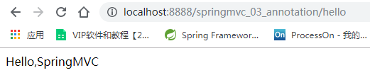

   **OK，运行成功！**

### 小结

实现步骤其实非常的简单：

1. 新建一个web项目
2. 导入相关jar包
3. 编写web.xml , 注册DispatcherServlet
4. 编写springmvc配置文件
5. 接下来就是去创建对应的控制类 , controller
6. 最后完善前端视图和controller之间的对应
7. 测试运行调试.

<font color=red>使用springMVC必须配置的三大件</font>

**<font color=red>处理器映射器、处理器适配器（被注解<mvc:annotation-driven /> 取代）</font>**

**<font color=red>视图解析器</font>**


<font color=red>通常，我们只需要**手动配置视图解析器**，而**处理器映射器**和**处理器适配器**只需要开启**注解驱动**即可，而省去了大段的xml配置</font>


## 4、RestFul和控制器

### 4.1、使用控制器Controller

- 控制器复杂提供访问应用程序的行为，通常通过接口定义或注解定义两种方法实现。

- 控制器负责解析用户的请求并将其转换为一个模型。

- 在Spring MVC中一个控制器类可以包含多个方法

- 在Spring MVC中，对于Controller的配置方式有很多种

  

实现Controller接口

Controller是一个接口，在org.springframework.web.servlet.mvc包下，接口中只有一个方法；

```java
//实现该接口的类获得控制器功能
public interface Controller {
   //处理请求且返回一个模型与视图对象
   ModelAndView handleRequest(HttpServletRequest var1, HttpServletResponse var2) throws Exception;
}
```


**测试**

1. 新建一个Moudle，springmvc-04-controller！

2. - mvc的配置文件只留下 视图解析器！

3. 编写一个Controller类，ControllerTest1

   ```java
   //定义控制器
   //注意点：不要导错包，实现Controller接口，重写方法；
   public class ControllerTest1 implements Controller {
   
      public ModelAndView handleRequest(HttpServletRequest httpServletRequest, HttpServletResponse httpServletResponse) throws Exception {
          //返回一个模型视图对象
          ModelAndView mv = new ModelAndView();
          mv.addObject("msg","Test1Controller");
          mv.setViewName("test");
          return mv;
     }
   }
   ```

4. 编写完毕后，去Spring配置文件中注册请求的bean；name对应请求路径，class对应处理请求的类

   ```xml
   <bean name="/t1" class="nuc.ss.controller.ControllerTest1"/>
   ```

5. 编写前端test.jsp，注意在WEB-INF/jsp目录下编写，对应我们的视图解析器

   ```html
   <%@ page contentType="text/html;charset=UTF-8" language="java" %>
   <html>
   <head>
      <title>Kuangshen</title>
   </head>
   <body>
   ${msg}
   </body>
   </html>
   ```

6. 配置Tomcat运行测试，我这里没有项目发布名配置的就是一个 / ，所以请求不用加项目名，OK！

   

   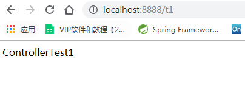

**说明：**

- 实现接口Controller定义控制器是较老的办法

- 缺点是：==一个控制器中只有一个方法==，如果要多个方法则需要定义多个Controller；定义的方式比较麻烦；

  

### 使用注解@Controller

- @Controller注解类型用于声明Spring类的实例是一个控制器（在讲IOC时还提到了另外3个注解）；

- Spring可以使用扫描机制来找到应用程序中所有基于注解的控制器类，为了保证Spring能找到你的控制器，需要在配置文件中声明组件扫描。

  ```xml
  <!-- 自动扫描指定的包，下面所有注解类交给IOC容器管理 -->
  <context:component-scan base-package="nuc.ss.controller"/>
  ```

- 增加一个ControllerTest2类，使用注解实现；

  ```java
  //@Controller注解的类会自动添加到Spring上下文中
  // 被注解的类中的方法，如果返回的String,并有页面可以跳转，那么就会被视图解析器解析。
  @Controller
  public class ControllerTest2{
  
     //映射访问路径
     @RequestMapping("/t2")
     public String index(Model model){
         //Spring MVC会自动实例化一个Model对象用于向视图中传值
         model.addAttribute("msg", "ControllerTest2");
         //返回视图位置, //WEB-INF/jsp/test.jsp
         return "test";
    }
  }
  ```

- 运行tomcat测试

  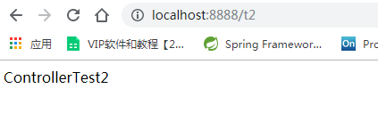

  

**可以发现，我们的两个请求都可以指向一个视图(test)，但是页面结果的结果是不一样的，从这里可以看出视图是被复用的，而控制器与视图之间是弱偶合关系。**

**注解方式是平时使用的最多的方式！**


### RequestMapping

**@RequestMapping**

- @RequestMapping注解用于映射url到控制器类或一个特定的处理程序方法。可用于类或方法上。用于类上，表示类中的所有响应请求的方法都是以该地址作为父路径。

- 为了测试结论更加准确，我们可以加上一个项目名测试 myweb

- 只注解在方法上面

  ```java
  @Controller
  public class TestController {
     @RequestMapping("/h1")
     public String test(){
         return "test";
    }
  }
  ```

  访问路径：http://localhost:9000 / 项目名 / h1

- 同时注解类与方法

  ```java
  @Controller
  @RequestMapping("/admin")
  public class TestController {
     @RequestMapping("/h1")
     public String test(){
         return "test";
    }
  }
  ```

  访问路径：http://localhost:9000 / 项目名/ admin /h1  , 需要先指定类的路径再指定方法的路径；


### ==RestFul 风格==

**概念**

==Restful就是一个资源定位及资源操作的风格,不是标准也不是协议，只是一种风格==

基于这个风格设计的软件可以更简洁，更有层次，更易于实现缓存等机制。

**功能**

资源：互联网所有的事物都可以被抽象为资源

资源操作：使用POST、DELETE、PUT、GET，使用不同方法对资源进行操作。

分别对应 添加、 删除、修改、查询。

**传统方式操作资源**  ：通过不同的参数来实现不同的效果！方法单一，post 和 get

​	http://127.0.0.1/item/queryItem.action?id=1 查询,GET

​	http://127.0.0.1/item/saveItem.action 新增,POST

​	http://127.0.0.1/item/updateItem.action 更新,POST

​	http://127.0.0.1/item/deleteItem.action?id=1 删除,GET或POST

**使用RESTful操作资源** ：可以通过不同的请求方式来实现不同的效果！如下：请求地址一样，但是功能可以不同！

​	http://127.0.0.1/item/1 查询,GET

​	http://127.0.0.1/item 新增,POST

​	http://127.0.0.1/item 更新,PUT

​	http://127.0.0.1/item/1 删除,DELETE

**学习测试**

1. 在新建一个类 RestFulController

   ```java
   @Controller
   public class RestFulController {}
   ```

2. 在Spring MVC中可以使用  @PathVariable 注解，让方法参数的值对应绑定到一个URI模板变量上。

   ```java
   @Controller
   public class RestFulController {
   
      //映射访问路径
      @RequestMapping("/add/{p1}/{p2}")
      public String index(@PathVariable int p1, @PathVariable int p2, Model model){
          
          int result = p1+p2;
          //Spring MVC会自动实例化一个Model对象用于向视图中传值
          model.addAttribute("msg", "结果："+result);
          //返回视图位置
          return "test";
          
     }
      
   }
   ```

3. 我们来测试请求查看下

   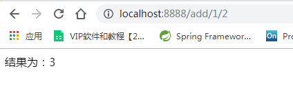

4. 思考：使用路径变量的好处？

   - 使路径变得更加简洁；

   - 获得参数更加方便，框架会自动进行类型转换。

   - 通过路径变量的类型可以约束访问参数，如果类型不一样，则访问不到对应的请求方法，如这里访问是的路径是/add/1/a，则路径与方法不匹配，而不会是参数转换失败。

     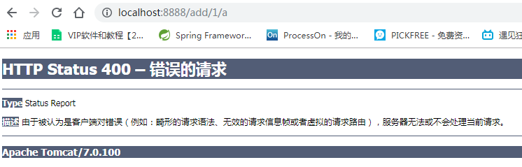

6. 我们来修改下对应的参数类型，再次测试

   ```java
   //映射访问路径
   @RequestMapping("/add/{p1}/{p2}")
   public String index(@PathVariable int p1, @PathVariable String p2, Model model){
   
      String result = p1+p2;
      //Spring MVC会自动实例化一个Model对象用于向视图中传值
      model.addAttribute("msg", "结果："+result);
      //返回视图位置
      return "test";
   
   }
   ```

   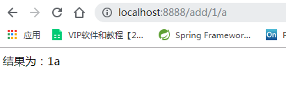

**使用method属性指定请求类型**

用于约束请求的类型，可以收窄请求范围。指定请求谓词的类型如GET, POST, HEAD, OPTIONS, PUT, PATCH, DELETE, TRACE等

我们来测试一下：

- 增加一个方法

  ```java
  //映射访问路径,必须是POST请求
  @RequestMapping(value = "/hello",method = {RequestMethod.POST})
  public String index2(Model model){
     model.addAttribute("msg", "hello!");
     return "test";
  }
  ```

- 我们使用浏览器地址栏进行访问默认是Get请求，会报错405：

  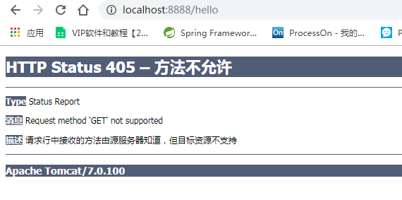

- 如果将POST修改为GET则正常了；

  ```java
  //映射访问路径,必须是Get请求
  @RequestMapping(value = "/hello",method = {RequestMethod.GET})
  public String index2(Model model){
     model.addAttribute("msg", "hello!");
     return "test";
  }
  ```

  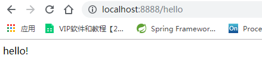

**小结：**

Spring MVC 的 @RequestMapping 注解能够处理 HTTP 请求的方法, 比如 GET, PUT, POST, DELETE 以及 PATCH。

**所有的地址栏请求默认都会是 HTTP GET 类型的。**

方法级别的注解变体有如下几个：组合注解

```
@GetMapping
@PostMapping
@PutMapping
@DeleteMapping
@PatchMapping:  这个是什么？
```

@GetMapping 是一个组合注解，平时使用的会比较多！

它所扮演的是 @RequestMapping(method =RequestMethod.GET) 的一个快捷方式。


### 扩展：小黄鸭调试法

场景一：*我们都有过向别人（甚至可能向完全不会编程的人）提问及解释编程问题的经历，但是很多时候就在我们解释的过程中自己却想到了问题的解决方案，然后对方却一脸茫然。*

场景二：你的同行跑来问你一个问题，但是当他自己把问题说完，或说到一半的时候就想出答案走了，留下一脸茫然的你。

其实上面两种场景现象就是所谓的小黄鸭调试法（Rubber Duck Debuging），又称橡皮鸭调试法，它是我们软件工程中最常使用调试方法之一。


此概念据说来自《程序员修炼之道》书中的一个故事，传说程序大师随身携带一只小黄鸭，在调试代码的时候会在桌上放上这只小黄鸭，然后详细地向鸭子解释每行代码，然后很快就将问题定位修复了。

## 5、结果跳转方式

### 5.1、ModelAndView

设置ModelAndView对象 , 根据view的名称 , 和视图解析器跳到指定的页面 .

页面 : {视图解析器前缀} + viewName +{视图解析器后缀}

```xml
<!-- 视图解析器 -->
<bean class="org.springframework.web.servlet.view.InternalResourceViewResolver"
     id="internalResourceViewResolver">
   <!-- 前缀 -->
   <property name="prefix" value="/WEB-INF/jsp/" />
   <!-- 后缀 -->
   <property name="suffix" value=".jsp" />
</bean>
```

对应的controller类

```java
public class ControllerTest1 implements Controller {

   public ModelAndView handleRequest(HttpServletRequest httpServletRequest, HttpServletResponse httpServletResponse) throws Exception {
       //返回一个模型视图对象
       ModelAndView mv = new ModelAndView();
       mv.addObject("msg","ControllerTest1");
       mv.setViewName("test");
       return mv;
  }
}
```

### 5.2、ServletAPI

ServletAPI

通过设置ServletAPI , 不需要视图解析器 .

1. 通过HttpServletResponse进行输出

2. 通过HttpServletResponse实现重定向

3. 通过HttpServletResponse实现转发

   ```java
   @Controller
   public class ResultGo {
   
      @RequestMapping("/result/t1")
      public void test1(HttpServletRequest req, HttpServletResponse rsp) throws IOException {
          rsp.getWriter().println("Hello,Spring BY servlet API");
     }
   
      @RequestMapping("/result/t2")
      public void test2(HttpServletRequest req, HttpServletResponse rsp) throws IOException {
          rsp.sendRedirect("/index.jsp");
     }
   
      @RequestMapping("/result/t3")
      public void test3(HttpServletRequest req, HttpServletResponse rsp) throws Exception {
          //转发
          req.setAttribute("msg","/result/t3");
          req.getRequestDispatcher("/WEB-INF/jsp/test.jsp").forward(req,rsp);
     }
   
   }
   ```

### 5.3、SpringMVC

通过SpringMVC来实现转发和重定向   **在无需视图解析器**

测试前，需要将视图解析器注释掉

- 默认为forward转发（<font color=red>也可以加上</font>）
- redirect转发需特别加

```java
@Controller
public class ResultSpringMVC {
   @RequestMapping("/rsm/t1")
   public String test1(){
       //转发
       return "/index.jsp";
  }

   @RequestMapping("/rsm/t2")
   public String test2(){
       //转发二
       return "forward:/index.jsp";
  }

   @RequestMapping("/rsm/t3")
   public String test3(){
       //重定向
       return "redirect:/index.jsp";
  }
}
```


通过SpringMVC来实现转发和重定向 **- 在有视图解析器**

重定向 , 不需要视图解析器 , 本质就是重新请求一个新地方嘛 , 所以注意路径问题.

可以重定向到另外一个请求实现 .

- 默认为forward转发（<font color=red>不可以加上，加上会拼接层/WEB-INF/JSP/***.jsp</font>）
- redirect转发需特别加

```java
@Controller
public class ResultSpringMVC2 {
   @RequestMapping("/rsm2/t1")
   public String test1(){
       //转发
       return "test";
  }

   @RequestMapping("/rsm2/t2")
   public String test2(){
       //重定向
       return "redirect:/index.jsp";
       //return "redirect:hello.do"; //hello.do为另一个请求/
  }

}
```


## 6、数据处理

### 6.1、处理提交数据

**1、提交的域名称和处理方法的参数名一致**

提交数据 : http://localhost:9000/hello?name=kuangshen

处理方法 :

```java
@RequestMapping("/hello")
public String hello(String name){
   System.out.println(name);
   return "hello";
}
```

后台输出 : kuangshen

**2、提交的域名称和处理方法的参数名不一致**

提交数据 : http://localhost:9000/hello?username=kuangshen

处理方法 :

```java
//@RequestParam("username") : username提交的域的名称 .
@RequestMapping("/hello")
public String hello(@RequestParam("username") String name){
   System.out.println(name);
   return "hello";
}
```

后台输出 : kuangshen

**3、提交的是一个对象**

要求提交的表单域和对象的属性名一致  , 参数使用对象即可

1. 实体类

    ```java
    public class User {
       private int id;
       private String name;
       private int age;
       //构造
       //get/set
       //tostring()
    }
    ```

2. 提交数据 : http://localhost:9000/mvc04/user?name=kuangshen&id=1&age=15

3. 处理方法 :

   ```java
   @RequestMapping("/user")
   public String user(User user){
      System.out.println(user);
      return "hello";
   }
   ```

后台输出 : User { id=1, name='kuangshen', age=15 }

说明：如果使用对象的话，前端传递的<font color=red>参数名和对象名必须一致</font>，否则就是null。

### 6.2、数据显示到前端

**第一种 : 通过ModelAndView**

我们前面一直都是如此 . 就不过多解释

```java
public class ControllerTest1 implements Controller {

   public ModelAndView handleRequest(HttpServletRequest httpServletRequest, HttpServletResponse httpServletResponse) throws Exception {
       //返回一个模型视图对象
       ModelAndView mv = new ModelAndView();
       mv.addObject("msg","ControllerTest1");
       mv.setViewName("test");
       return mv;
  }
}
```

**第二种 : 通过ModelMap**

ModelMap

```java
@RequestMapping("/hello")
public String hello(@RequestParam("username") String name, ModelMap modelMap){
   //封装要显示到视图中的数据
   //相当于req.setAttribute("name",name);
   modelMap.addAttribute("name",name);
   System.out.println(name);
   return "hello";
}

```

**第三种 : 通过Model**

Model

```java
@RequestMapping("/ct2/hello")
public String hello(@RequestParam("username") String name, Model model){
   //封装要显示到视图中的数据
   //相当于req.setAttribute("name",name);
   model.addAttribute("msg",name);
   System.out.println(name);
   return "test";
}
```

### 6.3、对比

就对于新手而言简单来说使用区别就是：

```
Model 只有寥寥几个方法只适合用于储存数据，简化了新手对于Model对象的操作和理解；
ModelMap 继承了 LinkedMap ，除了实现了自身的一些方法，同样的继承 LinkedMap 的方法和特性；
ModelAndView 可以在储存数据的同时，可以进行设置返回的逻辑视图，进行控制展示层的跳转。
```

当然更多的以后开发考虑的更多的是性能和优化，就不能单单仅限于此的了解。

**请使用80%的时间打好扎实的基础，剩下18%的时间研究框架，2%的时间去学点英文，框架的官方文档永远是最好的教程。**


## 7、乱码问题

测试步骤：

1. 我们可以在首页编写一个提交的表单

   ```html
   <form action="/e/t" method="post">
    <input type="text" name="name">
    <input type="submit">
   </form>
   ```

2. 后台编写对应的处理类

   ```java
   @Controller
   public class Encoding {
      @RequestMapping("/e/t")
      public String test(Model model,String name){
          model.addAttribute("msg",name); //获取表单提交的值
          return "test"; //跳转到test页面显示输入的值
     }
   }
   ```

3. 输入中文测试，发现乱码

   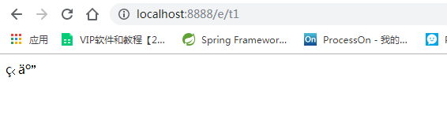

不得不说，乱码问题是在我们开发中十分常见的问题，也是让我们程序猿比较头大的问题！

以前乱码问题通过过滤器解决 , 而SpringMVC给我们提供了一个过滤器 , 可以在web.xml中配置 .

修改了xml文件需要重启服务器！

```xml
filter>
   <filter-name>encoding</filter-name>
   <filter-class>org.springframework.web.filter.CharacterEncodingFilter</filter-class>
   <init-param>
       <param-name>encoding</param-name>
       <param-value>utf-8</param-value>
   </init-param>
</filter>
<filter-mapping>
   <filter-name>encoding</filter-name>
   <url-pattern>/*</url-pattern>
</filter-mapping>
```

<font color=red>注意：这里写/*，写/的话过滤不了jsp页面，不能解决乱码</font>

但是我们发现 , 有些极端情况下.这个过滤器对get的支持不好 .

处理方法 :

1. 修改tomcat配置文件 ：设置编码！

    ```xml
    <Connector URIEncoding="utf-8" port="8080" protocol="HTTP/1.1"
              connectionTimeout="20000"
              redirectPort="8443" />
    ```

2. 自定义过滤器（万能解决）

   ```java
   package com.kuang.filter;
   
   import javax.servlet.*;
   import javax.servlet.http.HttpServletRequest;
   import javax.servlet.http.HttpServletRequestWrapper;
   import javax.servlet.http.HttpServletResponse;
   import java.io.IOException;
   import java.io.UnsupportedEncodingException;
   import java.util.Map;
   
   /**
   * 解决get和post请求 全部乱码的过滤器
   */
   public class GenericEncodingFilter implements Filter {
   
      @Override
      public void destroy() {
     }
   
      @Override
      public void doFilter(ServletRequest request, ServletResponse response, FilterChain chain) throws IOException, ServletException {
          //处理response的字符编码
          HttpServletResponse myResponse=(HttpServletResponse) response;
          myResponse.setContentType("text/html;charset=UTF-8");
   
          // 转型为与协议相关对象
          HttpServletRequest httpServletRequest = (HttpServletRequest) request;
          // 对request包装增强
          HttpServletRequest myrequest = new MyRequest(httpServletRequest);
          chain.doFilter(myrequest, response);
     }
   
      @Override
      public void init(FilterConfig filterConfig) throws ServletException {
     }
   
   }
   
   //自定义request对象，HttpServletRequest的包装类
   class MyRequest extends HttpServletRequestWrapper {
   
      private HttpServletRequest request;
      //是否编码的标记
      private boolean hasEncode;
      //定义一个可以传入HttpServletRequest对象的构造函数，以便对其进行装饰
      public MyRequest(HttpServletRequest request) {
          super(request);// super必须写
          this.request = request;
     }
   
      // 对需要增强方法 进行覆盖
      @Override
      public Map getParameterMap() {
          // 先获得请求方式
          String method = request.getMethod();
          if (method.equalsIgnoreCase("post")) {
              // post请求
              try {
                  // 处理post乱码
                  request.setCharacterEncoding("utf-8");
                  return request.getParameterMap();
             } catch (UnsupportedEncodingException e) {
                  e.printStackTrace();
             }
         } else if (method.equalsIgnoreCase("get")) {
              // get请求
              Map<String, String[]> parameterMap = request.getParameterMap();
              if (!hasEncode) { // 确保get手动编码逻辑只运行一次
                  for (String parameterName : parameterMap.keySet()) {
                      String[] values = parameterMap.get(parameterName);
                      if (values != null) {
                          for (int i = 0; i < values.length; i++) {
                              try {
                                  // 处理get乱码
                                  values[i] = new String(values[i]
                                         .getBytes("ISO-8859-1"), "utf-8");
                             } catch (UnsupportedEncodingException e) {
                                  e.printStackTrace();
                             }
                         }
                     }
                 }
                  hasEncode = true;
             }
              return parameterMap;
         }
          return super.getParameterMap();
     }
   
      //取一个值
      @Override
      public String getParameter(String name) {
          Map<String, String[]> parameterMap = getParameterMap();
          String[] values = parameterMap.get(name);
          if (values == null) {
              return null;
         }
          return values[0]; // 取回参数的第一个值
     }
   
      //取所有值
      @Override
      public String[] getParameterValues(String name) {
          Map<String, String[]> parameterMap = getParameterMap();
          String[] values = parameterMap.get(name);
          return values;
     }
   }
   ```

   一般情况下，SpringMVC默认的乱码处理就已经能够很好的解决了！

   **然后在web.xml中配置这个过滤器即可！**

   乱码问题，需要平时多注意，在尽可能能设置编码的地方，都设置为统一编码 UTF-8！

## 8、JSON交互处理

### 8.1、什么是JSON？

- JSON(JavaScript Object Notation, JS 对象标记) 是一种轻量级的数据交换格式，目前使用特别广泛。
- 采用完全独立于编程语言的**文本格式**来存储和表示数据。
- 简洁和清晰的层次结构使得 JSON 成为理想的数据交换语言。
- 易于人阅读和编写，同时也易于机器解析和生成，并有效地提升网络传输效率。

在 JavaScript 语言中，一切都是对象。因此，任何JavaScript 支持的类型都可以通过 JSON 来表示，例如字符串、数字、对象、数组等。看看他的要求和语法格式：

- 对象表示为键值对，数据由逗号分隔
- 花括号保存对象
- 方括号保存数组

**JSON 键值对**是用来保存 JavaScript 对象的一种方式，和 JavaScript 对象的写法也大同小异，键/值对组合中的键名写在前面并用双引号 "" 包裹，使用冒号 : 分隔，然后紧接着值：

```javascript
{"name": "QinJiang"}
{"age": "3"}
{"sex": "男"}
```

很多人搞不清楚 JSON 和 JavaScript 对象的关系，甚至连谁是谁都不清楚。其实，可以这么理解：

JSON 是 JavaScript 对象的字符串表示法，它使用文本表示一个 JS 对象的信息，本质是一个字符串。

```javascript
var obj = {a: 'Hello', b: 'World'}; //这是一个对象，注意键名也是可以使用引号包裹的
var json = '{"a": "Hello", "b": "World"}'; //这是一个 JSON 字符串，本质是一个字符串
```

### 8.2、**JSON 和 JavaScript 对象互转**

要实现从JSON字符串转换为JavaScript 对象，使用 JSON.parse() 方法：

```javascript
var obj = JSON.parse('{"a": "Hello", "b": "World"}');
//结果是 {a: 'Hello', b: 'World'}
```

要实现从JavaScript 对象转换为JSON字符串，使用 JSON.stringify() 方法：

```javascript
var json = JSON.stringify({a: 'Hello', b: 'World'});
//结果是 '{"a": "Hello", "b": "World"}'
```

**代码测试**

1. 新建一个module ，springmvc-05-json ， 添加web的支持

2. 在web目录下新建一个 json-1.html ， 编写测试内容

   ```html
   <!DOCTYPE html>
   <html lang="en">
   <head>
      <meta charset="UTF-8">
      <title>JSON_秦疆</title>
   </head>
   <body>
   
   <script type="text/javascript">
      //编写一个js的对象
      var user = {
          name:"秦疆",
          age:3,
          sex:"男"
     };
      //将js对象转换成json字符串
      var str = JSON.stringify(user);
      console.log(str);
      
      //将json字符串转换为js对象
      var user2 = JSON.parse(str);
      console.log(user2.age,user2.name,user2.sex);
   
   </script>
   
   </body>
   </html>
   ```

3. 在IDEA中使用浏览器打开，查看控制台输出！

### 8.3、Controller返回JSON数据

- Jackson应该是目前比较好的json解析工具了

- 当然工具不止这一个，比如还有阿里巴巴的 fastjson 等等。

- 我们这里使用Jackson，使用它需要导入它的jar包；

    ```xml
    <!-- https://mvnrepository.com/artifact/com.fasterxml.jackson.core/jackson-core -->
    <dependency>
       <groupId>com.fasterxml.jackson.core</groupId>
       <artifactId>jackson-databind</artifactId>
       <version>2.9.8</version>
    </dependency>
    ```

- 配置SpringMVC需要的配置

  - （web.xml）

      ```xml
      <?xml version="1.0" encoding="UTF-8"?>
      <web-app xmlns="http://xmlns.jcp.org/xml/ns/javaee"
              xmlns:xsi="http://www.w3.org/2001/XMLSchema-instance"
              xsi:schemaLocation="http://xmlns.jcp.org/xml/ns/javaee http://xmlns.jcp.org/xml/ns/javaee/web-app_4_0.xsd"
              version="4.0">

         <!--1.注册servlet-->
         <servlet>
             <servlet-name>SpringMVC</servlet-name>
             <servlet-class>org.springframework.web.servlet.DispatcherServlet</servlet-class>
             <!--通过初始化参数指定SpringMVC配置文件的位置，进行关联-->
             <init-param>
                 <param-name>contextConfigLocation</param-name>
                 <param-value>classpath:springmvc-servlet.xml</param-value>
             </init-param>
             <!-- 启动顺序，数字越小，启动越早 -->
             <load-on-startup>1</load-on-startup>
         </servlet>

         <!--所有请求都会被springmvc拦截 -->
         <servlet-mapping>
             <servlet-name>SpringMVC</servlet-name>
             <url-pattern>/</url-pattern>
         </servlet-mapping>

         <filter>
             <filter-name>encoding</filter-name>
             <filter-class>org.springframework.web.filter.CharacterEncodingFilter</filter-class>
             <init-param>
                 <param-name>encoding</param-name>
                 <param-value>utf-8</param-value>
             </init-param>
         </filter>
         <filter-mapping>
             <filter-name>encoding</filter-name>
             <url-pattern>/</url-pattern>
         </filter-mapping>

      </web-app>
      ```
  
  - springmvc-servlet.xml
  
    ```xml
    <?xml version="1.0" encoding="UTF-8"?>
    <beans xmlns="http://www.springframework.org/schema/beans"
          xmlns:xsi="http://www.w3.org/2001/XMLSchema-instance"
          xmlns:context="http://www.springframework.org/schema/context"
          xmlns:mvc="http://www.springframework.org/schema/mvc"
          xsi:schemaLocation="http://www.springframework.org/schema/beans
           http://www.springframework.org/schema/beans/spring-beans.xsd
           http://www.springframework.org/schema/context
           https://www.springframework.org/schema/context/spring-context.xsd
           http://www.springframework.org/schema/mvc
           https://www.springframework.org/schema/mvc/spring-mvc.xsd">
    
       <!-- 自动扫描指定的包，下面所有注解类交给IOC容器管理 -->
       <context:component-scan base-package="com.kuang.controller"/>
    
       <!-- 视图解析器 -->
       <bean class="org.springframework.web.servlet.view.InternalResourceViewResolver"
             id="internalResourceViewResolver">
           <!-- 前缀 -->
           <property name="prefix" value="/WEB-INF/jsp/" />
           <!-- 后缀 -->
           <property name="suffix" value=".jsp" />
       </bean>
    
    </beans>
    ```
  
  - 我们随便编写一个User的实体类，然后我们去编写我们的测试Controller；
  
      ```java
      @Data
      @AllArgsConstructor
      @NoArgsConstructor
      public class User {
          private int id;
          private String name;
        private int age;
      }
      ```
  
      
  
  - 这里我们需要两个新东西，一个是@ResponseBody，一个是ObjectMapper对象，我们看下具体的用法
  
    编写一个Controller；
  
       ```java
    @Controller
    public class UserController {
    @RequestMapping("/j1")
        @ResponseBody//他就不会走视图解析器，会直接返回一个 字符串
        public String json1() throws JsonProcessingException {
            //jackson,ObjectMapper
            ObjectMapper mapper = new ObjectMapper();
    
            //创建一个对象
            User user = new User(1, "秦疆一号", 12);
            //System.out.println(user);
    
            String str = mapper.writeValueAsString(user);
            return str;
        }
       ```
    
  - 此时输入中文会产生乱码
  
    ```java
    //produces:指定响应体返回类型和编码
    @RequestMapping(value = "/json1",produces = "application/json;charset=utf-8")
    ```
  
  - 配置Tomcat ， 启动测试一下！http://localhost:9000/json1
  
    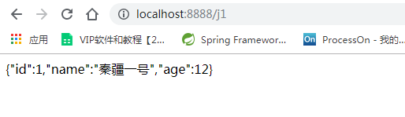

<font color=red>【注意：使用json记得处理乱码问题】</font>

### 8.4代码优化

**乱码统一解决**

上一种方法比较麻烦，如果项目中有许多请求则每一个都要添加，可以通过Spring配置统一指定，这样就不用每次都去处理了！

我们可以在springmvc的配置文件上添加一段消息StringHttpMessageConverter转换配置！

```xml
<mvc:annotation-driven>
   <mvc:message-converters register-defaults="true">
       <bean class="org.springframework.http.converter.StringHttpMessageConverter">
           <constructor-arg value="UTF-8"/>
       </bean>
       <bean class="org.springframework.http.converter.json.MappingJackson2HttpMessageConverter">
           <property name="objectMapper">
               <bean class="org.springframework.http.converter.json.Jackson2ObjectMapperFactoryBean">
                   <property name="failOnEmptyBeans" value="false"/>
               </bean>
           </property>
       </bean>
   </mvc:message-converters>
</mvc:annotation-driven>
```

**返回json字符串统一解决**

- @ResponseBody解决（每个方法都得加，不建议使用）

  ```java
  @Controller
  public class UserController {
     //produces:指定响应体返回类型和编码
     @RequestMapping(value = "/json1")
     @ResponseBody
     public String json1() throws JsonProcessingException {
         //创建一个jackson的对象映射器，用来解析数据
         ObjectMapper mapper = new ObjectMapper();
         //创建一个对象
         User user = new User(1, "秦疆一号", 12);
         //将我们的对象解析成为json格式
         String str = mapper.writeValueAsString(user);
         //由于@ResponseBody注解，这里会将str转成json格式返回；十分方便
         return str;
    }
  }
  ```

- **@RestController**（直接加到类上即可）

```java
@RestController
public class UserController {
   @RequestMapping(value = "/j1")
   public String json1() throws JsonProcessingException {
       //创建一个jackson的对象映射器，用来解析数据
       ObjectMapper mapper = new ObjectMapper();
       //创建一个对象
       User user = new User(1, "秦疆一号", 12);
       //将我们的对象解析成为json格式
       String str = mapper.writeValueAsString(user);
       return str;
  }

}
```


### 8.5、测试集合输出

增加一个新的方法

```java
@RequestMapping("/j2")
public String json2() throws JsonProcessingException {

    //创建一个jackson的对象映射器，用来解析数据
    ObjectMapper mapper = new ObjectMapper();
    //创建一个对象
   	User user1 = new User(1, "秦疆1号", 12);
    User user2 = new User(2, "秦疆2号", 12);
    User user3 = new User(3, "秦疆3号", 12);
    User user4 = new User(4, "秦疆4号", 12);
    User user5 = new User(5, "秦疆5号", 12);
    List<User> list = new ArrayList<User>();
    list.add(user1);
    list.add(user2);
    list.add(user3);
    list.add(user4);
    list.add(user5);
    //将我们的对象解析成为json格式
    String str = mapper.writeValueAsString(list);
    return str;
}
```

运行结果 : 十分完美，没有任何问题！

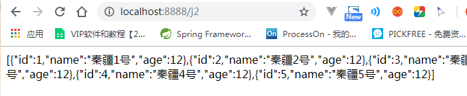

### 8.6、输出时间对象

- 增加一个新的方法

    ```java
    @RequestMapping("/j3")
    public String json3() throws JsonProcessingException {

       ObjectMapper mapper = new ObjectMapper();

       //创建时间一个对象，java.util.Date
       Date date = new Date();
       //将我们的对象解析成为json格式
       String str = mapper.writeValueAsString(date);
       return str;
    }
    ```

- 运行结果 :

    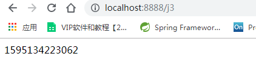

- 默认日期格式会变成一个数字，是1970年1月1日到当前日期的毫秒数！
- Jackson 默认是会把时间转成timestamps形式

**解决方案：取消timestamps形式 ， 自定义时间格式**

```java
@RequestMapping("/j3")
public String json4() throws JsonProcessingException {

   ObjectMapper mapper = new ObjectMapper();

   //不使用时间戳的方式
   mapper.configure(SerializationFeature.WRITE_DATES_AS_TIMESTAMPS, false);
   //自定义日期格式对象
   SimpleDateFormat sdf = new SimpleDateFormat("yyyy-MM-dd HH:mm:ss");
   //指定日期格式
   mapper.setDateFormat(sdf);

   Date date = new Date();
   String str = mapper.writeValueAsString(date);

   return str;
}
```

运行结果 : 成功的输出了时间！

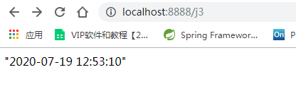

**<font color=red>抽取为工具类</font>**

**如果要经常使用的话，这样是比较麻烦的，我们可以将这些代码封装到一个工具类中；我们去编写下**

```java
public class JsonUtils {
    public static String getJson(Object object) {
        return getJson(object,"yyyy-MM-dd HH:mm:ss");
    }
    public static String getJson(Object object, String dateFormat) {
        ObjectMapper mapper = new ObjectMapper();

        //java自定义日期格式
        SimpleDateFormat sdf = new SimpleDateFormat(dateFormat);
        //sdf.format(date)

        // 使用ObjectMapper 来格式化输出
        mapper.configure(SerializationFeature.WRITE_DATES_AS_TIMESTAMPS,false);
        mapper.setDateFormat(sdf);

        try {
            //ObjectMapper,时间解析后的默认格式为：TImestamp.时间戳
            return mapper.writeValueAsString(object);
        } catch (JsonProcessingException e) {
            e.printStackTrace();
        }
        return null;
    }

}

```

我们使用工具类，代码就更加简洁了！

```java
@RequestMapping("/j3")
    public String json3(){

        Date date = new Date();

        return JsonUtils.getJson(date,"yyyy-MM-dd HH:mm:ss");
    }
}
```

大功告成！完美！


### 8.7、FastJson

- fastjson.jar是阿里开发的一款专门用于Java开发的包，
- 实现json对象与JavaBean对象的转换，
- 实现JavaBean对象与json字符串的转换，
- 实现json对象与json字符串的转换。
- 实现json的转换方法很多，最后的实现结果都是一样的。

fastjson 的 pom依赖！

```xml
<dependency>
   <groupId>com.alibaba</groupId>
   <artifactId>fastjson</artifactId>
   <version>1.2.60</version>
</dependency>
```

**fastjson 三个主要的类：**

1. JSONObject  代表 json 对象
   - JSONObject实现了Map接口, 猜想 JSONObject底层操作是由Map实现的。
   - JSONObject对应json对象，通过各种形式的get()方法可以获取json对象中的数据，也可利用诸如size()，isEmpty()等方法获取"键：值"对的个数和判断是否为空。其本质是通过实现Map接口并调用接口中的方法完成的。
2. JSONArray   代表 json 对象数组
   - 内部是有List接口中的方法来完成操作的。
3. JSON代表 JSONObject和JSONArray的转化
   - JSON类源码分析与使用
   - 仔细观察这些方法，主要是实现json对象，json对象数组，javabean对象，json字符串之间的相互转化。


**代码测试，我们新建一个FastJsonDemo 类**

```java
@RequestMapping("/j4")
    //@ResponseBody//他就不会走视图解析器，会直接返回一个 字符串
    public String json4(){

        User user1 = new User(1, "秦疆1号", 12);
        User user2 = new User(2, "秦疆2号", 12);
        User user3 = new User(3, "秦疆3号", 12);
        User user4 = new User(4, "秦疆4号", 12);
        User user5 = new User(5, "秦疆5号", 12);

        List<User> list = new ArrayList<User>();
        list.add(user1);
        list.add(user2);
        list.add(user3);
        list.add(user4);
        list.add(user5);

        System.out.println("*******Java对象 转 JSON字符串*******");
        String str1 = JSON.toJSONString(list);
        System.out.println("JSON.toJSONString(list)==>"+str1);
        String str2 = JSON.toJSONString(user1);
        System.out.println("JSON.toJSONString(user1)==>"+str2);

        System.out.println("\n****** JSON字符串 转 Java对象*******");
        User jp_user1=JSON.parseObject(str2,User.class);
        System.out.println("JSON.parseObject(str2,User.class)==>"+jp_user1);

        System.out.println("\n****** Java对象 转 JSON对象 ******");
        JSONObject jsonObject1 = (JSONObject) JSON.toJSON(user2);
        System.out.println("(JSONObject) JSON.toJSON(user2)==>"+jsonObject1.getString("name"));

        System.out.println("\n****** JSON对象 转 Java对象 ******");
        User to_java_user = JSON.toJavaObject(jsonObject1, User.class);
        System.out.println("JSON.toJavaObject(jsonObject1, User.class)==>"+to_java_user);

        return JSON.toJSONString(list);
    }
```

这种工具类，我们只需要掌握使用就好了，在使用的时候在根据具体的业务去找对应的实现。和以前的commons-io那种工具包一样，拿来用就好了！


## 9、Ajax研究

### 9.1、简介

- **AJAX = Asynchronous JavaScript and XML（异步的 JavaScript 和 XML）。**
- AJAX 是一种在无需重新加载整个网页的情况下，能够更新部分网页的技术。
- **Ajax 不是一种新的编程语言，而是一种用于创建更好更快以及交互性更强的Web应用程序的技术。**
- 在 2005 年，Google 通过其 Google Suggest 使 AJAX 变得流行起来。Google Suggest能够自动帮你完成搜索单词。
- Google Suggest 使用 AJAX 创造出动态性极强的 web 界面：当您在谷歌的搜索框输入关键字时，JavaScript 会把这些字符发送到服务器，然后服务器会返回一个搜索建议的列表。
- 就和国内百度的搜索框一样!

- 传统的网页(即不用ajax技术的网页)，想要更新内容或者提交一个表单，都需要重新加载整个网页。
- 使用ajax技术的网页，通过在后台服务器进行少量的数据交换，就可以实现异步局部更新。
- 使用Ajax，用户可以创建接近本地桌面应用的直接、高可用、更丰富、更动态的Web用户界面。


### 9.2、伪造Ajax

我们可以使用前端的一个标签来伪造一个ajax的样子。iframe标签

1. 新建一个module ：sspringmvc-06-ajax ， 导入web支持！

2. 编写一个 ajax-frame.html 使用 iframe 测试，感受下效果

   ```html
   <!DOCTYPE html>
   <html>
   <head lang="en">
      <meta charset="UTF-8">
      <title>kuangshen</title>
   </head>
   <body>
   
   <script type="text/javascript">
      window.onload = function(){
          var myDate = new Date();
          document.getElementById('currentTime').innerText = myDate.getTime();
     };
   
      function LoadPage(){
          var targetUrl =  document.getElementById('url').value;
          console.log(targetUrl);
          document.getElementById("iframePosition").src = targetUrl;
     }
   
   </script>
   
   <div>
      <p>请输入要加载的地址：<span id="currentTime"></span></p>
      <p>
          <input id="url" type="text" value="https://www.baidu.com/"/>
          <input type="button" value="提交" onclick="LoadPage()">
      </p>
   </div>
   
   <div>
      <h3>加载页面位置：</h3>
      <iframe id="iframePosition" style="width: 100%;height: 500px;"></iframe>
   </div>
   
   </body>
   </html>
   ```

3. 使用IDEA开浏览器测试一下！

**利用AJAX可以做：**

- 注册时，输入用户名自动检测用户是否已经存在。
- 登陆时，提示用户名密码错误
- 删除数据行时，将行ID发送到后台，后台在数据库中删除，数据库删除成功后，在页面DOM中将数据行也删除。
- ....等等

### 9.3、jQuery.ajax

- 纯JS原生实现Ajax我们不去讲解这里，直接使用jquery提供的，方便学习和使用，避免重复造轮子，有兴趣的同学可以去了解下JS原生XMLHttpRequest ！

- Ajax的核心是XMLHttpRequest对象(XHR)。XHR为向服务器发送请求和解析服务器响应提供了接口。能够以异步方式从服务器获取新数据。

- jQuery 提供多个与 AJAX 有关的方法。

- 通过 jQuery AJAX 方法，您能够使用 HTTP Get 和 HTTP Post 从远程服务器上请求文本、HTML、XML 或 JSON – 同时您能够把这些外部数据直接载入网页的被选元素中。

- jQuery 不是生产者，而是大自然搬运工。

- jQuery Ajax本质就是 XMLHttpRequest，对他进行了封装，方便调用！

```javascript
jQuery.ajax(...)
      部分参数：
            url：请求地址
            type：请求方式，GET、POST（1.9.0之后用method）
        headers：请求头
            data：要发送的数据
    contentType：即将发送信息至服务器的内容编码类型(默认: "application/x-www-form-urlencoded; charset=UTF-8")
          async：是否异步
        timeout：设置请求超时时间（毫秒）
      beforeSend：发送请求前执行的函数(全局)
        complete：完成之后执行的回调函数(全局)
        success：成功之后执行的回调函数(全局)
          error：失败之后执行的回调函数(全局)
        accepts：通过请求头发送给服务器，告诉服务器当前客户端可接受的数据类型
        dataType：将服务器端返回的数据转换成指定类型
          "xml": 将服务器端返回的内容转换成xml格式
          "text": 将服务器端返回的内容转换成普通文本格式
          "html": 将服务器端返回的内容转换成普通文本格式，在插入DOM中时，如果包含JavaScript标签，则会尝试去执行。
        "script": 尝试将返回值当作JavaScript去执行，然后再将服务器端返回的内容转换成普通文本格式
          "json": 将服务器端返回的内容转换成相应的JavaScript对象
        "jsonp": JSONP 格式使用 JSONP 形式调用函数时，如 "myurl?callback=?" jQuery 将自动替换 ? 为正确的函数名，以执行回调函数
```

**我们来个简单的测试，使用最原始的HttpServletResponse处理 , .最简单 , 最通用**

1. 配置web.xml 和 springmvc的配置文件【记得静态资源过滤和注解驱动配置上】

   ```xml
   <?xml version="1.0" encoding="UTF-8"?>
   <beans xmlns="http://www.springframework.org/schema/beans"
         xmlns:xsi="http://www.w3.org/2001/XMLSchema-instance"
         xmlns:context="http://www.springframework.org/schema/context"
         xmlns:mvc="http://www.springframework.org/schema/mvc"
         xsi:schemaLocation="http://www.springframework.org/schema/beans
          http://www.springframework.org/schema/beans/spring-beans.xsd
          http://www.springframework.org/schema/context
          https://www.springframework.org/schema/context/spring-context.xsd
          http://www.springframework.org/schema/mvc
          https://www.springframework.org/schema/mvc/spring-mvc.xsd">
   
      <!-- 自动扫描指定的包，下面所有注解类交给IOC容器管理 -->
      <context:component-scan base-package="com.kuang.controller"/>
       <!--静态资源过滤-->
      <mvc:default-servlet-handler />
       <!--注解驱动配-->
      <mvc:annotation-driven />
   
      <!-- 视图解析器 -->
      <bean class="org.springframework.web.servlet.view.InternalResourceViewResolver"
            id="internalResourceViewResolver">
          <!-- 前缀 -->
          <property name="prefix" value="/WEB-INF/jsp/" />
          <!-- 后缀 -->
          <property name="suffix" value=".jsp" />
      </bean>
   
   </beans>
   ```

2. 编写一个AjaxController

   ```java
   @Controller
   public class AjaxController {
   
      @RequestMapping("/a1")
      public void ajax1(String name , HttpServletResponse response) throws IOException {
          if ("admin".equals(name)){
              response.getWriter().print("true");
         }else{
              response.getWriter().print("false");
         }
     }
   }
   ```
   
3. 导入jquery ， 可以使用在线的CDN ， 也可以下载导入

   ```js
   <script src="https://code.jquery.com/jquery-3.1.1.min.js"></script>
   <script src="${pageContext.request.contextPath}/statics/js/jquery-3.1.1.min.js"></script>
   ```

4. 编写index.jsp测试

   ```jsp
   <%@ page contentType="text/html;charset=UTF-8" language="java" %>
   <html>
    <head>
      <title>$Title$</title>
     <%--<script src="https://code.jquery.com/jquery-3.1.1.min.js"></script>--%>
      <script src="${pageContext.request.contextPath}/statics/js/jquery-3.1.1.min.js"></script>
      <script>
          function a1(){
              $.post({
                  url:"${pageContext.request.contextPath}/a1",
                  data:{'name':$("#txtName").val()},
                  success:function (data,status) {
                      alert(data);
                      alert(status);
                 }
             });
         }
      </script>
    </head>
    <body>
   
   <%--onblur：失去焦点触发事件--%>
   用户名:<input type="text" id="txtName" onblur="a1()"/>
   
    </body>
   </html>
   ```

5. 启动tomcat测试！打开浏览器的控制台，当我们鼠标离开输入框的时候，可以看到发出了一个ajax的请求！是后台返回给我们的结果！测试成功！

### 9.4、**Springmvc实现**

1. 实体类user（使用了lombok插件，可以自己写实现类方法）

   ```java
   @Data
   @AllArgsConstructor
   @NoArgsConstructor
   public class User {
   
      private String name;
      private int age;
      private String sex;
   
   }
   ```

2. 我们来获取一个集合对象，展示到前端页面

   ```java
   @RequestMapping("/a2")
   public List<User> ajax2(){
      List<User> list = new ArrayList<User>();
      list.add(new User("秦疆1号",3,"男"));
      list.add(new User("秦疆2号",3,"男"));
      list.add(new User("秦疆3号",3,"男"));
      return list; //由于@RestController注解，将list转成json格式返回
   }
   ```

3. 前端页面

   ```jsp
   <%@ page contentType="text/html;charset=UTF-8" language="java" %>
   <html>
   <head>
       <title>Title</title>
       <script src="${pageContext.request.contextPath}/static/js/jquery-3.4.1.js"></script>
       <script>
           $(function () {
               $("#btn").click(function () {
                   // console.log('点击事件成功')
                   // $.post(url,param,[可以省略],success)
                   $.post("${pageContext.request.contextPath}/a2",function (data) {
                       console.log(data[0].name);
                       let html =  "";
                       for (let i = 0; i < data.length; i++) {
                           html += `<tr>
                                       <td>${"${data[i].name}"}</td>
                                       <td>${"${data[i].age}"}</td>
                                       <td>${"${data[i].sex}"}</td>
                                   </tr>`
                       }
                       $("#content").html(html)
                       console.log(html)
                   })
               })
           })
       </script>
   </head>
   <body>
   <input type="button" value="加载数据" id="btn">
   <table>
       <thead>
           <tr>
               <td>姓名</td>
               <td>年龄</td>
               <td>性别</td>
           </tr>
       </thead>
       <tbody id="content">
           <%--数据：后台--%>
       </tbody>
   </table>
   </body>
   </html>
   ```

**成功实现了数据回显！可以体会一下Ajax的好处！**


### 9.5、注册提示效果

1. 我们写一个Controller

   ```java
   @RequestMapping("/a3")
   public String ajax3(String name,String pwd){
      String msg = "";
      //模拟数据库中存在数据
      if (name!=null){
          if ("admin".equals(name)){
              msg = "OK";
         }else {
              msg = "用户名输入错误";
         }
     }
      if (pwd!=null){
          if ("123456".equals(pwd)){
              msg = "OK";
         }else {
              msg = "密码输入有误";
         }
     }
      return msg; //由于@RestController注解，将msg转成json格式返回
   }
   ```

2. 前端页面 login.jsp

   ```jsp
   <%@ page contentType="text/html;charset=UTF-8" language="java" %>
   <html>
   <head>
      <title>ajax</title>
      <script src="${pageContext.request.contextPath}/statics/js/jquery-3.1.1.min.js"></script>
      <script>
   
          function a1(){
              $.post({
                  url:"${pageContext.request.contextPath}/a3",
                  data:{'name':$("#name").val()},
                  success:function (data) {
                      if (data.toString()=='OK'){
                          $("#userInfo").css("color","green");
                     }else {
                          $("#userInfo").css("color","red");
                     }
                      $("#userInfo").html(data);
                 }
             });
         }
          function a2(){
              $.post({
                  url:"${pageContext.request.contextPath}/a3",
                  data:{'pwd':$("#pwd").val()},
                  success:function (data) {
                      if (data.toString()=='OK'){
                          $("#pwdInfo").css("color","green");
                     }else {
                          $("#pwdInfo").css("color","red");
                     }
                      $("#pwdInfo").html(data);
                 }
             });
         }
   
      </script>
   </head>
   <body>
   <p>
     用户名:<input type="text" id="name" onblur="a1()"/>
      <span id="userInfo"></span>
   </p>
   <p>
     密码:<input type="text" id="pwd" onblur="a2()"/>
      <span id="pwdInfo"></span>
   </p>
   </body>
   </html>
   ```

3. <font color=red>记得处理json乱码问题</font>

   ```xml
   <!--JSON乱码问题配置-->
       <mvc:annotation-driven>
           <mvc:message-converters register-defaults="true">
               <bean class="org.springframework.http.converter.StringHttpMessageConverter">
                   <constructor-arg value="UTF-8"/>
               </bean>
               <bean class="org.springframework.http.converter.json.MappingJackson2HttpMessageConverter">
                   <property name="objectMapper">
                       <bean class="org.springframework.http.converter.json.Jackson2ObjectMapperFactoryBean">
                           <property name="failOnEmptyBeans" value="false"/>
                       </bean>
                   </property>
               </bean>
           </mvc:message-converters>
       </mvc:annotation-driven>
   
   ```

4. 测试一下效果，动态请求响应，局部刷新，就是如此！

   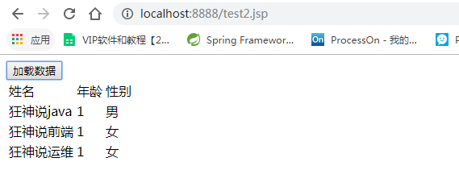

### 9.6、获取baidu接口Demo

1. JSONP.html
    ```html
    <!DOCTYPE HTML>
    <html>
    <head>
       <meta http-equiv="Content-Type" content="text/html; charset=utf-8">
       <title>JSONP百度搜索</title>
       <style>
           #q{
               width: 500px;
               height: 30px;
               border:1px solid #ddd;
               line-height: 30px;
               display: block;
               margin: 0 auto;
               padding: 0 10px;
               font-size: 14px;
          }
           #ul{
               width: 520px;
               list-style: none;
               margin: 0 auto;
               padding: 0;
               border:1px solid #ddd;
               margin-top: -1px;
               display: none;
          }
           #ul li{
               line-height: 30px;
               padding: 0 10px;
          }
           #ul li:hover{
               background-color: #f60;
               color: #fff;
          }
       </style>
       <script>

           // 2.步骤二
           // 定义demo函数 (分析接口、数据)
           function demo(data){
               var Ul = document.getElementById('ul');
               var html = '';
               // 如果搜索数据存在 把内容添加进去
               if (data.s.length) {
                   // 隐藏掉的ul显示出来
                   Ul.style.display = 'block';
                   // 搜索到的数据循环追加到li里
                   for(var i = 0;i<data.s.length;i++){
                       html += '<li>'+data.s[i]+'</li>';
                  }
                   // 循环的li写入ul
                   Ul.innerHTML = html;
              }
          }

           // 1.步骤一
           window.onload = function(){
               // 获取输入框和ul
               var Q = document.getElementById('q');
               var Ul = document.getElementById('ul');

               // 事件鼠标抬起时候
               Q.onkeyup = function(){
                   // 如果输入框不等于空
                   if (this.value != '') {
                       // ☆☆☆☆☆☆☆☆☆☆☆☆☆☆☆☆☆☆JSONPz重点☆☆☆☆☆☆☆☆☆☆☆☆☆☆☆☆☆☆☆☆
                       // 创建标签
                       var script = document.createElement('script');
                       //给定要跨域的地址 赋值给src
                       //这里是要请求的跨域的地址 我写的是百度搜索的跨域地址
                       script.src = 'https://sp0.baidu.com/5a1Fazu8AA54nxGko9WTAnF6hhy/su?wd='+this.value+'&cb=demo';
                       // 将组合好的带src的script标签追加到body里
                       document.body.appendChild(script);
                  }
              }
          }
       </script>
    </head>

    <body>
    <input type="text" id="q" />
    <ul id="ul">

    </ul>
    </body>
    </html>
    ```

2. 测试

   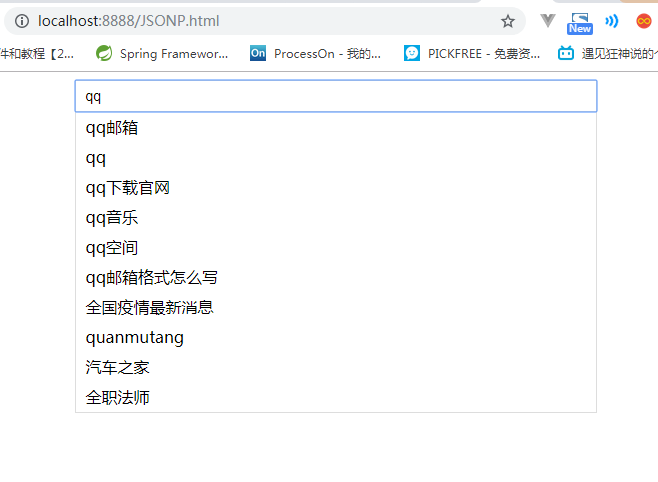
   
   
   
## 10、拦截器

### 10.1、概述

- SpringMVC的处理器拦截器类似于Servlet开发中的过滤器Filter,用于对处理器进行预处理和后处理。
- 开发者可以自己定义一些拦截器来实现特定的功能。

**过滤器与拦截器的区别：**拦截器是<font color=red>AOP思想</font>的具体应用。

**过滤器**

- servlet规范中的一部分，任何javaweb工程都可以使用
- 在url-pattern中配置了/*之后，可以对所有要访问的资源进行拦截

**拦截器** 

- 拦截器是SpringMVC框架自己的，只有使用了SpringMVC框架的工程才能使用
- 拦截器只会拦截访问的控制器方法， 如果访问的是jsp/html/css/image/js是不会进行拦截的

### 10.2、自定义拦截器

1. 新建一个Moudule ， springmvc-Interceptor  ， 添加web支持

2. 配置web.xml 和 springmvc-servlet.xml 文件

3. 编写一个拦截器（必须实现<font color=red> HandlerInterceptor 接口</font>）

   ```java
   package nuc.ss.config;
   
   import org.springframework.web.servlet.HandlerInterceptor;
   import org.springframework.web.servlet.ModelAndView;
   
   import javax.servlet.http.HttpServletRequest;
   import javax.servlet.http.HttpServletResponse;
   
   public class MyInterceptor implements HandlerInterceptor {
       //return true; 执行下一个拦截器，放行
       //return false; 不执行下一个拦截器，拦截
       public boolean preHandle(HttpServletRequest request, HttpServletResponse response, Object handler) throws Exception {
           System.out.println("===========处理前===========");
           return true;
       }
       //日志
       public void postHandle(HttpServletRequest request, HttpServletResponse response, Object handler, ModelAndView modelAndView) throws Exception {
           System.out.println("===========处理后===========");
   
       }
       //日志
       public void afterCompletion(HttpServletRequest request, HttpServletResponse response, Object handler, Exception ex) throws Exception {
           System.out.println("===========清理===========");
   
       }
   }
   
   ```

4. 在springmvc的配置文件中配置拦截器

   ```xml
   <!--拦截器配置-->
   <mvc:interceptors>
       <mvc:interceptor>
           <!--包括这个请求下面的所有请求-->
           <mvc:mapping path="/**"/>
           <bean class="nuc.ss.config.MyInterceptor"/>
       </mvc:interceptor>
   
   </mvc:interceptors>
   ```

5. 编写一个Controller，接收请求

   ```java
   package nuc.ss.controller;
   
   import org.springframework.web.bind.annotation.GetMapping;
   import org.springframework.web.bind.annotation.RestController;
   
   @RestController
   public class TestController {
       @GetMapping("/t1")
       public String test() {
           System.out.println("TestController.test");
           return "ok";
       }
   }
   ```

6. 启动tomcat 测试一下！(http://localhost:8888/t1)

### 10.3、验证用户是否登录 (认证用户)

**实现思路**

1. 有一个登陆页面，需要写一个controller访问页面。

2. 登陆页面有一提交表单的动作。需要在controller中处理。判断用户名密码是否正确。如果正确，向session中写入用户信息。*返回登陆成功。*

3. 拦截用户请求，判断用户是否登陆。如果用户已经登陆。放行， 如果用户未登陆，跳转到登陆页面

**测试：**

1. 编写一个登陆页面  login.jsp

   ```jsp
   <%@ page contentType="text/html;charset=UTF-8" language="java" %>
   <html>
   <head>
       <title>登录</title>
   </head>
   <body>
   <%--在web-inf下面的所有页面或者资源，只能通过controller或者Servlet进行访问--%>
   <h1>登录页面</h1>
   
   <form action="${pageContext.request.contextPath}/user/login" method="post">
       用户名：<input type="text" name="username">
       密码：<input type="text" name="password">
       <input type="submit" value="提交">
   </form>
   </body>
   </html>
   
   ```

2. 编写一个Controller处理请求

   ```java
   @Controller
   @RequestMapping("/user")
   public class LoginController {
       @RequestMapping("/main")
       public String main() {
           return "main";
       }
   
       @RequestMapping("/goLogin")
       public String login() {
           return "login";
       }
       @RequestMapping("/login")
       public String login(HttpSession session, String username, String password, Model model) {
   
           //把用户的信息存在session中
           session.setAttribute("userLoginInfo",username);
           model.addAttribute("password",password);
           model.addAttribute("username",username);
           return "main";
       }
   
       @RequestMapping("/goOut")
       public String goOut(HttpSession sessionl) {
           sessionl.removeAttribute("userLoginInfo");
           return "login";
       }
   }
   
   ```

3. 编写一个登陆成功的页面 main.jsp

   ```jsp
   <%@ page contentType="text/html;charset=UTF-8" language="java" %>
   <html>
   <head>
       <title>首页</title>
   </head>
   <body>
   <h1>首页</h1>
   <span>${password}</span>
   <span>${username}</span>
   
   <p>
       <a href="${pageContext.request.contextPath}/user/goOut">注销</a>
   </p>
   
   </body>
   </html>
   
   ```

4. 在 index 页面上测试跳转！启动Tomcat 测试，未登录也可以进入主页！

   ```jsp
   <%@ page contentType="text/html;charset=UTF-8" language="java" %>
   <html>
   <head>
     <title>index</title>
   </head>
   <body>
   <h1><a href="${pageContext.request.contextPath}/user/goLogin">登录页面</a></h1>
   <h1><a href="${pageContext.request.contextPath}/user/main">首页</a></h1>
   
   </body>
   </html>
   ```

5. 编写用户登录拦截器

   ```java
   package nuc.ss.config;
   
   import org.springframework.web.servlet.HandlerInterceptor;
   
   import javax.servlet.http.HttpServletRequest;
   import javax.servlet.http.HttpServletResponse;
   import javax.servlet.http.HttpSession;
   
   public class LoginInterceptor implements HandlerInterceptor {
       public boolean preHandle(HttpServletRequest request, HttpServletResponse response, Object handler) throws Exception {
           HttpSession session = request.getSession();
           //放行:判断什么情况下登录
   
           //登录页面也会放行
           if (request.getRequestURI().contains("goLogin")) {
               return true;
           }
           if (request.getRequestURI().contains("login")) {
               return true;
           }
           if (session.getAttribute("userLoginInfo") != null) {
               return true;
           }
           //判断什么情况下没有登录
           request.getRequestDispatcher("/WEB-INF/jsp/login.jsp").forward(request,response);
           return false;
       }
   }
   
   ```

6. 在Springmvc的配置文件中注册拦截器

   ```xml
   <!--关于拦截器的配置-->
   <mvc:interceptors>
      <mvc:interceptor>
          <mvc:mapping path="/**"/>
          <bean id="loginInterceptor" class="com.kuang.interceptor.LoginInterceptor"/>
      </mvc:interceptor>
   </mvc:interceptors>
   ```

7. 再次重启Tomcat测试！

**OK，测试登录拦截功能无误.**

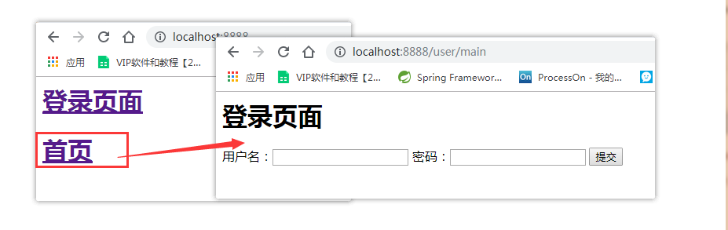

## 11、文件上传和下载

### 11.1、准备工作

- 文件上传是项目开发中最常见的功能之一 ,springMVC 可以很好的支持文件上传。
- SpringMVC上下文中默认没有装配MultipartResolver，因此默认情况下其不能处理文件上传工作。如果想使用Spring的文件上传功能，则需要在上下文中配置MultipartResolver。
- 前端表单要求：为了能上传文件，必须将表单的method设置为POST，并将enctype设置为multipart/form-data。只有在这样的情况下，浏览器才会把用户选择的文件以二进制数据发送给服务器；

**对表单中的 enctype 属性做个详细的说明：**

- application/x-www=form-urlencoded：默认方式，只处理表单域中的 value 属性值，采用这种编码方式的表单会将表单域中的值处理成 URL 编码方式。
- multipart/form-data：这种编码方式会以二进制流的方式来处理表单数据，这种编码方式会把文件域指定文件的内容也封装到请求参数中，不会对字符编码。
- text/plain：除了把空格转换为 "+" 号外，其他字符都不做编码处理，这种方式适用直接通过表单发送邮件。

```html
<form action="" enctype="multipart/form-data" method="post">
   <input type="file" name="file"/>
   <input type="submit">
</form>
```

一旦设置了enctype为multipart/form-data，浏览器即会采用二进制流的方式来处理表单数据，而对于文件上传的处理则涉及在服务器端解析原始的HTTP响应。在2003年，Apache Software Foundation发布了开源的Commons FileUpload组件，其很快成为Servlet/JSP程序员上传文件的最佳选择。

- Servlet3.0规范已经提供方法来处理文件上传，但这种上传需要在Servlet中完成。
- 而Spring MVC则提供了更简单的封装。
- Spring MVC为文件上传提供了直接的支持，这种支持是用即插即用的MultipartResolver实现的。
- Spring MVC使用Apache Commons FileUpload技术实现了一个MultipartResolver实现类：
- CommonsMultipartResolver。因此，<font color=red>SpringMVC的文件上传还需要依赖Apache Commons FileUpload的组件。</font>


### 11.2、文件上传

1. 导入文件上传的jar包，commons-fileupload ， Maven会自动帮我们导入他的依赖包 commons-io包；

   ```xml
   <!--文件上传-->
   <dependency>
      <groupId>commons-fileupload</groupId>
      <artifactId>commons-fileupload</artifactId>
      <version>1.3.3</version>
   </dependency>
   <!--servlet-api导入高版本的-->
   <dependency>
      <groupId>javax.servlet</groupId>
      <artifactId>javax.servlet-api</artifactId>
      <version>4.0.1</version>
   </dependency>
   ```

2. 配置bean：multipartResolver

   <font color=red>【**注意！！！这个bena的id必须为：multipartResolver ， 否则上传文件会报400的错误！在这里栽过坑,教训！**】</font>

   ```xml
   <!--文件上传配置-->
   <bean id="multipartResolver"  class="org.springframework.web.multipart.commons.CommonsMultipartResolver">
      <!-- 请求的编码格式，必须和jSP的pageEncoding属性一致，以便正确读取表单的内容，默认为ISO-8859-1 -->
      <property name="defaultEncoding" value="utf-8"/>
      <!-- 上传文件大小上限，单位为字节（10485760=10M） -->
      <property name="maxUploadSize" value="10485760"/>
      <property name="maxInMemorySize" value="40960"/>
   </bean>
   ```

   CommonsMultipartFile 的 常用方法：

   - **String getOriginalFilename()：获取上传文件的原名**
   - **InputStream getInputStream()：获取文件流**
   - **void transferTo(File dest)：将上传文件保存到一个目录文件中**

    我们去实际测试一下

3. 编写前端页面

   ```jsp
   <form action="/upload" enctype="multipart/form-data" method="post">
    <input type="file" name="file"/>
    <input type="submit" value="upload">
   </form>
   ```

4. **Controller**

   ```java
   package nuc.ss.controller;
   
   import org.springframework.web.bind.annotation.RequestMapping;
   import org.springframework.web.bind.annotation.RequestParam;
   import org.springframework.web.bind.annotation.RestController;
   import org.springframework.web.multipart.commons.CommonsMultipartFile;
   
   import javax.servlet.http.HttpServletRequest;
   import javax.servlet.http.HttpServletResponse;
   import java.io.*;
   import java.net.URLEncoder;
   
   @RestController
   public class FileController {
   
       //@RequestParam("file") 将name=file控件得到的文件封装成CommonsMultipartFile 对象
       //批量上传CommonsMultipartFile则为数组即可
       @RequestMapping("/upload")
       public String fileUpload(@RequestParam("file") CommonsMultipartFile file , HttpServletRequest request) throws IOException {
   
           //获取文件名 : file.getOriginalFilename();
           String uploadFileName = file.getOriginalFilename();
   
           //如果文件名为空，直接回到首页！
           if ("".equals(uploadFileName)){
               return "redirect:/index.jsp";
           }
           System.out.println("上传文件名 : "+uploadFileName);
   
           //上传路径保存设置
           String path = request.getServletContext().getRealPath("/upload");
           //如果路径不存在，创建一个
           File realPath = new File(path);
           if (!realPath.exists()){
               realPath.mkdir();
           }
           System.out.println("上传文件保存地址："+realPath);
   
           InputStream is = file.getInputStream(); //文件输入流
           OutputStream os = new FileOutputStream(new File(realPath,uploadFileName)); //文件输出流
   
           //读取写出
           int len=0;
           byte[] buffer = new byte[1024];
           while ((len=is.read(buffer))!=-1){
               os.write(buffer,0,len);
               os.flush();
           }
           os.close();
           is.close();
           return "redirect:/index.jsp";
       }
   
       /*
        * 采用file.Transto 来保存上传的文件
        */
       @RequestMapping("/upload2")
       public String  fileUpload2(@RequestParam("file") CommonsMultipartFile file, HttpServletRequest request) throws IOException {
   
           //上传路径保存设置
           String path = request.getServletContext().getRealPath("/upload");
           File realPath = new File(path);
           if (!realPath.exists()){
               realPath.mkdir();
           }
           //上传文件地址
           System.out.println("上传文件保存地址："+realPath);
   
           //通过CommonsMultipartFile的方法直接写文件（注意这个时候）
           file.transferTo(new File(realPath +"/"+ file.getOriginalFilename()));
   
           return "redirect:/index.jsp";
       }
   
       @RequestMapping(value="/download")
       public String downloads(HttpServletResponse response , HttpServletRequest request) throws Exception{
           //要下载的图片地址
           String  path = request.getServletContext().getRealPath("/upload");
           String  fileName = "bg1.jpg";
   
           //1、设置response 响应头
           response.reset(); //设置页面不缓存,清空buffer
           response.setCharacterEncoding("UTF-8"); //字符编码
           response.setContentType("multipart/form-data"); //二进制传输数据
           //设置响应头
           response.setHeader("Content-Disposition",
                   "attachment;fileName="+ URLEncoder.encode(fileName, "UTF-8"));
   
           File file = new File(path,fileName);
           //2、 读取文件--输入流
           InputStream input=new FileInputStream(file);
           //3、 写出文件--输出流
           OutputStream out = response.getOutputStream();
   
           byte[] buff =new byte[1024];
           int index=0;
           //4、执行 写出操作
           while((index= input.read(buff))!= -1){
               out.write(buff, 0, index);
               out.flush();
           }
           out.close();
           input.close();
           return null;
       }
   }
   
   ```

5. 测试上传文件，OK！

**采用file.Transto 来保存上传的文件**

1. 编写Controller

   ```java
   /*
   * 采用file.Transto 来保存上传的文件
   */
   @RequestMapping("/upload2")
   public String  fileUpload2(@RequestParam("file") CommonsMultipartFile file, HttpServletRequest request) throws IOException {
   
      //上传路径保存设置
      String path = request.getServletContext().getRealPath("/upload");
      File realPath = new File(path);
      if (!realPath.exists()){
          realPath.mkdir();
     }
      //上传文件地址
      System.out.println("上传文件保存地址："+realPath);
   
      //通过CommonsMultipartFile的方法直接写文件（注意这个时候）
      file.transferTo(new File(realPath +"/"+ file.getOriginalFilename()));
   
      return "redirect:/index.jsp";
   }
   ```

2. 前端表单提交地址修改

3. 访问提交测试，OK！

### 11.3、文件下载

**文件下载步骤：**

1. 设置 response 响应头

2. 读取文件 -- InputStream

3. 写出文件 -- OutputStream

4. 执行操作

5. 关闭流 （先开后关）

**代码实现：**

```java
@RequestMapping(value="/download")
public String downloads(HttpServletResponse response ,HttpServletRequest request) throws Exception{
   //要下载的图片地址
   String  path = request.getServletContext().getRealPath("/upload");
   String  fileName = "基础语法.jpg";

   //1、设置response 响应头
   response.reset(); //设置页面不缓存,清空buffer
   response.setCharacterEncoding("UTF-8"); //字符编码
   response.setContentType("multipart/form-data"); //二进制传输数据
   //设置响应头
   response.setHeader("Content-Disposition",
           "attachment;fileName="+URLEncoder.encode(fileName, "UTF-8"));

   File file = new File(path,fileName);
   //2、 读取文件--输入流
   InputStream input=new FileInputStream(file);
   //3、 写出文件--输出流
   OutputStream out = response.getOutputStream();

   byte[] buff =new byte[1024];
   int index=0;
   //4、执行 写出操作
   while((index= input.read(buff))!= -1){
       out.write(buff, 0, index);
       out.flush();
  }
   out.close();
   input.close();
   return null;
}
```

前端

```jsp
<a href="/download">点击下载</a>
```

测试，文件下载OK

