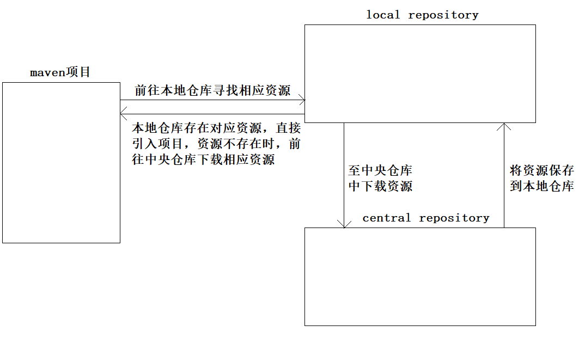
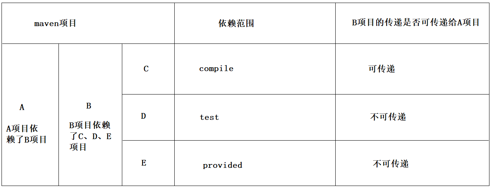
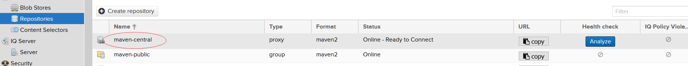
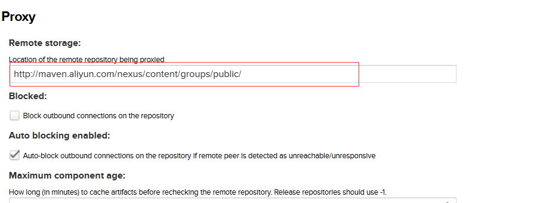
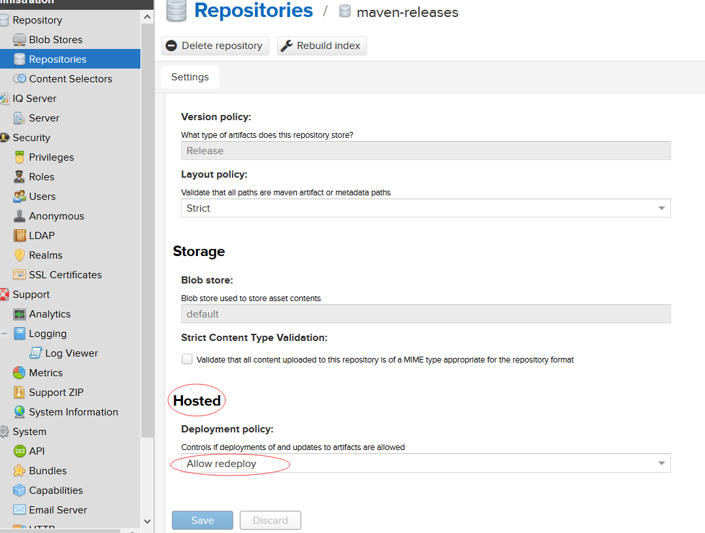

# Maven

## maven概述

​		maven是一款自动化构建工具，专注于java平台的项目构建和依赖管理。maven由apache软件基金会进行维护，是一个开源的项目。

​		maven使用pom（项目对象模型）来管理项目，通过一小段描述信息来管理项目的构建、报告及文档等。

​		项目构建工具有多种，maven只是其中一种而已。构建工具的发展：make->ant->maven->gradle。

### 为什么要使用maven?

#### 1、分布式开发

传统项目和分布式项目的区别：

- 传统项目：

  开发：只创建一个项目，以package来划分模块；

  部署：将项目部署到服务器上的tomcat容器，发布一次即可；

- 分布式项目：

  开发：按模块将一个完整的项目拆分为多个项目；

  部署：将拆分后的项目分别发布到对应的tomcat中，需要发布多次；

​		一般来说，如果项目负载量高，应该采用分布式进行开发和部署；如果项目负载量很低，体现不出分布式开发的优势。

​		maven可以很方便的实现分布式开发。

#### 2、依赖管理

使用maven可以避免频繁的手动复制jar包到WEB-INF/lib目录；

使用maven可以避免繁琐的jar包下载过程；

使用maven可以自动导入项目所需jar包依赖的其他jar包，无需去记忆jar包之间的依赖，从而大大降低了学习成本。


## maven的安装和配置

### 安装

​		下载地址：https://maven.apache.org/download.cgi，解压即可用。

​		注意：应解压到一个无中文无空格的目录下。

### 配置

- 创建一个MAVEN_HOME环境变量，其值指向解压文件所在目录。
- 引入path，%MAVEN_HOME%\bin

### 测试

​		在命令行模式中，输入mvn -v命令，回车执行后从响应信息中可查看到maven是否安装成功。


## maven核心概念

### maven项目的目录结构

​		在maven中，项目的目录结构是约定好的，不能改变。


​		maven在项目构建过程中，最主要的几种操作：

- 清理：删除之前编译的结果，为下一次编译做准备。

  对应的maven命令：mvn clean

- 编译：将java源文件编译为字节码文件。

  对应的maven命令：mvn compile(编译主程序)或者mvn test-compile(编译测试程序)

- 测试：对项目开发的关键节点进行测试，保证项目在迭代开发过程中关键节点的正确性。

  对应的maven命令：mvn test

- 报告：对测试结果使用标准格式进行记录和展示。

- 打包：将一个包含诸多文件项目封装成一个可被安装或部署的包。java项目->jar，web项目->war

  对应的maven命令：mvn package

- 安装：在maven环境中，安装是指将打包结果安装到maven的本地仓库。

  对应的maven命令：mvn install

- 部署：将打包结果部署到远程仓库或是将war包部署到服务器上的tomcat容器。

  对应的maven命令：mvn deploy


#### 案例

步骤1：创建maven对应的目录结构及文件。

test\src\main\resources

test\src\main\java\com\wsjy\maven\MainHello.java

```java
package com.wsjy.maven;
public class MainHello{
	public static void main(String[] args){
		System.out.println("main,hello world!!");
	}
}
```

test\src\test\resources

test\src\test\java\com\wsjy\maven\TestHello.java

```java
package com.wsjy.maven;
public class TestHello{
	public static void main(String[] args){
		System.out.println("test,hello world!!");
	}
}
```

test\pom.xml

```xml
<?xml version="1.0" encoding="UTF-8"?>
<project xmlns="http://maven.apache.org/POM/4.0.0"
         xmlns:xsi="http://www.w3.org/2001/XMLSchema-instance"
         xsi:schemaLocation="http://maven.apache.org/POM/4.0.0 		http://maven.apache.org/xsd/maven-4.0.0.xsd">
    <modelVersion>4.0.0</modelVersion>
    <!-- 坐标 -->
    <groupId>com.wsjy.maven</groupId>
    <artifactId>Hello</artifactId>
    <version>1.0-SNAPSHOT</version>

</project>
```

步骤2：在命令行模式中，测试maven命令的使用。注意：**maven命令只能在pom.xml所在的目录中执行**。

测试maven编译命令：mvn compile

当本机的jdk版本与maven默认的jdk版本不一致时，会编译失败，从而导致项目构建失败。

编辑maven安装目录/conf/settings.xml，在<settings>标签中修改maven的jdk版本。

```xml
<profile>
     <id>jdk11</id>
     <activation>
        <activeByDefault>true</activeByDefault>
        <jdk>11</jdk>
     </activation>
     <properties>
        <maven.compiler.source>11</maven.compiler.source>
        <maven.compiler.target>11</maven.compiler.target>
        <maven.compiler.compilerVersion>11</maven.compiler.compilerVersion>
      </properties>
    </profile>
```

测试maven清除命令：mvn clean

测试编译测试程序命令：mvn test-compile

测试命令：mvn test

测试打包命令：mvn package，注意：生成jar或war包时，仅打包主程序main下的内容。

测试安装命令：mvn install。

### maven的仓库



#### 本地仓库

​		maven默认的本地仓库：

windows系统：C:\Users\系统登录用户名\\.m2\repository

linux系统：用户的home目录\\.m2\repository

​		一般来说，windows系统中本地仓库不会使用默认仓库，而是使用自定义的本地仓库。

##### 自定义本地仓库

​		编辑maven安装目录/conf/settings.xml，在该文件的<settings>标签中配置本地仓库。

```xml
<localRepository>E:\maven\repository</localRepository>
```

#### 远程仓库

- 私服：搭建在局域网环境中，为当前局域网内所有的maven项目服务
- 中央仓库：在internet上，为全世界的maven项目提供服务
- 中央仓库镜像：为了分担中央仓库流量，提升用户访问和下载速度

##### 设置中央仓库镜像

​		编辑maven安装目录/conf/settings.xml，在该文件的<settings>标签中设置中央仓库镜像。

```xml
在<mirrors>标签中配置中央仓库镜像
<mirror>
    <id>nexus-aliyun</id>
    <mirrorOf>central</mirrorOf>
    <name>Nexus aliyun</name>
    <url>http://maven.aliyun.com/nexus/content/groups/public</url> 
</mirror>
```

### maven的生命周期

​		maven的核心程序定义了三套相互独立的生命周期，生命周期中各个阶段的具体任务是插件来完成。

​		maven核心程序为了更好的实现自动化构建，设定了一个生命周期执行规则：**不管是执行生命周期中的哪一个阶段，都会从当前生命周期的最初位置开始执行**。

#### maven的三套生命周期

##### clean lifecycle

​		在项目构建之前执行的一些清理工作，clean生命周期包含三个阶段：

1. pre-clean：执行清理工作之前做的一些事情
2. clean：执行清理工作
3. post-clean：执行完清理工作之后做的一些事情

##### default lifecycle

​		是项目构建的核心部分，编译、测试、打包、安装、部署等，default生命周期是maven生命周期中最重要的一个，绝大部分工作都发生在这个生命周期中。

1. validate
2. generate-sources
3. process-sources
4. generate-resources
5. process-resources：复制并处理资源文件，放到目标目录，准备打包。
6. compile：编译项目主程序源代码
7. process-classes
8. generate-test-sources
9. process-test-sources
10. generate-test-resources
11. process-test-resources：复制并处理资源文件，放到测试目录。
12. test-compile：编译项目测试程序源代码
13. process-test-classes
14. test：使用合适的单元测试框架运行测试，测试代码不会被打包和部署。
15. prepare-package
16. package：接受编译好的代码，打包成可发布的格式。jar或war等。
17. pre-integration-test
18. integration-test
19. post-integration-test
20. verify
21. install：将打包结果安装到maven本地仓库，以便于其他项目进行依赖。
22. deploy：将最终的包复制到远程仓库，以便其他开发人员与项目共享，或者把war包部署到服务器上运行。

##### site lifecycle

​		site生命周期用于生成项目报告，生成一个站点，发布站点。

1. pre-site：在生成站点文档之前做的一些事情
2. site：生成站点文档
3. post-site：生成站点文档之后做的一些事情
4. site-deploy：将生成的站点文档部署到特定的服务器上。


### maven的pom.xml

#### maven的坐标

​		数学的坐标分为两类：

- 平面：由X和Y两个向量来唯一进行定位某个具体的点。
- 空间：由X和Y、Z三个向量来唯一进行定位某个具体的点。

​		在maven中，通过groupId和artifactId、version三个向量在maven仓库中唯一定位到一个maven项目，使用坐标来描述当前项目存放在maven仓库的位置。

```xml
<!-- 坐标 -->
<!-- 公司或组织的域名倒序+开发的项目名 -->
<groupId>com.wsjy.maven</groupId>
<!-- 项目中的模块名 -->
<artifactId>Hello</artifactId>
<!-- 版本 -->
<version>1.0-SNAPSHOT</version>
```

​		使用mvn install安装到本地仓库的项目jar包的命名：artifactId+"-"+version.jar。


#### maven的依赖

​		maven的依赖通过\<dependency>标签实现，该标签是\<dependencies>的子标签，不能在pom.xml独立存在，必须作为\<dependencies>的子标签出现。

```xml
<dependencies>
	<dependency>
		<!-- 被依赖的项目groupId -->
		<groupId>com.wsjy.maven</groupId>
		<!-- 被依赖的项目artifactId -->
		<artifactId>Hello</artifactId>
		<!-- 被依赖的项目的version -->
		<version>1.0-SNAPSHOT</version>
	</dependency>
</dependencies>
```

​		\<dependency>标签中并不只有坐标信息，还可以有其他配置，重要的配置有：

\<type>：用于描述当前依赖的类型。

```xml
<dependencies>
	<dependency>
		<groupId>com.wsjy.maven</groupId>
		<artifactId>Hello</artifactId>
		<version>1.0-SNAPSHOT</version>
        <!-- 手动指定当前依赖的类型，默认为jar。也可以取值为：war或pom -->
        <type>jar</type>
	</dependency>
</dependencies>
```

**\<scope>**：定义了导入的依赖作用范围。

```xml
<dependencies>
	<dependency>
		<groupId>com.wsjy.maven</groupId>
		<artifactId>Hello</artifactId>
		<version>1.0-SNAPSHOT</version>
        <type>jar</type>
        <!-- 定义依赖的作用范围，默认范围是compile。
			可以取值：compile|test|runtime|provided|system|import
		-->
        <scope>compile</scope>
	</dependency>
</dependencies>
```

- **compile**：默认值，表示当前依赖会参与项目的编译、测试、和运行阶段，属于强依赖，打包时，会打进对应的包中。
- **test**：表示当前依赖仅仅只参与测试相关的内容，包括测试用例的编译和执行。典型：junit。
- runtime：当前依赖只参与运行周期中的使用。一般来说，这种都是接口与实现相分离的类库，典型：JDBC类库，在编译时仅依赖相关接口，在具体运行时才需要具体的数据库驱动程序。
- **provided**：表示当前依赖不参与打包过程，这个依赖由运行时环境来提供。典型：servlet-api.jar。
- system：使用上跟provided相同，表示当前依赖不从maven仓库中获取，而从本地文件系统中获取。
- import：只能在dependencyManagement中使用，能解决maven单继承的问题，import的依赖关系实际上并不参与限制依赖关系的传递性。


​		**修改idea的maven版本**

​		settings->build->build tools->maven

- maven home derictory：指向maven安装目录；
- user settins file：指向安装目录下/conf/settings.xml；
- local repository：指向自定义的本地仓库；


##### maven依赖的传递

案例：

demo的pom.xml

```xml
<?xml version="1.0" encoding="UTF-8"?>
<project xmlns="http://maven.apache.org/POM/4.0.0"
         xmlns:xsi="http://www.w3.org/2001/XMLSchema-instance"
         xsi:schemaLocation="http://maven.apache.org/POM/4.0.0 http://maven.apache.org/xsd/maven-4.0.0.xsd">
    <modelVersion>4.0.0</modelVersion>

    <groupId>com.wsjy.maven</groupId>
    <artifactId>demo</artifactId>
    <version>1.0-SNAPSHOT</version>

    <dependencies>
        <dependency>
            <groupId>org.springframework</groupId>
            <artifactId>spring-core</artifactId>
            <version>5.2.1.RELEASE</version>
        </dependency>
    </dependencies>
    
</project>

```

demo1的pom.xml

```xml
<?xml version="1.0" encoding="UTF-8"?>
<project xmlns="http://maven.apache.org/POM/4.0.0"
         xmlns:xsi="http://www.w3.org/2001/XMLSchema-instance"
         xsi:schemaLocation="http://maven.apache.org/POM/4.0.0 http://maven.apache.org/xsd/maven-4.0.0.xsd">
    <modelVersion>4.0.0</modelVersion>

    <groupId>com.wsjy.maven</groupId>
    <artifactId>demo1</artifactId>
    <version>1.0-SNAPSHOT</version>

    <dependencies>
        <dependency>
            <groupId>com.wsjy.maven</groupId>
            <artifactId>demo</artifactId>
            <version>1.0-SNAPSHOT</version>
        </dependency>
    </dependencies>

</project>
```

​		从上例中可看出，在demo1中依赖了demo，而demo又依赖了spring-core，此时maven会自动将demo依赖的spring-core引入到demo1，此处体现了依赖的传递性。

​		maven依赖是否进行传递是同依赖范围\<scope>来决定的，只有compile范围的依赖可以进行传递，其余依赖范围是无法传递的。



##### maven依赖的排除

​		在maven项目中，由于依赖的传递性导致compile范围的依赖都会被传递，如果传递过来的依赖是一个不稳定版本或者与本项目中的其他依赖有冲突时，会对当前项目产生不良影响，此时应将传递的依赖排除掉，只导入本项目需要的依赖即可。

​		排除对应的依赖使用\<exclusions>标签来实现。

```xml
<dependencies>
    <dependency>
        <groupId>com.wsjy.maven</groupId>
        <artifactId>demo</artifactId>
        <version>1.0-SNAPSHOT</version>
        <!-- 排除依赖 -->
        <exclusions>
            <exclusion>
                <groupId>org.springframework</groupId>
                <artifactId>spring-core</artifactId>
            </exclusion>
        </exclusions>
    </dependency>
</dependencies>
```


##### maven依赖的原则

###### 就近原则(路径最短者优先)

​		当传递给maven项目中的依赖相同但版本不同时，当前项目所使用的版本是离自己路径最短的依赖中所使用的版本。

###### 路径相同时先声明者优先

​		当传递给maven项目中的依赖相同但版本不同时，如果传递依赖的项目与当前项目路径相同时，由当前项目中\<dependency>标签的顺序来决定使用哪一个版本。


#### maven的继承

##### maven项目的分类

​		在maven中，根据项目打包类型的不同，将项目分为三种类型：jar、war、pom。

- jar：普通java项目
- war：web项目
- pom：父项目，如果项目下有子项目存在，则该项目的打包类型一定是pom。

​		通过\<packaging>来设置项目的打包类型。

```xml
<packaging>jar|war|pom</packaging>
```

​		在某个项目的pom.xml中使用\<parent>标签来声明该项目的父项目信息后，该项目就作为父项目的子项目出现，从而实现了maven的项目继承。

##### 父项目集中管理依赖版本

创建tiangou_parent项目，pom.xml内容如下：

```xml
<?xml version="1.0" encoding="UTF-8"?>
<project xmlns="http://maven.apache.org/POM/4.0.0"
         xmlns:xsi="http://www.w3.org/2001/XMLSchema-instance"
         xsi:schemaLocation="http://maven.apache.org/POM/4.0.0 http://maven.apache.org/xsd/maven-4.0.0.xsd">
    <modelVersion>4.0.0</modelVersion>

    <groupId>com.wsjy</groupId>
    <artifactId>tiangou_parent</artifactId>
    <version>1.0-SNAPSHOT</version>
    <!-- <properties>的子标签可以自定义 -->
    <properties>
        <!-- 使用自定义标签存放依赖的版本信息，如需修改，只需要在此处进行改动即可 -->
        <spring.version>5.2.1.RELEASE</spring.version>
    </properties>

    <packaging>pom</packaging>
    <!-- 依赖管理：只做声明，不做实际导入。
        一般会在子项目中通过<dependencies>标签来实际导入相关依赖。-->
    <dependencyManagement>
        <dependencies>
            <dependency>
                <groupId>org.springframework</groupId>
                <artifactId>spring-core</artifactId>
                <!-- 使用${自定义标签名}引用对应标签中存放的内容 -->
                <version>${spring.version}</version>
            </dependency>
        </dependencies>
    </dependencyManagement>

</project>
```

创建tiangou_child项目，pom.xml内容如下：

```xml
<?xml version="1.0" encoding="UTF-8"?>
<project xmlns="http://maven.apache.org/POM/4.0.0"
         xmlns:xsi="http://www.w3.org/2001/XMLSchema-instance"
         xsi:schemaLocation="http://maven.apache.org/POM/4.0.0 http://maven.apache.org/xsd/maven-4.0.0.xsd">
    <modelVersion>4.0.0</modelVersion>

    <artifactId>tiangou_child</artifactId>

    <packaging>jar</packaging>
    <!-- 声明父项目信息 -->
    <parent>
        <groupId>com.wsjy</groupId>
        <artifactId>tiangou_parent</artifactId>
        <version>1.0-SNAPSHOT</version>
        <!-- 设置父项目的pom.xml相对于本项目的路径 -->
        <relativePath>../tiangou_parent/pom.xml</relativePath>
    </parent>
    
    <dependencies>
        <dependency>
            <groupId>org.springframework</groupId>
            <artifactId>spring-core</artifactId>
        </dependency>
    </dependencies>

</project>
```

​		在maven的继承中，父项目与子项目之间只有逻辑上的父子关系，也就是说子项目不会被包含在父项目中。

#### maven的聚合

​		maven项目的聚合是建立在继承的基础上的。

​		在父项目中使用\<modules>标签将子项目引入父项目，此时就实现了maven项目的聚合，给父项目打包时，子项目的内容也会被打包进来。

```xml
	<!-- 指定当前项目中应该包含的模块 -->
    <modules>
        <module>../tiangou_child</module>
        <module>../tiangou_child1</module>
        <module>../tiangou_child2</module>
    </modules>
```

​		一般来说，使用聚合项目。


#### maven项目其他配置

idea使用模板创建maven Web项目。

create from archetype->org.apache.maven.archetypes:maven-archetype-webapp

- 增加src/test/java、src/test/resources
- 增加src/main/java、src/main/resources
- 增加src/main/webapp/META-INF


##### pom.xml中\<build>的常见配置

###### \<resources>

​		在构建maven项目时，如果没有进行特殊的配置，maven会按照标准的目录结构查找和处理各种类型的文件。

**src/main/java和src/test/java**

​		这两个目录中所有的.java文件会分别在compile和test-compile阶段被编译，编译结果会分别放到target/classes和target/test-classes目录中，这两个目录中的其他类型文件都会被忽略掉。

**src/main/resources和src/test/resources**

​		这两个目录中的文件也会分别被复制到target/classes和target/test-classes目录中。

**target/classes**

​		打包插件默认会把该目录中的所有内容打入到jar或war包中。

​		资源文件是java代码运行过程中需要使用的文件，java代码在执行的过程中会到指定位置去查找这些文件。而maven默认只将src/main/java下的.java文件放入到target/classes目录，有时候我们需要进行自定义的配置(mybaties)。

自定义配置有两种方式：

- 在\<build>标签下添加\<resources>进行配置
- 在\<build>标签的\<plugins>子元素中配置maven-resources-plugin等处理资源文件的插件。

案例：

```xml
<!-- 资源文件目录 -->
    <resources>
      <!-- 具体的资源文件 -->
      <resource>
        <!-- 资源文件所在的目录 -->
        <directory>src/main/java</directory>
        <!-- 是否对资源文件所在的目录进行过滤 -->
        <filtering>true</filtering>
        <!-- 打包后存放的位置 -->
<!--        <targetPath>${project.build.directory}</targetPath>-->
        <!-- 包含：只包含<directory>目录下的指定文件 -->
        <includes>
          <!-- *:通配符 -->
          <include>**/*.xml</include>
        </includes>
        <!-- 排除：不包含<directory>目录下的指定文件，
        当<includes>和<excludes>同时存在时，以<excludes>为准 -->
        <excludes>
          <exclude>**/*.xml</exclude>
        </excludes>
      </resource>
    </resources>
```


常见配置：

```xml
	<resources>
      <resource>
        <filtering>true</filtering>
        <directory>src/main/java</directory>
        <includes>
          <include>**/*.xml</include>
        </includes>
      </resource>
      <resource>
        <directory>src/main/resources</directory>
      </resource>
    </resources>
```


###### \<plugins>

​		自定义插件，开发过程中常见的插件配置：tomcat。使用tomcat插件可以让项目在插件中运行，而无需在本机上安装tomcat，另外可以使用tomcat插件实现项目热部署。

```xml
	<plugins>
      <plugin>
        <groupId>org.apache.tomcat.maven</groupId>
        <artifactId>tomcat7-maven-plugin</artifactId>
        <version>2.2</version>
        <configuration>
          <!-- 配置tomcat插件的端口号 -->
          <port>8888</port>
          <!-- 配置项目的虚拟项目名 http://localhost:8888/taotao -->
          <path>/taotao</path>
        </configuration>
      </plugin>
    </plugins>
```

​		**热部署**

​		热部署前提条件，用户必须能够访问manager App，因此，需要为远程服务器上的tomcat配置用户并授予权限，修改远程服务器上tomcat安装目录/conf/tomcat-users.xml进行以下配置：

```
<role rolename="manager-gui"/>
<role rolename="manager-script"/>
<role rolename="admin-gui"/>
<user username="root" password="root" roles="manager-gui,admin-gui,manager-script"/>
```

​		在pom.xml中配置tomcat插件：

```xml
	<plugins>
      <plugin>
        <groupId>org.apache.tomcat.maven</groupId>
        <artifactId>tomcat7-maven-plugin</artifactId>
        <version>2.2</version>
        <configuration>
          <!-- 配置tomcat插件的端口号 -->
          <port>8888</port>
          <!-- 配置项目的虚拟项目名 http://localhost:8888/taotao -->
          <path>/taotao</path>
		  <!-- 配置可以访问manager app的用户名 -->
          <username>root</username>
          <!-- 配置可以访问manager app的密码 -->
          <password>root</password>
          <!-- 配置当前项目部署的位置 -->
          <url>http://192.168.113.133:8080/manager/text</url>
        </configuration>
      </plugin>
    </plugins>
```


### 搭建maven私服

#### nexus的安装及配置

​		使用nexus工具来搭建maven私服。nexus有两个大版本：2.\*，3.\*。

​		下载nexus：https://www.sonatype.com/download-nexus-repo-oss，下载时请选择OSS版本(免费)。

​		nexus的安装：

​		nexus是一个压缩版的软件，解压即可使用，解压目录中不能有中文和空格。

​		环境变量的配置：

​		在用户变量的path中添加：nexus的解压目录\nexus-3.9.0-01-win64\nexus-3.9.0-01\bin。

​		启动nexus：在命令行中输入nexus.exe /run，出现以下界面代表启动成功：


​		验证：http://localhost:8081，nexus默认端口为8081。

​		安装成功后，nexus默认提供了用户名和密码：

- 用户名：admin
- 密码：admin123


​		nexus的仓库类型：

- proxy：代理仓库，最常用的就是maven的中央仓库。
- hosted：本地仓库。
- 3rd party：第三方仓库(oracle的JDBC)。

​	

​		nexus提供的3个仓库和1个仓库组：

- maven-central:maven中央仓库。
- maven-releases:maven的release项目部署到私服时，存放的仓库。
- maven-snapshots:maven的snapshot项目部署到私服时，存放的仓库。
- maven-public:仓库组

​		

​		修改nexus中央仓库镜像






#### nexus的使用

##### 使用私服进行依赖

​		在maven的settings.xml进行以下配置即可：

```xml
<mirror>
    <id>nexus-wsjy</id>
    <mirrorOf>*</mirrorOf>
    <name>Nexus wsjy</name>
    <url>http://localhost:8081/repository/maven-public/</url> 
</mirror>
```

​		注：如果失败，可以将maven-central指向的中央仓库镜像改成：http://maven.aliyun.com/nexus/content/repositories/central

##### 将项目部署到私服中

​		在maven的settings.xml进行以下配置：

```xml
<settings xmlns="http://maven.apache.org/SETTINGS/1.0.0"
          xmlns:xsi="http://www.w3.org/2001/XMLSchema-instance"
          xsi:schemaLocation="http://maven.apache.org/SETTINGS/1.0.0 http://maven.apache.org/xsd/settings-1.0.0.xsd">
    <servers>
    	<server>
      		<id>nexus</id>
      		<username>admin</username>
      		<password>admin123</password>
    		</server>
    </servers>
</settings>
```

​		在nexus中将maven-releases和maven-snapshots的hosted设置为allow redeploy。



​		在要部署到nexus中的项目的pom.xml中，使用\<distributionManagement>设置项目要存放的nexus仓库。

```xml
<distributionManagement>
    <!-- 对应nexus中maven-releases -->
    <repository>
      <id>nexus</id>
      <name>nexus-release</name>
      <url>http://localhost:8081/repository/maven-releases/</url>
    </repository>
    <!-- 对应nexus中maven-snapshots -->
    <snapshotRepository>
      <id>nexus</id>
      <name>nexus-snapshot</name>
      <url>http://localhost:8081/repository/maven-snapshots/</url>
    </snapshotRepository>
  </distributionManagement>
```

​		注意：\<distributionManagement>的\<repository>的id值必须与maven的settings.xml中的\<server>的id值匹配，否则失败。


