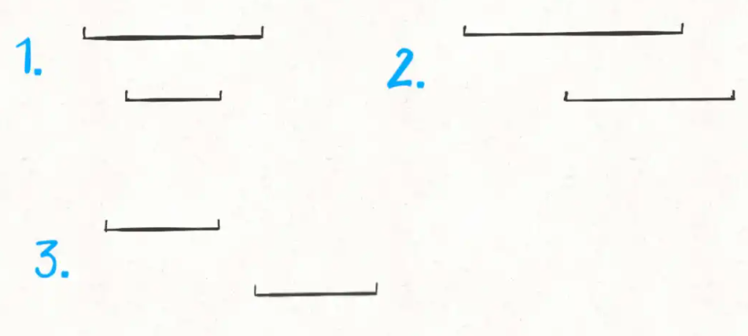

# MS面经

https://leetcode-cn.com/circle/discuss/NomXXq/


# 输入输出 美团、阿里

输入输出牛客练习题：https://www.nowcoder.com/test/27976983/summary

赛码网输入输出练习：https://exercise.acmcoder.com/online/online_judge_ques?ques_id=9579&konwledgeId=137&opencustomeinput=true


学习链接：https://blog.csdn.net/u013568373/article/details/92803182，有文件输入输出

牛客Java笔试必备 - 输入输出流整理：https://blog.csdn.net/Sabrina_cc/article/details/108086175

格式化字符串：https://blog.csdn.net/lonely_fireworks/article/details/7962171


```
import java.util.*;
import java.io.*;

public class Main{
    public static void main(String[] args){
        Scanner scan =new Scanner(System.in);
        
        while(scan.hasNext()){
            double n =  scan.nextInt();
            int m = scan.nextInt();
            double sum=0;
            while(m-- > 0){
                sum += n;
                n = Math.sqrt(n);
            }
            System.out.printf("%.2f", sum);
            System.out.println("");
        }
        // 注意这里，hasNext()阻塞特性，会让程序无法执行这里的代码
    }
}
```


34 获取⽤键盘输⼊常⽤的两种⽅法

```java
Scanner input = new Scanner(System.in);
String s = input.nextLine();
input.close();
```


```java
BufferedReader input = new BufferedReader(new
InputStreamReader(System.in));
String s = input.readLine();
```


## 案例

hasNext()：判断是否有下一个有效输入，next()是阻塞的，意味着不可以把代码写在这里。

hasNextLine()：判断是否有下一行输入

nextInt()：读取下一个整数

```
import java.io.*;
import java.util.*;

public class Main{
    public static void main(String[] args){
        Scanner sc = new Scanner(System.in);
        while(sc.hasNextLine()){
            String[] line = sc.nextLine().split(" ");
            // 如果是无效输入，在这里 break;
            int sum = 0;
            for(String one: line){
                sum += Integer.parseInt(one);
            }
            System.out.println(sum);
        }
        // 注意谨慎谨慎把代码写在这里
    }
}
```


## 各厂情况

阿里：

微软：自己的英文

牛客：腾讯

赛码：美团


# labuladong

## Todo

[51.N皇后（困难）](https://leetcode-cn.com/problems/n-queens)：八皇后问题


[76.最小覆盖子串（困难）](https://leetcode-cn.com/problems/minimum-window-substring)， https://leetcode-cn.com/problems/minimum-window-substring/submissions/，有问题

[567.字符串的排列（中等）](https://leetcode-cn.com/problems/permutation-in-string)

[438.找到字符串中所有字母异位词（中等）](https://leetcode-cn.com/problems/find-all-anagrams-in-a-string)

[3.无重复字符的最长子串（中等）](https://leetcode-cn.com/problems/longest-substring-without-repeating-characters)


## 0章节

### 回溯算法

一般的复杂度：O(n!)，因为免不了穷举

[46.全排列（中等）](https://leetcode-cn.com/problems/permutations)

[51.N皇后（困难）](https://leetcode-cn.com/problems/n-queens)：八皇后问题

```python
result = []
# 孙: 原文def backtrack(路径，选择列表): 没有我这里好理解
def backtrack(选择列表，路径):
    if 满足结束条件:
        result.add(路径)
        return

    for 选择 in 选择列表:
        做选择
        backtrack(路径, 选择列表)
        撤销选择
```


[46.全排列（中等）](https://leetcode-cn.com/problems/permutations)


```java
List<List<Integer>> res = new LinkedList<>();
public List<List<Integer>> permute(int[] nums) {

    // 路径：
    LinkedList<Integer> track = new LinkedList<>();
    backtrack(nums, track);
    return res;
}

public void backtrack(int[] nums, LinkedList<Integer> track){
    if(track.size() == nums.length){
        // 注意返回 添加对象引用，而不是新对象引用的错误
        res.add(new LinkedList<Integer>(track));      // res.add(track);
        return;
    }

    for(int i=0; i<nums.length; i++){
        if(track.contains(nums[i])){
            continue;
        }

        track.add(nums[i]);
        backtrack(nums, track);
        track.removeLast();   // remove(int index) remove(Object obj) removeLast()
    }
}
```


[51.N皇后（困难）](https://leetcode-cn.com/problems/n-queens)：cpp写的

string s(num,c) //生成一个字符串，包含num个c字符  

// Create a vector of size n with all values as 10

vector<int> vect(n, 10);

```java
public List<List<String>> solveNQueens(int n) {
    return sunla_start(n);
}

public List<List<String>> sunla_start(int n){
    char[][] pan = new char[n][n];

    for(int i=0; i<n; i++){
        for(int j=0; j<n; j++){
            pan[i][j] = '.';
        }
    }
    List<List<String>> res = new LinkedList<>();
    sunla_start_backtrack(res, pan, 0);
    return res;
}

public void sunla_start_backtrack(List<List<String>> res, char[][] pan, int row){
    int size = pan.length;
    if(row == size){
        List<String> track = new LinkedList<>();
        for(int i=0; i<row; i++){
            track.add(new String(pan[i]));
        }
        res.add(track);
        return;
    }

    for(int col=0; col<size; col++){
        if(!isValid(pan, row, col))
            continue;    // 一个break, 调试了2小时。hhhhh
        pan[row][col]='Q';
        sunla_start_backtrack(res, pan, row+1);
        pan[row][col]='.';
    }
}

public boolean isValid(char[][] pan, int row, int col){
    int size = pan.length;

    for(int i=0; i<row; i++){
        if(pan[i][col]=='Q') return false;
    }

    for(int i=row-1, j=col+1; i>=0&&j<size; i--, j++){
        if(pan[i][j]=='Q') return false;
    }

    for(int i=row-1, j=col-1; i>=0&&j>=0; i--, j--){
        if(pan[i][j]=='Q') return false;
    }

    return true;
}
```

###  BFS 框架

[111.二叉树的最小深度（简单）](https://leetcode-cn.com/problems/minimum-depth-of-binary-tree)

[752.打开转盘锁（中等）](https://leetcode-cn.com/problems/open-the-lock)


// BFS模板

```java
// 计算从起点 start 到终点 target 的最近距离
int BFS(Node start, Node target) {
    Queue<Node> q; // 核心数据结构
    Set<Node> visited; // 避免走回头路

    q.offer(start); // 将起点加入队列
    visited.add(start);
    int step = 0; // 记录扩散的步数          -----------------------> A

    while (q not empty) {
        int sz = q.size();
        /* 将当前队列中的所有节点向四周扩散 */
        for (int i = 0; i < sz; i++) {
            Node cur = q.poll();
            /* 划重点：这里判断是否到达终点 */
            if (cur is target)
                return step;              -------------------------> B：A的初值，和step是否需要其他处理
            /* 将 cur 的相邻节点加入队列 */
            for (Node x : cur.adj())
                if (x not in visited) {
                    q.offer(x);
                    visited.add(x);
                }
        }
        /* 划重点：更新步数在这里 */
        step++;
    }
}
```


[111.二叉树的最小深度（简单）](https://leetcode-cn.com/problems/minimum-depth-of-binary-tree)

```java
public int sunla_bfs(TreeNode root){
    if(root==null) return 0;
    Queue<TreeNode> queue = new LinkedList<>();
    queue.add(root);
    int step=1;

    while(queue.size()!=0){
        int sz = queue.size();
        while(sz-- >0){
            TreeNode tmp = queue.poll();
            /* 划重点：这里判断是否到达终点 */
            if(tmp.left==null && tmp.right==null){
                return step;
            }
            /* 将 cur 的相邻节点加入队列 */
            if(tmp.left!=null) queue.add(tmp.left);
            if(tmp.right!=null) queue.add(tmp.right);
        }
        /* 划重点：更新步数在这里 */
        step++;			
    }

    return step;
}
```


[752.打开转盘锁（中等）](https://leetcode-cn.com/problems/open-the-lock)

```java
public int sunla_main(String[] deadends, String target){
    Queue<String> queue = new LinkedList<>();
    queue.add("0000");

    List<String> deadends_list = Arrays.asList(deadends);
    // sun: 我的版本，会跳过这个异常判断
    if(deadends_list.contains("0000")) return -1;

    Set<String> visited = new HashSet<>();
    visited.add("0000");
    int step=0;

    while(queue.size()!=0){
        int sz = queue.size();
        while(sz-- >0){
            String tmp = queue.poll();

            if(tmp.equals(target))
                return step;

            for(int j=0; j<4; j++){
                String min = minusOne(tmp, j);
                if(visited.contains(min) || deadends_list.contains(min))
                    continue;    
                queue.add(min);
                visited.add(min);
            }

            for(int j=0; j<4; j++){
                String max = plusOne(tmp, j);
                if(visited.contains(max) || deadends_list.contains(max))
                    continue;
                queue.add(max);
                visited.add(max);
            }
        }

        step++;
    }

    return -1;
}

public String minusOne(String s, int j){
    char[] c=s.toCharArray();
    if(c[j]=='0'){
        c[j]='9';
    }else
        c[j] = (char)(c[j] -1);
    return new String(c);
}

public String plusOne(String s, int j){
    char[] c=s.toCharArray();
    if(c[j]=='9'){
        c[j]='0';
    }else
        c[j] = (char)(c[j]+1);
    return new String(c);
}
```


### 二分

左右边界：https://leetcode-cn.com/problems/find-first-and-last-position-of-element-in-sorted-array

```
int binary_search(int[] nums, int target) {
    int left = 0, right = nums.length - 1; 
    while(left <= right) {
        int mid = left + (right - left) / 2;
        if (nums[mid] < target) {
            left = mid + 1;
        } else if (nums[mid] > target) {
            right = mid - 1; 
        } else if(nums[mid] == target) {
            // 直接返回
            return mid;
        }
    }
    // 直接返回
    return -1;
}

int left_bound(int[] nums, int target) {
    int left = 0, right = nums.length - 1;
    while (left <= right) {
        int mid = left + (right - left) / 2;
        if (nums[mid] < target) {
            left = mid + 1;
        } else if (nums[mid] > target) {
            right = mid - 1;
        } else if (nums[mid] == target) {
            // 别返回，锁定左侧边界
            right = mid - 1;
        }
    }
    // 最后要检查 left 越界的情况，即target > all
    if (left >= nums.length || nums[left] != target)
        return -1;
    return left;
}


int right_bound(int[] nums, int target) {
    int left = 0, right = nums.length - 1;
    while (left <= right) {
        int mid = left + (right - left) / 2;
        if (nums[mid] < target) {
            left = mid + 1;
        } else if (nums[mid] > target) {
            right = mid - 1;
        } else if (nums[mid] == target) {
            // 别返回，锁定右侧边界
            left = mid + 1;
        }
    }
    // 最后要检查 right 越界的情况，即target < all
    if (right < 0 || nums[right] != target)
        return -1;
    return right;
}
```


### 滑动窗口

https://leetcode-cn.com/problems/minimum-window-substring/submissions/

```java
public String window2(String pattern, String str){
    // need：  统计pattern,  pattern 中需要的每个字符的个数
    // window: 已经拥有的need中的 字符， 和字符的个数
    // valid: window中 已经满足要求的 字符个数
    int[] need = new int[128];
    int[] window = new int[128];
    int need_count=0;
    for(char c:pattern.toCharArray()){
        // 出错1，未理解valid 和 distinct pattern的关系
        if(need[c] == 0)  need_count++;
        need[c]++;
    }

    int left = 0, right = 0;
    int valid = 0, len= Integer.MAX_VALUE , start=0;
    while(right < str.length()){
        char in = str.charAt(right);
        right++;

        if(need[in] !=0){
            window[in]++;
            if(window[in] == need[in]){
                valid++;
            }
        }

        // 出错2: pattern.length()
        while( valid == need_count ){

            // 出错3: need_count
            if(right - left < len){
                start = left;
                len = right - left;
            }

            char out = str.charAt(left);
            left++;

            if(need[out] !=0){
                if(window[out] == need[out ]){
                    valid--;
                }
                window[out]--;
            }
        }
    }

    return len==Integer.MAX_VALUE?"": str.substring(start, start + len);
}
```


### 股票买卖

#### 状态和选择的理解

```
先说状态，如何才能描述一个问题局面？只要给定几个可选物品和一个背包的容量限制，就形成了一个背包问题，对不对？所以状态有两个，就是「背包的容量」和「可选择的物品」。

再说选择，也很容易想到啊，对于每件物品，你能选择什么？选择就是「装进背包」或者「不装进背包」嘛。


**for** 状态1 **in** 状态1的所有取值：
  **for** 状态2 **in** 状态2的所有取值：
    **for** ...
      dp[状态1][状态2][...] = 择优(选择1，选择2...)
```


[123. 买卖股票的最佳时机 III](https://leetcode-cn.com/problems/best-time-to-buy-and-sell-stock-iii/)

```java

// d[0][k][1] = -prices[i];
// d[-1][k][0] = d[i][k][0] = 0;
// d[-1][k][1] = d[i][0][1] = -infinite;

// d[i][k][0] = max(d[i-1][k][0], d[i-1][k][1] + prices[i]);
// d[i][k][1] = max(d[i-1][k][1], d[i-1][k-1][0] - prices[i]); 
public int la_window(int[] prices){
    int n = prices.length;
    int maxK = 2;
    int[][][] d = new int[n][maxK+1][2];

    for(int i=0; i<prices.length; i++){
        for(int k=1; k<=maxK; k++){
            if( i-1 == -1){
                d[i][0][0] = 0;
                d[i][0][1] = Integer.MIN_VALUE;
                d[i][k][0] = 0;
                d[i][k][1] = -prices[i];    //注意d[i][k][1]的取值，d[0][k][1]应当是合法的
                continue;
            }
            d[i][k][0] = Math.max(d[i-1][k][0], d[i-1][k][1] + prices[i]); 
            d[i][k][1] = Math.max(d[i-1][k][1], d[i-1][k-1][0] - prices[i]);

        }
    }

    return d[n-1][maxK][0];
}
```


[309. 最佳买卖股票时机含冷冻期](https://leetcode-cn.com/problems/best-time-to-buy-and-sell-stock-with-cooldown/)

```java
// d[0][0] = 0
// d[0][1] = -prices[0];
// d[-1][0] = 0;
// d[-1][1] = Integer.MIN_VALUE;

// dp[i][0] = Math.max(dp[i-1][0], dp[i-1][1] + prices[i]);
// dp[i][1] = Math.max(dp[i-1][1], dp[i-2][0] -prices[i]);

public int la_window(int[] prices){
    if(prices==null || prices.length==0)
        return 0;

    int n = prices.length;

    // dp[i-2][0] =0, dp[i-1][0] = 0 的简化版本;
    // 相当于if(i==0)处的base case
    int dp_pre_pre_0 = 0, dp_pre_0=0;
    int  dpi0 = 0, dpi1 = -prices[0];

    for(int i=0; i<n; i++){
        // if(i==0){ } 上面写了初始化，这里就不写了
        dpi0 = Math.max(dpi0, dpi1 + prices[i]);
        dpi1 = Math.max(dpi1, dp_pre_pre_0 - prices[i]);
        // 移动指针图片
        dp_pre_pre_0 = dp_pre_0;
        dp_pre_0 = dpi0;
    }
    return dpi0;
}
```


[714. 买卖股票的最佳时机含手续费](https://leetcode-cn.com/problems/best-time-to-buy-and-sell-stock-with-transaction-fee/)

```java
// dp[0][0] = 0;
// dp[0][1] = -(prices[i] + fee);

// dp[i][0] = Math.max(dp[i-1][0], dp[i-1][1] + prices[i]);
// dp[i][1] = Math.max(dp[i-1][1], dp[i-1][0] -(prices[i] + fee));
public int la_maxprofit(int[] prices, int fee){
    if( prices==null || prices.length==0)
        return 0;

    int n=prices.length;
    int dpi0=0, dpi1=0;
    for(int i=0; i<n; i++){
        if(i==0){
            dpi0 = 0;
            dpi1 = -(prices[i] + fee);
            continue;
        }
        dpi0 = Math.max(dpi0, dpi1 + prices[i]);
        dpi1 = Math.max(dpi1, dpi0 - (prices[i]+fee));
    }

    return dpi0;
}
```


### 打家劫舍

[198.打家劫舍（简单）](https://leetcode-cn.com/problems/house-robber)

[213.打家劫舍II（中等）](https://leetcode-cn.com/problems/house-robber-ii)

[337.打家劫舍III（中等）](https://leetcode-cn.com/problems/house-robber-iii)


// 

```java
public int la_rob(int[] nums){
    if(nums==null || nums.length == 0)
        return 0;

    int n=nums.length;
    int dp_pre_pre=0, dp_pre = 0, dpi = 0;
    for(int i=0; i<n; i++){
        if(i==0){                                       // base case
            dp_pre = 0;
            dp_pre_pre = 0;
        }
        dpi = Math.max(dp_pre, dp_pre_pre + nums[i]);   // 转移方程
        dp_pre_pre = dp_pre;                            // 辅助变量
        dp_pre = dpi;
    }
    return dpi;
}
```


形成环：打家劫舍

```java
public int rob(int[] nums) {
    if(nums.length==1) return nums[0];
    // 情况一：[0, n-1], 情况2：[1, n-1], 情况3:[1, n]，只需比较情况3，情况3包含情况2嘛，就可以得出结果。
    return Math.max(la_rob(nums, 0, nums.length-1), la_rob(nums, 1, nums.length));
}

public int la_rob(int[] nums, int start, int end){
    int dp_pre_pre=0, dp_pre = 0, dpi = 0;
    for(int i=start; i<end; i++){
        if(i==0){                                       // base case
            dp_pre = 0;
            dp_pre_pre = 0;
        }
        dpi = Math.max(dp_pre, dp_pre_pre + nums[i]);   // 转移方程
        dp_pre_pre = dp_pre;                            // 辅助变量
        dp_pre = dpi;
    }
    return dpi;
}
```


#### 树-打家劫舍

```java
public int sung_main_selected_and_labuladong(TreeNode root){
    int[] res = sung_main_selected_and_labuladong_main(root);
    // res[0] 不包括root, res[1]包括
    return Math.max(res[0], res[1]);
}

public int[] sung_main_selected_and_labuladong_main(TreeNode root){
    if(root==null)
        return new int[]{0, 0};

    // base case
    int[] left = sung_main_selected_and_labuladong_main(root.left);
    int[] right = sung_main_selected_and_labuladong_main(root.right);

    int no_root = Math.max(left[0], left[1]) + Math.max(right[0], right[1]);
    int has_root = left[0] + right[0] + root.val;

    return new int[]{no_root, has_root};
}
```


### 三道区间

[1288.删除被覆盖区间（中等）](https://leetcode-cn.com/problems/remove-covered-intervals)

[56.区间合并（中等）](https://leetcode-cn.com/problems/merge-intervals)

[986.区间列表的交集（中等）](https://leetcode-cn.com/problems/interval-list-intersections)


总结：对应线段的3种提醒、覆盖区间、区间的合并、区间的交集等等。

解决思想：注意归类3中情况。



```java
public int la_remove(int[][] intervals){

    Arrays.sort(intervals, (a,b)->{
        if(a[0] == b[0])
            return b[1] - a[1];     // b1=2, a1=0,    2-0>0,    降序0, 则排序先b,  在 a
        return a[0] - b[0];         // if(a[0]<b[0]) ,0-1<0,    升序，     a[0] , b[0]
    });

    int n = intervals.length;
    int left = intervals[0][0];
    int right = intervals[0][1];

    int removed = 0;
    for(int i=1; i<n; i++){
        if(left<= intervals[i][0] && right >= intervals[i][1]){
            left = intervals[i][0];
            removed++;
        }

        if(intervals[i][0] <=right && right < intervals[i][1]){
            left = intervals[i][0];
            right = intervals[i][1];
        }

        if(right < intervals[i][0]){
            left = intervals[i][0];
            right = intervals[i][1];
        }
    }
    return n-removed;
}
```


[56.区间合并（中等）](https://leetcode-cn.com/problems/merge-intervals)

```java
 public int[][] la_merge(int[][] intervals){
        Arrays.sort(intervals, (a, b)->{
            if(a[0] == b[0]){
                return b[1] - a[1];
            }
                return a[0] - b[0];
        });
 	List<int[]> res = new ArrayList<>();
    res.add(new int[]{intervals[0][0], intervals[0][1]});

    for(int i=1; i<intervals.length; i++){
        int lastIdx = res.size() - 1;
        int[] last = res.get(lastIdx);

        // 第2种情况
        if(intervals[i][0]<= last[1] && last[1]< intervals[i][1]){
            last[1] = intervals[i][1];
            res.set(lastIdx, last);
        }
        
        // 第3种情况
        if(last[1] < intervals[i][0]){
            res.add(intervals[i]);
        }
    }

    int size = res.size();
    return res.toArray(new int[size][2]);
}
```


[986.区间列表的交集（中等）](https://leetcode-cn.com/problems/interval-list-intersections)

```java
class Solution {
    public int[][] intervalIntersection(int[][] firstList, int[][] secondList) {
        return la_interval(firstList, secondList);
    }

    public int[][] la_interval(int[][] firstList, int[][] secondList){
        if(firstList.length ==0 || secondList.length == 0 ){
            return new int[][]{};
        }

        int a1 = firstList[0][0], a2 = firstList[0][1];
        int b1 = secondList[0][0], b2 = secondList[0][1];
        int i = 0, j = 0;
        List<int[]> res = new ArrayList<>();
        while( i < firstList.length && j< secondList.length){
            // a2 < b1 or b2 < a1 是没有交集的
            if(a2 >= b1 && a1 <= b2){
                res.add(new int[]{ Math.max(a1, b1), Math.min(a2, b2) });
            }

            if(a2< b2){
                i++;
                if(i<firstList.length) {
                    a1 = firstList[i][0];
                    a2 = firstList[i][1];
                }
            } else {
                j++;
                if(j<secondList.length) {
                    b1 = secondList[j][0];
                    b2 = secondList[j][1];
                }
            }
        }       

        int size = res.size();
        return res.toArray(new int[size][2]);
    }
}
```


### 三数之和

#### 2数字问题

input：输入含 （或者不含） 重复数字

output：不含重复序列的2维数组

```java
vector<vector<int>> twoSumTarget(vector<int>& nums, int target) {
  // nums 数组必须有序
  sort(nums.begin(), nums.end());
  int lo = 0, hi = nums.size() - 1;
  vector<vector<int>> res;
  while (lo < hi) {
      int sum = nums[lo] + nums[hi];
      int left = nums[lo], right = nums[hi];
      if (sum < target) {
          while (lo < hi && nums[lo] == left) lo++;
      } else if (sum > target) {
          while (lo < hi && nums[hi] == right) hi--;
      } else {
          res.push_back({left, right});
          while (lo < hi && nums[lo] == left) lo++;
          while (lo < hi && nums[hi] == right) hi--;
      }
  }
  return res;
}
```


#### 3数字之和					

```java
// 如何声明 List<List<Integer>>
// 三数之和 = 给定数字i + 两数之和(target - i)
// 复杂度：O(NlogN) + （N，外层循环）*（N, 两数之和） = N^2

public List<List<Integer> > la_threeSum(int[] nums, int target){
    if(nums==null || nums.length==0)
        return new ArrayList<>();
    Arrays.sort(nums);
    int n = nums.length;

    List<List<Integer>> res = new ArrayList<>();
    for(int i=0; i<n; i++){                         // 外层循环
        List<List<Integer> > tuples = la_tooSum(nums, i+1, target - nums[i]);
        for(List<Integer> tuple: tuples){
            List<Integer> one = new ArrayList<>();
            one.add(nums[i]);
            one.addAll(tuple);
            res.add(one);
        }

        while(i<n-1 && nums[i] == nums[i+1]) i++;
    }
    return res;
}

// 辅助函数：两数之和如何写
// 经典两数之和问题： 先排序 ， 在循环， 复杂度 = O(NlogN) + N = O(N)

public List<List<Integer> > la_tooSum(int[] nums, int start, int target){
    int i = start;
    int j = nums.length-1;
    List<List<Integer>>  res = new ArrayList<>();
    while(i<j){
        int left = nums[i], right = nums[j];
        if(nums[i] + nums[j] == target){
            List<Integer> one = new ArrayList<>();
            one.add(nums[i]);
            one.add(nums[j]);
            res.add(one);
            while(i<j && nums[i] == left ) i++;
            while(i<j && nums[j] == right ) j--;
        }else if( nums[i] + nums[j] < target ){
            while(i<j && nums[i] == left ) i++;
        }else{
            while(i<j && nums[j] == right ) j--;
        }
    }

    return res;
}
```


#### 100 Sum

```java
/* 注意：调用这个函数之前一定要先给 nums 排序 */
vector<vector<int>> nSumTarget(
    vector<int>& nums, int n, int start, int target) {
    int sz = nums.size();
    vector<vector<int>> res;
    // 至少是 2Sum，且数组大小不应该小于 n
    if (n < 2 || sz < n) return res;
    // 2Sum 是 base case
    if (n == 2) {
        // 双指针那一套操作
        int lo = start, hi = sz - 1;
        while (lo < hi) {
            int sum = nums[lo] + nums[hi];
            int left = nums[lo], right = nums[hi];
            if (sum < target) {
                while (lo < hi && nums[lo] == left) lo++;
            } else if (sum > target) {
                while (lo < hi && nums[hi] == right) hi--;
            } else {
                res.push_back({left, right});
                while (lo < hi && nums[lo] == left) lo++;
                while (lo < hi && nums[hi] == right) hi--;
            }
        }
    } else {
        // n > 2 时，递归计算 (n-1)Sum 的结果
        for (int i = start; i < sz; i++) {
            vector<vector<int>> 
                sub = nSumTarget(nums, n - 1, i + 1, target - nums[i]);
            for (vector<int>& arr : sub) {
                // (n-1)Sum 加上 nums[i] 就是 nSum
                arr.push_back(nums[i]);
                res.push_back(arr);
            }
            while (i < sz - 1 && nums[i] == nums[i + 1]) i++;
        }
    }
    return res;
}
```


### 手把手二叉树（第一期）

[226.翻转二叉树（简单）](https://leetcode-cn.com/problems/invert-binary-tree)

[114.二叉树展开为链表（中等）](https://leetcode-cn.com/problems/flatten-binary-tree-to-linked-list)

[116.填充每个节点的下一个右侧节点指针（中等）](https://leetcode-cn.com/problems/populating-next-right-pointers-in-each-node)


==[114.二叉树展开为链表（中等）](https://leetcode-cn.com/problems/flatten-binary-tree-to-linked-list)==

```java
public void la_iter(TreeNode root){
    if(root==null)
        return;

    la_iter(root.left);
    la_iter(root.right);

    TreeNode left = root.left;
    TreeNode right = root.right;

    root.left = null;
    root.right = left;

    // 从根节点开始，一直找到最右下角的节点
    TreeNode p = root;
    while(p.right != null){
        p = p.right;
    }
    p.right = right;
}
```


[116.填充每个节点的下一个右侧节点指针（中等）](https://leetcode-cn.com/problems/populating-next-right-pointers-in-each-node)

```java
// Node==null是可行的
public Node la_connect(Node root){
    if(root==null)
        return root;  

    la_connect_twoNode(root.left, root.right);
    root.next=null;
    return root;
}

public void la_connect_twoNode(Node left, Node right){
    if(left==null || right==null)
        return;
    left.next = right;

    la_connect_twoNode(left.left, left.right);
    la_connect_twoNode(right.left, right.right);
    la_connect_twoNode(left.right, right.left);
}
```


### 动态规划

#### [经典动态规划—— 0,1问题](https://mp.weixin.qq.com/s?__biz=MzAxODQxMDM0Mw==&mid=2247485064&idx=1&sn=550705eb67f5e71487c8b218382919d6&chksm=9bd7f880aca071962a5a17d0f85d979d6f0c5a5ce32c84b8fee88e36d451f9ccb3bb47b88f78&scene=21#wechat_redirect)

```java
int knapsack(int W, int N, vector<int>& wt, vector<int>& val) {
    // vector 全填入 0，base case 已初始化。
    vector<vector<int>> dp(N + 1, vector<int>(W + 1, 0));
    for (int i = 1; i <= N; i++) {
        for (int w = 1; w <= W; w++) {
            if (w - wt[i-1] < 0) {
                // 当前背包容量装不下，只能选择不装入背包
                dp[i][w] = dp[i - 1][w];
            } else {
                // 装入或者不装入背包，择优
                dp[i][w] = max(dp[i - 1][w - wt[i-1]] + val[i-1], 
                               dp[i - 1][w]);
            }
        }
    }

    return dp[N][W];
}
```


[416.分割等和子集（中等）](https://leetcode-cn.com/problems/partition-equal-subset-sum)

```java
public boolean la_zeroOrOne(int[] nums){  
    int sum=0;
    for(int i:nums) sum += i;

    if(sum%2!=0) return false;

    // dp[i][sum/2] 第i个物品，背包大小sum/2, 是否装满了。
    // base case 就是 dp[..][0] = true 和 dp[0][..] = false
    // idx  0 1 2 3 ... sum
    //   0  t f f  
    // i 1  t
    // i 2  t

    boolean[][] dp = new boolean[nums.length][sum+1];
    for(int j=0; j<dp[0].length; j++)  dp[0][j] = false;
    for(int i=0; i<dp.length; i++)     dp[i][0] = true;

    for(int i=1; i<dp.length; i++){
        for(int j=1; j<dp[0].length; j++){
            if(j-nums[i]<0){
                dp[i][j] = dp[i-1][j];
            }else{
                dp[i][j] = dp[i-1][j] || dp[i-1][j-nums[i]];
            }
        }
    }
    return dp[nums.length-1][sum/2];
}
```


# 排序

## 快排

一次partition：选定一个标的X，把所有比X小的数都移到X左边去，把所有比X大的数都移到X右边去。

整体流程：对数组V进行一次partition，得到V(内含V1、X、V2)，其中X已移动到其应该在的位置，再递归地对V1和V2进行partition操作。

```java
public int partion(int[] arr, int left , int right){
    // 不判断 left > right 的原因，因为不可能，起码都是 == 号
    int x = arr[left];
    while(left<right){
        while(left < right && arr[right] >= x) --right;
        arr[left] = arr[right];

        while(left < right && arr[left] <= x) left++;
        arr[right] = arr[left];
    }
    arr[left] = x;
    return left;
}

public void quickSort(int[] arr, int left, int right){
    if(left<right){
        int i = partion(arr, left, right);
		quickSort(arr, left, i - 1);
		quickSort(arr, i + 1, right);
    }
}
```


## 归并排序

```java
public void merge(int[] arr,int low,int mid,int high){
    int i = 0;
    int j = low,k = mid+1;  //左边序列和右边序列起始索引
    int[] tmp = new int[high-low+1];
    while(j <= mid && k <= high){
        if(arr[j] < arr[k]){
            tmp[i++] = arr[j++];
        }else{
            tmp[i++] = arr[k++];
        }
    }
    //若左边序列还有剩余，则将其全部拷贝进tmp[]中
    while(j <= mid){    
        tmp[i++] = arr[j++];
    }

    while(k <= high){
        tmp[i++] = arr[k++];
    }
	
    // 拷贝 tmp 中的数据 到 arr中
    for(int t=0;t<i;t++){
        arr[low+t] = tmp[t];
    }
}

public void mergeSort(int[] arr,int low,int high){
    if(low<high){
        int mid = (low+high)/2;
        mergeSort(arr,low,mid);     //对左边序列进行归并排序
        mergeSort(arr,mid+1,high);  //对右边序列进行归并排序
        merge(arr,low,mid,high);    //合并两个有序序列
    }
}
```


## [十大排序](https://www.cnblogs.com/onepixel/p/7674659.html)


# 树

## 前序迭代

[144. 二叉树的前序遍历](https://leetcode-cn.com/problems/binary-tree-preorder-traversal/)

[94. 二叉树的中序遍历](https://leetcode-cn.com/problems/binary-tree-inorder-traversal/)

[145. 二叉树的后序遍历](https://leetcode-cn.com/problems/binary-tree-postorder-traversal/)

[102. 二叉树的层序遍历](https://leetcode-cn.com/problems/binary-tree-level-order-traversal/)


### 前中后统一版

```java
public List<Integer> preorderTraversal(TreeNode root) {
    List<Integer> res = new ArrayList<Integer>();
    if (root == null)   return res;

    Deque<TreeNode> stack = new LinkedList<TreeNode>();
    TreeNode node = root;
    while (!stack.isEmpty() || node != null) {
        while (node != null) {
            res.add(node.val);    // 后序 res.addFirst(root.val);  对应处理1
            stack.push(node);
            node = node.left;     // 后序 node = node.right;  对应处理2 
        }
        node = stack.pop();
        node = node.right;        // 后序 node = node.left;  对应处理2
    }
    return res;
}
```


### 深度遍历

```java
// 前序遍历
// 前中后是深度遍历的1种，以下是深度遍历的典型写法
public List<Integer> sunp_preOrder_inter(TreeNode root){
    List<Integer> res = new LinkedList<>();
    if(root==null) return res;

    Deque<TreeNode> stack = new LinkedList<>(){{ push(root); }};
    while(stack.size()!=0){
        TreeNode tmp = stack.pop();
        res.add(tmp.val);
        if(tmp.right != null) stack.push(tmp.right);
        if(tmp.left != null) stack.push(tmp.left);
    }

    return res;
}
```


## 中序迭代

[94. 二叉树的中序遍历](https://leetcode-cn.com/problems/binary-tree-inorder-traversal/)

```java
public List<Integer> Iter(TreeNode root){
    List<Integer> res = new LinkedList<>();
    Deque<TreeNode> stack = new LinkedList<>(){{ add(root); }};

    // 当 root != null 或者 栈不空(此时最近更新的root为null)
    //  - 指针可以左下角走动，就往左下角走动。这是在访问 左重孙
    //  - 获取可以访问的节点，就从stack中获取
    //  - 最后root指向非空左下角节点的右儿子。
    while(root!=null || !stack.empty()){
        
        while(root != null){  //  - 指针可以左下角走动，就往左下角走动
            stack.push(root);
            root = root.left;
        }
        
        root = stack.pop();  //  - 获取可以访问的节点，就从stack中获取
        res.add(root.val);
        root = root.right;  //  - 最后root指向非空左下角节点的右儿子。
    }
    return res;
}
```


## 后续迭代

[145. 二叉树的后序遍历](https://leetcode-cn.com/problems/binary-tree-postorder-traversal/)

解释说明：https://leetcode-cn.com/problems/binary-tree-postorder-traversal/solution/die-dai-jie-fa-shi-jian-fu-za-du-onkong-jian-fu-za/


前序遍历顺序为：根 -> 左 -> 右

后序遍历顺序为：左 -> 右 -> 根

如果1： 我们将前序遍历中节点插入结果链表尾部的逻辑，==修改为将节点插入结果链表的头部==

	那么结果链表就变为了：右 -> 左 -> 根

如果2： 我们将遍历的顺序由  ==从左到右  修改为从右到左==，配合如果1

	那么结果链表就变为了：左 -> 右 -> 根

这刚好是后序遍历的顺序

基于这两个思路，我们想一下如何处理：

1. 修改前序遍历代码中，节点写入结果链表的代码，将插入队尾修改为插入队首

2. 修改前序遍历代码中，每次先查看左节点再查看右节点的逻辑，变为先查看右节点再查看左节点


```java
public List<Integer> Iter(TreeNode root){
    LinkedList<Integer> res = new LinkedList<>();
    Deque<TreeNode> stack = new LinkedList<>(){{ add(root); }};

    while(root!=null || !stack.empty()){
        while(root != null){ 
            res.addFirst(root.val);  // 前序 res.add(root.val);  对应处理1
            stack.push(root);
            root = root.right;       // 前序 root = root.right;  对应处理2
        }

        root = stack.pop();  
        
        root = root.left;  			 // 前序 root = root.right;
    }
    return res;
}
```


## 层序并遍历一层

[102. 二叉树的层序遍历](https://leetcode-cn.com/problems/binary-tree-level-order-traversal/)

```xml
[
  [3],
  [9,20],
  [15,7]
]
```

```java
public List<List<Integer>> levelOrder(TreeNode root){
    List<List<Integer>> res = new ArrayList<List<Integer>>();
    if(root == null)  return res;

    Queue<TreeNode> queue = new LinkedList<>(){{ addLast(root); }};
    while(queue.size()!=0){
        List<Integer> temp = new ArrayList<>();
        int size = queue.size();
        for(int i=0; i<size; i++){
            // 队列头结点，是上层结点
            TreeNode one = queue.poll();
            temp.add(one.val);

            if(one.left != null ) queue.add(one.left);
            if(one.right != null) queue.add(one.right);
        }
        res.add(temp);
    }
    return res;
}
```


# 动态规划

## [45. 跳跃游戏 II](https://leetcode-cn.com/problems/jump-game-ii/)

```java
// 会超时，从最终问题，分析其前1个状态，和最终状态之间的关系，入手
public int sunp_tanxin(int[] nums){
    // 因为总是可达，所以不必判断异常，
    int position = nums.length -1;
    int steps = 0;
    while(position != 0){ 
        for(int i=0; i<position; i++){  //  如果能找到 最近的位置，就找到最近的位置
            if(nums[i] + i >= position){
                steps++;
                position = i;
                break;
            }
        }
    }
    return steps;
}

// dp: 从小问题，到大问题，求得最终解
public int sunp_dp(int[] nums){
    int start = 0;
    int end = 0;
    int next_max = 0;
    int steps = 0;
    // [2,3,1,1,4]的推理区间为 [0,0] ->[1,2] ->[3,4] ，故是两步
    while(end < nums.length - 1){
        for(int i=start; i<=end; i++){
            next_max = Math.max(next_max, i+nums[i]);  // eg, 在[0,0]区间，下次最远到达那个区间
        }
        start = end + 1;   // 更新最远区间为[end+1, next_max]
        end = next_max; 
        steps++;
    }

    return steps;
}
```


## 最长回文子串

[5. 最长回文子串](https://leetcode-cn.com/problems/longest-palindromic-substring/)

```java
public String sung_dp(String s){
    int n = s.length();
    boolean[][] dp = new boolean[n][n];
    String res ="";

    // l = length，是 j - i之间的距离，从[0, n-1]
    for(int l=0; l<n; l++){
        for(int i=0; i+l<n; i++){ // i从0开始，依次根据步长为l, 选取j(但j<n)
            int j=i+l;
            if(l==0){
                dp[i][j]=true;
            }else if(l==1){
                dp[i][j] = (s.charAt(i) == s.charAt(j));
            }else{
                dp[i][j] = (s.charAt(i) == s.charAt(j)) && (dp[i+1][j-1]);
            }

            if(dp[i][j] && l+1 >res.length()){
                // res = [i, j+l+1)
                res = s.substring(i, i+l+1);
            }
        }
    }  
    return res;
}
```


## 最长递增子列

```java
public int sung_dp(int[] nums){
    int len = nums.length;
    int resMax = 1;

    // dp[i]: 以nums[i]结尾的，最长递增子序列
    int[] dp = new int[len];
    Arrays.fill(dp, 1);
    for(int i=1; i<len; i++){
        for(int j=i-1; j>=0; j--){
            if(nums[j]< nums[i]){
                dp[i] = dp[j]+1>dp[i]?dp[j]+1: dp[i];
            }
        }
        resMax = dp[i]>resMax?dp[i]:resMax;
    }
    return resMax;
}
```


# 其他

## 数组为null，长度为0

```java
public TreeNode buildTree(int[] preorder, int[] inorder) {    
    if(preorder==null || preorder.length == 0) return null;
}
```


```java
if (grid == null || grid.length == 0 || grid[0].length == 0) {
    return 0;
}

int[][] grid1 = null;
int[][] grid2 = new int[0][5];
int[][] grid3=new int[3][0];
if(grid1 == null)
    System.out.println("1111111111111");
if(grid2.length == 0)
    System.out.println("222222222222222222");
if(grid3[0].length==0)
    System.out.println("33333333333333333333");
```


## int[], int[][]的返回

> new int[]{a,b}
>
> new int[0];


## 比特位计数 

method3： r(2)可以由r(i>>1)+1推到出来m4:

method4：`p(x) = p(x&(x-1))` 推到出来将x的最右边的1消去，`x&(x-1)`的值一定已经存在了，故而可以用`p(x&(x-1))+1`计算出`p(x)`


## LinkedList 栈

LinkedList stk = new LinkedList();

```java
用stk.push()和pop()是标准的栈操作
- push表示的是：此方法相当于addFirst(E) 
- pop相当于：此方法相当于removeFirst() 。用stk.addLast()和stk.removeLast()是另一种章操作
```


## Trick

```
//elementData:源数组;index:源数组中的起始位置;elementData：目标数组；index + 1：目标数组中的起始位置； size - index：要复制的数组元素的数量；
System.arraycopy(elementData, index, elementData, index + 1, size - index);
```


### Arrays

Arrays 和 Collections 用的什么底层排序算法

```
Arrays.sort()方法： 如果arr.length >=28 && 连续性好的话，用归并排序 如果 arr.length >=286 && 连续性不好的话，用双轴快速排序 如果 arr.length >= 47 && arr.length <286，用双轴快速排序 如果 arr.length < 47，用插入排序。
```


### Collections

```
Collections.sort()`方法： 如果LegacyMergeSort.userRequested为true的话就会使用归并排序

Collections.swap(arr, left, right)；   //交换数组 left, right的值
```


### System.arrayCopy 合并两个数组

public static void arraycopy(Object src, int srcPos, Object dest, int destPos, int length) 代码解释: 　　

Object src : 原数的起始位置开始 　　

Object dest : 目标数组 　　

int destPos : 目标数组的开始起始位置 　　

int length : 要copy的数组的长

```java
byte[] srcBytes = new byte[]{2,4,0,0,0,0,0,10,15,50}; // 源数组

byte[] destBytes = new byte[5]; // 目标数组
	
System.arrayCopy(srcBytes,0,destBytes ,0,5) // 上面这段代码就是 : 创建一个一维空数组,数组的总长度为 12位,然后将srcByt 位之间的数值 copy 到 destBytes目标数组中,在目标数组的第0位开始放置. 那么这行代码的运行效果应该是 2,4,0,0,0,
```


Integer之间的比较，建议用 equals()


# SQL算法

SQL：人数最多的5个部门

```sql
select class.id,class.name,count(stu.id) 
from class join stu on class.id=stu.classid
group by class.id order by count(stu.id) desc
```


