#### TODO

Java 线程池：https://tech.meituan.com/2020/04/02/java-pooling-pratice-in-meituan.html

AQS：https://blog.csdn.net/qq_43778308/article/details/111084100

【Java】说HashMap链表长度超过8就会转换成红黑树的出来挨打！
：https://blog.csdn.net/qq_43771096/article/details/106434673

生产者消费者：https://www.cnblogs.com/moongeek/p/7631447.html

多个生产者，多个消费者：https://www.jianshu.com/p/ab013a4d5878


发布订阅模式？？？

CSnotes - read blocking 


看Guide面试突击版设计到的知识：

原子类的说法【guide，JUC中的Atomic原子类总结】：https://mp.weixin.qq.com/s/joa-yOiTrYF67bElj8xqvg

推荐两篇 AQS 原理和相关源码分析的⽂章：

http://www.cnblogs.com/waterystone/p/4920797.html

https://www.cnblogs.com/chengxiao/archive/2017/07/24/7141160.html

- CyclicBarrier：
- CountDownLatch:


MVCC多版本并发控制：https://segmentfault.com/a/1190000012650596


详细内容可以参考： MySQL锁机制简单了解⼀

下：https://blog.csdn.net/qq_34337272/article/details/80611486

**InnoDB**存储引擎的锁的算法有三种：

Record lock：单个⾏记录上的锁

Gap lock：间隙锁，锁定⼀个范围，不包括记录本身

Next-key lock：record+gap 锁定⼀个范围，包含记录本身

相关知识点：

1. innodb对于⾏的查询使⽤next-key lock

2. Next-locking keying为了解决Phantom Problem幻读问题

3. 当查询的索引含有唯⼀属性时，将next-key lock降级为record key

4. Gap锁设计的⽬的是为了阻⽌多个事务将记录插⼊到同⼀范围内，⽽这会导致幻读问题的产⽣

5. 有两种⽅式显式关闭gap锁：（除了外键约束和唯⼀性检查外，其余情况仅使⽤record lock）

A. 将事务隔离级别设置为RC B. 将参数innodb_locks_unsafe_for_binlog设置为1


MySQL⼤表优化⽅案: https://segmentfault.com/a/1190000006158186

⽣成全局 id 有下⾯这⼏种⽅式：

**UUID**：不适合作为主键，因为太⻓了，并且⽆序不可读，查询效率低。⽐᫾适合⽤于⽣成唯⼀的

名字的标示⽐如⽂件的名字。

数据库⾃增 **id** : 两台数据库分别设置不同步⻓，⽣成不重复ID的策略来实现⾼可⽤。这种⽅式

⽣成的 id 有序，但是需要独⽴部署数据库实例，成本⾼，还会有性能瓶颈。

利⽤ **redis** ⽣成 **id :** 性能⽐᫾好，灵活⽅便，不依赖于数据库。但是，引⼊了新的组件造成

系统更加复杂，可⽤性降低，编码更加复杂，增加了系统成本。

**Twitter**的**snowflake**算法 ：Github 地址：https://github.com/twitter-archive/snowflake。

美团的**Leaf**分布式**ID**⽣成系统 ：Leaf 是美团开源的分布式ID⽣成器，能保证全局唯⼀性、趋势

递增、单调递增、信息安全，⾥⾯也提到了⼏种分布式⽅案的对⽐，但也需要依赖关系数据库、

Zookeeper等中间件。感觉还不错。美团技术团队的⼀篇⽂章：https://tech.meituan.com/2017

/04/21/mt-leaf.html 。


 ⼀条SQL语句在MySQL中如何执⾏的

[⼀条SQL语句在MySQL中如何执⾏的](https://mp.weixin.qq.com/s?__biz=Mzg2OTA0Njk0OA==&mid=2247485097&idx=1&sn=84c89da477b1338bdf3e9fcd65514ac1&chksm=cea24962f9d5c074d8d3ff1ab04ee8f0d6486e3d015cfd783503685986485c11738ccb542ba7&token=79317275&lang=zh_CN%23rd)

4.1.16 MySQL⾼性能优化规范建议

[MySQL⾼性能优化规范建议](https://mp.weixin.qq.com/s?__biz=Mzg2OTA0Njk0OA==&mid=2247485117&idx=1&sn=92361755b7c3de488b415ec4c5f46d73&chksm=cea24976f9d5c060babe50c3747616cce63df5d50947903a262704988143c2eeb4069ae45420&token=79317275&lang=zh_CN%23rd)

4.1.17⼀条SQL语句执⾏得很慢的原因有哪些？

[腾讯⾯试：⼀条SQL语句执⾏得很慢的原因有哪些？---不看后悔系列](https://mp.weixin.qq.com/s?__biz=Mzg2OTA0Njk0OA==&mid=2247485185&idx=1&sn=66ef08b4ab6af5757792223a83fc0d45&chksm=cea248caf9d5c1dc72ec8a281ec16aa3ec3e8066dbb252e27362438a26c33fbe842b0e0adf47&token=79317275&lang=zh_CN%23rd)

4.1.19 后端程序员必备：书写⾼质量SQL的30条建议

[后端程序员必备：书写⾼质量SQL的30条建议](https://mp.weixin.qq.com/s?__biz=Mzg2OTA0Njk0OA==&mid=2247486461&idx=1&sn=60a22279196d084cc398936fe3b37772&chksm=cea24436f9d5cd20a4fa0e907590f3e700d7378b3f608d7b33bb52cfb96f503b7ccb65a1deed&token=1987003517&lang=zh_CN%23rd)


# 网址

敖丙的：https://github.com/AobingJava/JavaFamily


书籍：

Java基础知识补充（Java、操作系统、网络）：[file:///C:/Users/Sun/Desktop/ssp/%E4%B8%80%E4%BA%9BPDF/java-programmers-interview-book.pdf](file:///C:/Users/Sun/Desktop/ssp/%E4%B8%80%E4%BA%9BPDF/java-programmers-interview-book.pdf)


程序员面试金典：https://weread.qq.com/web/reader/bf93256071a122bebf98d95kc20321001cc20ad4d76f5ae

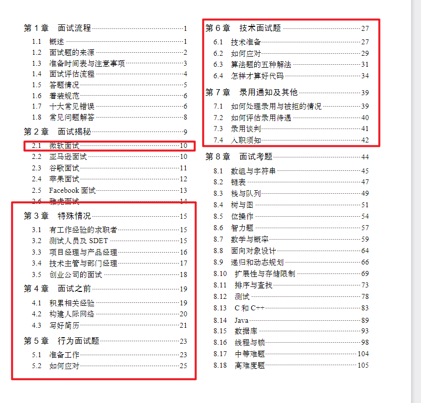


Cookie 和 Session的区别：

https://blog.csdn.net/duan1078774504/article/details/51912868


[Http中Post/Get/Put/Delete的区别](https://www.jianshu.com/p/62e56c53b1b9)、

HTTP中GET，POST和PUT的区别：https://blog.csdn.net/qq_36183935/article/details/80570062


TCP协议的可靠性保证：https://cloud.tencent.com/developer/article/1591989

什么事线程安全的？[掘进的教程](https://juejin.im/post/6844903923116048397#heading-0)

[ThreadLocal是什么](https://droidyue.com/blog/2016/03/13/learning-threadlocal-in-java/)

实际上ThreadLocal的值，是放入了当前线程的一个ThreadLocalMap实例中，所以只能在本线程中访问，其他线程无法访问。


# 1 Web & Spring

## 单点登录

是什么https://www.cnblogs.com/suim1218/p/7699041.html

单点登录（Single Sign On），简称为 SSO，是目前比较流行的企业业务整合的解决方案之一。SSO的定义是在多个应用系统中，用户只需要登录一次就可以访问所有相互信任的应用系统。

主要实现方式：

- 后台共享Session不安全，所以后台共享SSO-token，他在多个整个server中是唯一的
- 前台呢，主要去存储1个SSO-token。
- 验证过程：每当一个用户要访问网站，如果没有登录，就引导到认证系统。如果有Token，就会带着token去访问，后台在根据SSO-token去验证，验证成功后，用户就可在在新的应用系统Server上，访问服务啦。

优点和缺点：

- 优点：程序员不用考虑用户系统，开发快；用户体验好；
- 缺点：不利于重构，涉及到系统太多了；


# 2 集合 & Java基础

## 集合类

### 概览

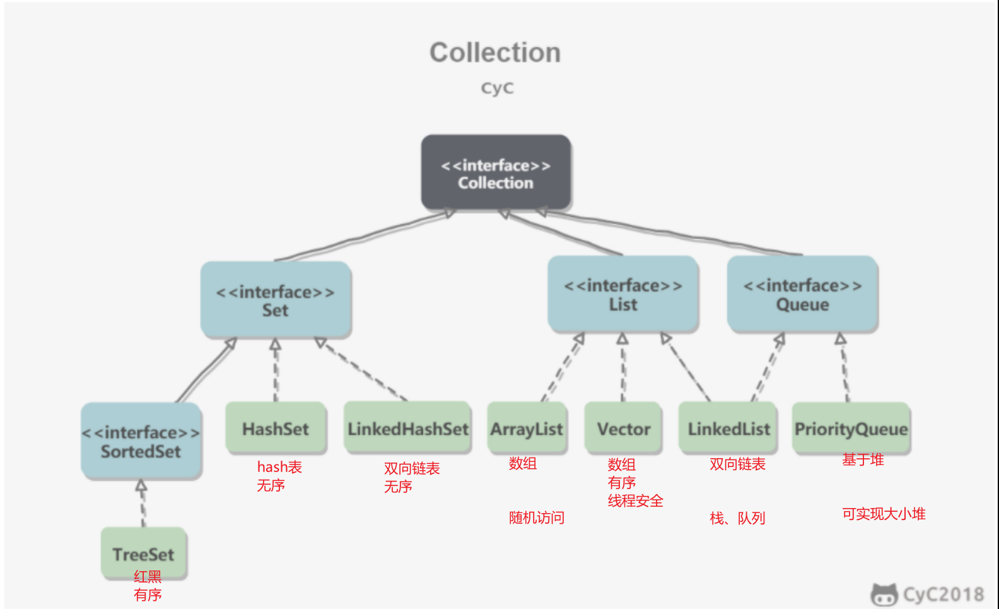


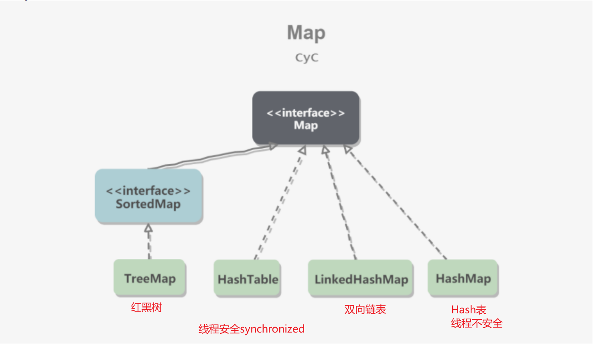


### ArrayList

总结流程：

- add()直到满了，然后copy到一个新数组
- 当数组不在变动的时候，trimToSize()压缩多余空间

[ArrayList 扩容机制分析](https://snailclimb.gitee.io/javaguide/#/docs/java/collection/ArrayList源码+扩容机制分析?id=_3-arraylist-扩容机制分析)


[Arraylist 与 LinkedList 区别?](https://snailclimb.gitee.io/javaguide/#/docs/java/collection/ArrayList源码+扩容机制分析?id=_12-arraylist-与-linkedlist-区别)

1. **是否保证线程安全：** `ArrayList` 和 `LinkedList` 都是不同步的，也就是不保证线程安全；
2. **底层数据结构：** `Arraylist` 底层使用的是 **`Object` 数组**；`LinkedList` 底层使用的是 **双向链表** 数据结构（JDK1.6 之前为循环链表，JDK1.7 取消了循环。注意双向链表和双向循环链表的区别，下面有介绍到！）
3. **插入和删除是否受元素位置的影响：** ① **`ArrayList` 采用数组存储，所以插入和删除元素的时间复杂度受元素位置的影响。** 比如：执行`add(E e)`方法的时候， `ArrayList` 会默认在将指定的元素追加到此列表的末尾，这种情况时间复杂度就是 O(1)。但是如果要在指定位置 i 插入和删除元素的话（`add(int index, E element)`）时间复杂度就为 O(n-i)。因为在进行上述操作的时候集合中第 i 和第 i 个元素之后的(n-i)个元素都要执行向后位/向前移一位的操作。 ② **`LinkedList` 采用链表存储，所以对于`add(E e)`方法的插入，删除元素时间复杂度不受元素位置的影响，近似 O(1)，如果是要在指定位置`i`插入和删除元素的话（`(add(int index, E element)`） 时间复杂度近似为`o(n))`因为需要先移动到指定位置再插入。**
4. **是否支持快速随机访问：** `LinkedList` 不支持高效的随机元素访问，而 `ArrayList` 支持。快速随机访问就是通过元素的序号快速获取元素对象(对应于`get(int index)`方法)。
5. **内存空间占用：** `ArrayList` 的空 间浪费主要体现在在 list 列表的结尾会预留一定的容量空间，而 `LinkedList` 的空间花费则体现在它的每一个元素都需要消耗比 `ArrayList` 更多的空间（因为要存放直接后继和直接前驱以及数据）。


### Map

Java为数据结构中的映射定义了一个接口`java.util.Map`，此接口主要有四个常用的实现类，分别是`HashMap`、`Hashtable`、`LinkedHashMap`和`TreeMap`，类继承关系如下图所示：

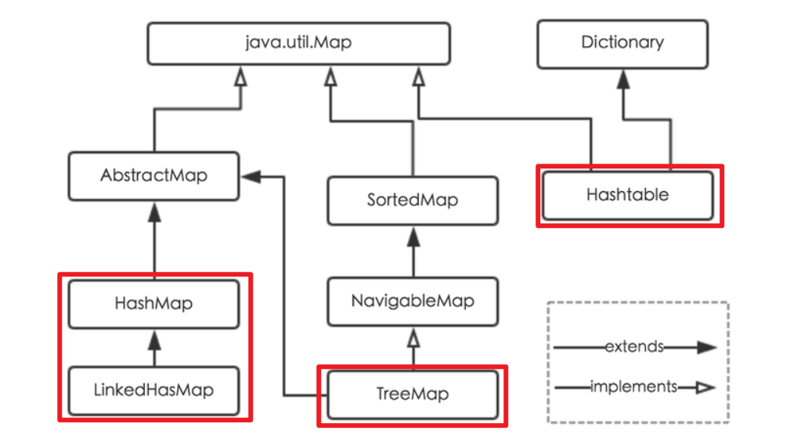

* `HashMap`：它根据键的hash code值存储数据，大多数情况下可以直接定位到它的值，因而具有很快的访问速度，但遍历顺序却是不确定的。
  *  `HashMap` 最多只允许一条记录的键为null，允许多条记录的值为null。
  *  `HashMap`非线程安全，即任一时刻可以有多个线程同时写`HashMap`，可能会导致数据的不一致。如果需要满足线程安全，可以用 `Collections`的`synchronizedMap`方法使`HashMap`具有线程安全的能力，或者使用`ConcurrentHashMap`。
* `Hashtable`：`Hashtable`是遗留类，很多映射的常用功能与`HashMap`类似，不同的是它承自Dictionary类，并且是线程安全的，任一时间只有一个线程能写`Hashtable`，并发性不如`ConcurrentHashMap`，因为`ConcurrentHashMap`引入了分段锁。`Hashtable`不建议在新代码中使用，不需要线程安全的场合可以用`HashMap`替换，需要线程安全的场合可以用`ConcurrentHashMap`替换。
* `LinkedHashMap`：`LinkedHashMap`是`HashMap`的一个子类，==保存了记录的插入顺序==，在用Iterator遍历`LinkedHashMap`时，先得到的记录肯定是先插入的，也可以在构造时带参数，按照访问次序排序。
* `TreeMap`：`TreeMap`实现`SortedMap`接口，能够把它保存的记录==根据键排序==，默认是按键值的升序排序，也可以指定排序的比较器，当用Iterator遍历`TreeMap`时，得到的记录是排过序的。如果使用排序的映射，建议使用`TreeMap`。在使用`TreeMap`时，key必须实现`Comparable`接口或者在构造`TreeMap`传入自定义的`Comparator`，否则会在运行时抛出`java.lang.ClassCastException`类型的异常。


总结：

2. 结构上：数组 table +  链表 + 红黑树，其中加红黑树是为了提高拉链太长的参训效率
3. 其他：


#### 一些二叉树

红黑树：是一种含有红黑结点并能自平衡的二叉查找树，详细讲解：https://www.jianshu.com/p/e136ec79235c


#### HashMap

HashMap源码+分析：https://snailclimb.gitee.io/javaguide/#/docs/java/collection/HashMap(JDK1.8)%E6%BA%90%E7%A0%81+%E5%BA%95%E5%B1%82%E6%95%B0%E6%8D%AE%E7%BB%93%E6%9E%84%E5%88%86%E6%9E%90

HashMap和ConcurrentMap详解：https://blog.csdn.net/weixin_44460333/article/details/86770169


总结：

重要结构：

```
static final int DEFAULT_INITIAL_CAPACITY = 1 << 4;
static final int MAXIMUM_CAPACITY = 1 << 30;

- Node<K,V> table 简称hash数组：
- LoadFactor ：loadFactor 太大导致查找元素效率低，太小导致数组的利用率低，存放的数据会很分散。loadFactor 的默认值为 0.75f 是官方给出的一个比较好的临界值。
- threshold = capacity \* loadFactor，当 Size>=threshold的时候，那么就要考虑对数组的扩增了，也就是说，这个的意思就是 衡量数组是否需要扩增的一个标准。
```

- hashcode 方法：注意key不可变,可变的key会使得HashCode的值有变化，存储时利用Key计算获取的桶的位置，和获取时根据（变化后的Key）计算的Hashcode的值不一致，从而获取不到。

- 1.7和1.8put方法对比：

  - 1.7：先遍历链表，如果不存在，再用头插法；如果存在，就直接替换。
  - 1.8：采取尾插法的方式。
  - 如果新增元素，链表>8且size>64要红黑树化，少语一定元素又退回链表；如果超过threshold要数组扩容resize()

- get方法：

- 扩容resize:

  - O(n)：进行扩容，会伴随着一次重新 hash 分配，并且会遍历 hash 表中所有的元素，是非常耗时的。在编写程序中，要尽量避免 resize。
  - 扩容和红黑树的好处：get,put的时间效率接近O（1），不会因为拉链太长，而降低时间复杂度。

- 什么时候转红黑树：当链表长度大于阈值（默认为 8）并且 HashMap 数组长度超过 64 的时候才会执行链表转红黑树的操作，否则就只是对数组扩容。

- HashMap为什么不是线程安全的？

  https://stackoverflow.com/questions/18542037/how-to-prove-that-hashmap-in-java-is-not-thread-safe

  主要是在PUT操作是，两个并发的线程可能会造成如下问题：

  - 线程A，B。A插入Table[i] = null，直接写入时，A阻塞。线程B的key.hashcode()与A一样，也写入这个Table[i]位置，会造成覆盖问题。
  - 线程A在扩容resize()时，在还没有复制不完全时，线程B来get(key)，在新数组还未完成copy时，get已存在的key，但值为null，
  - 线程AB，都插入元素。AB都要扩容时，A先完成扩容，这是B可能会因为造成循环链表


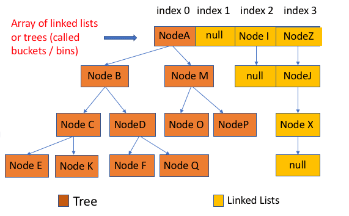


put元素的流程？

说明:上图有两个小问题：

- 直接覆盖之后应该就会 return，不会有后续操作。参考 JDK8 HashMap.java 658 行（[issue#608](https://github.com/Snailclimb/JavaGuide/issues/608)）。
- 当链表长度大于阈值（默认为 8）并且 HashMap 数组长度超过 64 的时候才会执行链表转红黑树的操作，否则就只是对数组扩容。参考 HashMap 的 `treeifyBin()` 方法（[issue#1087](https://github.com/Snailclimb/JavaGuide/issues/1087)）。


#### ==[ConcurrentHashMap](https://www.jianshu.com/p/865c813f2726)==

资源：

- ConcurrentMap JavaGuide：https://snailclimb.gitee.io/javaguide/#/docs/java/collection/ConcurrentHashMap%E6%BA%90%E7%A0%81+%E5%BA%95%E5%B1%82%E6%95%B0%E6%8D%AE%E7%BB%93%E6%9E%84%E5%88%86%E6%9E%90
- 红黑树详解：https://www.jianshu.com/p/e136ec79235c
- HashMap和ConcurrentMap详解：https://blog.csdn.net/weixin_44460333/article/details/86770169
- HashMap的扩容机制：https://blog.csdn.net/lky5387/article/details/103042972
- HashMap为什么不是线程安全的：https://blog.csdn.net/weixin_43092168/article/details/89791106


video : https://www.bilibili.com/video/BV17i4y1x71z?from=search&seid=16806543830211878358

结构：1.7 Segment 数组 + HashEntry 数组 + 链表，用 concurrencyLevel 实现的分段锁，而1.8 是 Node 数组 + 链表 / 红黑树。

如何线程安全：1.7 是分段锁每一个 Segment 上同时只有一个线程可以操作，1.8是  Synchronized + CAS + 自旋保证安全的


## 基础————数据类型

| 类型  | 字节 |
| ----- | ---- |
| int   | 4    |
| short | 2    |
| long  | 8    |
| byte  | 1    |
| char  | 2    |

int最大值大约2*10^9

INT_MAX:0X7FFFFFFF

INT_MIN:0X7FFFFFFF+1 或 0X80000000

JAVA类型范围与机器无关，这是与C++的区别。

JAVA没有无符号数类型。

JAVA中0不能转false，所以不能写while(1)这种东西。

在Java中，**只有基本类型不是对象**，例如，数值、字符和布尔类型的值都不是对象。所有的数组类型，不管是对象数组还是基本类型的数组都扩展了Object类。

### 类型转换

```java
double x = 1.2;
int y = (int) x;
```

### 字符串

Java字符串是不可变的。优点：字符串共享。缺点：更改效率低。

用equals方法检测两个字符串是否相等。因为==符号只能确定两个字符串是否放在同一个位置上。

如果要构建一个经常需要改变的字符串，应该使用StringBuilder类。StringBuffer类是线程安全的StringBuilder类。

### 大数值

`BigInteger`：任意精度的整数

`BigDecimal`：任意精度的浮点数

使用valueOf方法将普通数值转换为大数值:

```java
BigInteger a = BigInteger.valueOf(100);
```

大数值不能使用传统的运算符，而要使用add和multiply方法。


## final static

用final定义常量，习惯上将常量名全部大写。（const是关键字，但是目前并没有使用。）

用final定义的对象变量，只是表示该对象变量不会更改引用，但是这个对象本身是可以改变的。

用final定义的类，不允许被继承。

用final定义的方法，不允许被覆盖。


### static

静态域：即使没有一个instance，静态域也存在，因为它属于类，而不属于任何独立的对象。

静态方法：静态方法是一种不能向对象实施操作的方法。

静态方法不使用任何instance，换句话说，没有隐式的参数。可以认为静态方法是没有this参数的方法。

静态方法不能访问实例域，因为它不能操作对象。但是，静态方法可以访问自身类中的静态域。

不需要使用对象调用静态方法。


### 父子类Static如何继承

```java
public class Bark {
    public static void main(String[] args) {
        Father father = new Father();
        Father fs = new Son();
        Son son = new Son();
        father.stcSay(); //static father
        father.say(); //father
        fs.stcSay(); //static father
        fs.say(); //son
        son.stcSay(); //static son
        son.say(); //son
    }

}

class Father {
    public static void stcSay() {
        System.out.println("static father");
    }
    public void say() {
        System.out.println("father");
    }
}

class Son extends Father {
    public static void stcSay() {
        System.out.println("static son");
    }

    public void say() {
        System.out.println("Son");
    }
}
```

对于static修饰的变量，当子类与父类中存在相同的static变量时，是根据“静态引用”而不是根据“动态引用”来调用相应的变量的！换句话说，**static是跟着类本身走的，而不是跟着实例走的**。static修饰的内容**只看你的声明是什么，而不管你的实现是什么**。

总结：

- 子类是不继承父类的static变量和方法的。因为这是属于类本身的。但是子类是可以访问的。 
- 子类和父类中同名的static变量和方法都是相互独立的，并不存在任何的重写的关系。
- Father f = new Son；f.staticMethod，是用的父类的方法


## 面向对象

方法参数：JAVA永远使用值传递！


### 初始化块

在一个类的声明中，可以包含多个代码块。只要构造类的对象，这些块就会被执行。

无论使用哪个构造器构造对象，域都在对象初始化块中被先初始化。

首先运行初始化块，然后才运行构造器的主体部分。


### 函数重载

JAVA只有方法重载，没有操作符重载。

函数签名：函数名+参数类型。

重载一个方法，需要函数名相同，参数类型不同。与返回值无关。


### 抽象 封装 继承 多态

抽象是从众多的事物中抽取出共同的、本质性的特征，而舍弃其非本质的特征。

抽象用 abstract 关键字来修饰，用 abstract 修饰类时，此类就不能被实例化，从这里可以看出，抽象类就是为了继承而存在的。


**覆盖**

JAVA中所有的继承都是公有继承，没有C++中的私有继承和保护继承。

**子类会继承父类的private域和方法，但是不能访问。**同样，子类也不能覆盖父类的private方法。

```java
class Father{
    private say(){
        System.out.println("I'm father");
    }
    public f(){
        say();
    }
}

class Child extends Father{
    //可以定义。并无覆盖。
    private say(){
        System.out.println("I'm child"); 
    }
    public c(){
        say();
    }
}

public class Test{
    public static void main(String[] args){
        Father father = new Father();
        Child child  = new Child();
        father.f(); //I'm father
        child.f(); //I'm father 表明子类中继承了父类的say方法
        child.c(); //I'm child
    }
}
```

在覆盖一个方法的时候，子类不能低于父类的可见性。

### super 调用父类构造

使用super关键字指示编译器调用父类方法。`int a = super.getSalary();`

或者

使用super关键字表示调用父类的构造函数。

### 子类构造 默认调 父构造

如果子类的构造函数没有显式地调用父类的构造函数，则将自动地调用父类默认（没有参数）的构造函数。

如果父类没有不带参数的构造函数，并且在子类的构造函数中又没有显式地调用父类的其他构造函数，则Java编译器将报告错误。


#### 多态

父类或接口定义的引用变量可以指向子类或具体实现类的实例对象。提高了程序的拓展性。

根据何时确定执行多态方法中的哪一个，多态分为两种情况：编译时多态和运行时多态。如果在编译时能够确定执行多态方法中的哪一个，称为编译时多态，否则称为运行时多态。

* 编译时多态

  方法重载都是编译时多态。根据实际参数的数据类型、个数和次序，在编译时能够确定执行重载方法中的哪一个。

* 运行时多态

  方法覆盖表现出两种多态性，当对象引用本类实例时，为编译时多态，否则为运行时多态。


父类型可以引用子类型，子类型不可以引用父类型。换句话说，不支持类的向下转型。

```java
Son son = new Parent(); //不合法
```

一个instance可以调用哪些方法，是由其声明类型决定的。而其调用的是哪个class的方法，是由其实际类型决定的。`Father f = new Son();`即使f实际是`Son`类的实例，但是只能在其上调用`Father`类定义的方法。但是调用某个方法之后，如果该方法被`Son`类覆盖过，那么实际调用的就是`Son`类的该方法。


总结：

1. 封装：隐藏对象的属性和实现细节，仅对外提供公共访问方式，将变化隔离，便于使用，提高复用性和安全性。
2. 继承：提高代码复用性；继承是多态的前提。


## Object类

### Objects类

**Object** 是 Java 中所有类的基类，位于`java.lang`包。

**Objects** 是 Object 的工具类，位于`java.util`包。它从jdk1.7开始才出现，被final修饰不能被继承，拥有私有的构造函数。它由一些静态的实用方法组成，这些方法是空指针安全的，用于计算对象的hash code、返回对象的字符串表示形式、比较两个对象。

### equals方法

- 默认的equals方法只检测两个对象的地址是否相等。
- 需要自行覆盖，请看

```java
public class Employee{    
    @Override // 为显式参数是Employee，并没有覆盖Object类的equals方法
    public boolean equals(Object other){
        if(getClass() != otherObject.getClass()) return false;
        // other
    }
}
```


### hashCode方法

散列码（hash code）是由对象导出的一个整型值。

**如果要将用户自定义类作为散列表的key值，必须重新定义`equals`方法和`hashCode`方法。**

组合多个散列值时，可以调用`Objects.hash`并提供多个参数。这个方法会对各个参数调用`Objects.hashCode`，并组合这些散列值：

```
public class Employee{
    public int hashCode(){
        return Objects.hash(name， salary， hireDay);
    }
}
```

`Equals`与`hashCode`的定义必须一致：

- 如果`x.equals(y)`返回true，那么`x.hashCode()`就必须与`y.hashCode()`具有相同的值。
- 如果存在数组类型的域，那么可以使用静态的`Arrays.hashCode`方法计算散列码。

### toString方法

只要对象与一个字符串通过操作符“+”连接起来，Java编译就会自动地调用`toString`方法，以便获得这个对象的字符串描述。

`println`方法会调用`toString()`，并打印输出得到的字符串。

`Object`类默认的`toString`方法，会打印**对象所属的类名**和**散列码**。

强烈建议为自定义的每一个类增加`toString`方法。这样做不仅自己受益，而且所有使用这个类的程序员也会从这个日志记录支持中受益匪浅。


### == 和equals区别

**基本数据类型：==比较的是值**

**引用数据类型：==比较的是内存地址**


hashCode() 和 equals()

Object 的 hashcode 方法是本地方法，也就是用 c 语言或 c++ 实现的，该方法通常用来将**对象的 内存地址 转换为整数之后返回.**

```
public native int hashCode();
```

引用类型中，equals()相等 和 hashCode()相等情况比较：

1. equas()等，是真的等
2. hashCode相等：不一定是真的相等，毕竟是hash过来的。不过的值，可能有同一个Hash


## [8种基本类型的包装类和常量池](https://snailclimb.gitee.io/javaguide/#/docs/java/basis/Java基础知识?id=_133-8-种基本类型的包装类和常量池)

 **Byte,Short,Integer,Long,Character,Boolean；前面 4 种包装类默认创建了数值[-128，127] 的相应类型的缓存数据，Character 创建了数值在[0,127]范围的缓存数据，Boolean 直接返回 True Or False**

> 注意 基本类型中的真new 和 假 new问题

1. Integer i1=40；Java 在编译的时候会直接将代码封装成 Integer i1=Integer.valueOf(40);，从而使用常量池中的对象。**假new**

> Integer i1 = 40;

>  Integer i5 = new Integer(40);

>  Integer i6 = new Integer(0);

> System.out.println("i4=i5+i6   " + (i4 == i5 + i6));

1. Integer i1 = new Integer(40);这种情况下会创建新的对象。**真new**


### 重载 重写

（override）重写就是当子类继承自父类的相同方法，输入数据一样，但要做出有别于父类的响应时，你就要覆盖父类方法

（overload）重载就是同样的一个方法能够根据输入数据的不同，做出不同的处理


### 深浅拷贝

1. **浅拷贝**：对基本数据类型进行值传递，对引用数据类型进行引用传递般的拷贝，此为浅拷贝。
2. **深拷贝**：对基本数据类型进行值传递，对引用数据类型，创建一个新的对象，并复制其内容，此为深拷贝。


### 多态

顾名思义，表示一个对象具有多种的状态。具体表现为父类的引用指向子类的实例。**多态的特点:**

- 对象类型和引用类型之间具有继承（类）/实现（接口）的关系；
- 引用类型变量发出的方法调用的到底是哪个类中的方法，必须在程序运行期间才能确定；
- 多态不能调用“只在子类存在但在父类不存在”的方法；
- 如果子类重写了父类的方法，真正执行的是子类覆盖的方法，如果子类没有覆盖父类的方法，执行的是父类的方法。


## [注解狂神](https://www.bilibili.com/video/BV1p4411P7V3?p=17)

建议读码：***


## 反射和反射使用的场景

教程：[反射狂神](https://www.bilibili.com/video/BV1p4411P7V3?p=17)


反射类型：

- 静态编译：在编译时确定类型，绑定对象
- 动态编译：运行时确定类型，绑定对象。比如反射机制


常用场景：

[Reflection：Java反射机制的应用场景](https://segmentfault.com/a/1190000010162647)

A. 在JDBC 的操作中，如果要想进行数据库的连接，Class.forName()加载数据库的驱动。

B. Spring 通过 XML 配置模式装载 Bean 的过程：


反射应用场景详细：

A. 在JDBC 的操作中，如果要想进行数据库的连接，则必须按照以上的几步完成

1. 通过Class.forName()加载数据库的驱动程序 （通过反射加载，前提是引入相关了Jar包）

B. Spring 通过 XML 配置模式装载 Bean 的过程：

1. 将程序内所有 XML 或 Properties 配置文件加载入内存中
2. Java类里面解析xml或properties里面的内容，得到对应实体类的字节码字符串以及相关的属性信息
3. 使用反射机制，根据这个字符串获得某个类的Class实例
4. 动态配置实例的属性

Spring这样做的好处是：

- 不用每一次都要在代码里面去new或者做其他的事情
- 以后要改的话直接改配置文件，代码维护起来就很方便了
- 有时为了适应某些需求，Java类里面不一定能直接调用另外的方法，可以通过反射机制来实现


### 获取Class对象的方式

- 通过对象获得
- 通过Class.forname()
- 通过类名.class获得

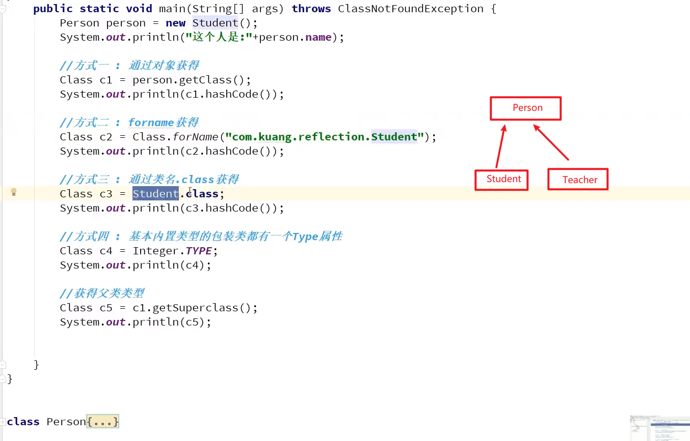


### 有Class的类型


### 类的加载与ClassLoader的理解

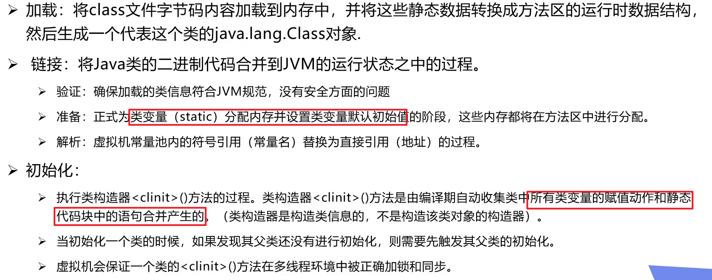


用类加载过程来说明：


代码案例：

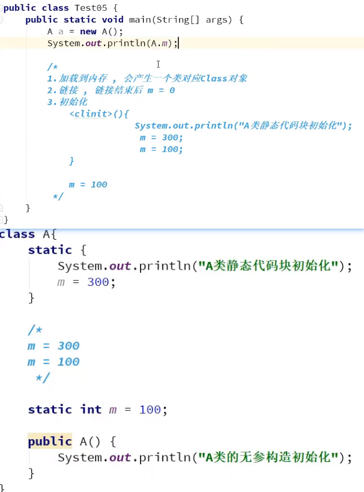


### 什么时候发生类的初始化


```java
package com.reflection;

public class ClassLoaderTime {
    public static void main(String[] args) {
        // 1 主动引用的情况
        // Son a = new Son();

        // 反射也会主动引用，先加载父类，在加载之类
        // Class aClass = Class.forName("com.reflection.ClassLoaderTime");


        // 2 不会产生类的引用
        // 访问父类的 静态域
        // System.out.println(Son.b);

        // 数组定义的类，不会引发类的引用
        // Son[] son = new Son[5];

        // 常量不会引起 类的引用
        // System.out.println(Son.FINAL_N);

    }
}

class Father{
    static int b = 2;
    static {
        System.out.println("父类被加载！");
    }
}

class Son extends Father{
    static {
        System.out.println("子类被加载   ---  链接阶段执行的");
        m = 300;
    }

    static int m = 100;
    static final int FINAL_N = 999;

    public Son(){
        System.out.println("A类 无参构造 初始化");
    }
}

```


### 反射获取内容


### 反射创建调用对象

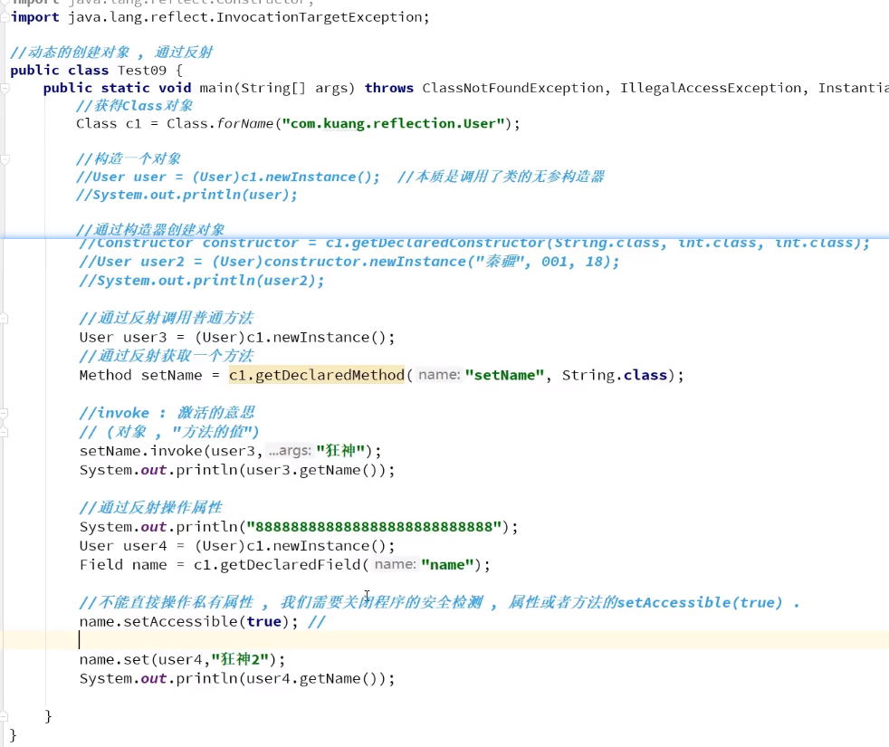


### 反射调用的效率

反射调用：比较慢

反射调用：关闭权限检查  `getName.setAccessible(true);`  会好很多。

```java
package com.reflection;

import org.springframework.context.support.ClassPathXmlApplicationContext;

import java.lang.reflect.InvocationTargetException;
import java.lang.reflect.Method;

public class ReflectionTime {

    public static void test01(){
        User user = new User();
        long startTime = System.currentTimeMillis();
        for (int i = 0; i < 10000000; i++) {
            user.getName();
        }
        long endTime = System.currentTimeMillis();

        System.out.println("普通 ：" + (endTime - startTime) + "ms");
    }

    // 反射
    public static void test02() throws InvocationTargetException, IllegalAccessException, NoSuchMethodException {
        User user = new User();
        Class c1 = user.getClass();

        Method getName = c1.getDeclaredMethod("getName", null);

        long startTime = System.currentTimeMillis();
        for (int i = 0; i < 10000000; i++) {
            getName.invoke(user, null);
        }
        long endTime = System.currentTimeMillis();

        System.out.println("反射 ：" + (endTime - startTime) + "ms");
    }

    // 反射 不检查权限
    public static void test03() throws InvocationTargetException, IllegalAccessException, NoSuchMethodException {
        User user = new User();
        Class c1 = user.getClass();

        Method getName = c1.getDeclaredMethod("getName", null);
        getName.setAccessible(true);        // 关不权限监测，就是getName如果是private，也是可以调用的
        long startTime = System.currentTimeMillis();
        for (int i = 0; i < 10000000; i++) {
            getName.invoke(user, null);
        }
        long endTime = System.currentTimeMillis();

        System.out.println("反射（不检查权限） ：" + (endTime - startTime) + "ms");
    }

    public static void main(String[] args) throws IllegalAccessException, NoSuchMethodException, InvocationTargetException {
        test01();
        test02();
        test03();
    }
}

// 普通 ：7ms
// 反射 ：133ms
// 反射（不检查权限） ：42ms
```


### 反射操作泛型


```java
package com.reflection;

import java.lang.reflect.Method;
import java.lang.reflect.ParameterizedType;
import java.lang.reflect.Type;
import java.util.List;
import java.util.Map;

// 通过反射 获取泛型
public class GetTypeByReflection {

    public void test01(Map<String, User> map, List<User> list){
        System.out.println("test01");
    }

    public Map<String, User> test02(){
        System.out.println("test02");
        return null;
    }

    public static void main(String[] args) throws NoSuchMethodException {
        Method method = GetTypeByReflection.class.getMethod("test01", Map.class, List.class);

        // 获取泛型参数化类型
        Type[] genericParameterTypes = method.getGenericParameterTypes();
        for (Type genericParameterType : genericParameterTypes) {
            System.out.println("# genericParameterType: " + genericParameterType);

            // 对每一个参数，如果是参数化类型，就获取真实的类型
            if(genericParameterType instanceof ParameterizedType){
                Type[] actualTypeArguments = ((ParameterizedType) genericParameterType).getActualTypeArguments();
                for (Type actualTypeArgument : actualTypeArguments) {
                    System.out.println("# actualTypeArgument: " +actualTypeArgument);
                }
            }
        }

        System.out.println("  ===============================  ");

        method = GetTypeByReflection.class.getMethod("test02", null);
        Type genericReturnType = method.getGenericReturnType();
        if(genericReturnType instanceof ParameterizedType){
            Type[] actualTypeArguments = ((ParameterizedType) genericReturnType).getActualTypeArguments();
            for (Type actualTypeArgument : actualTypeArguments) {
                System.out.println("# actualTypeArgument: " +actualTypeArgument);
            }
        }
    }

}

// # genericParameterType: java.util.Map<java.lang.String, com.reflection.User>
// # actualTypeArgument: class java.lang.String
// # actualTypeArgument: class com.reflection.User
// # genericParameterType: java.util.List<com.reflection.User>
// # actualTypeArgument: class com.reflection.User
// ===============================
// # actualTypeArgument: class java.lang.String
// # actualTypeArgument: class com.reflection.User
```


## ==JAVA NIO==（Non-block IO）

参考代码：


## BIO和NIO说明

高能预警，本文是我一个月前就开始写的，所以内容会非常长，当然也非常硬核，dubbo源码系列结束之后我就想着写一下netty系列的，但是netty的源码概念又非常多，所以才写到了现在。

我相信90%的读者都不会一口气看完的，因为实在太长了，长到我现在顶配的mbp打字编辑框都是卡的，但是我希望大家日后想看netty或者在面试前需要了解的朋友回头翻一下就够了，那我写这个文章的意义也就有了。

也不多BB，直接开整。


BIO：阻塞IO

NIO：非阻塞IO，client注册channel，channel注册到选择器，服务端的线程，通过selector来处理多个IO请求，而不必自己像阻塞IO一样阻塞、或者轮训去管理多个IO 请求，IO复用的方式提高了利用率。


## ==NIO 基本概念===

参考：

Todo 敖丙肝了一个月的Netty知识点：https://mp.weixin.qq.com/s/I9PGsWo7-ykGf2diKklGtA


 NIO听课：尚硅谷的NIO教程dddd

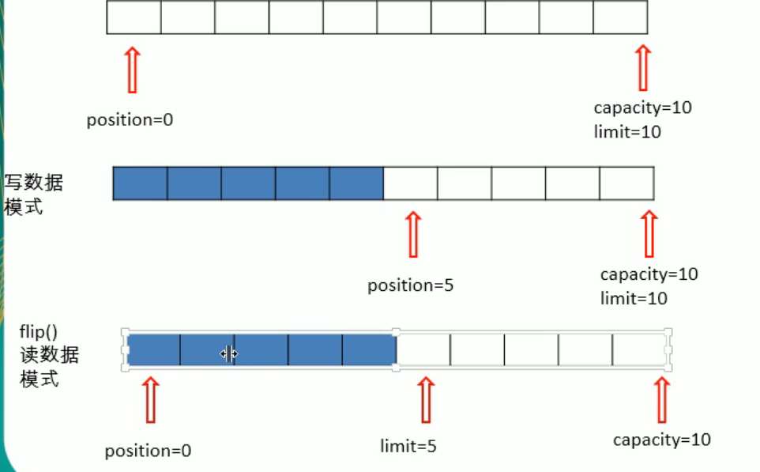


## 其他Trick

### 内联方法

在C++中，通常在类的外面定义方法，如果在类的内部定义方法，这个方法将自动地成为内联（inline）方法。在Java中，所有的方法都必须在类的内部定义，但并不表示它们是内联方法。是否将某个方法设置为内联方法是Java虚拟机的任务。

### 标准or文件 的标准输入输出

```java
Scanner in = new Scanner(System.in);
String s = in.nextLine(); //读取一行
String name = in.next(); //读取一个单词（以空白符作为分隔符）
int i = in.nextInt(); //读取一个整形
```

```java
System.out.printf("%8.2f"，x); //宽度为8，保留小数点后两位
System.out.printf("Hello， %s， next year you will be %d"， name， age); //可以使用多个参数
```


```
//文件输入输出
Scanner in = new Scanner(Path.get("c:\\myfile.txt")，"UTF-8");
PrintWriter out = new PrintWriter("outfile.txt"，"UTF-8");
```


### **终端命令**

```shell
javac Helloworld.java
java Helloworld
```

javac是编译指令，文件名要带上.java后缀。将源码文件编译为字节码（.class文件）。

java是运行指令，**不要**带.class后缀，因为java命令指定是类名。将字节码文件交给jvm开始运行。

如果键入`java Helloworld`，而虚拟机没有找到Helloworld类，就应该检查一下是否有人设置了系统的CLASSPATH环境变量（不推荐）。


# 3 Java 并发 & 锁 

## [Java 并发进阶常见面试题总结](https://snailclimb.gitee.io/javaguide/#/docs/java/multi-thread/2020最新Java并发进阶常见面试题总结?id=java-并发进阶常见面试题总结)

### [JMM(Java 内存模型)](https://snailclimb.gitee.io/javaguide/#/docs/java/multi-thread/2020最新Java并发进阶常见面试题总结?id=_22-讲一下-jmmjava-内存模型)

#### volatile关键字

volatile 关键字主要作用： 

1. 除了防止 JVM 的指令重排 
2. 还有一个重要的作用就是保证变量的可见性。


sun： 

为了获得最佳速度，允许线程保存共享成员变量的私有拷贝，而且只当线程进入或者离开同步代码块时才与共享成员变量的原始值对比。这样当多个线程同时与某个对象交互时，就必须要注意到要让线程及时的得到共享成员变量的变化。
而volatile关键字就是提示VM：对于这个成员变量不能保存它的私有拷贝，而应直接与共享成员变量交互


### [并发编程的三个重要特性](https://snailclimb.gitee.io/javaguide/#/docs/java/multi-thread/2020最新Java并发进阶常见面试题总结?id=_23-并发编程的三个重要特性)

并发变成重要特性：

1. **原子性** : 一个的操作或者多次操作，要么所有的操作全部都得到执行并且不会收到任何因素的干扰而中断，要么所有的操作都执行，要么都不执行。synchronized 可以保证代码片段的原子性。
2. **可见性** ：当一个变量对共享变量进行了修改，那么另外的线程都是立即可以看到修改后的最新值。volatile 关键字可以保证共享变量的可见性。
3. **有序性** ：代码在执行的过程中的先后顺序，Java 在编译器以及运行期间的优化，代码的执行顺序未必就是编写代码时候的顺序。volatile 关键字可以禁止指令进行重排序优化。

### [说说 sleep() 方法和 wait() 方法区别和共同点](https://snailclimb.gitee.io/javaguide/#/docs/java/multi-thread/2020最新Java并发基础常见面试题总结?id=_9-说说-sleep-方法和-wait-方法区别和共同点)

- 两者最主要的区别在于：**sleep() 方法没有释放锁，而 wait() 方法释放了锁** 。
- 两者都可以暂停线程的执行。
- wait() 通常被用于线程间交互/通信，sleep() 通常被用于暂停执行。
- wait() 方法被调用后，线程不会自动苏醒，需要别的线程调用同一个对象上的 notify() 或者 notifyAll() 方法。sleep() 方法执行完成后，线程会自动苏醒。或者可以使用 wait(long timeout) 超时后线程会自动苏醒。


### Syschronized

#### [synchronized 同步语句块、方法的区别](https://snailclimb.gitee.io/javaguide/#/docs/java/multi-thread/2020最新Java并发进阶常见面试题总结?id=_131-synchronized-同步语句块的情况)

阅读：[Java6及以上版本对synchronized的优化 - 吴庆龙的技术轮子 - 博客园](https://www.cnblogs.com/wuqinglong/p/9945618.html)

JVM基于进入和退出Monitor对象来实现方法同步和代码块同步, 但是两者的实现细节不一样.

1. 代码块同步: 通过使用monitorenter和monitorexit指令实现的.
2. 同步方法: ACC_SYNCHRONIZED修饰

具体点：

- **synchronized** **同步语句块：实现使用的是** **monitorenter** **和** **monitorexit** **指令，其中** **monitorenter** **指令指向同步代码块的开始位置，****monitorexit** **指令则指明同步代码块的结束位置。当执行** **monitorenter** **指令时，线程试图获取锁也就是获取 对象监视器** **monitor** **的持有权。并且在 Java 虚拟机(HotSpot)中，Monitor 是基于 C++实现的，由****[ObjectMonitor](https://github.com/openjdk-mirror/jdk7u-hotspot/blob/50bdefc3afe944ca74c3093e7448d6b889cd20d1/src/share/vm/runtime/objectMonitor.cpp)****实现的。每个对象中都内置了一个** **ObjectMonitor****对象。**
- synchronized 修饰的方法：并没有 monitorenter 指令和 monitorexit 指令，取得代之的确实是 ACC_SYNCHRONIZED 标识，该标识指明了该方法是一个同步方法。
- **不过两者的本质都是对对象监视器 monitor 的获取。**


### ThreadLocal ThreadLocalMap

参看：[3.3. ThreadLocal 原理](https://snailclimb.gitee.io/javaguide/#/docs/java/multi-thread/2020最新Java并发进阶常见面试题总结?id=_33-threadlocal-原理)

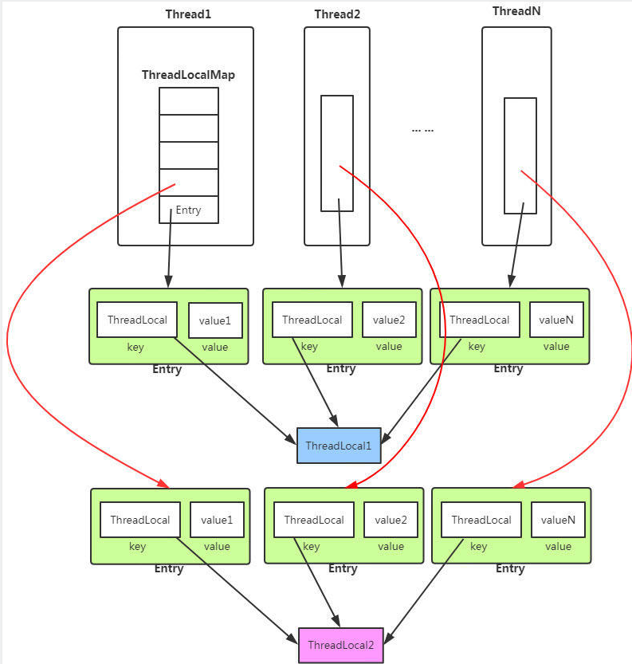


#### [ThreadLocal 内存泄露问题](https://snailclimb.gitee.io/javaguide/#/docs/java/multi-thread/2020最新Java并发进阶常见面试题总结?id=_34-threadlocal-内存泄露问题)

ThreadLocalMap 中使用的 key 为 ThreadLocal 的弱引用,而 value 是强引用。所以，如果 ThreadLocal 没有被外部强引用的情况下，在垃圾回收的时候，key 会被清理掉，而 value 不会被清理掉。这样一来，ThreadLocalMap 中就会出现 key 为 null 的 Entry。假如我们不做任何措施的话，value 永远无法被 GC 回收，这个时候就可能会产生内存泄露。ThreadLocalMap 实现中已经考虑了这种情况，在调用 set()、get()、remove() 方法的时候，会清理掉 key 为 null 的记录。使用完 ThreadLocal方法后 最好手动调用remove()方法


Sun:

ThreadLocal.set()、get()一般和remove(）一起使用


### Callable 和 Future接口的区别

[实现 Runnable 接口和 Callable 接口的区别](https://snailclimb.gitee.io/javaguide/#/docs/java/multi-thread/2020最新Java并发进阶常见面试题总结?id=_42-实现-runnable-接口和-callable-接口的区别)

Runnable自 Java 1.0 以来一直存在，但Callable仅在 Java 1.5 中引入,目的就是为了来处理Runnable不支持的用例。**Runnable 接口**不会返回结果或抛出检查异常，但是**Callable 接口**可以。所以，如果任务不需要返回结果或抛出异常推荐使用 \******Runnable** **接口**，这样代码看起来会更加简洁

1. Callable规定的方法是call()，而Runnable规定的方法是run()。
2. Callable的任务执行后可返回值，而Runnable的任务是不能返回值的。
3. call()方法可抛出异常，而run()方法是不能抛出异常的。
4. 运行Callable任务可拿到一个Future对象， Future表示异步计算的结果。
5. 它提供了检查计算是否完成的方法，以等待计算的完成，并检索计算的结果。
6. 通过Future对象可了解任务执行情况，可取消任务的执行，还可获取任务执行的结果。
7. Callable是类似于Runnable的接口，实现Callable接口的类和实现Runnable的类都是可被其它线程执行的任务。

FutureTask包装器是一种非常便利的机制，可将Callable转换成Future和Runnable，它同时实现二者的接口。

```java
Callable<Integer> myComputation = ...;
FutureTask<Integer> task = new FutureTask<Integer>(myComputation);
Thread t = new Thread(task); //task既是Runnable
t.start();
Integer result = task.get(); //task也是Future
```


### 原子类，CAS，ABA问题

建议读：[JUC 中的 Atomic 原子类总结 - 不懒人 - 博客园](https://www.cnblogs.com/wuwuyong/p/12173954.html)

CAS + ABA：CAS 比较与交换，在原子类中使用较多。ABA 是 ：A线程获取oldValue, B线程获取到oldValue，但改成newValue后，又改回oldValue。A线程是察觉不到这个问题的，compareAndSet(expect, newValue）就还是成功的。

如何解决ABA问题：

- AtomicStampedReference
- AtomicMarkedReference


### [AQS（AbstractQueuedSynchronizer） 介绍](https://snailclimb.gitee.io/javaguide/#/docs/java/multi-thread/2020最新Java并发进阶常见面试题总结?id=_61-aqs-介绍)

JavaGuide AQS详细讲解：[1 AQS 简单介绍](https://snailclimb.gitee.io/javaguide/#/docs/java/multi-thread/AQS原理以及AQS同步组件总结?id=_1-aqs-简单介绍)

[Java并发之AQS详解 - waterystone - 博客园](http://www.cnblogs.com/waterystone/p/4920797.html)

[Java并发包基石-AQS详解 - dreamcatcher-cx - 博客园](https://www.cnblogs.com/chengxiao/archive/2017/07/24/7141160.html)


AQS 是一个用来构建锁和同步器的框架，使用 AQS 能简单且高效地构造出应用广泛的大量的同步器，比如我们提到的 ReentrantLock，Semaphore，其他的诸如 ReentrantReadWriteLock，SynchronousQueue，FutureTask 等等皆是基于 AQS 的。当然，我们自己也能利用 AQS 非常轻松容易地构造出符合我们自己需求的同步器。


使用原子类的好处：

1. 本身就是原子的加，原子的减法。就不必再单独对一个操作进行加锁了


CyclicBarrier 用法

当调用 CyclicBarrier 对象调用 await() 方法时，实际上调用的是dowait(false, 0L)方法。 await() 方法就像树立起一个栅栏的行为一样，将线程挡住了，当拦住的线程数量达到 parties 的值时，栅栏才会打开，线程才得以通过执行。


CyclicBarrier 和 CountDownLatch 的区别：

[多线程CountDownLatch和CyclicBarrier的区别 以及举例_paul342的专栏-CSDN博客](https://blog.csdn.net/paul342/article/details/49661991)

- CountDownLatch : **一个线程**(或者多个)， 等待另外**N个线程**完成**某个事情**之后才能执行
- CyclicBarrier    : **N个线程**相互等待，任何一个线程完成之前，所有的线程都必须等待，**然后都可以做其他事情了。强调某时刻同步一个状态**


#### AbastractQueuedSynchronizer(AQS)

AQS总结：AQS就是基于CLH队列，用volatile修饰共享变量state，线程通过CAS去改变状态符，成功则获取锁成功，失败则进入等待队列，等待被唤醒。


[Java并发之AQS详解](https://www.cnblogs.com/waterystone/p/4920797.html)：https://blog.csdn.net/mulinsen77/article/details/84583716

可重入锁(递归锁)+LockSupport+AQS源码分析：https://blog.csdn.net/TZ845195485/article/details/109210263


### Trick

- **调用 start() 方法方可启动线程并使线程进入就绪状态，直接执行 run() 方法的话不会以多线程的方式执行**
- **修饰代码块** ：指定加锁对象，对给定对象/类加锁。synchronized(this|object) 表示进入同步代码库前要获得**给定对象的锁**。synchronized(类.class) 表示进入同步代码前要获得 **当前 class 的锁**


**String,StringBuffer,stringBuilder的区别**

- string是常量，StringBuffer是线程安全的，StringBuilder是线程不安全的
- 单线程：可以用StringBuilder进行字符串操作，效率高
- 多线程：一定要用StringBuffer，这个线程安全。


#### 什么是 final 溢出

final逸出

　　写 final 域的重排序规则可以确保：在引用变量为任意线程可见 之前，该引用变量指向的对象的 final 域已经在构造函数中被正确初始化过了。其 实要得到这个效果，还需要一个保证：在构造函数内部，不能让这个被构造对象的 引用为其他线程可见，也就是对象引用不能在构造函数中“逸出”。我们来看下面示例代码：　　

```
public class FinalReferenceEscapeExample { 
    final int i;
    static FinalReferenceEscapeExample obj;

    public FinalReferenceEscapeExample () {
        i = 1;         //1 写 final 域
        obj = this;    //2 this 引用在此“逸出”
    }

    public static void writer() {
        new FinalReferenceEscapeExample ();
    }

    public static void reader {
        if (obj != null) {    //3 犹豫线程B，执行到这，可能会因为1,2的指令重排层2,1，提前读obj, obj.i不就没有初始化吗
        int temp = obj.i;    //4
        }
    }
}
```

　　说明：假设一个线程 A 执行 writer()方法，另一个线程 B 执行 reader()方法。这里的操作 2 使得对象还未完成构造前就为线程 B 可见。即使这里的操作 2 是构造函数的最后一步，且即使在程序中操作 2 排在操作 1 后面，执行 read()方法的线程仍然可能无 法看到 final 域被初始化后的值，因为这里的操作 1 和操作 2 之间可能被重排序。实际的执行时序可能如下图所示：


　　说明：在构造函数返回前，被构造对象的引用不能为其他线程可见，因为此时的 final 域可能还没有被初始化。在构造函数返回后，任意线程都将保证能看到 final 域正确初始化之后的值。


#### syschoronized 实例锁 和 对象锁

为什么 syschoronized 实例可以访问实例的锁，实例还可以访问对象锁。

**因为访问静态** **synchronized** **方法占用的锁是当前类的锁，而访问非静态** **synchronized** **方法占用的锁是当前实例对象锁**。(https://blog.csdn.net/lkforce/article/details/81128115?utm_source=copy)

#### Synchronized 最主要的三种使用方式

-  修饰实例⽅法: 作⽤于当前对象实例加锁，进⼊同步代码前要获得当前对象实例的锁 
-  修饰静态⽅法: 也就是给当前类加锁，会作⽤于类的所有对象实例，因为静态成员不属于任何⼀ 个实例对象，是类成员（ static 表明这是该类的⼀个静态资源，不管new了多少个对象，只有 ⼀份）。
   - **所以如果⼀个线程A调⽤⼀个实例对象的⾮静态 synchronized ⽅法，**
   - **⽽线程B需要调⽤ 这个实例对象所属类的静态 synchronized ⽅法，是允许的，不会发⽣互斥现象**
   - **因为访问静态 synchronized ⽅法占⽤的锁是当前类的锁，⽽访问⾮静态 synchronized ⽅法占⽤的锁是当前 实例对象锁。** 
-  修饰代码块: 指定加锁对象，对给定对象加锁，进⼊同步代码库前要获得给定对象的锁。 总结： synchronized 关键字加到 static 静态⽅法和 synchronized(class)代码块上都是是给 Class 类上锁。synchronized 关键字加到实例⽅法上是给对象实例上锁。尽量不要使⽤ synchronized(String a) 因为JVM中，字符串常量池具有缓存功能！


## 进程 VS 线程的状态改变

进程管理：[进程状态的切换](http://www.cyc2018.xyz/计算机基础/操作系统基础/计算机操作系统 - 进程管理.html#进程状态的切换)

线程的5种状态详解：https://blog.csdn.net/xingjing1226/article/details/81977129

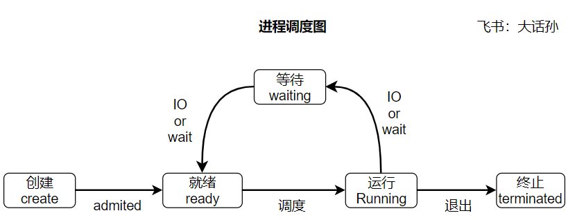


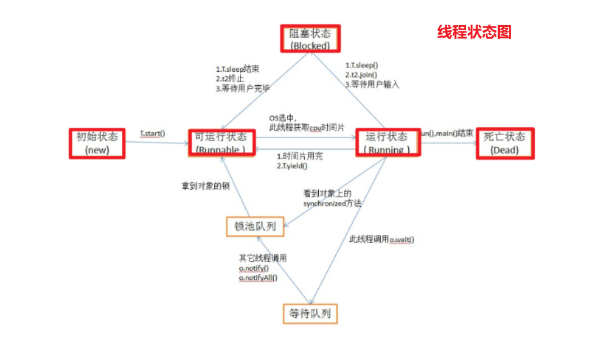

**线程相关状态图**

1. **新建(NEW)**：新创建了一个线程对象。

2. **可运行(RUNNABLE)**：线程对象创建后，其他线程(比如main线程）调用了该对象的start()方法。该状态的线程位于可运行线程池中，等待被线程调度选中，获取cpu 的使用权 。

3. **运行(RUNNING)**：可运行状态(runnable)的线程获得了cpu 时间片（timeslice） ，执行程序代码。

4. **阻塞(BLOCKED)**：阻塞状态是指线程因为某种原因放弃了cpu 使用权，也即让出了cpu timeslice，暂时停止运行。直到线程进入可运行(runnable)状态，才有机会再次获得cpu timeslice 转到运行(running)状态。阻塞的情况分三种： 

> (一). 等待阻塞：运行(running)的线程执行o.wait()方法，JVM会把该线程放入等待队列(waitting queue)中。
> (二). 同步阻塞：运行(running)的线程在获取对象的同步锁时，若该同步锁被别的线程占用，则JVM会把该线程放入锁池(lock pool)中。
> (三). 其他阻塞：运行(running)的线程执行Thread.sleep(long ms)或t.join()方法，或者发出了I/O请求时，JVM会把该线程置为阻塞状态。当sleep()状态超时、join()等待线程终止或者超时、或者I/O处理完毕时，线程重新转入可运行(runnable)状态。

5. **死亡(DEAD)**：线程run()、main() 方法执行结束，或者因异常退出了run()方法，则该线程结束生命周期。死亡的线程不可再次复生。


==线程之挂起、睡眠、阻塞、等待==

调用 Thread.sleep() 方法使线程进入限期等待状态时，常常用“使一个线程睡眠”进行描述。

调用 Object.wait() 方法使线程进入限期等待或者无限期等待时，常常用“**挂起**一个线程”进行描述。

睡眠和挂起是用来描述行为，而阻塞和等待用来描述状态。


## 线程安全是什么

推荐看：https://juejin.im/post/6844903923116048397#heading-0

是什么：不同的线程可以访问相同的资源，而不会暴露出错误的行为或产生不可预知的结果。

- 无状态。线程本地没有需要同步的内容

- 不可变实现。线程本地变量，是不可变的，String.

- 线程本地变量。用ThreadLocal<StateHolder>实现的每个线程，有独立的本地变量

- 同步集合，**同1时间内，只有被1个线程访问。**

- **并发集合。同步块，具体方式不清楚**

- 原子对象。Java有原子类，用原子类（AtomicInteger/AtomicLong）等可以线程安全，如addAndGet(int delta)

- synchronized 同步方法(function)，用synchronized 标记方法。

- ```
  public synchronized void incrementCounter() {
  ```

  synchronized 同步语句，用synchornozied标记语句。

- Volatile变量，确保给定线程可见的所有变量也将从主存中读取。虽然用一些办法同步了，但你千万别从CPU缓存读，而不从内存中读，那就尴尬。**完全 volatile 可见性保证？？？**

- 外部锁定，解决了内部锁定可能被DOS的问题

- Reentrantlock 锁机制，**考虑了线程等待时间的锁**

- 读写锁，**考虑了只要没有人写，可以多个读**。


## 线程池

### [为什么要用线程池？](https://snailclimb.gitee.io/javaguide/#/docs/java/multi-thread/2020最新Java并发进阶常见面试题总结?id=_41-为什么要用线程池？)

- **降低资源消耗**。通过重复利用已创建的线程降低线程创建和销毁造成的消耗。
- **提高响应速度**。当任务到达时，任务可以不需要的等到线程创建就能立即执行。
- **提高线程的可管理性**。线程是稀缺资源，如果无限制的创建，不仅会消耗系统资源，还会降低系统的稳定性，使用线程池可以进行统一的分配，调优和监控。


**ThreadPoolExecutor** 饱和策略定义：【代码+示例}】：https://www.jianshu.com/p/9fec2424de54

AbortPolicy

ThreadPoolExecutor中默认的拒绝策略就是AbortPolicy。直接抛出异常。

```java
private static final RejectedExecutionHandler defaultHandler =
    new AbortPolicy();
```

下面是他的实现：

```java
public static class AbortPolicy implements RejectedExecutionHandler {
    public AbortPolicy() { }
    public void rejectedExecution(Runnable r, ThreadPoolExecutor e) {
        throw new RejectedExecutionException("Task " + r.toString() +
                                             " rejected from " +
                                             e.toString());
    }
}
```

很简单粗暴，直接抛出个RejectedExecutionException异常，也不执行这个任务了。

测试

先自定义一个Runnable,给每个线程起个名字，下面都用这个Runnable

```java
static class MyThread implements Runnable {
        String name;
        public MyThread(String name) {
            this.name = name;
        }
        @Override
        public void run() {
            try {
                Thread.sleep(2000);
            } catch (InterruptedException e) {
                e.printStackTrace();
            }
            System.out.println("线程:"+Thread.currentThread().getName() +" 执行:"+name +"  run");
        }
    }
```

然后构造一个核心线程是1，最大线程数是2的线程池。拒绝策略是AbortPolicy

```java
ThreadPoolExecutor executor = new ThreadPoolExecutor(1, 2, 0, 
        TimeUnit.MICROSECONDS, 
        new LinkedBlockingDeque<Runnable>(2), 
        new ThreadPoolExecutor.AbortPolicy());
```

```java
for (int i = 0; i < 6; i++) {
    System.out.println("添加第"+i+"个任务");
    executor.execute(new MyThread("线程"+i));
    Iterator iterator = executor.getQueue().iterator();
    while (iterator.hasNext()){
        MyThread thread = (MyThread) iterator.next();
        System.out.println("列表："+thread.name);
    }
}
```

输出是：

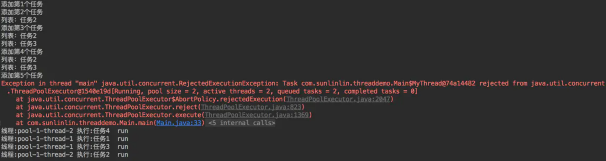

分析一下过程。

1. 添加第一个任务时，直接执行，任务列表为空。
2. 添加第二个任务时，因为采用的LinkedBlockingDeque，，并且核心线程正在执行任务，所以会将第二个任务放在队列中，队列中有 线程2.
3. 添加第三个任务时，也一样会放在队列中，队列中有 线程2，线程3.
4. 添加第四个任务时，因为核心任务还在运行，而且任务队列已经满了，所以胡直接创建新线程执行第四个任务，。这时线程池中一共就有两个线程在运行了，达到了最大线程数。任务队列中还是有线程2， 线程3.
5. 添加第五个任务时，再也没有地方能存放和执行这个任务了，就会被线程池拒绝添加，执行拒绝策略的rejectedExecution方法，这里就是执行AbortPolicy的rejectedExecution方法直接抛出异常。
6. 最终，只有四个线程能完成运行。后面的都被拒绝了。

CallerRunsPolicy

CallerRunsPolicy在任务被拒绝添加后，会调用当前线程池的所在的线程去执行被拒绝的任务。

下面说他的实现：

```java
public static class CallerRunsPolicy implements RejectedExecutionHandler {
    public CallerRunsPolicy() { }
    public void rejectedExecution(Runnable r, ThreadPoolExecutor e) {
        if (!e.isShutdown()) {
            r.run();
        }
    }
}
```

也很简单，直接run。

测试

```cpp
ThreadPoolExecutor executor = new ThreadPoolExecutor(1, 2, 30,
        TimeUnit.SECONDS,
        new LinkedBlockingDeque<Runnable>(2),
        new ThreadPoolExecutor.AbortPolicy());
```

按上面的运行，输出


注意在添加第五个任务，任务5 的时候，同样被线程池拒绝了，因此执行了CallerRunsPolicy的rejectedExecution方法，这个方法直接执行任务的run方法。因此可以看到任务5是在main线程中执行的。

从中也可以看出，因为第五个任务在主线程中运行，所以主线程就被阻塞了，以至于当第五个任务执行完，添加第六个任务时，前面两个任务已经执行完了，有了空闲线程，因此线程6又可以添加到线程池中执行了。

这个策略的缺点就是可能会阻塞主线程。


线程池-Demo 代码

```java
import java.util.Date;
/**
    * 这是⼀个简单的Runnable类，需要⼤约5秒钟来执⾏其任务。
    * @author shuang.kou
    */
public class MyRunnable implements Runnable {
    private String command;
    public MyRunnable(String s) {
        this.command = s;
    }
    @Override
    public void run() {
        System.out.println(Thread.currentThread().getName() + " Start.Time = " + new Date());
        processCommand();
        System.out.println(Thread.currentThread().getName() + " End.Time = " + newDate());
    }

    private void processCommand() {
        try {
            Thread.sleep(5000);
        } catch (InterruptedException e) {
            e.printStackTrace();
        }
    }

    @Override
    public String toString() {
        return this.command;
    }

}
```


```java
import java.util.concurrent.ArrayBlockingQueue;
import java.util.concurrent.ThreadPoolExecutor;
import java.util.concurrent.TimeUnit;
public class ThreadPoolExecutorDemo {
    private static final int CORE_POOL_SIZE = 5;
    private static final int MAX_POOL_SIZE = 10;
    private static final int QUEUE_CAPACITY = 100;
    private static final Long KEEP_ALIVE_TIME = 1L;
    public static void main(String[] args) {
        //使⽤阿⾥巴巴推荐的创建线程池的⽅式
        //通过ThreadPoolExecutor构造函数⾃定义参数创建
        ThreadPoolExecutor executor = new ThreadPoolExecutor(
            CORE_POOL_SIZE,
            MAX_POOL_SIZE,
            KEEP_ALIVE_TIME,
            TimeUnit.SECONDS,
            new ArrayBlockingQueue<>(QUEUE_CAPACITY),
            new ThreadPoolExecutor.CallerRunsPolicy());
        for (int i = 0; i < 10; i++) {
            //创建WorkerThread对象（WorkerThread类实现了Runnable 接⼝）
            Runnable worker = new MyRunnable("" + i);
            //执⾏Runnable
            executor.execute(worker);
        }
        //终⽌线程池
        executor.shutdown();
        while (!executor.isTerminated()) {
        }
        System.out.println("Finished all threads");
    }
}
```


[并发和并行（go的案例）](https%3A%2F%2Fwww.aqee.net%2Fdocs%2FConcurrency-is-not-Parallelism%2F%23landing-slide)

- 并发：是执行不同的任务，使得程序能够提供不同的功能

- 并行：是执行相同的任务，通过多核CPU，能够提高同样任务的处理效率。


### 创建线程的方法

1. 实现Runnable接口

```java
Runnable r = ()->{task code;}
Thread t = new Thread(r);
t.start()
```

2. 继承Thread类

```java
class MyThread extends Thread{
    public void run(){
        // task code;
    }
}
MyThread t = new MyThread();
t.start(); 
```

3. 实现Callable接口

```java
Class MyCallble implements Callble<Integer>{
    public Integer call(){
        // task code;
    }
}
MyCallble mc = new MyCallble();
Thread t = new Thread(mc);
t.start();
```


### ==线程池==

构建一个新的线程是有一定代价的，因为涉及与操作系统的交互。如果程序中创建了大量的生命期很短的线程，应该使用线程池（thread pool）。

一个线程池中包含许多准备运行的空闲线程。将Runnable对象交给线程池，就会有一个线程调用run方法。当run方法退出时，线程不会死亡，而是在池中准备为下一个请求提供服务。

另一个使用线程池的理由是减少并发线程的数目。创建大量线程会大大降低性能甚至使虚拟机崩溃。如果有一个会创建许多线程的算法，应该使用一个线程数“固定的”线程池以限制并发线程的总数。

执行器（Executor）类有许多静态工厂方法用来构建线程池。

* newCachedThreadPool：构建了一个线程池，对于每个任务，如果有空闲线程可用，立即让它执行任务，如果没有可用的空闲线程，则创建一个新线程。
* newFixedThreadPool：构建一个具有固定大小的线程池。如果提交的任务数多于空闲的线程数，那么把得不到服务的任务放置到队列中。当其他任务完成以后再运行它们。
* newSingleThreadExecutor：是一个退化了的大小为1的线程池：由一个线程执行提交的任务，一个接着一个。
* newScheduledThreadPool：
* newSingleThreadScheduledExecutor：

前3个方法返回实现了ExecutorService接口的ThreadPoolExecutor类的对象。

可用下面的submit方法之一将一个Runnable对象或Callable对象提交给ExecutorService，调用submit时，会得到一个Future对象，可用来查询该任务的状态。

```java
Future<?> submit(Runnable task)
Future<T> submit(Runnable task， T result)
Future<T> submit(Callable<T> task)
```

* `Future<?> submit(Runnable task)`

  这个submit方法返回一个奇怪样子的`Future<?>`。可以使用这样一个对象来调用isDone、cancel或isCancelled。但是，get方法在完成的时候只是简单地返回null。

* `Future<T> submit(Runnable task， T result)`

  这个版本的Submit也提交一个Runnable，并且Future的get方法在完成的时候返回指定的result对象。

* `Future<T> submit(Callable<T> task)`

  这个版本的Submit提交一个Callable，并且返回的Future对象将在计算结果准备好的时候得到它。

当用完一个线程池的时候，调用shutdown。该方法启动该池的关闭序列。被关闭的执行器不再接受新的任务。当所有任务都完成以后，线程池中的线程死亡。另一种方法是调用shutdownNow。该池取消尚未开始的所有任务并试图中断正在运行的线程。

后两个方法将返回实现了Scheduled-ExecutorService接口的对象。ScheduledExecutorService接口具有为预定执行或重复执行任务而设计的方法。

可以预定Runnable或Callable在初始的延迟之后只运行一次。也可以预定一个Runnable对象周期性地运行。

#### 重要参数

> 现有一个线程池，参数corePoolSize = 5，maximumPoolSize = 10，BlockingQueue阻塞队列长度为5，此时有4个任务同时进来，问：线程池会创建几条线程？
> 如果4个任务还没处理完，这时又同时进来2个任务，问：线程池又会创建几条线程还是不会创建？
> 如果前面6个任务还是没有处理完，这时又同时进来5个任务，问：线程池又会创建几条线程还是不会创建？

如果你此时一脸懵逼，请不要慌，问题不大。

创建线程池的构造方法的参数都有哪些？

要回答这个问题，我们需要从创建线程池的参数去找答案：

```java
java.util.concurrent.ThreadPoolExecutor#ThreadPoolExecutor：
public ThreadPoolExecutor(int corePoolSize，
                          int maximumPoolSize，
                          long keepAliveTime，
                          TimeUnit unit，
                          BlockingQueue<Runnable> workQueue，
                          ThreadFactory threadFactory，
                          RejectedExecutionHandler handler) {
	if (corePoolSize < 0 || maximumPoolSize <= 0 || maximumPoolSize < corePoolSize || keepAliveTime < 0)
	        throw new IllegalArgumentException();
	if (workQueue == null || threadFactory == null || handler == null)
	        throw new NullPointerException();
	this.acc = System.getSecurityManager() == null ? null : AccessController.getContext();
	this.corePoolSize = corePoolSize;
	this.maximumPoolSize = maximumPoolSize;
	this.workQueue = workQueue;
	this.keepAliveTime = unit.toNanos(keepAliveTime);
	this.threadFactory = threadFactory;
	this.handler = handler;
}
```

创建线程池一共有7个参数，从源码可知，corePoolSize和maximumPoolSize都不能小于0，且核心线程数不能大于最大线程数。

下面我来解释一下这7个参数的用途：

- **corePoolSize**：线程池核心线程数量，**核心线程不会被回收，即使没有任务执行，也会保持空闲状态**。如果线程池中的线程少于此数目，则在执行任务时创建。
- **maximumPoolSize**：池允许最大的线程数，**当线程数量达到corePoolSize，且workQueue队列塞满任务了之后，继续创建线程**。
- **keepAliveTime**：超过corePoolSize之后的“临时线程”的存活时间。
- **unit**：keepAliveTime的单位。
- **workQueue**：**当前线程数超过corePoolSize时，新的任务会处在等待状态，并存在workQueue中**，BlockingQueue是一个先进先出的阻塞式队列实现，底层实现会涉及Java并发的AQS机制。
- **threadFactory**：创建线程的工厂类，通常我们会自定一个threadFactory设置线程的名称，这样我们就可以知道线程是由哪个工厂类创建的，可以快速定位。
- **handler**：线程池执行拒绝策略，当线数量达到maximumPoolSize大小，并且workQueue也已经塞满了任务的情况下，线程池会调用handler拒绝策略来处理请求。

系统默认的拒绝策略有以下几种：

- AbortPolicy：为线程池**默认**的拒绝策略，该策略直接抛异常处理。
- DiscardPolicy：直接抛弃不处理。
- DiscardOldestPolicy：丢弃队列中最老的任务。
- CallerRunsPolicy：将任务分配给当前执行execute方法线程来处理。

我们还可以自定义拒绝策略，只需要实现RejectedExecutionHandler接口即可，友好的拒绝策略实现有如下：

- 将数据保存到数据，待系统空闲时再进行处理
- 将数据用日志进行记录，后由人工处理

现在我们回到刚开始的问题就很好回答了：

> 线程池corePoolSize=5，线程初始化时不会自动创建线程，所以当有4个任务同时进来时，执行execute方法会新建【4】条线程来执行任务；
> 前面的4个任务都没完成，现在又进来2个队列，会新建【1】条线程来执行任务，这时poolSize=corePoolSize，还剩下1个任务，线程池会将剩下这个任务塞进阻塞队列中，等待空闲线程执行；
> 如果前面6个任务还是没有处理完，这时又同时进来了5个任务，此时还没有空闲线程来执行新来的任务，所以线程池继续将这5个任务塞进阻塞队列，但发现阻塞队列已经满了，核心线程也用完了，还剩下1个任务不知道如何是好，于是线程池只能创建【1】条“临时”线程来执行这个任务了；
> 这里创建的线程用“临时”来描述还是因为它们不会长期存在于线程池，它们的存活时间为keepAliveTime，此后线程池会维持最少corePoolSize数量的线程。


#### 为什么不建议使用Executors创建线程池？

JDK为我们提供了Executors线程池工具类，里面有默认的线程池创建策略，大概有以下几种：

- **FixedThreadPool**：线程池线程数量固定，即corePoolSize和maximumPoolSize数量一样。
- **SingleThreadPool**：单个线程的线程池。
- **CachedThreadPool**：初始核心线程数量为0，最大线程数量为Integer.MAX_VALUE，线程空闲时存活时间为60秒，并且它的阻塞队列为SynchronousQueue，它的初始长度为0，这会导致任务每次进来都会创建线程来执行，在线程空闲时，存活时间到了又会释放线程资源。
- **ScheduledThreadPool**：创建一个定长的线程池，而且支持定时的以及周期性的任务执行，类似于Timer。

用Executors工具类虽然很方便，我依然不推荐大家使用以上默认的线程池创建策略，阿里巴巴开发手册也是强制不允许使用Executors来创建线程池，我们从JDK源码中寻找一波答案：

```java
java.util.concurrent.Executors：
// FixedThreadPool
public static ExecutorService newFixedThreadPool(int nThreads) {
	return new ThreadPoolExecutor(nThreads， nThreads，
	                                  0L， TimeUnit.MILLISECONDS，
	                                  new LinkedBlockingQueue<Runnable>());
}
// SingleThreadPool
public static ExecutorService newSingleThreadExecutor() {
	return new FinalizableDelegatedExecutorService
	        (new ThreadPoolExecutor(1， 1，
	                                0L， TimeUnit.MILLISECONDS，
	                                new LinkedBlockingQueue<Runnable>()));
}
// CachedThreadPool
public static ExecutorService newCachedThreadPool() {
	// 允许创建线程数为Integer.MAX_VALUE
	return new ThreadPoolExecutor(0， Integer.MAX_VALUE，
	                                  60L， TimeUnit.SECONDS，
	                                  new SynchronousQueue<Runnable>());
}
// ScheduledThreadPool
public ScheduledThreadPoolExecutor(int corePoolSize) {
	// 允许创建线程数为Integer.MAX_VALUE
	super(corePoolSize， Integer.MAX_VALUE， 0， NANOSECONDS，
	              new DelayedWorkQueue());
}
public LinkedBlockingQueue() {
	// 允许队列长度最大为Integer.MAX_VALUE
	this(Integer.MAX_VALUE);
}
```

从JDK源码可看出，**Executors工具类无非是把一些特定参数进行了封装，并提供一些方法供我们调用而已，我们并不能灵活地填写参数，策略过于简单，不够友好。**

CachedThreadPool和ScheduledThreadPool最大线程数为Integer.MAX_VALUE，如果线程无限地创建，会造成OOM异常。

LinkedBlockingQueue基于链表的FIFO队列，是无界的，默认大小是Integer.MAX_VALUE，因此FixedThreadPool和SingleThreadPool的阻塞队列长度为Integer.MAX_VALUE，如果此时队列被无限地堆积任务，会造成OOM异常。


### Interrupt

当对一个线程调用interrupt方法时，线程的中断状态将被置位。这是每一个线程都具有的boolean标志。

要想弄清中断状态是否被置位，首先调用静态的`Thread.currentThread()`方法获得当前线程，然后调用`isInterrupted()`方法：

```java
while(!Thread.currentThread().isInterrupted && more work){
    do more work;
}
```

如果线程被阻塞，就无法检测中断状态。

当在一个被阻塞的线程上调用`interrupt()`方法时，将会产生`Interrupted Exception`异常。

如果在中断状态被置位时调用`sleep()`方法，它不会休眠。相反，它将清除这一状态并抛出`InterruptedException`异常。

考虑到interrupt方法的线程设计：

```java
Runnable r = ()->{
    try{
        do something;
        while(!Thread.currentThread().isInterrupted() && more work){
            do more work;
        }
    }
    catch(InterruptedException e){
        //处理异常
    }finally{
        //clean up
    }
}
```

对于catch内处理异常的问题，可以在catch子句中调用`Thread.currentThread().interrupt()`来设置中断状态。因为如果在中断状态被置位时调用`sleep()`方法，它将清除这一状态。

或者，更好的选择是，用`throws InterruptedException`标记你的方法，不采用try语句块捕获异常。这样调用者可以捕获这一异常：

```java
void mySubTask() throws InterruptedException{
        do something;
        while(!Thread.currentThread().isInterrupted() && more work){
            do more work;
        }
}
```


### Join方法

* void join（）

  等待终止指定的线程。

* void join（long millis）

  等待指定的线程死亡或者经过指定的毫秒数。

```java
public class JoinTest implements Runnable{
    public void run() {
        do something;
    }
    public static void main(String[] args) throws Exception {  
        Runnable r = new JoinTest();  
        Thread t = new Thread(r);  
        t.start();
        t.join();//主线程会等待t线程结束之后再结束
    }         
}  
```

### 线程优先级

每一个线程有一个优先级，默认继承它的父线程的优先级。

可以用setPriority方法为线程设置优先级。可以将优先级设置为在1与10之间的任何值，默认为5。

每当线程调度器有机会选择新线程时，它首先选择具有较高优先级的线程。但是，线程优先级是高度依赖于系统的。当虚拟机依赖于宿主机平台的线程实现机制时，Java线程的优先级被映射到宿主机平台的优先级上，优先级个数也许更多，也许更少。例如，Windows有7个优先级别。在Oracle为Linux提供的Java虚拟机中，线程的优先级被忽略——所有线程具有相同的优先级。

如果确实要使用优先级，应该避免使低优先级的线程完全饿死。


### 守护线程

可以使用`t.setDaemon(true)`将线程转换为守护线程。

守护线程的唯一用途是为其他线程提供服务。当只剩下守护线程时，虚拟机就退出了，由于如果只剩下守护线程，就没必要继续运行程序了。

守护线程应该永远不去访问固有资源，如文件、数据库，因为它会在任何时候甚至在一个操作的中间发生中断。


### 条件对象

线程进入临界区，却发现在某一条件满足之后它才能执行。要使用一个条件对象来管理那些已经获得了一个锁但是却不能做有用工作的线程。这时就要使用条件对象。

等待获得锁的线程和调用await方法的线程存在本质上的不同。一旦一个线程调用await方法，它进入该条件的等待集。即使锁可用时，该线程也不能马上解除阻塞，要等到另一个线程调用同一条件上的signalAll方法。

```java
class Bank{
    private Lock bankLock = new Reentrantlock();
    private Condition sufficientFunds = bankLock.newCondition();
    public void transfer(){
        bankLock.lock();
        try{
            while(accounts[from]<amount) //注意不能使用if
                sufficientFunds.await();
            转移资金
            sufficientFunds.signalAll();
        }
    }
}

```

`singalAll()`重新激活因为这一条件而等待的所有线程。当这些线程从等待集当中移出时，它们将试图重新进入该对象。一旦锁成为可用的，它们中的某个将从await调用返回，重新获得该锁并从被阻塞的地方继续执行。此时，线程应该再次测试该条件。由于无法确保该条件被满足——`signalAll`方法仅仅是通知正在等待的线程此时有可能已经满足条件。

另一个方法signal，则是随机解除等待集中某个线程的阻塞状态。这比解除所有线程的阻塞更加有效，但也存在危险。如果随机选择的线程发现自己仍然不能运行，那么它再次被阻塞。如果没有其他线程再次调用signal，那么系统就死锁了。

await()方法也可以提供一个超时参数。


### 阻塞队列

生产者线程向队列插入元素，消费者线程则取出它们。使用队列，可以安全地从一个线程向另一个线程传递数据。例如，考虑银行转账程序，转账线程将转账指令对象插入一个队列中，而不是直接访问银行对象。另一个线程从队列中取出指令执行转账。只有该线程可以访问该银行对象的内部。因此不需要同步。

当试图向队列添加元素而队列已满，或是想从队列移出元素而队列为空的时候，阻塞队列会将线程阻塞。

java.util.concurrent包提供了阻塞队列的几个变种：

* LinkedBlockingQueue：默认的容量是没有上边界的，但是，也可以选择指定最大容量。

* LinkedBlockingDeque：是一个双端的版本。

* ArrayBlockingQueue：在构造时需要指定容量，并且有一个可选的参数来指定是否需要公平性。

* PriorityBlockingQueue：是一个带优先级的队列，而不是先进先出队列。元素按照它们的优先级顺序被移出。

* DelayQueue：包含实现Delayed接口的对象。

  ```java
  //getDelay方法返回对象的残留延迟。负值表示延迟已经结束。元素只有在延迟用完的情况下才能从DelayQueue移除。
  //还必须实现compareTo方法。DelayQueue使用该方法对元素进行排序。
  interface Delayed extends Comparable<Delayed>{
      long getDelay(TimeUnit unit);
  }
  ```

### 线程安全的集合？？

java.util.concurrent包提供了映射、有序集和队列的高效实现：ConcurrentHashMap、ConcurrentSkipListMap、ConcurrentSkipListSet和ConcurrentLinkedQueue。

集合返回弱一致性（weakly consistent）的迭代器。这意味着迭代器不一定能反映出它们被构造之后的所有的修改，但是，它们不会将同一个值返回两次，也不会抛出Concurrent ModificationException异常。


## 锁-------------- ReentrantLock

synchronized和lock的区别(底层实现)：https://www.jianshu.com/p/937a876372ff?utm_source=desktop&utm_medium=timeline

java 中的锁 -- 偏向锁、轻量级锁、自旋锁、重量级锁：https://blog.csdn.net/zqz_zqz/article/details/70233767


```java
public class ReentrantLockTest {
    public static void main(String[] args) throws InterruptedException {
        ReentrantLock lock = new ReentrantLock();
        for (int i = 1; i <= 3; i++) {
            lock.lock();
        }
        for(int i=1;i<=3;i++){
            try {

            } finally {
                lock.unlock();
            }
        }
    }
}
```


#### ==[与synchronized的对比](https://www.cnblogs.com/takumicx/p/9338983.html)==

- ReentrantLock可实现公平锁（先等待的线程先获得锁，默认是非公平的）；  synchronized不能，他默认也是非公平的。
- ReentrantLock可响应中断，就可以结束无意义的等待；  synchronized不能
- ReentrantLock可实现获取锁子时 限时等待；synchronized不能
- ReentrantLock可实现 Object上的wait和notify方法可以实现线程间的等待通知机制，即用 Condition机制 ；synchronized不能


#### 

[1.5. 谈谈 synchronized 和 ReentrantLock 的区别](https://snailclimb.gitee.io/javaguide/#/docs/java/multi-thread/2020最新Java并发进阶常见面试题总结?id=_15-谈谈-synchronized-和-reentrantlock-的区别)

[ReentrantLock(重入锁)功能详解和应用演示](https://www.cnblogs.com/takumicx/p/9338983.html)


**“可重入锁”** ：指的是自己（sun:指的是当前线程）可以再次获取自己的内部锁。

相比synchronized，ReentrantLock增加了一些高级功能。主要来说主要有三点：

- **等待可中断** : ReentrantLock提供了一种能够中断等待锁的线程的机制，通过 lock.lockInterruptibly() 来实现这个机制。也就是说正在等待的线程可以选择放弃等待，改为处理其他事情。
- **可实现公平锁** : ReentrantLock可以指定是公平锁还是非公平锁。而synchronized只能是非公平锁。所谓的公平锁就是先等待的线程先获得锁。ReentrantLock默认情况是非公平的，可以通过 ReentrantLock类的ReentrantLock(boolean fair)构造方法来制定是否是公平的。
- **可实现选择性通知（锁可以绑定多个条件）**: synchronized关键字与wait()和notify()/notifyAll()方法相结合可以实现等待/通知机制。ReentrantLock类当然也可以实现，但是需要借助于Condition接口与newCondition()方法。


**①** 两者都是可重⼊锁

两者都是可重⼊锁。“可重⼊锁”概念是：⾃⼰可以再次获取⾃⼰的内部锁。⽐如⼀个线程获得了某个对

象的锁，此时这个对象锁还没有释放，当其再次想要获取这个对象的锁的时候还是可以获取的，如果不

可锁重⼊的话，就会造成死锁。同⼀个线程每次获取锁，锁的计数器都⾃增1，所以要等到锁的计数器

下降为0时才能释放锁。

**② synchronized** 依赖于 **JVM** ⽽ **ReentrantLock** 依赖于 **API**

synchronized 是依赖于 JVM 实现的，前⾯我们也讲到了 虚拟机团队在 JDK1.6 为 synchronized 关

键字进⾏了很多优化，但是这些优化都是在虚拟机层⾯实现的，并没有直接暴露给我们。

ReentrantLock 是 JDK 层⾯实现的（也就是 API 层⾯，需要 lock() 和 unlock() ⽅法配合

try/finally 语句块来完成），所以我们可以通过查看它的源代码，来看它是如何实现的。

**③ ReentrantLock** ⽐ **synchronized** 增加了⼀些⾼级功能

相⽐synchronized，ReentrantLock增加了⼀些⾼级功能。主要来说主要有三点：**①**等待可中断；**②**可

实现公平锁；**③**可实现选择性通知（锁可以绑定多个条件）

- **ReentrantLock**提供了⼀种能够中断等待锁的线程的机制，通过lock.lockInterruptibly()来实现这个机制。也就是说正在等待的线程可以选择放弃等待，改为处理其他事情。

- **ReentrantLock**可以指定是公平锁还是⾮公平锁。⽽**synchronized**只能是⾮公平锁。所谓的公平锁就是先等待的线程先获得锁。 ReentrantLock默认情况是⾮公平的，可以通过 ReentrantLock类的 ReentrantLock(boolean fair) 构造⽅法来制定是否是公平。
- synchronized关键字与wait()和notify()/notifyAll()⽅法相结合可以实现等待/通知机制，ReentrantLock类当然也可以实现，但是需要借助于Condition接⼝与newCondition() ⽅法。Condition是JDK1.5之后才有的，它具有很好的灵活性，⽐如可以实现多路通知功能也就是在⼀个Lock对象中可以创建多个Condition实例（即对象监视器），线程对象可以注册在指定的**Condition**中，从⽽可以有选择性的进⾏线程通知，在调度线程上更加灵活。 在使⽤**notify()/notifyAll()**⽅法进⾏通知时，被通知的线程是由 **JVM** 选择的，⽤**ReentrantLock**类结合**Condition**实例可以实现**“**选择性通知**”** ，这个功能⾮常重要，⽽且是Condition接⼝默认提供的。⽽synchronized关键字就相当于整个Lock对象中只有⼀个Condition实例，所有的线程都注册在它⼀个身上。如果执⾏notifyAll()⽅法的话就会通知所有处于等待状态的线程这样会造成很⼤的效率问题，⽽Condition实例的signalAll()⽅法 只会唤醒注册在该Condition实例中的所有等待线程。

如果你想使⽤上述功能，那么选择ReentrantLock是⼀个不错的选择。


#### Volatile Vs synchronized 对比

总结：

Volatile和 synchronized分别保证什么性质：volatile保证可见性，有序性；synchronized保证了三个性质（原子，可见，有序）

- volatile：通过内存屏障实现。在读时，特定行语句前后加上内存屏障，前面的内存屏障保证能从内存读取到最新的值，后面的屏障保证这条读语句，不要被后面的指令给重排序。
- synchronized：也要在代码块前后，加上内存屏障，作用和volatile的内存屏障是一样的

为什么不能保证原子性：比如 i++，实际上是3步指令执行，volatile虽然保证1条语句原子性，但不能保证3条都原子性。在并发的情况下回出现错误。

- volatile对那些可以保证原子性呢：比如简单的get，set可以保证简单的原子性，但getAndSet()这类是不保证原子性的。

volatile的作用：

- 发生修改后**强制**将当前处理器缓存行的数据写**回到系统内存**。
- 这个写回内存的操作   会使得**在其他处理器缓存了该内存地址无效，重新从内存中读取。**


### **锁的升级(进化)** 

建议看：[Java6及以上版本对synchronized的优化 - 吴庆龙的技术轮子 - 博客园](https://www.cnblogs.com/wuqinglong/p/9945618.html)

[浅谈偏向锁、轻量级锁、重量级锁](https://juejin.cn/post/6844903550586191885)

[Java的对象头和对象组成详解_lkforce-CSDN博客_java对象头](https://blog.csdn.net/lkforce/article/details/81128115?utm_medium=distribute.pc_relevant.none-task-blog-BlogCommendFromBaidu-6.control&dist_request_id=1328689.11886.16165933840482131&depth_1-utm_source=distribute.pc_relevant.none-task-blog-BlogCommendFromBaidu-6.control)


总结：

JVM一般是这样使用锁和Mark Word的：

1，当没有被当成锁时，这就是一个普通的对象，Mark Word记录对象的HashCode，锁标志位是01，是否偏向锁那一位是0。

2，当对象被当做同步锁并有一个线程A抢到了锁时，锁标志位还是01，但是否偏向锁那一位改成1，前23bit记录抢到锁的线程id，表示进入偏向锁状态。

3，当线程A再次试图来获得锁时，JVM发现同步锁对象的标志位是01，是否偏向锁是1，也就是偏向状态，Mark Word中记录的线程id就是线程A自己的id，表示线程A已经获得了这个偏向锁，可以执行同步锁的代码。

4，当线程B试图获得这个锁时，JVM发现同步锁处于偏向状态，但是Mark Word中的线程id记录的不是B，那么线程B会先用CAS操作试图获得锁，这里的获得锁操作是有可能成功的，因为线程A一般不会自动释放偏向锁。如果抢锁成功，就把Mark Word里的线程id改为线程B的id，代表线程B获得了这个偏向锁，可以执行同步锁代码。如果抢锁失败，则继续执行步骤5。

5，偏向锁状态抢锁失败，代表当前锁有一定的竞争，偏向锁将升级为轻量级锁。JVM会在当前线程的线程栈中开辟一块单独的空间，里面保存指向对象锁Mark Word的指针，同时在对象锁Mark Word中保存指向这片空间的指针。上述两个保存操作都是CAS操作，如果保存成功，代表线程抢到了同步锁，就把Mark Word中的锁标志位改成00，可以执行同步锁代码。如果保存失败，表示抢锁失败，竞争太激烈，继续执行步骤6。

6，轻量级锁抢锁失败，JVM会使用自旋锁，自旋锁不是一个锁状态，只是代表不断的重试，尝试抢锁。从JDK1.7开始，自旋锁默认启用，自旋次数由JVM决定。如果抢锁成功则执行同步锁代码，如果失败则继续执行步骤7。

7，自旋锁重试之后如果抢锁依然失败，同步锁会升级至重量级锁，锁标志位改为10。在这个状态下，未抢到锁的线程都会被阻塞。 


**偏向锁**

偏向锁是针对于一个线程而言的, 线程获得锁之后就不会再有解锁等操作了, 这样可以省略很多开销. 假如有两个线程来竞争该锁话, 那么偏向锁就失效了, 进而升级成轻量级锁了.

为什么要这样做呢? 因为经验表明, 其实大部分情况下, 都会是同一个线程进入同一块同步代码块的. 这也是为什么会有偏向锁出现的原因.

在Jdk1.6中, 偏向锁的开关是默认开启的, 适用于只有一个线程访问同步块的场景.

**偏向锁的加锁**

当一个线程访问同步块并获取锁时, 会在锁对象的对象头和栈帧中的锁记录里存储锁偏向的线程ID, 以后该线程进入和退出同步块时不需要进行CAS操作来加锁和解锁, 只需要简单的测试一下锁对象的对象头的MarkWord里是否存储着指向当前线程的偏向锁(线程ID是当前线程), 如果测试成功, 表示线程已经获得了锁; 如果测试失败, 则需要再测试一下MarkWord中偏向锁的标识是否设置成1(表示当前是偏向锁), 如果没有设置, 则使用CAS竞争锁, 如果设置了, 则尝试使用CAS将锁对象的对象头的偏向锁指向当前线程.

**偏向锁的撤销**

偏向锁使用了一种等到竞争出现才释放锁的机制, 所以当其他线程尝试竞争偏向锁时, 持有偏向锁的线程才会释放锁. 偏向锁的撤销需要等到全局安全点(在这个时间点上没有正在执行的字节码). 首先会暂停持有偏向锁的线程, 然后检查持有偏向锁的线程是否存活, 如果线程不处于活动状态, 则将锁对象的对象头设置为无锁状态; 如果线程仍然活着, 则锁对象的对象头中的MarkWord和栈中的锁记录要么重新偏向于其它线程要么恢复到无锁状态, **最后唤醒暂停的线程(释放偏向锁的线程).**

偏向锁在Java6及更高版本中是默认启用的, 但是它在程序启动几秒钟后才激活. 可以使用-XX:BiasedLockingStartupDelay=0来关闭偏向锁的启动延迟, 也可以使用-XX:-UseBiasedLocking=false来关闭偏向锁, 那么程序会直接进入轻量级锁状态.

**6-2.轻量级锁**

当出现有两个线程来竞争锁的话, 那么偏向锁就失效了, 此时锁就会膨胀, 升级为轻量级锁.

**轻量级锁加锁**

线程在执行同步块之前, JVM会先在当前线程的栈帧中创建用户存储锁记录的空间, 并将对象头中的MarkWord复制到锁记录中. 然后线程尝试使用CAS将对象头中的MarkWord替换为指向锁记录的指针. 如果成功, 当前线程获得锁; 如果失败, 表示其它线程竞争锁, 当前线程便尝试使用自旋来获取锁, 之后再来的线程, 发现是轻量级锁, 就开始进行自旋.

**轻量级锁解锁**

轻量级锁解锁时, 会使用原子的CAS操作将当前线程的锁记录替换回到对象头, 如果成功, 表示没有竞争发生; 如果失败, 表示当前锁存在竞争, 锁就会膨胀成重量级锁.

**总结**

总结一下加锁解锁过程, 有线程A和线程B来竞争对象c的锁(如: synchronized(c){} ), 这时线程A和线程B同时将对象c的MarkWord复制到自己的锁记录中, 两者竞争去获取锁, 假设线程A成功获取锁, 并将对象c的对象头中的线程ID(MarkWord中)修改为指向自己的锁记录的指针, 这时线程B仍旧通过CAS去获取对象c的锁, 因为对象c的MarkWord中的内容已经被线程A改了, 所以获取失败. 此时为了提高获取锁的效率, 线程B会循环去获取锁, 这个循环是有次数限制的, 如果在循环结束之前CAS操作成功, 那么线程B就获取到锁, 如果循环结束依然获取不到锁, 则获取锁失败, 对象c的MarkWord中的记录会被修改为重量级锁, 然后线程B就会被挂起, 之后有线程C来获取锁时, 看到对象c的MarkWord中的是重量级锁的指针, 说明竞争激烈, 直接挂起.

解锁时, 线程A尝试使用CAS将对象c的MarkWord改回自己栈中复制的那个MarkWord, 因为对象c中的MarkWord已经被指向为重量级锁了, 所以CAS失败. 线程A会释放锁并唤起等待的线程, 进行新一轮的竞争.

**6.锁的比较**

锁优点缺点适用场景偏向锁加锁和解锁不需要额外的消耗, 和执行非同步代码方法的性能相差无几.如果线程间存在锁竞争, 会带来额外的锁撤销的消耗.适用于只有一个线程访问的同步场景轻量级锁竞争的线程不会阻塞, 提高了程序的响应速度如果始终得不到锁竞争的线程, 使用自旋会消耗CPU追求响应时间, 同步快执行速度非常快重量级锁线程竞争不适用自旋, 不会消耗CPU线程堵塞, 响应时间缓慢追求吞吐量, 同步快执行时间速度较长

**7.总结**

首先要明确一点是引入这些锁是为了提高获取锁的效率, 要明白每种锁的使用场景, 比如偏向锁适合一个线程对一个锁的多次获取的情况; 轻量级锁适合锁执行体比较简单(即减少锁粒度或时间), 自旋一会儿就可以成功获取锁的情况.

要明白MarkWord中的内容表示的含义.


### 读/写锁

`java.util.concurrent.locks`包定义了两个锁类，`ReentrantLock`类和`ReentrantReadWriteLock`类。如果很多线程从一个数据结构读取数据而很少线程修改其中数据的话，读写锁是十分有用的。

```java
private ReentrantReadWriteLock rwl = new ReentrantReadWriteLock();
private Lock readLock = rwl.readLock(); //抽取读锁
private Lock writeLock = rwl.writeLock(); //抽取写锁
//对所有获取方法加读锁
public void getSomething(){
    readLock.lock();
    try{...}
    finally{readLock.unlock();}
}
//对所有修改方法加写锁
public void transfer(){
    writeLock.lock();
    try{...}
    finally{writeLock.unlock();}
}
```

读锁可以被多个读操作共用，但会排斥所有写操作。写锁，排斥所有其他的读操作和写操作。


### 自旋与互斥锁

[自旋锁的原理](https://www.cnblogs.com/cxuanBlog/p/11679883.html)

自旋锁的定义：当一个线程尝试去获取某一把锁的时候，如果这个锁此时已经被别人获取(占用)，那么此线程就无法获取到这把锁，该线程将会等待，间隔一段时间后会再次尝试获取。这种采用循环加锁 -> 等待的机制被称为`自旋锁(spinlock)`


自旋锁避免了操作系统进程调度和线程切换，所以自旋锁通常适用在时间比较短的情况下。

- 适合自旋锁：适合锁的竞争不激烈，且占用锁时间非常短的代码块来说性能能大幅度的提升，通常会设置自旋的时间。
- 不适合自旋锁：如果锁的竞争激烈，或者持有锁的线程需要长时间占用锁执行同步块，这时候就不适合使用自旋锁了。


如果自旋锁的获取不公平（申请者是否FIFO的得到锁）怎么办：

可以用CLHLock和MCSLock、TicketLock 等等一些锁。


### ==乐观锁和悲观锁==

两种锁各有优缺点，不可认为一种好于另一种。

**乐观锁适用于写比较少的情况下（多读场景）**，即冲突真的很少发生的时候，这样可以省去了锁的开销，加大了系统的整个吞吐量。但如果是多写的情况，一般会经常产生冲突，这就会导致上层应用会不断的进行retry，这样反倒是降低了性能，所以**一般多写的场景下用悲观锁就比较合适。**


**悲观锁：**

总是假设最坏的情况，每次去拿数据的时候都认为别人会修改，所以每次在拿数据的时候都会上锁，这样别人想拿这个数据就会阻塞直到它拿到锁（**共享资源每次只给一个线程使用，其它线程阻塞，用完后再把资源转让给其它线程**）。

传统的关系型数据库里边就用到了很多这种锁机制，比如行锁，表锁等，读锁，写锁等，都是在做操作之前先上锁。

Java中`synchronized`和`ReentrantLock`等独占锁就是悲观锁思想的实现。


**乐观锁：**

总是假设最好的情况，每次去拿数据的时候都认为别人不会修改，所以不会上锁，但是在更新的时候会判断一下在此期间别人有没有去更新这个数据，可以使用版本号机制和CAS算法实现。

**乐观锁适用于多读的应用类型，这样可以提高吞吐量**，像数据库提供的类似于**write_condition机制**，其实都是提供的乐观锁。

在Java中`java.util.concurrent.atomic`包下面的原子变量类就是使用了乐观锁的一种实现方式**CAS**实现的。


**缺点：**

1. ABA 问题

   如果一个变量V初次读取的时候是A值，并且在准备赋值的时候检查到它仍然是A值，那我们就能说明它的值没有被其他线程修改过了吗？很明显是不能的，因为在这段时间它的值可能被改为其他值，然后又改回A，那CAS操作就会误认为它从来没有被修改过。这个问题被称为CAS操作的 **"ABA"问题。**

   JDK 1.5 以后的 `AtomicStampedReference 类`就提供了此种能力，其中的 `compareAndSet 方法`就是首先检查当前引用是否等于预期引用，并且当前标志是否等于预期标志，如果全部相等，则以原子方式将该引用和该标志的值设置为给定的更新值。

2. 循环时间长开销大

   自旋CAS（也就是不成功就一直循环执行直到成功）如果长时间不成功，会给CPU带来非常大的执行开销。

3. 只能保证一个共享变量的原子操作

   CAS 只对单个共享变量有效，当操作涉及跨多个共享变量时 CAS 无效。但是从 JDK 1.5开始，提供了`AtomicReference类`来保证引用对象之间的原子性，你可以把多个变量放在一个对象里来进行 CAS 操作.所以我们可以使用锁或者利用`AtomicReference类`把多个共享变量合并成一个共享变量来操作。


### 乐观锁常见的两种实现方式

乐观锁一般会使用版本号机制或CAS算法实现

#### 版本号机制

一般是在数据表中加上一个数据版本号version字段，表示数据被修改的次数，当数据被修改时，version值会加一。当线程A要更新数据值时，在读取数据的同时也会读取version值，在提交更新时，若刚才读取到的version值为当前数据库中的version值相等时才更新，否则重试更新操作，直到更新成功。

#### ==CAS机制==

即**compare and swap（比较与交换）**，是一种有名的**无锁算法**。

无锁编程，即不使用锁的情况下实现多线程之间的变量同步，也就是在没有线程被阻塞的情况下实现变量的同步，所以也叫非阻塞同步。**CAS算法**涉及到三个操作数

- 需要读写的内存值 V
- 进行比较的值 A
- 拟写入的新值 B

当且仅当 V 的值等于 A时，CAS通过原子方式用新值B来更新V的值，否则不会执行任何操作（比较和替换是一个原子操作）。一般情况下是一个**自旋操作**，即**不断的重试**。

### 锁消除（锁）

锁消除是指对于被检测出不可能存在竞争的共享数据的锁进行消除。

```java
public static String concatString(String s1, String s2, String s3) {
    StringBuffer sb = new StringBuffer();
    sb.append(s1);
    sb.append(s2);
    sb.append(s3);
    return sb.toString();
}
```

eg：消除concaString()是，就算转换为StringBuffer进行拼接需要对对象进行加锁，但因为JVM发现sb逃逸不出去，故而可以把这个concatString（）的对象锁给去掉。


# 4 JVM


## 字面量和符号引用todo

建议看：[java字面量和符号引用_彻底弄懂java中的常量池_从夏的博客-CSDN博客](https://blog.csdn.net/weixin_29357243/article/details/112181473)

建议看2：[Java常量池理解与总结](https://www.jianshu.com/p/c7f47de2ee80)

class文件里常量池里大部分数据会被加载到“运行时常量池”，包括String的字面量；但同时“Hello”字符串的一个引用会被存到同样在“非堆”区域的“字符串常量池”中。1.8以后在元空间中，元空间在本地内存中，而"Hello"本体还是和所有对象一样，创建在Java堆中。


常量池主要存放两大常量：字面量和符号引用。字面量比较接近于 Java 语言层面的的常量概念，如文本字符串、声明为 final 的常量值等。而符号引用则属于编译原理方面的概念。包括下面三类常量：

- 类和接口的全限定名
- 字段的名称和描述符
- 方法的名称和描述符


## 强弱软虚 todo


## 垃圾收集器

[深入理解JVM（5） : Java垃圾收集器](https://www.jianshu.com/p/50d5c88b272d)


### Serial收集器

这个收集器是一个单线程的收集器，但它的“单线程”的意义并不仅仅说明它只会使用一个CPU或一条收集线程去完成垃圾收集工作，更重要的是在它进行垃圾收集时，必须暂停其他所有的工作线程，直到它收集结束。

实际上到现在为止，它依然是虚拟机运行在Client模式下的默认新生代收集器。它也有着优于其他收集器的地方：简单而高效（与其他收集器的单线程比），对于限定单个CPU的环境来说，Serial收集器由于没有线程交互的开销，专心做垃圾收集自然可以获得最高的单线程收集效率。在用户的桌面应用场景中，分配给虚拟机管理的内存一般来说不会很大，收集几十兆甚至一两百兆的新生代，停顿时间完全可以控制在几十毫秒最多一百多毫秒以内，只要不是频繁发生，这点停顿是可以接受的。所以，Serial收集器对于运行在Client模式下的虚拟机来说是一个很好的选择。

### ParNew收集器

ParNew收集器其实就是Serial收集器的多线程版本。

ParNew收集器除了多线程收集之外，其他与Serial收集器相比并没有太多创新之处，但它却是许多运行在Server模式下的虚拟机中首选的新生代收集器，其中有一个与性能无关但很重要的原因是，除了Serial收集器外，目前只有它能与CMS收集器配合工作。

### Parallel Scavenge收集器

Parallel Scavenge收集器是一个新生代收集器，它也是使用复制算法的收集器，又是并行的多线程收集器。

Parallel Scavenge收集器的特点是它的关注点与其他收集器不同，其它收集器的关注点是尽可能地缩短垃圾收集时用户线程的停顿时间，而Parallel Scavenge收集器的目标则是达到一个可控制的吞吐量。所谓吞吐量就是CPU用于运行用户代码的时间与CPU总消耗时间的比值。

### Serial Old收集器

Serial Old是Serial收集器的老年代版本，它同样是一个单线程收集器，使用“标记-整理”算法。这个收集器的主要意义也是在于给Client模式下的虚拟机使用。

### Parallel Old收集器

Parallel Old是Parallel Scavenge收集器的老年代版本，使用多线程和“标记-整理”算法。在注重吞吐量以及CPU资源敏感的场合，都可以优先考虑Parallel Scavenge加Parallel Old收集器。

### CMS收集器

CMS（Concurrent Mark Sweep）收集器是一种以获取最短回收停顿时间为目标的收集器。目前很大一部分的Java应用集中在互联网站或者B/S系统的服务端上，这类应用尤其重视服务的响应速度，希望系统停顿时间最短，以给用户带来较好的体验。CMS收集器就非常符合这类应用的需求。

CMS收集器是基于“标记—清除”算法实现的，它的运作过程相对于前面几种收集器来说更复杂一些，整个过程分为4个步骤，包括：

1. 初始标记：标记一下GC Roots能直接关联到的对象。

2. 并发标记：进行GCRoots Tracing的过程。

3. 重新标记：为了修正并发标记期间因用户程序继续运作而导致标记产生变动的那一部分对象的标记记录。

4. 并发清除：

其中，初始标记、重新标记这两个步骤仍然需要“Stop The World”。初始标记仅仅只是标记一下GC Roots能直接关联到的对象，速度很快，并发标记阶段就是进行GCRoots Tracing的过程，而重新标记阶段则是为了修正并发标记期间因用户程序继续运作而导致标记产生变动的那一部分对象的标记记录，这个阶段的停顿时间一般会比初始标记阶段稍长一些，但远比并发标记的时间短。

由于整个过程中耗时最长的并发标记和并发清除过程收集器线程都可以与用户线程一起工作，所以，从总体上来说，CMS收集器的内存回收过程是与用户线程一起并发执行的。


####  CMS 的 Full GC 的触发条件

1. 调用 System.gc()
2. 老年代空间不足。太大的对象进入老年代，但进入不了
3. 空间分配担保失败
4. Concurrent Mode Failure


#### **CMS收集器和G1收集器的对比**

总结：

- stop the world：CMS是第1,3阶段，G1是，1,3,4都是stop。stop的意思是，让应用停下来，JVM要执行全力执行 GC垃圾回收线程。
- 描述CMS和G1：执行步骤，是否stop，优缺点，对比，清楚的算法，主要特色


原文：https://www.cnblogs.com/aspirant/p/8663897.html

CMS收集算法 参考：[图解 CMS 垃圾回收机制原理，-阿里面试题](https://www.cnblogs.com/aspirant/p/8663911.html)

G1收集算法 参考：[G1 垃圾收集器入门](https://www.cnblogs.com/aspirant/p/8663872.html)

首先要知道 Stop the world的含义(网易面试)：不管选择哪种GC算法，stop-the-world都是不可避免的。*Stop-the-world*意味着从应用中停下来并进入到GC执行过程中去。一旦Stop-the-world发生，**除了GC所需的线程外，其他线程都将停止工作，中断了的线程直到GC任务结束才继续它们的任务**。GC调优通常就是为了改善stop-the-world的时间 

CMS收集器是一种以获取最短回收停顿时间为目标的收集器，CMS收集器是基于“”标记--清除”(Mark-Sweep)算法实现的，整个过程分为四个步骤：  

​     1. 初始标记 (Stop the World事件 CPU停顿， 很短) 初始标记仅标记一下GC Roots能直接关联到的对象，速度很快；

​      2. 并发标记 (收集垃圾跟用户线程一起执行) 初始标记和重新标记任然需要“stop the world”，并发标记过程就是进行GC Roots Tracing的过程；

​      3. 重新标记 (Stop the World事件 CPU停顿，比初始标记稍微长，远比并发标记短)修正并发标记期间因用户程序继续运作而导致标记产生变动的那一部分对象的标记记录，这个阶段的停顿时间一般会比初始标记阶段稍长一些，但远比并发标记时间短

​      4. 并发清理 -清除算法；

　　整个过程中耗时最长的并发标记和并发清除过程收集器线程都可以与用户线程一起工作，所以，从总体上来说，CMS收集器的内存回收过程是与用户线程一起并发执行的。 

初始标记：仅仅是标记一下GC roots 能直接关联的对象，速度很快  (何为GC roots :

在Java语言中，可作为GC Roots的对象包括4种情况：

  a) 虚拟机栈中引用的对象（栈帧中的本地变量表）；

  b) 方法区中类静态属性引用的对象；

  c) 方法区中常量引用的对象；

  d) 本地方法栈中JNI（Native方法）引用的对象。

具体参考：[JVM的垃圾回收机制 总结(垃圾收集、回收算法、垃圾回收器)](http://www.cnblogs.com/aspirant/p/8662690.html)) 


CMS是一款优秀的收集器，它的主要优点是：并发收集、低停顿，但他有以下3个明显的缺点：

优点：并发收集，低停顿 

理由： 由于在整个过程和中最耗时的并发标记和 并发清除过程收集器程序都可以和用户线程一起工作，所以总体来说，Cms收集器的内存回收过程是与用户线程一起并发执行的

缺点：

  1.CMS收集器对CPU资源非常敏感 

   在并发阶段，虽然不会导致用户线程停顿，但是会因为占用了一部分线程使应用程序变慢，总吞吐量会降低，为了解决这种情况，虚拟机提供了一种“增量式并发收集器” 

的CMS收集器变种， 就是在并发标记和并发清除的时候让GC线程和用户线程交替运行，尽量减少GC 线程独占资源的时间，这样整个垃圾收集的过程会变长，但是对用户程序的影响会减少。（效果不明显，不推荐） 

  2. CMS处理器无法处理浮动垃圾 

   CMS在并发清理阶段线程还在运行， 伴随着程序的运行自然也会产生新的垃圾，这一部分垃圾产生在标记过程之后，CMS无法再当次过程中处理，所以只有等到下次gc时候在清理掉，这一部分垃圾就称作“浮动垃圾” ， 

  3. CMS是基于“标记--清除”算法实现的，所以在收集结束的时候会有大量的空间碎片产生。空间碎片太多的时候，将会给大对象的分配带来很大的麻烦，往往会出现老年代还有很大的空间剩余，但是无法找到足够大的连续空间来分配当前对象的，只能提前触发 full gc。 

  为了解决这个问题，CMS提供了一个开关参数，用于在CMS顶不住要进行full gc的时候开启内存碎片的合并整理过程，内存整理的过程是无法并发的，空间碎片没有了，但是停顿的时间变长了 

------------------------------------------------------------------------------------------------------------------

G1(Garbage First)是一款面向服务端应用的垃圾收集器。G1具备如下特点：

5、G1运作步骤：

**1、初始标记(stop the world事件 CPU停顿只处理垃圾)；**

**2、并发标记(与用户线程并发执行)；**

**3、最终标记(stop the world事件 ,CPU停顿处理垃圾)；**

**4、筛选回收(stop the world事件 根据用户期望的GC停顿时间回收)(注意：CMS 在这一步不需要stop the world)（阿里问为何停顿时间可以设置，参考：**[G1 垃圾收集器架构和如何做到可预测的停顿(阿里)](https://www.cnblogs.com/aspirant/p/8663872.html)**）**

**与其他GC收集器相比，G1具备如下特点：**

1、并行于并发：G1能充分利用CPU、多核环境下的硬件优势，使用多个CPU（CPU或者CPU核心）来缩短stop-The-World停顿时间。部分其他收集器原本需要停顿[Java](http://lib.csdn.net/base/java)线程执行的GC动作，G1收集器仍然可以通过并发的方式让java程序继续执行。

2、分代收集：虽然G1可以不需要其他收集器配合就能独立管理整个GC堆，但是还是保留了分代的概念。它能够采用不同的方式去处理新创建的对象和已经存活了一段时间，熬过多次GC的旧对象以获取更好的收集效果。

3、空间整合：与CMS的“标记--清理”算法不同**，G1从整体来看是基于“标记整理”算法实现的收集器；从局部上来看是基于“复制”算法实现的**。

4、可预测的停顿：这是G1相对于CMS的另一个大优势，降低停顿时间是G1和 CMS 共同的关注点，但 G1 除了追求低停顿外，还能建立可预测的停顿时间模型，能让使用者明确指定在一个长度为M毫秒的时间片段内，

 

上面几个步骤的运作过程和CMS有很多相似之处。初始标记阶段仅仅只是标记一下GC Roots能直接关联到的对象，并且修改TAMS的值，让下一个阶段用户程序并发运行时，能在正确可用的Region中创建新对象，这一阶段需要停顿线程，但是耗时很短，并发标记阶段是从GC Root开始对堆中对象进行可达性分析，找出存活的对象，这阶段时耗时较长，但可与用户程序并发执行。而最终标记阶段则是为了修正在并发标记期间因用户程序继续运作而导致标记产生变动的那一部分标记记录，虚拟机将这段时间对象变化记录在线程Remenbered Set Logs里面，最终标记阶段需要把Remembered Set Logs的数据合并到Remembered Set Logs里面，最终标记阶段需要把Remembered Set Logs的数据合并到Remembered Set中，这一阶段需要停顿线程，但是可并行执行。最后在筛选回收阶段首先对各个Region的回收价值和成本进行排序，根据用户所期望的GC停顿时间来制定回收计划。


### G1收集器

美团技术团队文章：[Java Hotspot G1 GC的一些关键技术](https://tech.meituan.com/2016/09/23/g1.html)

建议读：https://www.jianshu.com/p/7340becc027c


G1中是 **没** 有Old GC的，有一个把老年代跟新生代同时GC的 Mixed GC，它的 **回收流程** ：

1、 初始标记 ： **是STW事件** ，其完成工作是标记GC ROOTS 直接可达的对象。标记位RootRegion。

2、 根区域扫描 ： **不是STW事件** ，拿来RootRegion，扫描整个Old区所有Region，看每个Region的 **Rset** 中是否有RootRegion。有则标识出来。

3、 并发标记 ： 同CMS并发标记 **不需要STW** ，遍历范围减少，在此只需要遍历 第二步 被标记到引用老年代的对象 RSet。

4、 最终标记 ： 同 CMS 重新标记 会STW ，用的 **SATB** 操作，速度更快。

5、 清除 ： **STW操作** ，用 **复制清理算法** ，清点出有存活对象的Region和没有存活对象的Region(Empty Region)，更新Rset。把Empty Region收集起来到可分配Region队列。


###  判断一个对象是否可被回收

1. 引用计数法：会存在循环引用的问题，Java不用

2. 可达性分析算法：GC Roots，一般GC Roots包括：

   - 虚拟机栈中局部变量表中引用的对象
   - 本地方法栈中 JNI 中引用的对象
   - 方法区中类静态属性引用的对象
   - 方法区中的常量引用的对象

3. 方法区的回收：对常量池的回收和对类的卸载。

4. finalize()：

   

###  内存分配 与 回收

- 对象优先在 Eden分配。

- 大对象直接进入老年代。

- 长期存活对象进入老年代。大于 PretenureSizeThreshold 就可以进入老年代

- 动态对象判定机制。不是一定要到了指定年龄，才能进入老年代

- 空间分配担保。如果老年代剩余空间，不足以支撑新生代的处理方式。


### 为什么811

98%的对象，第一轮就死掉了。所以90%是空的，10%是survivor的。

java中堆的分区：https://blog.csdn.net/qq_41700030/article/details/99310305

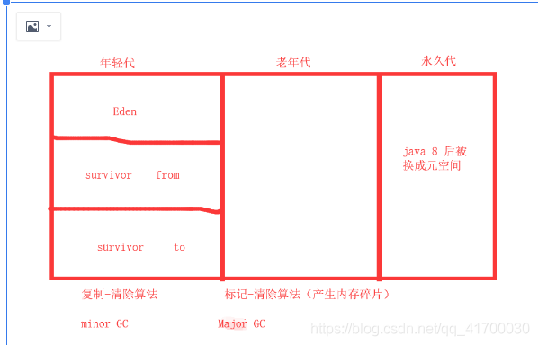


简单写个main函数，说下其在jvm中的生命周期

```
 public class A{
 public int i=1; 
    public static void mian(String args[]){
          A a=new A();
        }
    }
123456
```


1. 加载class文件到class内容区域，加载静态方法和静态变量到静态区（同时加载的）
2. 调用main方法到栈内存
3. 在栈内存中为a变量（A对象的引用）开辟空间
   4. 在堆内存为A对象申请空间
   5. 给成员变量进行默认初始化（此时 i=0），同时有一个方法标记，在方法区中创建一个A的方法区，将A的方法区的地址0x01给方法标记
   6. 给成员变量进行显示初始化（此时 i=1）
4. 将A对象的地址值给变量a


**1.既然有GC机制，为什么还会有内存泄露的情况？**

  理论上Java 因为有垃圾回收机制（GC）不会存在内存泄露问题（这也是 Java 被广泛使用于服务器端编程的一个重要原因）。然而在实际开发中，**可能会存在无用但可达的对象，这些对象不能被 GC 回收，因此也会导致内存泄露的发生**。

  例如 hibernate 的 Session（一级缓存）中的对象属于持久态，垃圾回收器是不会回收这些对象的，然而这些对象中可能存在无用的垃圾对象，如果不及时关闭（close）或清空（flush）一级缓存就可能导致内存泄露。

下面例子中的代码也会导致内存泄露。

```java
import java.util.Arrays;
import java.util.EmptyStackException;

public class MyStack<T> {
	private T[] elements;
	private int size = 0;
	private static final int INIT_CAPACITY = 16;
	public MyStack() {
		elements = (T[]) new Object[INIT_CAPACITY];
	}

	public void push(T elem) {
		ensureCapacity();
		elements[size++] = elem;
	}

	public T pop() {
		if (size == 0)
		throw new EmptyStackException();
		return elements[--size];
	}

	private void ensureCapacity() {
		if (elements.length == size) {
			elements = Arrays.copyOf(elements, 2 * size + 1);
		}
	}
}
```

上面的代码实现了一个栈（先进后出（FILO））结构，乍看之下似乎没有什么明显的问题，它甚至可以通过你编写的各种单元测试。然而其中的 pop 方法却存在内存泄露的问题，当我们用 pop 方法弹出栈中的对象时，该对象不会被当作垃圾回收，即使使用栈的程序不再引用这些对象，因为栈内部维护着对这些对象的过期引用（obsolete reference）。在支持垃圾回收的语言中，内存泄露是很隐蔽的，这种内存泄露其实就是无意识的对象保持。如果一个对象引用被无意识的保留起来了，那么垃圾回收器不会处理这个对象，也不会处理该对象引用的其他对象，即使这样的对象只有少数几个，也可能会导致很多的对象被排除在垃圾回收之外，从而对性能造成重大影响，极端情况下会引发 Disk Paging （物理内存与硬盘的虚拟内存交换数据），甚至造成 OutOfMemoryError。

**2. Java中为什么会有GC机制呢？**

>   安全性考虑；-- for security.
>
>   减少内存泄露；-- erase memory leak in some degree.
>
>   减少程序员工作量。-- Programmers don't worry about memory releasing.

3. 对于Java的GC哪些内存需要回收？

  内存运行时JVM会有一个运行时数据区来管理内存。它主要包括5大部分：程序计数器(Program Counter Register)、虚拟机栈(VM Stack)、本地方法栈(Native Method Stack)、方法区(Method Area)、堆(Heap).

  而其中程序计数器、虚拟机栈、本地方法栈是每个线程私有的内存空间，随线程而生，随线程而亡。例如栈中每一个栈帧中分配多少内存基本上在类结构确定是哪个时就已知了，因此这3个区域的内存分配和回收都是确定的，无需考虑内存回收的问题。

  但方法区和堆就不同了，一个接口的多个实现类需要的内存可能不一样，我们只有在程序运行期间才会知道会创建哪些对象，这部分内存的分配和回收都是动态的，GC主要关注的是这部分内存。

  总而言之，GC主要进行回收的内存是JVM中的方法区和堆；


**4. Java的GC什么时候回收垃圾？**

在面试中经常会碰到这样一个问题（事实上笔者也碰到过）：如何判断一个对象已经死去？

很容易想到的一个答案是：对一个对象添加引用计数器。每当有地方引用它时，计数器值加1；当引用失效时，计数器值减1.而当计数器的值为0时这个对象就不会再被使用，判断为已死。是不是简单又直观。然而，很遗憾。这种做法是错误的！为什么是错的呢？事实上，用引用计数法确实在大部分情况下是一个不错的解决方案，而在实际的应用中也有不少案例，但它却无法解决对象之间的循环引用问题。比如对象A中有一个字段指向了对象B，而对象B中也有一个字段指向了对象A，而事实上他们俩都不再使用，但计数器的值永远都不可能为0，也就不会被回收，然后就发生了内存泄露。

所以，正确的做法应该是怎样呢？ 在Java，C#等语言中，比较主流的判定一个对象已死的方法是：可达性分析(Reachability Analysis).所有生成的对象都是一个称为"GC Roots"的根的子树。从GC Roots开始向下搜索，搜索所经过的路径称为引用链(Reference Chain)，当一个对象到GC Roots没有任何引用链可以到达时，就称这个对象是不可达的（不可引用的），也就是可以被GC回收了。

无论是引用计数器还是可达性分析，判定对象是否存活都与引用有关！那么，如何定义对象的引用呢？

我们希望给出这样一类描述：当内存空间还够时，能够保存在内存中；如果进行了垃圾回收之后内存空间仍旧非常紧张，则可以抛弃这些对象。所以根据不同的需求，给出如下四种引用，根据引用类型的不同，GC回收时也会有不同的操作：

  1)强引用(Strong Reference):Object obj = new Object();只要强引用还存在，GC永远不会回收掉被引用的对象。

  2)软引用(Soft Reference)：描述一些还有用但非必需的对象。在系统将会发生内存溢出之前，会把这些对象列入回收范围进行二次回收（即系统将会发生内存溢出了，才会对他们进行回收。）

  3)弱引用(Weak Reference):程度比软引用还要弱一些。这些对象只能生存到下次GC之前。当GC工作时，无论内存是否足够都会将其回收（即只要进行GC，就会对他们进行回收。）

  4)虚引用(Phantom Reference):一个对象是否存在虚引用，完全不会对其生存时间构成影响。

关于方法区中需要回收的是一些废弃的常量和无用的类。

  1.废弃的常量的回收。这里看引用计数就可以了。没有对象引用该常量就可以放心的回收了。

  2.无用的类的回收。什么是无用的类呢？

​    A.该类所有的实例都已经被回收。也就是Java堆中不存在该类的任何实例；

​    B.加载该类的ClassLoader已经被回收；

​    C.该类对应的java.lang.Class对象没有任何地方被引用，无法在任何地方通过反射访问该类的方法。

总而言之:

对于堆中的对象，主要用可达性分析判断一个对象是否还存在引用，如果该对象没有任何引用就应该被回收。而根据我们实际对引用的不同需求，又分成了4中引用，每种引用的回收机制也是不同的。

对于方法区中的常量和类，当一个常量没有任何对象引用它，它就可以被回收了。而对于类，如果可以判定它为无用类，就可以被回收了。

4.在开发中遇到过内存溢出么？原因有哪些？解决方法有哪些?


引起内存溢出的原因有很多种，常见的有以下几种：

　　1.内存中加载的数据量过于庞大，如一次从数据库取出过多数据；

　　2.集合类中有对对象的引用，使用完后未清空，使得JVM不能回收；

　　3.代码中存在死循环或循环产生过多重复的对象实体；

　　4.使用的第三方软件中的BUG；

　　5.启动参数内存值设定的过小；

内存溢出的解决方案：

   第一步，修改JVM启动参数，直接增加内存。(-Xms，-Xmx参数一定不要忘记加。)

　　第二步，检查错误日志，查看“OutOfMemory”错误前是否有其它异常或错误。

　　第三步，对代码进行走查和分析，找出可能发生内存溢出的位置。

重点排查以下几点：

　　1.检查对数据库查询中，是否有一次获得全部数据的查询。一般来说，如果一次取十万条记录到内存，就可能引起内存溢出。这个问题比较隐蔽，在上线前，数据库中数据较少，不容易出问题，上线后，数据库中数据多了，一次查询就有可能引起内存溢出。因此对于数据库查询尽量采用分页的方式查询。

　　2.检查代码中是否有死循环或递归调用。

　　3.检查是否有大循环重复产生新对象实体。

　　4.检查对数据库查询中，是否有一次获得全部数据的查询。一般来说，如果一次取十万条记录到内存，就可能引起内存溢出。这个问题比较隐蔽，在上线前，数据库中  数据较少，不容易出问题，上线后，数据库中数据多了，一次查询就有可能引起内存溢出。因此对于数据库查询尽量采用分页的方式查询。

　　5.检查List、MAP等集合对象是否有使用完后，未清除的问题。List、MAP等集合对象会始终存有对对象的引用，使得这些对象不能被GC回收。

　　第四步，使用内存查看工具动态查看内存使用情况。


### 


## 运行时数据区

方法区、堆、虚拟机栈、本地方法栈、程序计数器。其中，方法区和堆是为所有线程所共享的，其它三个是线程隔离的。

### 程序计数器

程序计数器是一块较小的内存空间，它可以看作是当前线程所执行的字节码的行号指示器。在虚拟机的概念模型里，字节码解释器工作时就是通过改变这个计数器的值来选取下一条需要执行的字节码指令。分支、循环、跳转、异常处理、线程恢复等基础功能都需要依赖这个计数器来完成。

由于Java虚拟机的多线程是通过线程轮流切换并分配处理器执行时间的方式来实现的，在任何一个确定的时刻，一个处理器（对于多核处理器来说是一个内核）都只会执行一条线程中的指令。因此，为了线程切换后能恢复到正确的执行位置，每条线程都需要有一个独立的程序计数器，各条线程之间计数器互不影响，独立存储。

如果线程正在执行的是一个Java方法，这个计数器记录的是正在执行的虚拟机字节码指令的地址；

==如果正在执行的是Native方法，这个计数器值则为空（Undefined）。==

此内存区域是唯一一个在Java虚拟机规范中没有规定任何OutOfMemoryError情况的区域。

### Java虚拟机栈

Java虚拟机栈的生命周期与线程相同。虚拟机栈描述的是Java方法执行的内存模型：每个方法在执行的同时都会创建一个栈帧用于存储局部变量表、操作数栈、动态链接、方法出口等信息。每一个方法从调用直至执行完成的过程，就对应着一个栈帧在虚拟机栈中入栈到出栈的过程。局部变量表存放了编译期可知的各种基本数据类型、对象引用和returnAddress类型。

局部变量表所需的内存空间在编译期间完成分配，当进入一个方法时，这个方法需要在帧中分配多大的局部变量空间是完全确定的，在方法运行期间不会改变局部变量表的大小。

如果线程请求的栈深度大于虚拟机所允许的深度，将抛出StackOverflowError异常。

### 本地方法栈

本地方法栈与虚拟机栈所发挥的作用是非常相似的，它们之间的区别不过是虚拟机栈为虚拟机执行Java方法服务，而本地方法栈则为虚拟机使用到的Native方法服务。本地方法栈区域也会抛出StackOverflowError异常。

### Java堆

对于大多数应用来说，Java堆是Java虚拟机所管理的内存中最大的一块。Java堆是被所有线程共享的一块内存区域，在虚拟机启动时创建。此内存区域的唯一目的就是存放对象实例，几乎所有的对象实例都在这里分配内存。

Java堆是垃圾收集器管理的主要区域。从内存回收的角度来看，由于现在收集器基本都采用分代收集算法，所以Java堆中还可以细分为：新生代和老年代。

根据Java虚拟机规范的规定，Java堆可以处于物理上不连续的内存空间中，只要逻辑上是连续的即可，就像我们的磁盘空间一样。在实现时，既可以实现成固定大小的，也可以是可扩展的，不过当前主流的虚拟机都是按照可扩展来实现的。如果在堆中没有内存完成实例分配，并且堆也无法再扩展时，将会抛出OutOfMemoryError异常。

### 方法区

方法区与Java堆一样，是各个线程共享的内存区域，它用于存储已被虚拟机加载的类信息、常量、静态变量、即时编译器编译后的代码等数据。

Java虚拟机规范对方法区的限制非常宽松，除了和Java堆一样不需要连续的内存和可以选择固定大小或者可扩展外，还可以选择不实现垃圾收集。相对而言，垃圾收集行为在这个区域是比较少出现的，但并非数据进入了方法区就如永久代的名字一样“永久”存在了。这区域的内存回收目标主要是针对常量池的回收和对类型的卸载，一般来说，这个区域的回收“成绩”比较难以令人满意，尤其是类型的卸载，条件相当苛刻，但是这部分区域的回收确实是必要的。

根据Java虚拟机规范的规定，当方法区无法满足内存分配需求时，将抛出OutOfMemoryError异常。

#### 运行时常量池

运行时常量池是方法区的一部分。Class文件中除了有类的版本、字段、方法、接口等描述信息外，还有一项信息是常量池，用于存放编译期生成的各种字面量和符号引用，这部分内容将在类加载后进入方法区的运行时常量池中存放。当常量池无法再申请到内存时会抛出OutOfMemoryError异常。

### 直接内存

直接内存并不是虚拟机运行时数据区的一部分，也不是Java虚拟机规范中定义的内存区域。但是这部分内存也被频繁地使用，而且也可能导致OutOfMemoryError异常出现，所以我们放到这里一起讲解。在JDK 1.4中新加入了NIO（New Input/Output）类，引入了一种基于通道（Channel）与缓冲区（Buffer）的I/O方式，它可以使用Native函数库直接分配堆外内存，然后通过一个存储在Java堆中的DirectByteBuffer对象作为这块内存的引用进行操作。这样能在一些场景中显著提高性能，因为避免了在Java堆和Native堆中来回复制数据。显然，本机直接内存的分配不会受到Java堆大小的限制，但是，既然是内存，肯定还是会受到本机总内存（包括RAM以及SWAP区或者分页文件）大小以及处理器寻址空间的限制。服务器管理员在配置虚拟机参数时，会根据实际内存设置-Xmx等参数信息，但经常忽略直接内存，使得各个内存区域总和大于物理内存限制（包括物理的和操作系统级的限制），从而导致动态扩展时出现OutOfMemoryError异常。


## 垃圾判定算法

### 引用计数法

给对象中添加一个引用计数器，每当有一个地方引用它时，计数器值就加1；当引用失效时，计数器值就减1；任何时刻计数器为0的对象就是不可能再被使用的。

引用计数算法的实现简单，判定效率也很高，在大部分情况下它都是一个不错的算法。但是，主流的Java虚拟机里面没有选用引用计数算法来管理内存，其中最主要的原因是它很难解决对象之间相互循环引用的问题。

### 可达性分析算法

这个算法的基本思路就是通过一系列的称为“GC Roots”的对象作为起始点，从这些节点开始向下搜索，搜索所走过的路径称为引用链，当一个对象到GC Roots没有任何引用链相连时，则证明此对象是不可用的。

在Java语言中，可作为GC Roots的对象包括下面几种：

* 虚拟机栈（栈帧中的本地变量表）中引用的对象。
* 方法区中类静态属性引用的对象。
* 方法区中常量引用的对象。
* 本地方法栈中JNI（即一般说的Native方法）引用的对象。

即使在可达性分析算法中不可达的对象，也并非是“非死不可”的，这时候它们暂时处于“缓刑”阶段，要真正宣告一个对象死亡，至少要经历两次标记过程：如果对象在进行可达性分析后发现没有与GC Roots相连接的引用链，那它将会被第一次标记并且进行一次筛选，筛选的条件是此对象是否有必要执行finalize()方法。当对象没有覆盖finalize()方法，或者finalize()方法已经被虚拟机调用过，虚拟机将这两种情况都视为“没有必要执行”。

如果这个对象被判定为有必要执行finalize()方法，那么这个对象将会放置在一个叫做F-Queue的队列之中，并在稍后由一个由虚拟机自动建立的、低优先级的Finalizer线程去执行它。这里所谓的“执行”是指虚拟机会触发这个方法，但并不承诺会等待它运行结束，这样做的原因是，如果一个对象在finalize()方法中执行缓慢，或者发生了死循环（更极端的情况），将很可能会导致F-Queue队列中其他对象永久处于等待，甚至导致整个内存回收系统崩溃。finalize()方法是对象逃脱死亡命运的最后一次机会，稍后GC将对F-Queue中的对象进行第二次小规模的标记，如果对象要在finalize()中成功拯救自己——只要重新与引用链上的任何一个对象建立关联即可，譬如把自己（this关键字）赋值给某个类变量或者对象的成员变量，那在第二次标记时它将被移除出“即将回收”的集合；如果对象这时候还没有逃脱，那基本上它就真的被回收了。


## 垃圾收集算法

### 标记-清除算法

最基础的收集算法是“标记-清除”算法，如同它的名字一样，算法分为“标记”和“清除”两个阶段：首先标记出所有需要回收的对象，在标记完成后统一回收所有被标记的对象。

它的主要不足有两个：一个是效率问题，标记和清除两个过程的效率都不高；另一个是空间问题，标记清除之后会产生大量不连续的内存碎片，空间碎片太多可能会导致以后在程序运行过程中需要分配较大对象时，无法找到足够的连续内存而不得不提前触发另一次垃圾收集动作。

### 复制算法

为了解决效率问题，一种称为“复制”的收集算法出现了，它将可用内存按容量划分为大小相等的两块，每次只使用其中的一块。当这一块的内存用完了，就将还存活着的对象复制到另外一块上面，然后再把已使用过的内存空间一次清理掉。这样使得每次都是对整个半区进行内存回收，内存分配时也就不用考虑内存碎片等复杂情况，只要移动堆顶指针，按顺序分配内存即可，实现简单，运行高效。只是这种算法的代价是将内存缩小为了原来的一半，未免太高了一点。

现在的商业虚拟机都采用这种收集算法来回收新生代，IBM公司的专门研究表明，新生代中的对象98%是“朝生夕死”的，所以并不需要按照1∶1的比例来划分内存空间，而是将内存分为一块较大的Eden空间和两块较小的Survivor空间，每次使用Eden和其中一块Survivor。当回收时，将Eden和Survivor中还存活着的对象一次性地复制到另外一块Survivor空间上，最后清理掉Eden和刚才用过的Survivor空间。HotSpot虚拟机默认Eden和Survivor的大小比例是8∶1，也就是每次新生代中可用内存空间为整个新生代容量的90% （80%+10%），只有10%的内存会被“浪费”。当然，98%的对象可回收只是一般场景下的数据，我们没有办法保证每次回收都只有不多于10%的对象存活，当Survivor空间不够用时，需要依赖其他内存（这里指老年代）进行分配担保。


### 标记-整理算法

复制收集算法在对象存活率较高时就要进行较多的复制操作，效率将会变低。更关键的是，如果不想浪费50%的空间，就需要有额外的空间进行分配担保，以应对被使用的内存中所有对象都100%存活的极端情况，所以在老年代一般不能直接选用这种算法。

根据老年代的特点，有人提出了另外一种“标记-整理”（Mark-Compact）算法，标记过程仍然与“标记-清除”算法一样，但后续步骤不是直接对可回收对象进行清理，而是让所有存活的对象都向一端移动，然后直接清理掉端边界以外的内存。


## 类加载机制

### 字节码

[建议看：javap查看java字节码_dengyu的专栏-CSDN博客_javap 字节码](https://blog.csdn.net/u010377605/article/details/79577700)

javap -c -s -v -l 查看字节码


在聊 Java 类加载机制之前，需要先了解一下 Java 字节码，因为它和类加载机制息息相关。

计算机只认识 0 和 1，所以任何语言编写的程序都需要编译成机器码才能被计算机理解，然后执行，Java 也不例外。

Java 在诞生的时候喊出了一个非常牛逼的口号：“Write Once， Run Anywhere”，为了达成这个目的，Sun 公司发布了许多可以在不同平台（Windows、Linux）上运行的 Java 虚拟机（JVM）——负责载入和执行 Java 编译后的字节码。


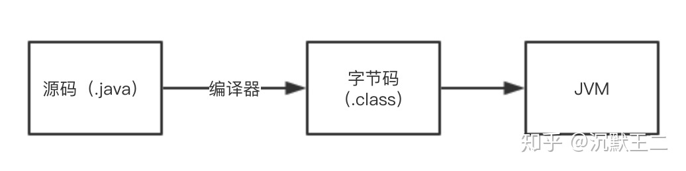


到底 Java 字节码是什么样子，我们借助一段简单的代码来看一看。

源码如下：

```text
package com.cmower.java_demo;

public class Test {

    public static void main(String[] args) {
        System.out.println("沉默王二");
    }

}
```

代码编译通过后，通过 `xxd Test.class` 命令查看一下这个字节码文件。

```text
xxd Test.class
00000000: cafe babe 0000 0034 0022 0700 0201 0019  .......4."......
00000010: 636f 6d2f 636d 6f77 6572 2f6a 6176 615f  com/cmower/java_
00000020: 6465 6d6f 2f54 6573 7407 0004 0100 106a  demo/Test......j
00000030: 6176 612f 6c61 6e67 2f4f 626a 6563 7401  ava/lang/Object.
00000040: 0006 3c69 6e69 743e 0100 0328 2956 0100  ..<init>...()V..
00000050: 0443 6f64 650a 0003 0009 0c00 0500 0601  .Code...........
00000060: 000f 4c69 6e65 4e75 6d62 6572 5461 626c  ..LineNumberTabl
```

感觉有点懵逼，对不对？

懵就对了。

这段字节码中的 `cafe babe` 被称为“魔数”，是 JVM 识别 .class 文件的标志。文件格式的定制者可以自由选择魔数值（只要没用过），比如说 .png 文件的魔数是 `8950 4e47`。

至于其他内容嘛，可以选择忘记了。


### [类加载过程](https://snailclimb.gitee.io/javaguide/#/docs/java/jvm/类加载过程?id=类加载过程)


类加载的过程：[JavaGuide](https://snailclimb.gitee.io/javaguide/#/docs/java/jvm/%E7%B1%BB%E5%8A%A0%E8%BD%BD%E8%BF%87%E7%A8%8B)


准备：我们定义了public static int value=111 ，那么 value 变量在准备阶段的初始值就是 0 而不是111（初始化阶段才会赋值）。特殊情况：比如给 value 变量加上了 fianl 关键字public static final int value=111 ，那么准备阶段 value 的值就被赋值为 111


解析动作：主要针对类或接口、字段、类方法、接口方法、方法类型、方法句柄和调用限定符7类符号引用进行。符号引用就是一组符号来描述目标，可以是任何字面量

了解了 Java 字节码后，我们来聊聊 Java 的类加载过程。

Java 的类加载过程可以分为 5 个阶段：**载入、验证、准备、解析和初始化**。这 5 个阶段一般是顺序发生的，但在动态绑定的情况下，解析阶段发生在初始化阶段之后。

1. Loading（载入）

   JVM 在该阶段的主要目的是将字节码从不同的数据源（可能是 class 文件、也可能是 jar 包，甚至网络）转化为二进制字节流加载到内存中，并生成一个代表该类的 `java.lang.Class` 对象。

2. Verification（验证）

   JVM 会在该阶段对二进制字节流进行校验，只有符合 JVM 字节码规范的才能被 JVM 正确执行。该阶段是保证 JVM 安全的重要屏障，下面是一些主要的检查。

   * 确保二进制字节流格式符合预期（比如说是否以 `cafe bene` 开头）。
   * 是否所有方法都遵守访问控制关键字的限定。
   * 方法调用的参数个数和类型是否正确。
   * 确保变量在使用之前被正确初始化了。
   * 检查变量是否被赋予恰当类型的值。

3. Preparation（准备）

   JVM 会在该阶段对类变量（也称为静态变量，`static` 关键字修饰的）分配内存并初始化（对应数据类型的默认初始值，如 0、0L、null、false 等）。

   也就是说，假如有这样一段代码：

   ```java
   public String chenmo = "沉默";
   public static String wanger = "王二";
   public static final String cmower = "沉默王二";
   ```

   chenmo 不会被分配内存，而 wanger 会；但 wanger 的初始值不是“王二”而是 `null`。

   需要注意的是，`static final` 修饰的变量被称作为常量，和类变量不同。常量一旦赋值就不会改变了，所以 cmower 在准备阶段的值为“沉默王二”而不是 `null`。

4. Resolution（解析）

   该阶段将常量池中的符号引用转化为直接引用。

   what？符号引用，直接引用？

   **符号引用**以一组符号（任何形式的字面量，只要在使用时能够无歧义的定位到目标即可）来描述所引用的目标。

   在编译时，Java 类并不知道所引用的类的实际地址，因此只能使用符号引用来代替。比如 `com.Wanger` 类引用了 `com.Chenmo` 类，编译时 Wanger 类并不知道 Chenmo 类的实际内存地址，因此只能使用符号 `com.Chenmo`。

   **直接引用**通过对符号引用进行解析，找到引用的实际内存地址。

5. Initialization（初始化）

   该阶段是类加载过程的最后一步。在准备阶段，类变量已经被赋过默认初始值，而在初始化阶段，类变量将被赋值为代码期望赋的值。换句话说，初始化阶段是执行类构造器方法的过程。

   oh，no，上面这段话说得很抽象，不好理解，对不对，我来举个例子。

   ```java
   String cmower = new String("沉默王二");
   ```

   上面这段代码使用了 `new` 关键字来实例化一个字符串对象，那么这时候，就会调用 String 类的构造方法对 cmower 进行实例化。


### 类加载器

聊完类加载过程，就不得不聊聊类加载器。

一般来说，Java 程序员并不需要直接同类加载器进行交互。JVM 默认的行为就已经足够满足大多数情况的需求了。不过，如果遇到了需要和类加载器进行交互的情况，而对类加载器的机制又不是很了解的话，就不得不花大量的时间去调试 
`ClassNotFoundException` 和 `NoClassDefFoundError` 等异常。

对于任意一个类，都需要由它的类加载器和这个类本身一同确定其在 JVM 中的唯一性。也就是说，如果两个类的加载器不同，即使两个类来源于同一个字节码文件，那这两个类就必定不相等（比如两个类的 Class 对象不 `equals`）。

站在程序员的角度来看，Java 类加载器可以分为三种。

1. 启动类加载器（Bootstrap Class-Loader），加载 `jre/lib` 包下面的 jar 文件，比如说常见的 rt.jar。

2. 扩展类加载器（Extension or Ext Class-Loader），加载 `jre/lib/ext` 包下面的 jar 文件。

3. 应用类加载器（Application or App Clas-Loader），根据程序的类路径（classpath）来加载 Java 类。

来来来，通过一段简单的代码了解下。

```java
public class Test {
    public static void main(String[] args) {
        ClassLoader loader = Test.class.getClassLoader();
        while (loader != null) {
            System.out.println(loader.toString());
            loader = loader.getParent();
        }
    }
}
```

每个 Java 类都维护着一个指向定义它的类加载器的引用，通过 `类名.class.getClassLoader()` 可以获取到此引用；然后通过 `loader.getParent()` 可以获取类加载器的上层类加载器。

这段代码的输出结果如下：

```text
sun.misc.Launcher$AppClassLoader@73d16e93
sun.misc.Launcher$ExtClassLoader@15db9742
```

第一行输出为 Test 的类加载器，即应用类加载器，它是 `sun.misc.Launcher$AppClassLoader` 类的实例；第二行输出为扩展类加载器，是 `sun.misc.Launcher$ExtClassLoader` 类的实例。那启动类加载器呢？

按理说，扩展类加载器的上层类加载器是启动类加载器，但在我这个版本的 JDK 中， 扩展类加载器的 `getParent()` 返回 `null`。所以没有输出。


### 双亲委派模型

如果以上三种类加载器不能满足要求的话，程序员还可以自定义类加载器（继承 `java.lang.ClassLoader` 类），它们之间的层级关系如下图所示。


这种层次关系被称作为**双亲委派模型**：如果一个类加载器收到了加载类的请求，它会先把请求委托给上层加载器去完成，上层加载器又会委托上上层加载器，一直到最顶层的类加载器；如果上层加载器无法完成类的加载工作时，当前类加载器才会尝试自己去加载这个类。

PS：双亲委派模型突然让我联想到朱元璋同志，这个同志当上了皇帝之后连宰相都不要了，所有的事情都亲力亲为，只有自己没精力没时间做的事才交给大臣们去干。

使用双亲委派模型有一个很明显的好处，那就是 Java 类随着它的类加载器一起具备了一种带有优先级的层次关系，这对于保证 Java 程序的稳定运作很重要。

上文中曾提到，如果两个类的加载器不同，即使两个类来源于同一个字节码文件，那这两个类就必定不相等——双亲委派模型能够保证同一个类最终会被特定的类加载器加载。


什么是栈、局部变量表、操作数栈：https://blog.csdn.net/wangwengcn/article/details/84269227?utm_medium=distribute.pc_relevant_t0.none-task-blog-BlogCommendFromMachineLearnPai2-1.control&depth_1-utm_source=distribute.pc_relevant_t0.none-task-blog-BlogCommendFromMachineLearnPai2-1.control

操作数栈：后进先出（Last-In-First-Out）的操作数栈，也可以称之为表达式栈（Expression Stack）。

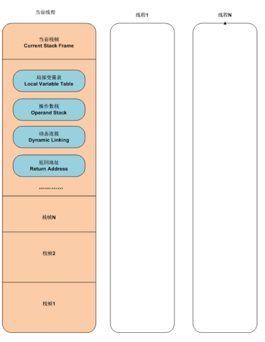

[Java中线程与堆栈的关系](https://www.cnblogs.com/heihaozi/p/11741733.html)：

**栈**是线程私有的，每个线程都是自己的栈，每个线程中的每个方法在执行的同时会创建一个栈帧用于存局部变量表、操作数栈、动态链接、方法返回地址等信息。每一个方法从调用到执行完毕的过程，就对应着一个栈帧在虚拟机栈中从入栈到出栈的过程。其中局部变量表，存放基本类型（boolean、byte、char、short、int、float）、对象的引用等等，对象的引用不是对象实例本身，而是指向对象实例的一个指针。

**堆**是线程共享的，所有的对象的实例和数组都存放在堆中，任何线程都可以访问。Java的垃圾自动回收机制就是运用这个区域的。

**方法区**也是线程共享的，用于存放 **类信息（包括类的名称、方法信息、字段信息）、常量、静态变量以及即时编译器编译后的代码** 等等。

这么讲比较抽象，写段代码：

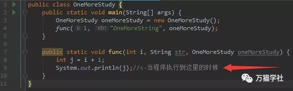

当程序执行到箭头指向那一个行代码的时候，
入参i和局部变量j都是基本类型，直接存放在栈中。
入参str和oneMoreStudy是对象类型，在栈中只存放对象的引用。
如下图：
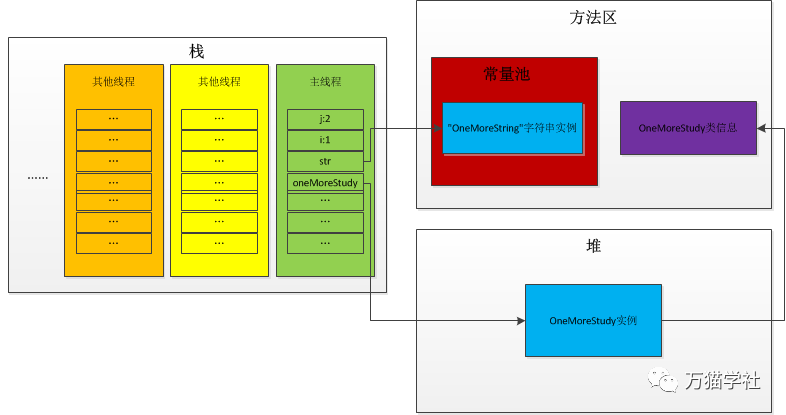


### 对象的加载过程

对象加载过程中发生了什么：https://blog.csdn.net/weixin_43392489/article/details/102746109

下图便是 Java 对象的创建过程，我建议最好是能默写出来，并且要掌握每一步在做什么。 [](https://camo.githubusercontent.com/f223f2f3ab0f1f6ecdbadf06dbc8b0692e0c9625d83a78c59597704f6282fb68/68747470733a2f2f757365722d676f6c642d63646e2e786974752e696f2f323031382f382f32322f313635363165353961343133353836393f773d39353026683d32373926663d706e6726733d3238353239)

**①类加载检查：** 虚拟机遇到一条 new 指令时，首先将去检查这个指令的参数是否能在常量池中定位到这个类的符号引用，并且检查这个符号引用代表的类是否已被加载过、解析和初始化过。如果没有，那必须先执行相应的类加载过程。

**②分配内存：** 在**类加载检查**通过后，接下来虚拟机将为新生对象**分配内存**。对象所需的内存大小在类加载完成后便可确定，为对象分配空间的任务等同于把一块确定大小的内存从 Java 堆中划分出来。**分配方式**有 **“指针碰撞”** 和 **“空闲列表”** 两种，**选择那种分配方式由 Java 堆是否规整决定，而Java堆是否规整又由所采用的垃圾收集器是否带有压缩整理功能决定**。

**内存分配的两种方式：（补充内容，需要掌握）**

选择以上两种方式中的哪一种，取决于 Java 堆内存是否规整。而 Java 堆内存是否规整，取决于 GC 收集器的算法是"标记-清除"，还是"标记-整理"（也称作"标记-压缩"），值得注意的是，复制算法内存也是规整的

[](https://camo.githubusercontent.com/adc1deb61d8307a66021809c7e39e9a4d89e4d9f0298e4a4da59010a744756c5/68747470733a2f2f757365722d676f6c642d63646e2e786974752e696f2f323031382f382f32322f313635363165353961343061326333643f773d3134323626683d33333326663d706e6726733d3236333436)

**内存分配并发问题（补充内容，需要掌握）**

在创建对象的时候有一个很重要的问题，就是线程安全，因为在实际开发过程中，创建对象是很频繁的事情，作为虚拟机来说，必须要保证线程是安全的，通常来讲，虚拟机采用两种方式来保证线程安全：

- **CAS+失败重试：** CAS 是乐观锁的一种实现方式。所谓乐观锁就是，每次不加锁而是假设没有冲突而去完成某项操作，如果因为冲突失败就重试，直到成功为止。**虚拟机采用 CAS 配上失败重试的方式保证更新操作的原子性。**
- **TLAB：** 为每一个线程预先在Eden区分配一块儿内存，JVM在给线程中的对象分配内存时，首先在TLAB分配，当对象大于TLAB中的剩余内存或TLAB的内存已用尽时，再采用上述的CAS进行内存分配

**③初始化零值：** 内存分配完成后，虚拟机需要将分配到的内存空间都初始化为零值（不包括对象头），这一步操作保证了对象的实例字段在 Java 代码中可以不赋初始值就直接使用，程序能访问到这些字段的数据类型所对应的零值。

**④设置对象头：** 初始化零值完成之后，**虚拟机要对对象进行必要的设置**，例如这个对象是那个类的实例、如何才能找到类的元数据信息、对象的哈希吗、对象的 GC 分代年龄等信息。 **这些信息存放在对象头中。** 另外，根据虚拟机当前运行状态的不同，如是否启用偏向锁等，对象头会有不同的设置方式。

**⑤执行 init 方法：** 在上面工作都完成之后，从虚拟机的视角来看，一个新的对象已经产生了，但从 Java 程序的视角来看，对象创建才刚开始，`<init>` 方法还没有执行，所有的字段都还为零。所以一般来说，执行 new 指令之后会接着执行 `<init>` 方法，把对象按照程序员的意愿进行初始化，这样一个真正可用的对象才算完全产生出来。


## 重点补充内容

### String 类和常量池

**1 String 对象的两种创建方式：**

```
     String str1 = "abcd";
     String str2 = new String("abcd");
     System.out.println(str1==str2);//false
```

这两种不同的创建方法是有差别的，第一种方式是在常量池中拿对象，第二种方式是直接在堆内存空间创建一个新的对象。 [](https://camo.githubusercontent.com/0f815ad9004e7a91c5f76b2a2e4d34f0b3b36a289637a5bf8089049768c6e8de/68747470733a2f2f757365722d676f6c642d63646e2e786974752e696f2f323031382f382f32322f313635363165353961353963303837333f773d36393826683d33353526663d706e6726733d3130343439) 记住：只要使用new方法，便需要创建新的对象。

**2 String 类型的常量池比较特殊。它的主要使用方法有两种：**

- 直接使用双引号声明出来的 String 对象会直接存储在常量池中。
- 如果不是用双引号声明的 String 对象，可以使用 String 提供的 intern 方法。String.intern() 是一个 Native 方法，它的作用是：如果运行时常量池中已经包含一个等于此 String 对象内容的字符串，则返回常量池中该字符串的引用；如果没有，则在常量池中创建与此 String 内容相同的字符串，并返回常量池中创建的字符串的引用。

```
	      String s1 = new String("计算机");
	      String s2 = s1.intern();
	      String s3 = "计算机";
	      System.out.println(s2);//计算机
	      System.out.println(s1 == s2);//false，因为一个是堆内存中的String对象一个是常量池中的String对象，
	      System.out.println(s3 == s2);//true，因为两个都是常量池中的String对象
```

**3 String 字符串拼接**

```
String str1 = "str";
String str2 = "ing";

String str3 = "str" + "ing";//常量池中的对象
String str4 = str1 + str2; //在堆上创建的新的对象	  
String str5 = "string";//常量池中的对象
System.out.println(str3 == str4);//false
System.out.println(str3 == str5);//true
System.out.println(str4 == str5);//false
```

[](https://camo.githubusercontent.com/8e3c4e4b8ea9401ccc7600275e0ae520a5f56641fb23cf30c7afb392386652e4/68747470733a2f2f757365722d676f6c642d63646e2e786974752e696f2f323031382f382f32322f313635363165353961346431336639323f773d35393326683d36303326663d706e6726733d3232323635)

尽量避免多个字符串拼接，因为这样会重新创建对象。如果需要改变字符串的话，可以使用 StringBuilder 或者 StringBuffer。

### String s1 = new String("abc");这句话创建了几个对象？

**创建了两个对象。**

**验证：**

```
		String s1 = new String("abc");// 堆内存的地址值
		String s2 = "abc";
		System.out.println(s1 == s2);// 输出false,因为一个是堆内存，一个是常量池的内存，故两者是不同的。
		System.out.println(s1.equals(s2));// 输出true
```

**结果：**

```
false
true
```

**解释：**

先有字符串"abc"放入常量池，然后 new 了一份字符串"abc"放入Java堆(字符串常量"abc"在编译期就已经确定放入常量池，而 Java 堆上的"abc"是在运行期初始化阶段才确定)，然后 Java 栈的 str1 指向Java堆上的"abc"。

### 8种基本类型的包装类和常量池

- **Java 基本类型的包装类的大部分都实现了常量池技术，即Byte,Short,Integer,Long,Character,Boolean；这5种包装类默认创建了数值[-128，127]的相应类型的缓存数据，但是超出此范围仍然会去创建新的对象。**
- **两种浮点数类型的包装类 Float,Double 并没有实现常量池技术。**

```
		Integer i1 = 33;
		Integer i2 = 33;
		System.out.println(i1 == i2);// 输出true
		Integer i11 = 333;
		Integer i22 = 333;
		System.out.println(i11 == i22);// 输出false
		Double i3 = 1.2;
		Double i4 = 1.2;
		System.out.println(i3 == i4);// 输出false
```

**Integer 缓存源代码：**

```
/**
*此方法将始终缓存-128到127（包括端点）范围内的值，并可以缓存此范围之外的其他值。
*/
    public static Integer valueOf(int i) {
        if (i >= IntegerCache.low && i <= IntegerCache.high)
            return IntegerCache.cache[i + (-IntegerCache.low)];
        return new Integer(i);
    }
```

**应用场景：**

1. Integer i1=40；Java 在编译的时候会直接将代码封装成Integer i1=Integer.valueOf(40);，从而使用常量池中的对象。
2. Integer i1 = new Integer(40);这种情况下会创建新的对象。

```
  Integer i1 = 40;
  Integer i2 = new Integer(40);
  System.out.println(i1==i2);//输出false
```

**Integer比较更丰富的一个例子:**

```
  Integer i1 = 40;
  Integer i2 = 40;
  Integer i3 = 0;
  Integer i4 = new Integer(40);
  Integer i5 = new Integer(40);
  Integer i6 = new Integer(0);
  
  System.out.println("i1=i2   " + (i1 == i2));
  System.out.println("i1=i2+i3   " + (i1 == i2 + i3));
  System.out.println("i1=i4   " + (i1 == i4));
  System.out.println("i4=i5   " + (i4 == i5));
  
  // i4 == i5 + i6，因为+这个操作符不适用于Integer对象，首先i5和i6进行自动拆箱操作，进行数值相加，即i4 == 40
  System.out.println("i4=i5+i6   " + (i4 == i5 + i6));     
  
  System.out.println("40=i5+i6   " + (40 == i5 + i6));     
```

结果：

```
i1=i2   true
i1=i2+i3   true
i1=i4   false
i4=i5   false
i4=i5+i6   true
40=i5+i6   true
```

解释：

语句i4 == i5 + i6，因为+这个操作符不适用于Integer对象，首先i5和i6进行自动拆箱操作，进行数值相加，即i4 == 40。然后Integer对象无法与数值进行直接比较，所以i4自动拆箱转为int值40，最终这条语句转为40 == 40进行数值比较。


#### 对象|变量的初始化时机

final变量必须进行初始化。否则就会报编译错误。The blank final field field_d5 may not have been initialized

- static final：在连接的 准备阶段，初始化为 用户设定的值！！！！！！！！！

static成员变量的初始化：发生在类被类加载器（classLoader）加载的时候系统会对没有初始化的静态成员变量在静态区进行默认赋值。

- static 非final变量：会在连接的 准备阶段，初始化为 默认的0值。

普通成员变量的初始化：==发生在JVM为类生成实例开辟空间的时候进行默认初始化赋值，（在构造函数中赋初值？，sun猜测）==

局部变量：程序员自己初始化。


对象初始化时机：https://blog.csdn.net/weixin_37766296/article/details/80548111?utm_medium=distribute.pc_relevant_t0.none-task-blog-BlogCommendFromMachineLearnPai2-1.control&depth_1-utm_source=distribute.pc_relevant_t0.none-task-blog-BlogCommendFromMachineLearnPai2-1.control


- 


JVM内存模型：https://www.cnblogs.com/yzwall/p/6661528.html

为什么volatile 不能保证原子性：https://www.cnblogs.com/simpleDi/p/11517150.html

volatile 与 内存屏障 的语义分析：https://www.cnblogs.com/webor2006/p/12598378.html

那些指令，用volatile可以当简单的锁使用：https://www.cnblogs.com/lfalex0831/p/9516777.html

final如何保持可见性：https://www.cnblogs.com/leesf456/p/5291484.html


内存模型三大特性：

**1、原子性：**

（1）原子的意思代表着——“不可分”；
（2）在整个操作过程中**不会被线程调度器中断的操作，都可认为是原子性**。原子性是**拒绝多线程交叉操作的**，不论是多核还是单核，具有原子性的量，**同一时刻只能有一个线程来对它进行操作**。例如 a=1是原子性操作，但是a++和a +=1就不是原子性操作。

- **synchronizd**临界区执行具有原子性；
- **volatile**仅仅保证对单个**volatile**变量的操作具有原子性；

**2、可见性**

线程执行结果在内存中对其它线程的可见性。

变量经过volatile修饰后，对此变量进行写操作时，汇编指令中会有一个LOCK前缀指令，加了这个指令后，会引发两件事情：

- 发生修改后**强制**将当前处理器缓存行的数据写**回到系统内存**。
- 这个写回内存的操作会使得**在其他处理器缓存了该内存地址无效，重新从内存中读取。**


- 单线程：不存在内存可见性问题；

- 多线程：Java通过**volatile**, **synchronized**, **final**关键字实现可见性；

- - **volatile**：valatile变量保证变量新值立即被同步回主存，每次读取valtile变量都立即从主存刷新；

  - **synchronized**：对变量进行解锁前，将对应变量同步回内存；

  - **final**：final字段一旦初始化完毕，并且this引用没有发生逃逸，其他线程立即看到final字段值；

    > this逃逸：在构造函数返回前，被构造对象的引用不能为其他线程可见，因为此时的 final 域可能还没有被初始化。如果obj = this, obj又被其他线程给拿到了，就发生了逃逸。因为 this可能还没有被初始化完毕。
    >
    > ==请看什么是final溢出==

**3、有序性**

在本线程内观察，所有操作都是有序的（即指令重排不会导致单线程程序执行结果与排序前有任何差别）。在一个线程观察另一个线程，所有操作都是无序的，无序是因为发生了指令重排序。在 Java 内存模型中，允许编译器和处理器对指令进行重排序，重排序过程不会影响到单线程程序的执行，却会影响到多线程并发执行的正确性。

Java通过**volatile**, **synchronized**保证线程间操作的有序性

- - **volatile**通过禁止重排序实现有序性；
  - **synchronized**通过声明临界区，保证线程互斥访问，实现有序性；


# 5 MySQL

## [MySQL必知必会思维导图](https://naotu.baidu.com/file/15721c19d4a9b86f6bad02c200904b28)

主要来自于这里：[MySQL热点问题的总结](https://github.com/ewenliu/Learning_Note/blob/master/Mysql热点问题总结.md)


聚簇索引和非聚簇索引：https://www.cnblogs.com/jiawen010/p/11805241.html

- 


数据库如何优化Query查询速度：https://www.cnblogs.com/crazylqy/p/4065330.html

1. 优化更需要优化的Query；高并发低消耗（相对）的 Query  优先于 低并发高消耗的 Query
2. 定位优化对象的性能瓶颈；利用MySQL的PROFILING，定位是IO还是CPU消耗比较大
3. 从 Explain 入手；Explain来验证调整的结果是否满足自己预定的执行计划
4. **永远用小结果集驱动大的结果集**；？？，https://www.cnblogs.com/crazylqy/p/7614903.html
5. **只取出自己需要的Columns**
6. 仅仅使用最有效的过滤条件。主键能搞定的，就不要用辅助索性，辅助索引能搞定的，就不要用联合索引。
7. 尽可能避免复杂的Join和子查询。复杂的Join会锁住多个表，降低并发度，所以尽量优化成少一点的表。


## B、B+、为什么B+

**B+树和B树的区别**

[b树和b+树的区别_login_sonata的博客-CSDN博客_b树与b+树的区别](https://blog.csdn.net/login_sonata/article/details/75268075)


**二叉查找树**

一个二叉查找树是由n个节点随机构成，所以，对于某些情况，二叉查找树会退化成一个有n个节点的线性链。显然这个二叉树的查询效率就很低，因此若想最大性能的构造一个二叉查找树，需要这个二叉树是平衡的，从而引出了一个新的定义-平衡二叉树AVL。


**AVL树**

AVL树是带有平衡条件的二叉查找树，一般是用平衡因子差值判断是否平衡并通过旋转来实现平衡，左右子树树高不超过1，和红黑树相比，它是严格的平衡二叉树，平衡条件必须满足所有节点的左右子树高度差不超过1。不管我们是执行插入还是删除操作，只要不满足上面的条件，就要通过旋转来保持平衡，而旋转是非常耗时的。由此我们可以知道**AVL树适合用于插入删除次数比较少，但查找多的情况**。 ==因为插入删除AVL保持平衡而旋转很耗时间==

由于维护这种高度平衡所付出的代价比从中获得的效率收益还大，故而实际的应用不多，更多的地方是用追求局部而不是非常严格整体平衡的红黑树。当然，如果应用场景中对插入删除不频繁，只是对查找要求较高，那么AVL还是较优于红黑树。


**红黑树**

一种二叉查找树，但在每个节点增加一个存储位表示节点的颜色，可以是red或black。通过对任何一条从根到叶子的路径上各个节点着色的方式的限制，红黑树确保没有一条路径会比其它路径长出两倍。它是一种弱平衡二叉树(由于是若平衡，可以推出，相同的节点情况下，AVL树的高度低于红黑树)，相对于要求严格的AVL树来说，它的旋转次数变少，所以对于搜索、插入、删除操作多的情况下，我们就用红黑树。

广泛用于C++的STL中，Map和Set都是用红黑树实现的； 


**B树**

我们在MySQL中的数据一般是放在磁盘中的，读取数据的时候肯定会有访问磁盘的操作，磁盘中有两个机械运动的部分，分别是盘片旋转和磁臂移动。盘片旋转就是我们市面上所提到的多少转每分钟，而磁盘移动则是在盘片旋转到指定位置以后，移动磁臂后开始进行数据的读写。那么这就存在一个定位到磁盘中的块的过程，而定位是磁盘的存取中花费时间比较大的一块，毕竟机械运动花费的时候要远远大于电子运动的时间。当大规模数据存储到磁盘中的时候，显然定位是一个非常花费时间的过程，但是我们可以通过B树进行优化，提高磁盘读取时定位的效率。

为什么B类树可以进行优化呢？我们可以根据B类树的特点，构造一个多阶的B类树，然后在尽量多的在结点上存储相关的信息，保证层数尽量的少，以便后面我们可以更快的找到信息，磁盘的I/O操作也少一些，而且B类树是平衡树，每个结点到叶子结点的高度都是相同，这也保证了每个查询是稳定的。

总的来说，B/B+树是为了磁盘或其它存储设备而设计的一种平衡多路查找树(相对于二叉，B树每个内节点有多个分支)，与红黑树相比，在相同的的节点的情况下，一颗B/B+树的高度远远小于红黑树的高度(在下面B/B+树的性能分析中会提到)。B/B+树上操作的时间通常由存取磁盘的时间和CPU计算时间这两部分构成，而CPU的速度非常快，所以B树的操作效率取决于访问磁盘的次数，关键字总数相同的情况下B树的高度越小，磁盘I/O所花的时间越少。

**B树的性质：**

1. 定义任意非叶子结点最多只有M个儿子，且M>2； 
2. 根结点的儿子数为[2， M]； 
3. 除根结点以外的非叶子结点的儿子数为[M/2， M]； 
4. 每个结点存放至少M/2-1（取上整）和至多M-1个关键字；（至少2个关键字） 
5. 非叶子结点的关键字个数=指向儿子的指针个数-1； 
6. 非叶子结点的关键字：K[1]， K[2]， …， K[M-1]；且K[i] < K[i+1]； 
7. 非叶子结点的指针：P[1]， P[2]， …， P[M]；其中P[1]指向关键字小于K[1]的子树，P[M]指向关键字大于K[M-1]的子树，其它P[i]指向关键字属于(K[i-1]， K[i])的子树； 
8. 所有叶子结点位于同一层； 


**B+树**

B+树是应文件系统所需而产生的一种B树的变形树（文件的目录一级一级索引，只有最底层的叶子节点（文件）保存数据）非叶子节点只保存索引，不保存实际的数据，数据都保存在叶子节点中，这不就是文件系统文件的查找吗?

我们就举个文件查找的例子：有3个文件夹a、b、c， a包含b，b包含c，一个文件yang.c，a、b、c就是索引（存储在非叶子节点）， a、b、c只是要找到的yang.c的key，而实际的数据yang.c存储在叶子节点上。

所有的非叶子节点都可以看成索引部分！

B+树的性质(下面提到的都是和B树不相同的性质)：

1. 非叶子节点的子树指针与关键字个数相同； 
2. 非叶子节点的子树指针p[i]，指向关键字值属于[k[i]，k[i+1]]的子树.**(B树是开区间，也就是说B树不允许关键字重复，B+树允许重复)**； 
3. 为所有叶子节点增加一个链指针； 
4. 所有关键字都在叶子节点出现(稠密索引). (且链表中的关键字恰好是有序的)； 
5. 非叶子节点相当于是叶子节点的索引(稀疏索引)，叶子节点相当于是存储(关键字)数据的数据层； 
6. 更适合于文件系统；


==为什么说B+树比B树更适合数据库索引？==

1. B+树的磁盘读写代价更低：

   B+树的非叶子节点不含有指向关键字具体信息的指针，因此其内部节点相对B树更小。如果把所有同一内部节点的关键字存放在同一盘块中，那么盘块所能容纳的关键字数量也越多，一次性读入内存的需要查找的关键字也就越多，相对IO读写次数就降低了。

2. B+树的查询效率更加稳定：

   任何关键字的查找必须走一条从根结点到叶子结点的路。所有关键字查询的路径长度相同，导致每一个数据的查询效率相当。

3. 方便扫库：

   由于B+树的数据都存储在叶子结点中，分支结点均为索引，扫库只需要扫一遍叶子结点即可，但是B树因为其分支结点同样存储着数据，我们要找到具体的数据，需要进行一次中序遍历按序来扫，所以B+树更加适合在区间查询的情况，所以通常B+树用于数据库索引。而且在数据库中基于范围的查询是非常频繁的，而B树不支持这样的操作或者说效率太低。


参考：

为什么用B树：https://www.cnblogs.com/zhuyeshen/p/12072997.html

[深入理解数据库索引采用B树和B+树的原因](https://www.cnblogs.com/zhuyeshen/p/12073135.html)

[Mysql 索引为什么要用B+数](https://www.cnblogs.com/alomsc/p/12746338.html)

磁盘IO次数和索引数据结构查询的次数以及磁盘IO与预读都有关系，具体关系：磁盘IO次数 <= B+树中从根节点一直到叶子节点整个过程中查询的节点数。 一次磁盘IO操作可以取出物理存储中相邻的一大片数据，如果查询的索引数据（就是B+树中从根节点一直到叶子节点整个过程中查询的节点数）都集中在该区域，那么只需要一次磁盘IO，否则就需要多次磁盘IO。


原因就是为了减少磁盘io次数，因为b+树所有最终的子节点都能在叶子节点里找见，
所以非叶子节点只需要存`索引范围和指向下一级索引（或者叶子节点）的地址` 就行了，
不需要存整行的数据，所以占用空间非常小，直到找到叶子节点才加载进来整行的数据。

B树非叶子节点也会存数据，所以不适合mysql(以后研究下mongo为啥用b树 再补充)


B+树适合作为数据库的基础结构，完全是因为计算机的内存-机械硬盘两层存储结构。内存可以完成快速的随机访问（随机访问即给出任意一个地址，要求返回这个地址存储的数据）但是容量较小。而硬盘的随机访问要经过机械动作（1磁头移动 2盘片转动），访问效率比内存低几个数量级，但是硬盘容量较大。典型的数据库容量大大超过可用内存大小，这就决定了在B+树中检索一条数据很可能要借助几次磁盘IO操作来完成。如下图所示：通常向下读取一个节点的动作可能会是一次磁盘IO操作，不过非叶节点通常会在初始阶段载入内存以加快访问速度。同时为提高在节点间横向遍历速度，真实数据库中可能会将图中蓝色的CPU计算/内存读取优化成二叉搜索树（InnoDB中的page directory机制）。


 

真实数据库中的B+树应该是非常扁平的，可以通过向表中顺序插入足够数据的方式来验证InnoDB中的B+树到底有多扁平。我们通过如下图的CREATE语句建立一个只有简单字段的测试表，然后不断添加数据来填充这个表。通过下图的统计数据（来源见参考文献1）可以分析出几个直观的结论，这几个结论宏观的展现了数据库里B+树的尺度。

1 每个叶子节点存储了468行数据，每个非叶子节点存储了大约1200个键值，这是一棵平衡的1200路搜索树！

2 对于一个22.1G容量的表，也只需要高度为3的B+树就能存储了，这个容量大概能满足很多应用的需要了。如果把高度增大到4，则B+树的存储容量立刻增大到25.9T之巨！

3 对于一个22.1G容量的表，B+树的高度是3，如果要把非叶节点全部加载到内存也只需要少于18.8M的内存（如何得出的这个结论？因为对于高度为2的树，1203个叶子节点也只需要18.8M空间，而22.1G从良表的高度是3，非叶节点1204个。同时我们假设叶子节点的尺寸是大于非叶节点的，因为叶子节点存储了行数据而非叶节点只有键和少量数据。），只使用如此少的内存就可以保证只需要一次磁盘IO操作就检索出所需的数据，效率是非常之高的。

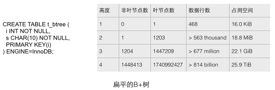


查找数据，最简单的方式是顺序查找。但是对于几十万上百万，甚至上亿的数据库查询就很慢了。

所以要对查找的方式进行优化，二叉树可以把速度提升到O(log(n，2))，查询的瓶颈在于树的深度，最坏的情况要查找到二叉树的最深层，由于，每查找深一层，就要访问更深一层的索引文件。在多达数G的索引文件中，这将是很大的开销。所以，尽量把数据结构设计的更为‘矮胖’一点就可以减少访问的层数，在众多的解决方案中，B/B+树很好的适合。

相比B树，B+树的父节点也必须存在于子节点中，是其中最大或者最小元素，==B+树的节点只存储索引key值，具体信息的地址存在于叶子节点的地址中。这就使以页为单位的索引中可以存放更多的节点==，，能减少更多的I/O支出。因此，B+树成为了数据库比较优秀的数据结构，MySQL中MyIsAM和InnoDB都是采用的B+树结构。不同的是前者是非聚集索引，后者主键是聚集索引，所谓聚集索引是物理地址连续存放的索引，在取区间的时候，查找速度非常快，但同样的，插入的速度也会受到影响而降低。聚集索引的物理位置使用链表来进行存储。


### B+相比其他的优势总结

- 多叉树：相比红黑树出读2更多叉；相比AVL树不必自选调整；都是多叉树，相比二叉树更矮胖；树低磁盘IO次数更少，B+树的叶子节点的内容更加连续，磁盘预读机制就能把相邻的数据页读到内存中来，IO又更少数据库单页能存更多，更少IO
- 叶子结点：
  - B+树的非叶子节点是主键，不存储数据，数的层级就更少，就能存更多的索引。能减少磁盘IO，就会少寻道，少旋转，少浪费了时间。
- 内容：B树非叶子存数据，但B+叶子存数据，非叶子不存数据只存索引，内存单页存储索引更多。
  - 换页就更少
  - 磁盘预读特性。连续读取数据时，相邻数据就会读取更快。
- 节点内容：B树存内容，而且只有1份；B+树非叶子节点只存索引，数据存多份：B+树查询更稳定
- 范围查找：B树没有叶子节点的指针；B+树有：B+树范围查找更优优势


为什么树矮胖 用作索引就更好呢？

[深入理解数据库索引采用B树和B+树的原因 - 那些年的代码 - 博客园](https://www.cnblogs.com/zhuyeshen/p/12073135.html)

sun总结：访问数据耗费的时间，主要取决顺访问磁盘的时间。访问磁盘的时间，主要取取决于磁盘IO时间，进一步讲磁盘IO取决于巡道、旋转时延、传输时延。局部预读原理说明：当访问一个地址数据的时候，与其相邻的数据很快也会被访问到。每次磁盘IO读取的数据我们称之为一页（page）。一页的大小与操作系统有关，**一般为4k或者8k（****[或者16k](https://snailclimb.gitee.io/javaguide/#/docs/database/MySQL Index?id=先从-mysql-的基本存储结构说起)****)**。这也就意味着读取一页内数据的时候，实际上发生了一次磁盘IO。

故而尽量选取矮胖形态（B+能够分裂）的树，磁盘IO次数能小于瘦高形（平衡二叉树）的树。


## MySQL锁机制 --------

[一张图彻底搞懂 MySQL 的锁机制 | MySQL 技术论坛](https://learnku.com/articles/39212?order_by=vote_count&)

[Mysql锁机制简单了解一下_不忘初心-CSDN博客_简单讲讲mysql的锁机制](https://blog.csdn.net/qq_34337272/article/details/80611486)

1. 尽可能让所有数据检索都通过索引来完成，避免无索引行锁升级为表锁
2. 合理设计索引，尽量缩小锁的范围
3. 尽可能较少检索条件，避免间隙锁
4. 尽量控制事务大小，减少锁定资源量和时间长度
5. 尽可能低级别事务隔离


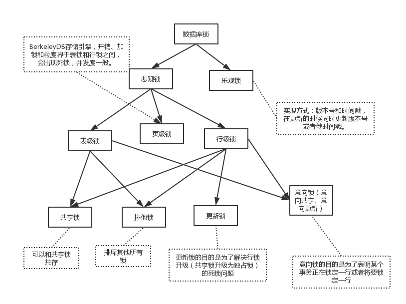

### 锁的分类

- **按锁的粒度划分**（即，每次上锁的对象是表，行还是页）：行级锁，页级锁，表级锁，
- **按锁的级别划分**：共享锁、排他锁
- **按加锁方式分**：自动锁（存储引擎自行根据需要施加的锁）、显式锁（用户手动请求的锁）
- **按操作划分**：DML锁（对数据进行操作的锁)、DDL锁（对表结构进行变更的锁）
- **最后按使用方式划分**：悲观锁、乐观锁


### 锁粒度划分

**行级锁**

行级锁是MySQL中锁定粒度最细的一种锁，表示只针对当前操作的行进行加锁。行级锁能大大减少数据库操作的冲突。其加锁粒度最小，但加锁的开销也最大。行级锁分为共享锁 和 排他锁。

特点：==开销大，加锁慢==；会出现死锁；锁定粒度最小，发生锁冲突的概率最低，并发度也最高。

**页级锁**

页级锁是MySQL中锁定粒度介于行级锁和表级锁中间的一种锁。表级锁速度快，但冲突多，行级冲突少，但速度慢。所以取了折衷的页级，**一次锁定相邻的一组记录**。==BDB支持页级锁==

特点：开销和加锁时间界于表锁和行锁之间；会出现死锁；锁定粒度界于表锁和行锁之间，并发度一般

**表级锁**

表级锁是MySQL中锁定粒度最大的一种锁，表示对当前操作的整张表加锁，它实现简单，资源消耗较少，被大部分MySQL引擎支持。最常使用的MYISAM与INNODB都支持表级锁定。表级锁定分为表共享读锁（共享锁）与表独占写锁（排他锁）。

特点：开销小，加锁快；不会出现死锁；锁定粒度大，发出锁冲突的概率最高，并发度最低。


#### MySQL常用存储引擎的锁机制

* MyISAM和MEMORY采用表级锁
* BDB采用页面锁或表级锁，默认为页面锁

* InnoDB支持行级锁和表级锁，**默认为行级锁**

InnoDB行锁是通过给索引上的索引项加锁来实现的，InnoDB这种行锁实现特点意味着：**只有通过索引条件检索数据，InnoDB才使用行级锁，否则，InnoDB将使用表锁！**

在实际应用中，要特别注意InnoDB行锁的这一特性，不然的话，可能导致大量的锁冲突，从而影响并发性能。

**行级锁都是基于索引的，如果一条SQL语句用不到索引是不会使用行级锁的，会使用表级锁。**行级锁的缺点是：由于需要请求大量的锁资源，所以速度慢，内存消耗大。

InnoDB引擎默认的修改数据语句：update，delete，insert都会自动给涉及到的数据加上排他锁。

select语句默认不会加任何锁类型，==如果加排他锁可以使用select …for update语句，加共享锁可以使用select … lock in share mode语句==

所以加过排他锁的数据行在其他事务种是不能修改数据的，也不能通过for update和lock in share mode锁的方式查询数据，但可以直接通过select …from…查询数据，因为普通查询没有任何锁机制。

##### ==猜想==

> 事务A对行a加了X锁，事务B读a，能够读出a的变化，就是能读出脏数据，uncommitted read：
>
> 不能读出a的变化，但能读出，
>

### 行级锁与死锁

MyISAM中是不会产生死锁的，因为MyISAM总是一次性获得所需的全部锁，==要么全部满足，要么全部等待。而在InnoDB中，锁是逐步获得的，就造成了死锁的可能。==

在MySQL中，行级锁并不是直接锁记录，而是锁索引。索引分为主键索引和非主键索引两种，如果一条sql语句操作了主键索引，MySQL就会锁定这条主键索引；如果一条语句操作了非主键索引，MySQL会先锁定该非主键索引，再锁定相关的主键索引。在UPDATE、DELETE操作时，MySQL不仅锁定WHERE条件扫描过的所有索引记录，而且会锁定相邻的键值，即所谓的next-key locking。

> ?：什么意思


**当两个事务同时执行，一个锁住了主键索引，在等待其他相关索引。另一个锁定了非主键索引，在等待主键索引。这样就会发生死锁。**

发生死锁后，InnoDB一般都可以检测到，并使一个事务释放锁回退，另一个获取锁完成事务。

### S锁|排他X | 意向锁IX | IS


表级行级别锁：

- S、X 
- IX、IS都是表锁。在理解兼容机制时候，当成1行看，见下文。


**InnoDB的锁机制兼容**：https://segmentfault.com/a/1190000022963513


**首先把四个名字的含义理解了：**

- X理解为独占一个表（exclusive）
- S理解为共享一个表（整个表共享读）
- IX理解为有意向写这张表的某一行（有意向独占某一行、先占一个坑）
- IS理解为有意向读这张表的某一行

**所以锁机制兼容情况可以表达为：**

1. X是独占整个表，当表中已经存在了X、S、IX、IS任意一种锁，X锁一定加不上了，因为无法满足独占。同理，表中已经存在X，其他锁都加不上了（必须独占）
2. IX和S锁不兼容，IX是独占某一行，既然IX占领了某一行，那么就不能S整个表共享读了
3. IX和IS兼容，某一行有意向独占和另一行有意向共享读是可以成立的
4. IX和IX之间兼容，可以存在IX想要独占row_a，另一个IX想要独占row_b，只要a≠b即可成立
5. 整个兼容表其实是对称的 (行列顺序都按照 X、S、IX、IS)

### 乐观锁和悲观锁

#### 乐观锁（Optimistic Lock）

假设认为数据一般情况下不会造成冲突，所以在数据进行提交更新的时候，才会正式对数据的冲突与否进行检测，如果发现冲突了，则让返回用户错误的信息，让用户决定如何去做。

**相对于悲观锁，在对数据库进行处理的时候，乐观锁并不会使用数据库提供的锁机制。一般的实现乐观锁的方式就是记录数据版本。**

数据版本，为数据增加的一个版本标识。当读取数据时，将版本标识的值一同读出，数据每更新一次，同时对版本标识进行更新。当我们提交更新的时候，判断数据库表对应记录的当前版本信息与第一次取出来的版本标识进行比对，如果数据库表当前版本号与第一次取出来的版本标识值相等，则予以更新，否则认为是过期数据。

实现数据版本有两种方式，第一种是使用版本号，第二种是使用时间戳。

##### 使用版本号实现乐观锁

使用版本号时，可以在数据初始化时指定一个版本号，每次对数据的更新操作都对版本号执行+1操作。并判断当前版本号是不是该数据的最新的版本号。

```text
1.查询出商品信息
select (status，status，version) from t_goods where id=#{id}
2.根据商品信息生成订单
3.修改商品status为2
update t_goods
set status=2，version=version+1
where id=#{id} and version=#{version};
```

乐观并发控制相信事务之间的数据竞争(data race)的概率是比较小的，==因此尽可能做下去，直到提交的时候才去锁定==，所以不会产生任何锁和死锁。但如果直接简单这么做，还是有可能会遇到不可预期的结果，例如两个事务都读取了数据库的某一行，经过修改以后写回数据库，这时就遇到了问题。

==疑问？什么问题==

> **注意：乐观锁的更新操作，最好用主键或者唯一索引来更新，这样是行锁，否则更新时会锁表**


#### 悲观锁（Pessimistic Lock）

在整个数据处理过程中，将数据处于锁定状态。**悲观锁的实现，往往依靠数据库提供的锁机制** （也只有数据库层提供的锁机制才能真正保证数据访问的排他性，否则，即使在本系统中实现了加锁机制，也无法保证外部系统不会修改数据）

- 在对任意记录进行修改前，先尝试为该记录加上排他锁（exclusive locking）。
- 如果加锁失败，说明该记录正在被修改，那么当前查询可能要等待或者抛出异常（具体响应方式由开发者根据实际需要决定）
- 如果成功加锁，那么就可以对记录做修改，事务完成后就会解锁了。
- 其间如果有其他对该记录做修改或加排他锁的操作，都会等待我们解锁或直接抛出异常。

#### MySQL InnoDB 中使用悲观锁

**要使用悲观锁，我们必须关闭mysql数据库的自动提交属性，因为MySQL默认使用autocommit模式，也就是说，当你执行一个更新操作后，==MySQL会立刻将结果进行提交。set autocommit=0;==**

```text
// 0.开始事务
begin;

// 1.查询出商品信息
select status from t_goods where id=1 for update;

// 2.根据商品信息生成订单
insert into t_orders (id，goods_id) values (null，1);

// 3.修改商品status为2
update t_goods set status=2;

// 4.提交事务
commit;
```

上面的查询语句中，我们使用了select…for update的方式，这样就通过开启排他锁的方式实现了悲观锁。此时在t_goods表中，id为1的 那条数据就被我们锁定了，其它的事务必须等本次事务提交之后才能执行。这样我们可以保证当前的数据不会被其它事务修改。

### 数据库死锁

InnoDB引擎并不会回滚大部分错误异常，但一旦侦测到死锁就会回滚。


### ==浅析MySQL二段锁??==

链接:https://blog.csdn.net/weixin_33889245/article/details/88926438?utm_medium=distribute.pc_relevant.none-task-blog-BlogCommendFromBaidu-4.control&depth_1-utm_source=distribute.pc_relevant.none-task-blog-BlogCommendFromBaidu-4.control


## 调优

### 大表优化

水平拆分可以支持非常大的数据量。需要注意的一点是：分表仅仅是解决了单一表数据过大的问题，但由于表的数据还是在同一台机器上，其实对于提升MySQL并发能力没有什么意义，所以 **水平拆分最好分库** 。

水平拆分能够 **支持非常大的数据量存储，应用端改造也少**，但 **分片事务难以解决** ，跨节点Join性能较差，逻辑复杂。《Java工程师修炼之道》的作者推荐 **尽量不要对数据进行分片，因为拆分会带来逻辑、部署、运维的各种复杂度** ，一般的数据表在优化得当的情况下支撑千万以下的数据量是没有太大问题的。如果实在要分片，尽量选择客户端分片架构，这样可以减少一次和中间件的网络I/O。

**下面补充一下数据库分片的两种常见方案：**

- **客户端代理：** **分片逻辑在应用端，封装在jar包中，通过修改或者封装JDBC层来实现。** 当当网的 **Sharding-JDBC** （推荐） 、阿里的TDDL是两种比较常用的实现。
- **中间件代理：** **在应用和数据中间加了一个代理层。分片逻辑统一维护在中间件服务中。** 我们现在谈的 **Mycat** 、360的Atlas、网易的DDB等等都是这种架构的实现。

详细内容可以参考： MySQL大表优化方案: https://segmentfault.com/a/1190000006158186


### 分库分表：

- 详细复杂方案，没有看懂：https://segmentfault.com/a/1190000006158186

- 4分钟视频，但是不全：https://www.bilibili.com/video/BV1BA41147Re?from=search&seid=5280351313409136387


#### 架构演变

- 单机单库：单表数据量不大，用户不多的时候
- V2.0：高可用设计，主写从读，提高可用性。但每个表数据还是受限，1000w时候就挺难受的
- V3.0：分库分表，解决单库或单表容量的问题。

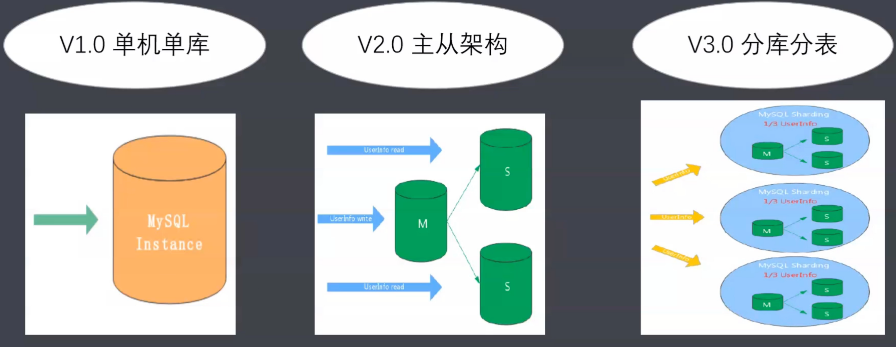


#### 垂直分库、分表

- 分库：订单order_databases、用户databases，都独立出去成为2个库
- 分表：把order，分成order_basic，order_detail。垂直拆分表
  - 提高IO效率。detail在必要的时候在去查询，内存单页能存更多数据basic，就能减少IO次数；
  - 最大化利用Cache的目的，具体在垂直拆分的时候可以将不常变的字段放一起，将经常改变的放一起。
  - 缺点：
    - 主键出现冗余。
    - 表join
    - 依然存在单表数据量过大的问题（需要水平拆分）
    - 事务处理复杂。

水平分库（建议）、分表：

- 分片规则：应该时可以应用于分库、分表上面的？

- 分库（切分）：最好，但成本高一点。有效缓解单机、单库的IO、CPU、连接数、硬件压力。
- 分表：比如取模，让base1_order_1, base_order_2，分为几个。
  - 没有把表的数据分布到不同的机器上，因此对于减轻MySQL服务器的压力来说，并没有太大的作用
  - 缺点是：？？？https://segmentfault.com/a/1190000006158186
    - 分片事务一致性难以解决
    - 跨节点Join性能差，逻辑复杂
    - 数据多次扩展难度跟维护量极大

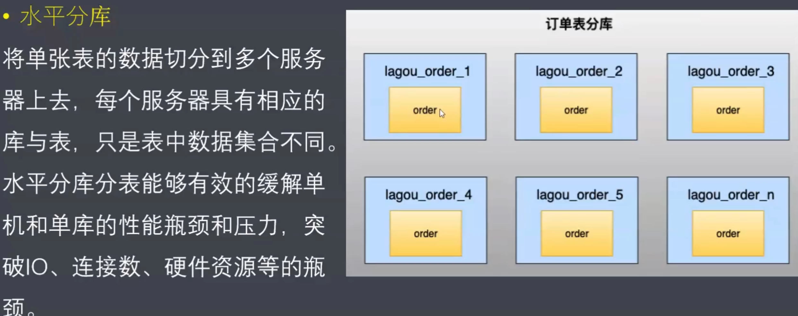


如何分片：

- 分片：就是水平切分
- 比如：范围分片、Hash分片

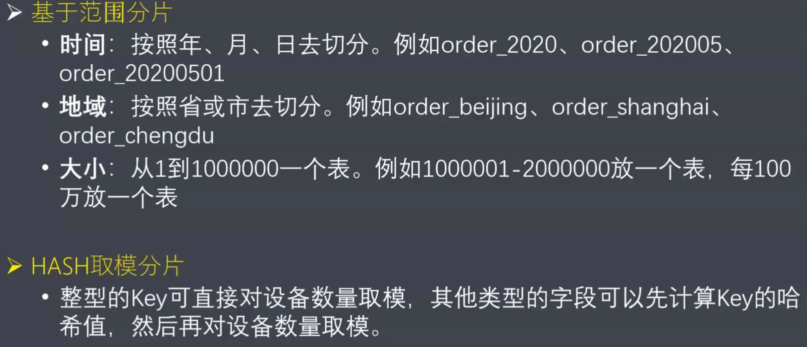


#### 两个例子

分库问题：在登录功能中，用户可以通过输入手机号，验证码方式登录；但大多数时候用 userId做分片，怎么防止 扫描全库？

1. 用户信息ID做分片处理，同时存储用户ID和手机号的映射关系（新增一个关系表），关系表按照手机号切分。
2. 根据关系表 找用户ID，在定位用户信息


订单信息分片：在拉勾网，求职者(下面统称C端用户)投递企业(下面统称B端用户)的职位产生的记录称之为订单表。

在线上的业务场景中，C端用户看自己的投递记录，每次的投递到了哪个状态，B端用户查看自己收到的简历，对于合适的简历会进行下一步沟通，同一个公司内的员工可以协作处理简历。如何能同时满足C端和B端对订单数据查询，如何避免扫描所有分库?


为了同时满足两端用户的业务场景，采用空间换时间，将一次的投递记录存为两份。C端的投递记录以用户ID为分片键，B端收到的简历按照公司D为分片键。

总结：那个条件经常用于查询，就用做分片键。其他的查询建，就做映射表比如第一个问题；或者设计2个表


#### 表分区TODO

详细：https://segmentfault.com/a/1190000006158186


#### **数据库分片的两种常见方案**

- 客户端架构：ShardingJDBC
- 代理架构：MyCat或者Atlas


#### 全局唯一ID

- **UUID**：不适合作为主键，因为太长了，并且无序不可读，查询效率低。比较适合用于生成唯一的名字的标示比如文件的名字。
- **数据库自增 id** : 两台数据库分别设置不同步长，生成不重复ID的策略来实现高可用。这种方式生成的 id 有序，但是需要独立部署数据库实例，成本高，还会有性能瓶颈。
- **利用 redis 生成 id :** 性能比较好，灵活方便，不依赖于数据库。但是，引入了新的组件造成系统更加复杂，可用性降低，编码更加复杂，增加了系统成本。
- **Twitter的snowflake算法** ：Github 地址：https://github.com/twitter-archive/snowflake。
- **美团的[Leaf](https://tech.meituan.com/2017/04/21/mt-leaf.html)分布式ID生成系统** ：Leaf 是美团开源的分布式ID生成器，能保证全局唯一性、趋势递增、单调递增、信息安全，里面也提到了几种分布式方案的对比，但也需要依赖关系数据库、Zookeeper等中间件。感觉还不错。美团技术团队的一篇文章：https://tech.meituan.com/2017/04/21/mt-leaf.html 。


### [一条SQL语句在MySQL中如何执行的](https://snailclimb.gitee.io/javaguide/#/docs/database/MySQL?id=一条sql语句在mysql中如何执行的)

[一条SQL语句在MySQL中如何执行的](https://mp.weixin.qq.com/s?__biz=Mzg2OTA0Njk0OA==&mid=2247485097&idx=1&sn=84c89da477b1338bdf3e9fcd65514ac1&chksm=cea24962f9d5c074d8d3ff1ab04ee8f0d6486e3d015cfd783503685986485c11738ccb542ba7&token=79317275&lang=zh_CN#rd)

- 连接（权限校验）、分析（词法，语法分析）、优化（根据索引权衡执行计划）、执行器（生产执行结果）

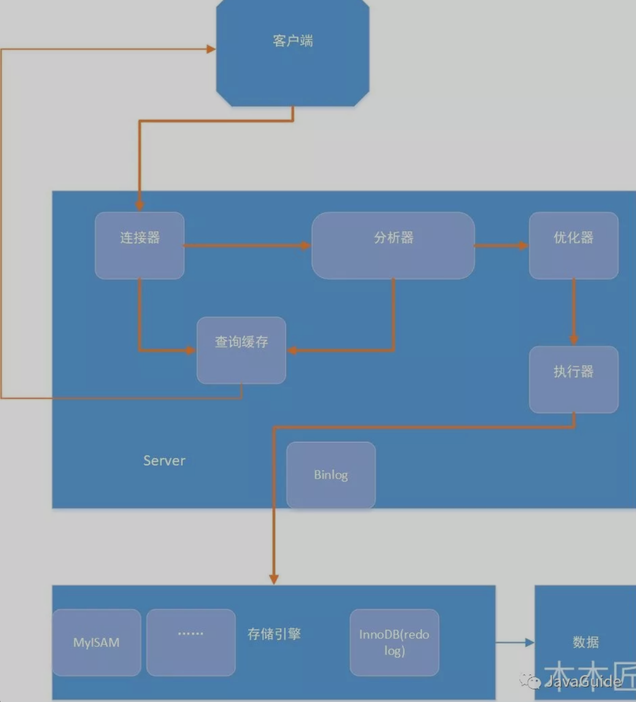

SQL 等执行过程分为两类：

- 一类对于查询等过程如下：权限校验---》查询缓存---》分析器---》优化器---》权限校验---》执行器---》引擎
- 对于更新等语句执行流程如下：分析器----》权限校验----》执行器---》引擎--》-redo log prepare---》binlog---》redo log commit


### ==[MySQL高性能优化规范建议](https://snailclimb.gitee.io/javaguide/#/docs/database/MySQL?id=mysql高性能优化规范建议)==

[MySQL高性能优化规范建议](https://mp.weixin.qq.com/s?__biz=Mzg2OTA0Njk0OA==&mid=2247485117&idx=1&sn=92361755b7c3de488b415ec4c5f46d73&chksm=cea24976f9d5c060babe50c3747616cce63df5d50947903a262704988143c2eeb4069ae45420&token=79317275&lang=zh_CN#rd)


**数据库基本设计规范**

1. 所有表必须使用 Innodb 存储引擎
2. 数据库和表的字符集统一使用 UTF8
3. 所有表和字段都需要添加注释
4. 控制单表数据量的大小,建议控制在 500 万以内
5. 谨慎使用 MySQL 分区表
6. 冷热数据分离,减小表的宽度
7. 禁止在表中建立预留字段
8. 禁止在数据库中存储图片,文件等大的二进制数据
9. 禁止在线上做数据库压力测试
10. 禁止从开发环境,测试环境直接连接生成环境数据库


**数据库字段设计规范**

1. 优先选择符合存储需要的最小的数据类型
   1. **将字符串转换成数字类型存储,如:将 IP 地址转换成整形数据**
   2. *对于非负型的数据 (如自增 ID,整型 IP) 来说,要优先使用无符号整型来存储**

2. 避免使用 TEXT,BLOB 数据类型，最常见的 TEXT 类型可以存储 64k 的数据
   1. **建议把 BLOB 或是 TEXT 列分离到单独的扩展表中**
   2. *TEXT 或 BLOB 类型只能使用前缀索引**

3. 避免使用 ENUM 类型
4. 把所有列定义为 NOT NULL
5. 使用 TIMESTAMP(4 个字节) 或 DATETIME 类型 (8 个字节) 存储时间
6. 同财务相关的金额类数据必须使用 decimal 类型


**索引设计规范**

限制每张表上的索引数量,建议单张表索引不超过 5 个

禁止给表中的每一列都建立单独的索引

- SELECT、UPDATE、DELETE 语句的 WHERE 从句中的列
- 包含在 ORDER BY、GROUP BY、DISTINCT 中的字段
- 要join的列
- 可以联合索引的不要单独建索引

每个 Innodb 表必须有个主键

> 不要使用更新频繁的列作为主键，不适用多列主键（相当于联合索引）
>
> 不要使用 UUID,MD5,HASH,字符串列作为主键（无法保证数据的顺序增长）
>
> 主键建议使用自增 ID 值

7. 对于频繁的查询优先考虑使用覆盖索引


**数据库 SQL 开发规范**

1. 建议使用预编译语句进行数据库操作

2. 避免数据类型的隐式转换（会是索引失效）

3. 充分利用表上已经存在的索引todo

   > 避免使用双%号的查询条件。如：`a like '%123%'`，（如果无前置%,只有后置%，是可以用到列上的索引的）
   >
   > 一个 SQL 只能利用到复合索引中的一列进行范围查询。如：有 a,b,c 列的联合索引，在查询条件中有 a 列的范围查询，则在 b,c 列上的索引将不会被用到。
   >
   > 在定义联合索引时，如果 a 列要用到范围查找的话，就要把 a 列放到联合索引的右侧，使用 left join 或 not exists 来优化 not in 操作，因为 not in 也通常会使用索引失效。

4. 避免使用 JOIN 关联太多的表

   1. 这个join产生的中间表，是占据内存的。join表太多，或者太大，如果join_buffer_size设置不合理，是会内存溢出的

5. in 比 or 更能利用索引。

6.  WHERE 从句中禁止对列进行函数转换和计算。因为可能会无法用到索引

7. 在明显不会有重复值时使用 UNION ALL 而不是 UNION

8. 拆分复杂的大 SQL 为多个小 SQL


**数据库操作行为规范**

1.  超 100 万行的批量写 (UPDATE,DELETE,INSERT) 操作,要分批多次进行操作
    1.  ​	大批量操作可能会造成严重的主从延迟
2.  对于大表使用 pt-online-schema-change 修改表结构
3.  禁止为程序使用的账号赋予 super 权限
    1.  当达到最大连接数限制时，还运行 1 个有 super 权限的用户连接•super 权限只能留给 DBA 处理问题的账号使用
4.  对于程序连接数据库账号,遵循权限最小原则
    1.  程序使用数据库账号只能在一个 DB 下使用，不准跨库•程序使用的账号原则上不准有 drop 权限


### [一条SQL语句执行得很慢的原因有哪些](https://snailclimb.gitee.io/javaguide/#/docs/database/MySQL?id=一条sql语句执行得很慢的原因有哪些？)

[腾讯面试：一条SQL语句执行得很慢的原因有哪些？---不看后悔系列](https://mp.weixin.qq.com/s?__biz=Mzg2OTA0Njk0OA==&mid=2247485185&idx=1&sn=66ef08b4ab6af5757792223a83fc0d45&chksm=cea248caf9d5c1dc72ec8a281ec16aa3ec3e8066dbb252e27362438a26c33fbe842b0e0adf47&token=79317275&lang=zh_CN#rd)

一个 SQL 执行的很慢，我们要分两种情况讨论：

1、大多数情况下很正常，偶尔很慢，则有如下原因

(1)、数据库在刷新脏页，例如 redo log 写满了需要同步到磁盘。

(2)、执行的时候，遇到锁，如表锁、行锁。

2、这条 SQL 语句一直执行的很慢，则有如下原因。

(1)、没有用上索引：例如该字段没有索引；由于对字段进行运算、函数操作导致无法用索引。

(2)、数据库选错了索引。优化器选索引的时候，不总是选择的最优的索引


[【思维导图-索引篇】搞定数据库索引就是这么简单](https://mp.weixin.qq.com/s?__biz=Mzg2OTA0Njk0OA==&mid=2247484848&idx=1&sn=77a0e6e82944ec385f5df17e91ce3bf2&chksm=cea24a7bf9d5c36d4b289cccb017292f9f36da9f3c887fd2b93ecd6af021fcf30121ba09799f&token=1082669959&lang=zh_CN&scene=21#wechat_redirect)


## 事务

```sql
START TRANSACTION;
SAVEPOINT delete1;
DELETE FROM student WHERE student_name = 'liming';
ROLLBACK TO delete1;
COMMIT;
```

### ACID特性

* 原子性（atomicity）：原子性指整个数据库事务是不可分割的工作单位。只有使事务中所有的数据库操作都执行成功，才算整个事务成功。事务中任何一个SQL语句执行失败，已经执行成功的SQL语句也必须撤销，数据库状态应该退回到执行事务前的状态。**通过UNDO LOG实现。**
* 一致性（consistency）：一致性指事务将数据库从一种状态转变为下一种一致的状态。在事务开始之前和事务结束以后，数据库的完整性约束没有被破坏。例如，在表中有一个字段为姓名，为唯一约束，即在表中姓名不能重复。如果一个事务对姓名字段进行了修改，但是在事务提交或事务操作发生回滚后，表中的姓名变得非唯一了，这就破坏了事务的一致性要求，即事务将数据库从一种状态变为了一种不一致的状态。因此，事务是一致性的单位，如果事务中某个动作失败了，系统可以自动撤销事务——返回初始化的状态。
* 隔离性（isolation）：隔离性还有其他的称呼，如并发控制（concurrency control）、可串行化（serializability）、锁（locking）等。事务的隔离性要求每个读写事务的对象对其他事务的操作对象能相互分离，即该事务提交前对其他事务都不可见，通常这使用锁来实现。当前数据库系统中都提供了一种粒度锁（granular lock）的策略，允许事务仅锁住一个实体对象的子集，以此来提高事务之间的并发度。**通过REDO LOG实现。**
* 持久性（durability）：事务一旦提交，其结果就是永久性的。即使发生宕机等故障，数据库也能将数据恢复。


### 事务的ACID特性

- Atomicity（原子性）：一个事务（transaction）中的所有操作，或者全部完成，或者全部不完成，不会结束在中间某个环节。事务在执行过程中发生错误，会被[回滚](https://zh.wikipedia.org/wiki/回滚_(数据管理))（Rollback）到事务开始前的状态，就像这个事务从来没有执行过一样。即，事务不可分割、不可约简。

- Consistency（一致性）：在事务开始之前和事务结束以后，数据库的完整性没有被破坏，数据库从一个一致的状态，到另一个一致的状态。

- Isolation（隔离性）：

  可以理解为锁

  ，数据库允许多个并发事务同时对其数据进行读写和修改的能力，隔离性可以防止多个事务并发执行时由于交叉执行而导致数据的不一致。事务隔离分为不同级别，包括

  - 未提交读（Read uncommitted）：脏读（读取还未提交数据）。

    - 事务A：就是对某1行数据，比如num = 1，每次执行加1，加到10为止。

- 事务B：就是读取num，可以以此读取1,2,3，....，10，这个就是B能读到的脏数据

  - 提交读（Read Committed）：会出现不可重复读问题，一般默认这个级别，并用乐观和悲观锁控制。

  - 事务A不变，事务C是从10加到20。
  - 事务B：能够读取到1（事务A没开始），10（事务A结束），20（事务C结束）。因为可以读取到事务A、事务C提交后的值。

- 可重复读（Repeatable Read）：会出现 幻读 问题。

  - 串行化（Serializable）：

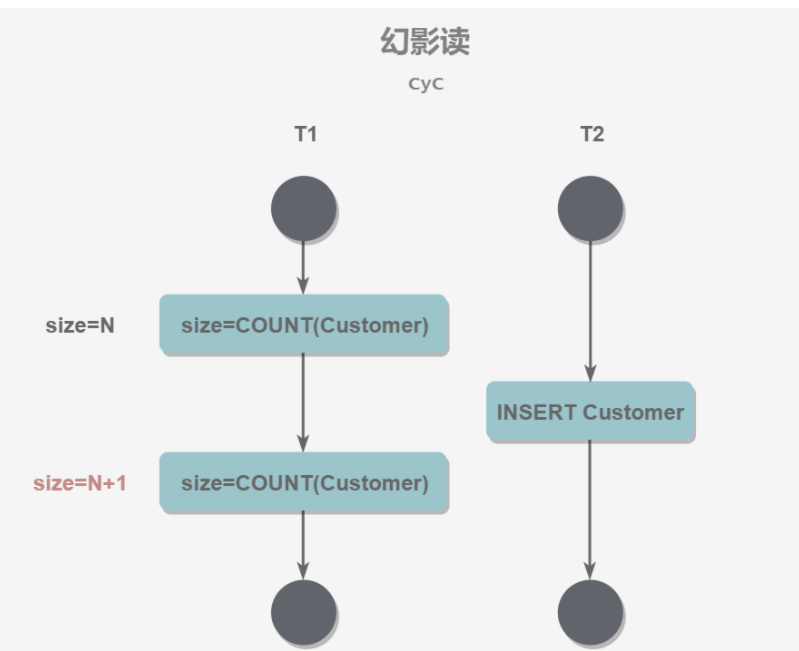

- Durability（持久性）：事务处理结束后，对数据的修改就是永久的，即便系统故障也不会丢失。


| **名称**                              | **脏读**    | **不可重复度** | **幻读** | **备注**                               |
| ------------------------------------- | ----------- | -------------- | -------- | -------------------------------------- |
| 未授权读/读未提交 （Read Uncommitted) | √（会出现） | √              | √        |                                        |
| 授权读/读已提交 （Read Committed ）   |             | √              | √        | 一般默认这个级别，并用乐观、悲观锁控制 |
| 可重复读取 （Repetable Read）         |             |                | √        |                                        |
| 串行化 （Serializable）               |             |                |          |                                        |


#### **脏读、不可重复读、幻读**

理解：

[知乎](https://zhuanlan.zhihu.com/p/78868493)

[三者的区别：](https://www.jianshu.com/p/0cef4c68b8f3，)不可重复读是记录内容不同，幻读是读取的记录数不同。


**脏读**

脏读又称无效数据读出（读出了脏数据）。一个事务读取另外一个事务还没有提交的数据叫脏读。

例如：事务T1修改了某个表中的一行数据，但是还没有提交，这时候事务T2读取了被事务T1修改后的数据，之后事务T1因为某种原因回滚（Rollback）了，那么事务T2读取的数据就是脏的（无效的）。

解决办法：把数据库的事务隔离级别调整到 **READ_COMMITTED**（读提交/不可重复读）

**不可重复读**

不可重复读是指在同一个事务内，两次相同的查询返回了不同的结果。

例如：事务T1会读取两次数据，在第一次读取某一条数据后，事务T2修改了该数据并提交了事务，T1此时再次读取该数据，两次读取便得到了不同的结果。

解决办法：把数据库的事务隔离级别调整到 **REPEATABLE_READ（可重复读，默认隔离级别）**

**幻读**

幻读也是指当事务不独立执行时，插入或者删除另一个事务当前影响的数据而发生的一种类似幻觉的现象。

例如：系统事务A将数据库中所有数据都删除的时候，但是事务B就在这个时候新插入了一条记录，当事务A删除结束后发现还有一条数据，就好像发生了幻觉一样。这就叫幻读。

解决办法：把数据库的事务隔离级别调整到 **SERIALIZABLE_READ**（序列化执行），或者数据库使用者自己进行加锁来保证。


### ==四种隔离级别==

SQL标准定义了4类隔离级别，包括了一些具体规则，用来限定事务内外的哪些改变是可见的，哪些是不可见的。

低级别的隔离级一般支持更高的并发处理，并拥有更低的系统开销。

* Read Uncommitted（读取未提交内容）

  在该隔离级别，所有事务都可以看到其他未提交事务的执行结果。本隔离级别很少用于实际应用，因为它的性能也不比其他级别好多少。读取未提交的数据，也被称之为脏读（Dirty Read）。

  

* Read Committed（读取提交内容）

  ==Oracle、SqlServer（默认都是PC，Read Committed），MySQL默认（RR，可重复读级别）==足了隔离的简单定义：一个事务只能看见已经提交事务所做的改变。

  

* Repeatable Read（可重读）

  这是MySQL的默认事务隔离级别，它确保同一事务的多个实例在并发读取数据时，会看到同样的数据行。不过理论上，这会导致另一个棘手的问题：幻读 （Phantom Read）。

  简单的说，幻读指在一个事务内读取某一范围的数据行时，另一个事务又在该范围内插入了新行，当用户第二次使用相同的查询语句再读取该范围的数据行时，会发现有新的“幻影” 行——结果与第一次查询不同。换句话说，一个事务里的两个相同条件的查询查到的结果是不一致的。InnoDB和Falcon存储引擎通过多版本并发控制（MVCC，Multiversion Concurrency Control）机制解决了该问题。

* Serializable（可串行化）

  这是最高的隔离级别，它通过强制事务排序，使之不可能相互冲突，从而解决幻读问题。简言之，它是在每个读的数据行上加上共享锁。在这个级别，可能导致大量的超时现象和锁竞争。


### ==？？UNDO LOG与REDO LOG==

innodb事务日志包括redo log和undo log。在概念上，innodb通过**force log at commit**机制实现事务的持久性，即在事务提交的时候，必须先将该事务的所有事务日志写入到磁盘上的redo log file和undo log file中进行持久化。

* redo log

  用于记录事务执行后的状态，提供前滚操作。通常是物理日志。

  redo log又称重做日志文件，记录的是数据修改之后的值，不管事务是否提交都会记录下来。它用来恢复提交后的物理数据页，且只能恢复到最后一次提交的位置。

  在实例和介质失败时，redo log文件就能派上用场，如数据库掉电，InnoDB存储引擎会使用redo log恢复到掉电前的时刻，以此来保证数据的完整性。

  在一条更新语句进行执行的时候，InnoDB引擎会把更新记录写到redo log日志中，然后更新内存，此时算是语句执行完了，然后在空闲的时候或者是按照设定的更新策略将redo log中的内容更新到磁盘中。

  作用：

  ==确保事务的持久性。防止在发生故障的时间点，尚有脏页未写入磁盘，在重启 mysql 服务的时候，根据 redo log 进行重做，从而达到事务的持久性这一特性。==

* undo log

  回滚日志，用于记录事务开始前的状态，提供回滚操作。一般是逻辑日志，根据每行记录进行记录。

  作用：

  ==保存了事务发生之前的数据的一个版本，可以用于回滚，同时可以提供多版本并发控制下的读（MVCC），也即非锁定读。==


总结：

1. 事务commit时，==必须先==将事务的所有事务日志，写到redo log file 和 undo log file 进行持久化，commit才算完成。
2. redo log：==确保事务的持久性。防止在发生故障的时间点，尚有脏页未写入磁盘，在重启 mysql 服务的时候，根据 redo log 进行重做，从而达到事务的持久性这一特性。==
3. undo log:==保存了事务发生之前的数据的一个版本，可以用于回滚，同时可以提供多版本并发控制下的读（MVCC），也即非锁定读。==


### [多版本并发控制](https://blog.csdn.net/Waves___/article/details/105295060)

推荐阅读：[MySQL-InnoDB-MVCC多版本并发控制](https://segmentfault.com/a/1190000012650596)

参考文档：[MySQL中MVCC的正确打开方式（源码佐证）](https://blog.csdn.net/Waves___/article/details/105295060)

- MVCC 中事务的修改操作（DELETE、INSERT、UPDATE）会为数据行新增一个版本快照。

#### **隐藏字段**

​    InnoDB存储引擎在每行数据的后面添加了三个隐藏字段：

      1. **DB_TRX_ID**(6字节)：表示最近一次对本记录行作修改（insert | update）的事务ID。至于delete操作，InnoDB认为是一个update操作，不过会更新一个另外的删除位，将行表示为deleted。并非真正删除。
    
      2. **DB_ROLL_PTR**(7字节)：回滚指针，指向当前记录行的undo log信息
    
      3. **DB_ROW_ID**(6字节)：随着新行插入而单调递增的行ID。理解：当表没有主键或唯一非空索引时，innodb就会使用这个行ID自动产生聚簇索引。如果表有主键或唯一非空索引，聚簇索引就不会包含这个行ID了。**这个DB_ROW_ID跟MVCC关系不大**。

#### **Read View 结构（重点）**

​    其实Read View（读视图），跟快照、snapshot是一个概念。

**① low_limit_id：目前出现过的最大的事务ID+1，即下一个将被分配的事务ID**

**② up_limit_id：\*活跃事务列表trx_ids中最小的事务ID，如果trx_ids为空，则up_limit_id 为 low_limit_id**

 **③ trx_ids：Read View创建时  其他未提交的活跃事务ID列表**

 ***④ creator_trx_id：当前创建事务的ID，是一个递增的编号***


#### **Undo log**    

在InnoDB里，undo log分为如下两类：
    ①insert undo log : 事务对insert新记录时产生的undo log， 只在事务回滚时需要， 并且在事务提交后就可以立即丢弃。
    ②update undo log : 事务对记录进行delete和update操作时产生的undo log，不仅在事务回滚时需要，快照读也需要，只有当数据库所使用的快照中不涉及该日志记录，对应的回滚日志才会被purge线程删除


#### 可见性比较算法

1. 如果 trx_id < up_limit_id， 那么表明“最新修改该行的事务”在“当前事务”创建快照之前就提交了，所以该记录行的值对当前事务是可见的。跳到步骤5。

   2. 如果 trx_id >= low_limit_id， 那么表明“最新修改该行的事务”在“当前事务”创建快照之后才修改该行，所以该记录行的值对当前事务不可见。跳到步骤4。

2. 如果 up_limit_id <= trx_id < low_limit_id， 表明“最新修改该行的事务”在“当前事务”创建快照的时候可能处于“活动状态”或者“已提交状态”；所以就要对活跃事务列表trx_ids进行查找（源码中是用的二分查找，因为是有序的）：
   1. 如果在活跃事务列表trx_ids中能找到 id 为 trx_id 的事务，表明①在“当前事务”创建快照前，“该记录行的值”被“id为trx_id的事务”修改了，但没有提交；或者②在“当前事务”创建快照后，“该记录行的值”被“id为trx_id的事务”修改了（不管有无提交）；这些情况下，这个记录行的值对当前事务都是不可见的，跳到步骤4；
   2. 在活跃事务列表中找不到，则表明“id为trx_id的事务”在修改“该记录行的值”后，在“当前事务”创建快照前就已经提交了，所以记录行对当前事务可见，跳到步骤5。

   3. 在该记录行的 DB_ROLL_PTR 指针所指向的undo log回滚段中，取出最新的的旧事务号DB_TRX_ID， 将它赋给trx_id，然后跳到步骤1重新开始判断。

   4. 将该可见行的值返回。


###  ==Next-Key Lock==


## ==索引==------------

索引是一种特殊的文件，它们包含着对数据表里所有记录的引用指针。
更通俗的说，数据库索引好比是一本书前面的目录，能加快数据库的查询速度。
一般数据库默认都会为主键生成索引。
索引分为聚簇索引和非聚簇索引两种，聚簇索引是按照数据存放的物理位置为顺序的。因此遍历快而修改慢。
聚簇索引能提高多行检索的速度，而非聚簇索引对于单行的检索很快。


### InnoDB和MyIASM索引

InnoDB：

- 聚簇索引：
  - 主键：B+树结构，叶子节点存数据页（每个主键对应的记录）
  - 优点
    - 数据访问更快。聚触1次查找到，非聚触要2次
    - 排序查找和范围查找快。聚簇索引对于主键的排序查找和范围查找速度非常快
  - 缺点
    - **更新主键的代价很高**，因为将会导致被更新的行移动。
    - **插入速度严重依赖于插入顺序**，按照主键的**顺序插入**是最快的方式，否则将会出现页分裂

- 非聚触索引：
  - 其他索引：B+树结构，叶子节点存（主键+其他索引内容）。查找：二级索引（非聚簇索引）访问需要两次索引查找

MyISAM：

- 主键：B+树结构（和InnoDB结构不同），叶子结点存（行数据地址值），不唯一属性的不能用聚触索引

- 聚触和非聚触：结构都一样，只是聚触的索引不能建立在非唯一的字段上。


### 聚集索引和非聚集索引

索引在数据库中的作用类似于目录在书籍中的作用，用来提高查找信息的速度。使用索引查找数据，无需对整表进行扫描，可以快速找到所需数据。

**聚集索引就是存放的物理顺序和列中的顺序一样，一般设置主键索引就为聚集索引。**

一个没加主键的表，它的数据**无序**的放置在磁盘存储器上，一行一行的排列的很整齐。如果给表上了主键，那么表在磁盘上的存储结构就由整齐排列的结构转变成了**树状结构**，也就是**平衡树结构**，换句话说，就是整个表就变成了一个索引，也就是所谓的**聚集索引**。 这就是为什么一个表只能有一个主键， 一个表只能有一个聚集索引，因为主键的作用就是把表的数据格式转换成索引（平衡树）的格式放置。

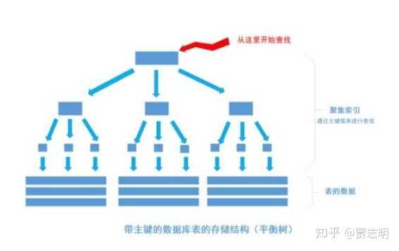

 上图就是带有主键的表（聚集索引）的结构图。其中树的所有结点（底部除外）的数据都是由主键字段中的数据构成，也就是通常我们指定主键的id字段。最下面部分是真正表中的数据。 假如我们执行一个SQL语句：

```text
select * from table where id = 1256
```

 首先根据索引定位到1256这个值所在的叶结点，然后再通过叶结点取到id等于1256的数据行。 这里不讲解平衡树的运行细节， 但是从上图能看出，树一共有三层， 从根节点至叶节点只需要经过三次查找就能得到结果。如下图


然而， 事物都是有两面的， 索引能让数据库查询数据的速度上升， 而使写入数据的速度下降，原因很简单的，**因为平衡树这个结构必须一直维持在一个正确的状态， 增删改数据都会改变平衡树各节点中的索引数据内容，破坏树结构， 因此，在每次数据改变时， DBMS必须去重新梳理树（索引）的结构以确保它的正确**，这会带来不小的性能开销，也就是为什么索引会给查询以外的操作带来副作用的原因。


讲完聚集索引 ， 接下来聊一下非聚集索引， 也就是我们平时经常提起和使用的常规索引。

非聚集索引和聚集索引一样， 同样是采用平衡树作为索引的数据结构。索引树结构中各节点的值来自于表中的索引字段， 假如给user表的name字段加上索引 ， 那么索引就是由name字段中的值构成，在数据改变时， DBMS需要一直维护索引结构的正确性。如果给表中多个字段加上索引 ， 那么就会出现多个独立的索引结构，**每个索引（非聚集索引）互相之间不存在关联**。 如下图

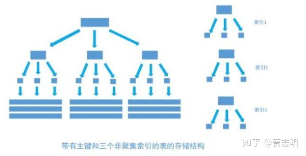

**每次给字段建一个新索引， 字段中的数据就会被复制一份出来， 用于生成索引。 因此， 给表添加索引，会增加表的体积， 占用磁盘存储空间。****非聚集索引和聚集索引的区别在于：**

通过聚集索引可以一次查到需要查找的数据， 而通过非聚集索引第一次只能查到记录对应的主键值 ， 再使用主键的值通过聚集索引查找到需要的数据。

聚集索引一张表只能有一个，而非聚集索引一张表可以有多个。


==总结==

InnoDB：

- 聚簇索引：
  - 主键：B+树结构，叶子节点存数据页（每个主键对应的记录）
  - 优点
    - 数据访问更快。聚触1次查找到，非聚触要2次
    - 排序查找和范围查找快。聚簇索引对于主键的排序查找和范围查找速度非常快
  - 缺点
    - **更新主键的代价很高**，因为将会导致被更新的行移动。
    - **插入速度严重依赖于插入顺序**，按照主键的**顺序插入**是最快的方式，否则将会出现页分裂

- 非聚触索引：
  - 其他索引：B+树结构，叶子节点存（主键+其他索引内容）。<br />查找：二级索引（非聚簇索引）访问需要两次索引查找


MyISAM：

- 主键：B+树结构（和InnoDB结构不同），叶子结点存（行数据地址值），不唯一属性的不能用聚触索引
- 聚触和非聚触：结构都一样，只是聚触的索引不能建立在非唯一的字段上。


### 普通、唯一、联合

**普通**

这是最基本的索引，它没有任何限制。

```sql
CREATE INDEX name ON students(student_name(50));
```


唯一索引

唯一的索引意味着两个行不能拥有相同的索引值。但允许有空值（注意和主键不同）

```sql
CREATE UNIQUE INDEX id ON students(student_id(10));
```


联合索引

联合索引是指对表上的多个列进行索引。

```sql
CREATE INDEX name_id ON students(student_name，student_id);
```

注意最左前缀。

### 覆盖索引、最左前缀原则、索引下推

```sql
mysql> 
create table T (
ID int primary key，
k int NOT NULL DEFAULT 0， 
s varchar(16) NOT NULL DEFAULT ''，
index k(k)) engine=InnoDB;

insert into T values(100，1， 'aa')，(200，2，'bb')，(300，3，'cc')，(500，5，'ee')，(600，6，'ff')，(700，7，'gg');
```

执行 ==select * from T where k between 3 and 5==，需要执行几次树的搜索操作，会扫描多少行？


这条SQL查询语句的执行流程：

- 1.在k索引树上找到k=3的记录，取得 ID = 300；
- 2.再到ID索引树查到ID=300对应的R3；
- 3.在k索引树取下一个值k=5，取得ID=500；
- 4.再回到ID索引树查到ID=500对应的R4；
- 5.在k索引树取下一个值k=6，不满足条件，循环结束。

在这个过程中，==回到主键索引树搜索的过程，我们称为回表==。可以看到，这个查询过程读了k索引树的3条记录（步骤1、3和5），回表了两次（步骤2和4）。


在这个例子中，由于查询结果所需要的数据只在主键索引上有，所以不得不回表。

那么，有没有可能经过索引优化，避免回表过程呢？


#### 覆盖索引

文件：https://www.cnblogs.com/wzc6688/p/11689018.html

用户对常见的查询需要的字段，比如a为主键，bcd构成1个联合索引。在查询时如果索引+辅助索引叶子节点的内容，就已经满足`select a,b,c,d，where b=1 and c=1 and d=1`就不必回表查询其他内容了。

如果执行的语句是select ID from T where k between 3 and 5，这时只需要查ID的值，而ID的值已经在k的辅助索引树叶子节点上了，因此可以直接提供查询结果，不需要回表。也就是说，在这个查询里面，==索引k已经“覆盖了”我们的查询需求，我们称为覆盖索引==。

**由于覆盖索引可以减少树的搜索次数，显著提升查询性能，所以使用覆盖索引是一个常用的性能优化手段。**

需要注意的是，在引擎内部使用覆盖索引在索引k上其实读了三个记录，R3~R5（对应的索引k上的记录项），但是对于MySQL的Server层来说，它就是找引擎拿到了两条记录，因此MySQL认为扫描行数是2。

基于上面覆盖索引的说明，我们来讨论一个问题：在一个市民信息表上，是否有必要将身份证号和名字建立联合索引？

假设这个市民表的定义是这样的：

```go
CREATE TABLE `tuser` (
  `id` int(11) NOT NULL，
  `id_card` varchar(32) DEFAULT NULL，
  `name` varchar(32) DEFAULT NULL，
  `age` int(11) DEFAULT NULL，
  `ismale` tinyint(1) DEFAULT NULL，
  PRIMARY KEY (`id`)，
  KEY `id_card` (`id_card`)，
  KEY `name_age` (`name`，`age`)
) ENGINE=InnoDB
```

我们知道，身份证号是市民的唯一标识。也就是说，如果有根据身份证号查询市民信息的需求，我们只要在身份证号字段上建立索引就够了。而再建立一个（身份证号、姓名）的联合索引，是不是浪费空间？

如果现在有一个高频请求，要根据市民的身份证号查询他的姓名，这个联合索引就有意义了。它可以在这个高频请求上用到覆盖索引，不再需要回表查整行记录，减少语句的执行时间。

当然，索引字段的维护总是有代价的。因此，在建立冗余索引来支持覆盖索引时就需要权衡考虑了。这正是业务DBA，或者称为业务数据架构师的工作。

#### 最左前缀原则

看到这里你一定有一个疑问，如果为每一种查询都设计一个索引，索引是不是太多了。如果我现在要按照市民的身份证号去查他的家庭地址呢？虽然这个查询需求在业务中出现的概率不高，但总不能让它走全表扫描吧？反过来说，==单独为一个不频繁的请求创建一个（身份证号，地址）的索引又感觉有点浪费。应该怎么做呢？==

B+树这种索引结构，可以利用索引的“最左前缀”，来定位记录。

为了直观地说明这个概念，我们用（name，age）这个联合索引来分析。


可以看到，索引项是按照索引定义里面出现的字段顺序排序的。

当你的逻辑需求是查到所有名字是“张三”的人时，可以快速定位到ID4，然后向后遍历得到所有需要的结果。

如果你要查的是所有名字第一个字是“张”的人，你的SQL语句的条件是"where name like ‘张%’"。这时，你也能够用上这个索引，查找到第一个符合条件的记录是ID3，然后向后遍历，直到不满足条件为止。

可以看到，不只是索引的全部定义，只要满足最左前缀，就可以利用索引来加速检索。这个最左前缀可以是联合索引的最左N个字段，也可以是字符串索引的最左M个字符。

基于上面对最左前缀索引的说明，我们来讨论一个问题：**在建立联合索引的时候，如何安排索引内的字段顺序。**

这里的评估标准是，索引的复用能力。因为可以支持最左前缀，所以当已经有了(a，b)这个联合索引后，一般就不需要单独在a上建立索引了。==因第一原则是，如果通过调整顺序，可以少维护一个索引，那么这个顺序往往就是需要优先考虑采用的。==

所以现在你知道了，这段开头的问题里，我们要为高频请求创建(身份证号，姓名）这个联合索引，并用这个索引支持“根据身份证号查询地址”的需求。

那么，如果既有联合查询，又有基于a、b各自的查询呢？查询条件里面只有b的语句，是无法使用(a，b)这个联合索引的，这时候你不得不维护另外一个索引，也就是说你需要同时维护(a，b)、(b) 这两个索引。

这时候，**我们要考虑的原则就是空间了。**比如上面这个市民表的情况，name字段是比age字段大的 ，那我就建议你创建一个（name，age)的联合索引和一个(age)的单字段索引。


sun：

- 调整联合索引，在字段的排列顺序，能够提高索引被复用的能力。 

- 通过考虑索引的空间性质，可以选择


#### 索引下推

以市民表的联合索引（name， age）为例。如果现在有一个需求：检索出表中“名字第一个字是张，而且年龄是10岁的所有男孩”。那么，SQL语句是这么写的：

```csharp
mysql> select * from tuser where name like '张%' and age=10 and ismale=1;
```

你已经知道了前缀索引规则，所以这个语句在搜索索引树的时候，只能用 “张”，找到第一个满足条件的记录ID3。当然，这还不错，总比全表扫描要好。

然后呢？

当然是判断其他条件是否满足。

在MySQL 5.6之前，只能从ID3开始一个个回表。到主键索引上找出数据行，再对比字段值。

而MySQL 5.6 引入的索引下推优化（index condition pushdown)， 可以在索引遍历过程中，对索引中包含的字段先做判断，直接过滤掉不满足条件的记录，减少回表次数。

- 无索引下推执行流程图

  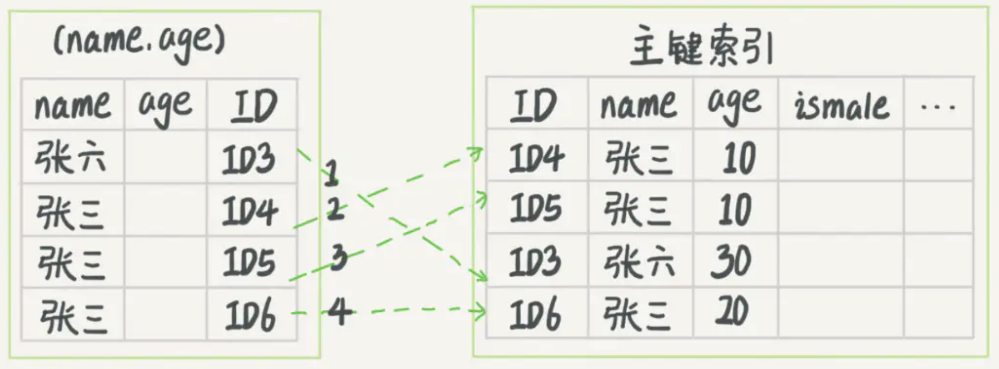

- 索引下推执行流程

  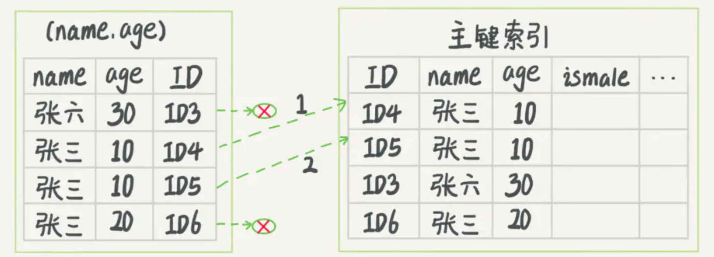

这两个图里面，每一个虚线箭头表示回表一次。

第一个图中，在(name，age)索引里面我特意去掉了age的值，这个过程InnoDB并不会去看age的值，只是按顺序把“name第一个字是’张’”的记录一条条取出来回表。因此，需要回表4次。

他们的区别是，==InnoDB在(name，age)索引内部就判断了age是否等于10，对于不等于10的记录，直接判断并跳过==。在这个例子中，只需要对ID4、ID5这两条记录回表取数据判断，就只需要回表2次。

> sun:
>
> 索引下推：InnoDB能够在索引内部就判断一些不合要求的数据行，以此减少基于索引的查询的回表次数。


## 其他&基础

### 数据库范式

满足高级依赖就意味着满足了低级依赖。

1. 第一范式（1NF）：属性不可拆分或无重复的列。

2. 第二范式（2NF）：就是有一个唯一主键，并且非主属性对候选键是完全依赖。

   例如，在选课关系表(学号，课程号，成绩，学分)，关键字为组合关键字(学号，课程号)，但由于非主属性学分仅依赖于课程号，对关键字(学号，课程号)只是部分依赖，而不是完全依赖，因此此种方式会导致数据冗余以及更新异常等问题，解决办法是将其分为两个关系模式：学生表(学号，课程号，分数)和课程表(课程号，学分)，新关系通过学生表中的外关键字课程号联系，在需要时进行连接。

3. 第三范式（3NF）：消除传递依赖。

   简而言之，第三范式（3NF）要求一个数据库表中不包含已在其它表中已包含的非主属性信息。例如，存在一个部门信息表，其中每个部门有部门编号（dept_id）、部门名称、部门简介等信息。那么在的员工信息表中列出部门编号后就不能再将部门名称、部门简介等与部门有关的信息再加入员工信息表中。如果不存在部门信息表，则根据第三范式（3NF）也应该构建它，否则就会有大量的数据冗余。简而言之，第三范式就是属性不依赖于其它非主属性。

   总结一下：两个表相关联，一个表只能有另一个表的一个依赖。

4. 第四范式（4NF）：一个表的主键只对应一个多值。

   例如，职工表(职工编号，职工孩子姓名，职工选修课程)，在这个表中，同一个职工可能会有多个职工孩子姓名，同样，同一个职工也可能会有多个职工选修课程，即这里存在着多值事实，不符合第四范式。如果要符合第四范式，只需要将上表分为两个表，使它们只有一个多值事实，例如职工表一(职工编号，职工孩子姓名)，职工表二(职工编号，职工选修课程)，两个表都只有一个多值事实，所以符合第四范式。


### 什么是范式

必须知道的ABC：[如何理解关系型数据库的常见设计范式？ - 刘慰的回答 - 知乎](https://www.zhihu.com/question/24696366/answer/29189700)

A：候选码、主属性、非主属性

候选码：一个表中，能够决定其他属性的就是候选码，可能有多个。

主属性：候选码包含的属性，就是主属性

非主属性：所有候选码不包含的属性，就是非主属性

B：完全、部分、传递依赖是什么

完全：X（可能包含多个属性，eg X=（AB）），X p->Y，Y完全有X决定，Y完全依赖于X

部分：X ->Y，加入X=AB，A->Y存在的话，就说明Y是部分依赖与X的

传递依赖：X->Y ,  Y->Z，则Z是传递依赖与X的。

C：23范式&BCNF是什么

- 1NF：任何数据库的表就是1NF，但不能包含重复列，

- 2NF：消除 非主属性 对 码（候选码）的 **部分依赖**

- 3NF：消除 非主属性 对 码（候选码）的 **传递依赖**

- BCNF：消除 **主属性** 对 码（候选码）的 **部分和传递依赖**


### 关系型和NoSQL数据库

关系型数据库

关系型数据库最典型的数据结构是表，由二维表及其之间的联系所组成的一个数据组织。
优点：

* 易于维护：都是使用表结构，格式一致；
* 使用方便：SQL语言通用，可用于复杂查询；
* 复杂操作：支持SQL，可用于一个表以及多个表之间非常复杂的查询。

缺点：

* 固定的表结构，灵活度稍欠；

非关系型数据库

非关系型数据库严格上不是一种数据库，应该是一种数据结构化存储方法的集合，可以是文档或者键值对等。
优点：

* 格式灵活：存储数据的格式可以是key，value形式、文档形式、图片形式等等，文档形式、图片形式等等。

缺点：

* 不提供sql支持；
* 不易于维护。


排序检索数据

```sql
SELECT name
FROM students
ORDER BY student_id DESC;
```

DESC关键字只应用到直接位于其前面的列名。在多个列上降序排序 如果想在多个列上进行降序排序，必须对每个列指定DESC关键字。


通配符匹配

%表示任何字符出现任意次数，_只匹配单个字符而不是多个字符。

```sql
SELECT id
FROM students
WHERE students_name LIKE '%Alex_';
```


正则表达式匹配

```sql
SELECT id
FROM students
WHERE students_name REGEXP 'Alex';
```


分组

```sql
SELECT name
FROM students
GROUP BY class_num
HAVING COUNT(*)>30
ORDER BY id;
```

### 联结

#### 一、内连接

表测试数据：


关键字：inner join on

语句：select * from a_table a inner join b_table b on a.a_id = b.b_id;

执行结果：

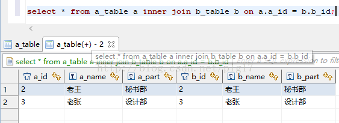


说明：组合两个表中的记录，返回关联字段相符的记录，也就是返回两个表的交集（阴影）部分。


#### 二、左连接（左外连接）

关键字：left join on / left outer join on

语句：select * from a_table a left join b_table b on a.a_id = b.b_id;

执行结果：


说明：

left join 是left outer join的简写，它的全称是左外连接，是外连接中的一种。

左(外)连接，左表(a_table)的记录将会全部表示出来，而右表(b_table)只会显示符合搜索条件的记录。右表记录不足的地方均为NULL。

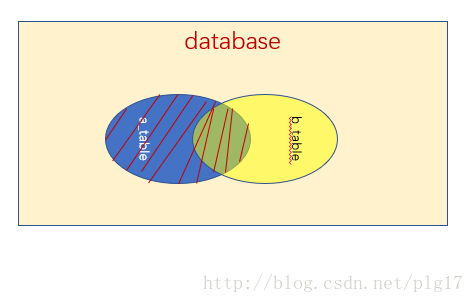

#### 三、右连接（右外连接）

关键字：right join on / right outer join on

语句：select * from a_table a right outer join b_table b on a.a_id = b.b_id;

执行结果：


说明：

right join是right outer join的简写，它的全称是右外连接，是外连接中的一种。

与左(外)连接相反，右(外)连接，左表(a_table)只会显示符合搜索条件的记录，而右表(b_table)的记录将会全部表示出来。左表记录不足的地方均为NULL。

#### 四、自联结

一个表，自己和自己联结。

```sql
SELECT s1.student_name
FROM student AS s1， student AS s2
WHERE s1.id = s2.id
AND s2.teacher_name = 'xiaohua';
```

通常自联结的速度会比子查询快很多。


#### 插入数据

```sql
INSERT INTO students(
    student_name，
    id，
    teacher_name，
    math_score
)
VALUES(
    'liming'，
    1，
    'xiaohua'，
    100
);
```

#### 更新数据

```
UPDATE student
SET math_score = 100
WHERE student_name = 'liming';
```

#### 删除数据

```
DELETE FROM student
WHERE student_name = 'liming';
```

#### 创建表

```sql
CREATE TABLE students
(
    student_id int NOT NULL AUTO_INCREMENT，
    student_name char(50) NOT NULL，
    teachr_name char(50) NULL，
    PRIMARY KEY (student_id)，
    FOREIGN KEY (teacher_name) REFERENCES teachers (teacher_name)
)ENGINE=InnoDB;
```


### [MyISAM和InnoDB区别](https://snailclimb.gitee.io/javaguide/#/docs/database/MySQL?id=myisam和innodb区别)

1. **是否支持行级锁** : MyISAM 只有表级锁(table-level locking)，而InnoDB 支持行级锁(row-level locking)和表级锁,默认为行级锁。
2. **是否支持事务和崩溃后的安全恢复： 
   1. **MyISAM** 强调的是性能，每次查询具有原子性,其执行速度比InnoDB类型更快，但是不提供事务支持。
   2. 但是**InnoDB** 提供事务支持，外部键等高级数据库功能。 具有事务(commit)、回滚(rollback)和崩溃修复能力(crash recovery capabilities)的事务安全(transaction-safe (ACID compliant))型表。
3. **是否支持外键：** MyISAM不支持，而InnoDB支持。
4. **是否支持MVCC** ：仅 InnoDB 支持。应对高并发事务, MVCC比单纯的加锁更高效；MVCC只在 READ COMMITTED 和 REPEATABLE READ 两个隔离级别下工作：MVCC可以使用 乐观(optimistic)锁 和 悲观(pessimistic)锁来实现;各数据库中MVCC实现并不统一。推荐阅读：[MySQL-InnoDB-MVCC多版本并发控制](https://segmentfault.com/a/1190000012650596)
5. ......


# 6 操作系统 && 网络

## 简明背诵

### select/epoll/e_poll：

- select/epoll、epoll 的作用，能让单个线程处理更多的IO，而线程本身又不用轮训去查看IO是否完毕，从而提高线程运行效率。
- 优势并不是对于单个连接能处理得更快，而是在于能处理更多的连接。
- 典型的应用有：redis，nginx，javaNIO（linux）也是用到epoll的。


### ==线程的状态==

新建、可运行、运行、阻塞（同步阻塞、等待阻塞、限时阻塞）、结束

- 同步阻塞：
- 等待阻塞：wait、join、LockSupport.park()
- 限期等待：sleep、timeout_wait、timeout_join、LockSupport.parkNanos() 方法、LockSupport.parkUntil() 方法


#### ==挂起、睡眠、阻塞、等待==

调用 Thread.sleep() 方法使线程进入限期等待状态时，常常用“使一个线程睡眠”进行描述。

调用 Object.wait() 方法使线程进入限期等待或者无限期等待时，常常用“挂起一个线程”进行描述。睡眠和挂起是用来描述行为，而阻塞和等待用来描述状态。


### 进程、线程、协程

参考：https://blog.csdn.net/kuangsonghan/article/details/80674777

根本区别：进程是操作系统资源分配的基本单位，而线程是任务调度和执行的基本单位。

从包含关系、开销、内存分配、系统拥有情况看：

包含关系：没有线程的进程可以看做是单线程的，如果一个进程内有多个线程，则执行过程不是一条线的，而是多条线（线程）共同完成的；线程是进程的一部分，所以线程也被称为轻权进程或者轻量级进程。

在开销方面：每个进程都有独立的代码和数据空间（程序上下文），程序之间的切换会有较大的开销；线程可以看做轻量级的进程，同一类线程共享代码和数据空间，每个线程都有自己独立的运行栈和程序计数器（PC），线程之间切换的开销小。

内存分配方面：系统在运行的时候会为每个进程分配不同的内存空间；而对线程而言，除了CPU外，系统不会为线程分配内存（线程所使用的资源来自其所属进程的资源），线程组之间只能共享资源。

所处环境：在操作系统中能同时运行多个进程（程序）；而在同一个进程（程序）中有多个线程同时执行（通过CPU调度，在每个时间片中只有一个线程执行）


| 参数                 | Process                                                      | Thread                                                       |
| :------------------- | :----------------------------------------------------------- | :----------------------------------------------------------- |
| 定义                 | Process means a program is in execution. 进程意味着程序正在执行中 | Thread means a segment of a process. 线程表示进程的一个片段  |
| 轻量级               | The process is not Lightweight. 这个过程不是轻量级的         | Threads are Lightweight. 轻量级线程                          |
| 终止时间             | The process takes more time to terminate. 这个过程需要更多的时间来终止 | The thread takes less time to terminate. 线程终止所需的时间较短 |
| 创造时间             | It takes more time for creation. 创造需要更多的时间          | It takes less time for creation. 创作所需的时间更少          |
| 沟通                 | Communication between processes needs more time compared to thread. 与线程相比，进程间的通信需要更多的时间 | Communication between threads requires less time compared to processes. 与进程相比，线程之间的通信所需的时间更少 |
| 上下文切换时间       | It takes more time for context switching. 上下文切换需要更多的时间 | It takes less time for context switching. 上下文切换所需的时间更少 |
| 资源                 | Process consume more resources. 过程消耗更多的资源           | Thread consume fewer resources. 线程消耗的资源较少           |
| 通过操作系统进行处理 | Different process are tread separately by OS. 不同的进程由操作系统分别操作 | All the level peer threads are treated as a single task by OS. 操作系统将所有级别的对等线程视为单个任务 |
| 内存                 | The process is mostly isolated. 这个过程基本上是孤立的       | Threads share memory. 线程共享内存                           |
| Sharing              | It does not share data 它不共享数据                          | Threads share data with each other. 线程之间共享数据         |


#### 协程

一句话说明什么是线程：协程是一种用户态的轻量级线程。

**协程拥有自己的寄存器上下文和栈。**

协程调度切换时，将寄存器上下文和栈保存到其他地方，在切回来的时候，恢复先前保存的寄存器上下文和栈。因此：协程能保留上一次调用时的状态（即所有局部状态的一个特定组合），每次过程重入时，就相当于进入上一次调用的状态，换种说法：进入上一次离开时所处逻辑流的位置。


协程的好处：

1. 无需线程上下文切换的开销
2. 无需原子操作锁定及同步的开销
3. 方便切换控制流，简化编程模型

高并发+高扩展性+低成本：一个CPU支持上万的协程都不是问题。所以很适合用于高并发处理。


缺点：

1. 无法利用多核资源：协程的本质是个单线程,它不能同时将 单个CPU 的多个核用上,协程需要和进程配合才能运行在多CPU上.当然我们日常所编写的绝大部分应用都没有这个必要，除非是cpu密集型应用。
2. 进行阻塞（Blocking）操作（如IO时）会阻塞掉整个程序


示例：

- java 原生是不支持协程的，Go支持：https://xie.infoq.cn/article/cef6d2931a54f85142d863db7


### 并发与并行

参考：https://zhuanlan.zhihu.com/p/70256971

并发：在操作系统中，某一时间段，几个程序在同一个CPU上运行，但在任意一个时间点上，只有一个程序在CPU上运行。

当有多个线程时，如果系统只有一个CPU，那么CPU不可能真正同时进行多个线程，CPU的运行时间会被划分成若干个时间段，每个时间段分配给各个线程去执行，一个时间段里某个线程运行时，其他线程处于挂起状态，这就是并发。并发解决了程序排队等待的问题，如果一个程序发生阻塞，其他程序仍然可以正常执行。

并行：当操作系统有多个CPU时，一个CPU处理A线程，另一个CPU处理B线程，两个线程互相不抢占CPU资源，可以同时进行，这种方式成为并行。


区别

1. 并发只是在宏观上给人感觉有多个程序在同时运行，但在实际的单CPU系统中，每一时刻只有一个程序在运行，微观上这些程序是分时交替执行。
2. 在多CPU系统中，将这些并发执行的程序分配到不同的CPU上处理，每个CPU用来处理一个程序，这样多个程序便可以实现同时执行。

知乎上高赞例子：

- 你吃饭吃到一半，电话来了，你一直到吃完了以后才去接，这就说明你不支持并发也不支持并行。
- 你吃饭吃到一半，电话来了，你停了下来接了电话，接完后继续吃饭，这说明你支持并发。
- 你吃饭吃到一半，电话来了，你一边打电话一边吃饭，这说明你支持并行。


并发的关键是你有处理多个任务的能力，不一定要同时。

并行的关键是你有同时处理多个任务的能力。


### 进程通信

进程间通信（张三同学）超级详细，有对比：https://www.nowcoder.com/discuss/462678?type=all&order=time&pos=&page=1&channel=-1&source_id=search_all_nctrack

- 匿名管道：通过匿名管道使2个进程通信，比如| grep就是。但是匿名通常是单向的，字节流的。
- 有名管道：可以是多方向的，比如linux的pipe，但是这个是阻塞的。
- 消息队列：生产者与消费者模型，生产者生产完了，放入队列直接走掉。这个可以是自定义结构的数据，==但传输大小受限制，存在内核与用户态数据拷贝的开销。==
- 共享内存：两个进程共享内存来通信，不存在开销问题，但会出现不同步的问题。
- 原语操作：用PV操作来控制对共享内存的互斥操作，解决冲突的问题。
- Socket：本地、跨网段进行Socket通信，可以实现TCP、UDP的通信。


### 线程通信 —— 主要是同步方式

https://www.cnblogs.com/fanguangdexiaoyuer/p/10834737.html#_label6

### 锁机制：包括互斥锁、条件变量、读写锁

互斥锁：提供了以排他方式防止数据结构被并发修改的方法。 
读写锁：允许许多个线程同时读共享数据，而对写操作是互斥的。 
条件变量：可以以原子的方式阻塞进程，直到某个特定条件为真为止。对条件的测试是在互斥锁的保护下进行的。条件变量始终与互斥锁一起使用。

> wait/notify 等待
>
> Volatile 内存共享
>
> CountDownLatch 并发工具
>
> CyclicBarrier 并发工具

**信号量机制(Semaphore)**：包括无名线程信号量和命名线程信号量。

**信号机制(Signal)**

类似进程间的信号处理。

线程间的通信目的主要是用于线程同步，所以线程没有像进程通信中的用于数据交换的通信机制。


### [内核与用户态](https://blog.csdn.net/qq_39823627/article/details/78736650?utm_medium=distribute.pc_relevant.none-task-blog-BlogCommendFromBaidu-2.control&depth_1-utm_source=distribute.pc_relevant.none-task-blog-BlogCommendFromBaidu-2.control)

个人总结：

1. 用户态：程序平常执行，并不需要访问一些敏感资源、比如创建进程、
2. 内核态：程序执行到某些指令，需要进行系统调用、被中断、异常等等，CPU需要更高权限才能访问内存中的某些地址时，需要变身到内核态。CPU敏感操作操作完了，又变回用户态。
3. 内存用户空间、和内核空间是有划分的，有一些是操作系统专用的内存。


1、linux进程有4GB地址空间，如图所示：


3G-4G大部分是共享的，是内核态的地址空间。这里存放整个内核的代码和所有的内核模块以及内核所维护的数据。

2、特权级的概念：

对于任何操作系统来说，创建一个进程是核心功能。创建进程要做很多工作，会消耗很多物理资源。比如分配物理内存，父子进程拷贝信息，拷贝设置页目录页表等等，这些工作得由特定的进程去做，所以就有了特权级别的概念。最关键的工作必须交给特权级最高的进程去执行，这样可以做到集中管理，减少有限资源的访问和使用冲突。inter x86架构的cpu一共有四个级别，0-3级，0级特权级最高，3级特权级最低。

3、用户态和内核态的概念：

当一个进程在执行用户自己的代码时处于用户运行态（用户态），此时特权级最低，为3级，是普通的用户进程运行的特权级，大部分用户直接面对的程序都是运行在用户态。Ring3状态不能访问Ring0的地址空间，包括代码和数据；当一个进程因为系统调用陷入内核代码中执行时处于内核运行态（内核态），此时特权级最高，为0级。执行的内核代码会使用当前进程的内核栈，每个进程都有自己的内核栈。

==举例==

用户运行一个程序，该程序创建的进程开始时运行自己的代码，处于用户态。如果要执行文件操作、网络数据发送等操作必须通过write、send等系统调用，这些系统调用会调用内核的代码。进程会切换到Ring0，然后进入3G-4G中的内核地址空间去执行内核代码来完成相应的操作。内核态的进程执行完后又会切换到Ring3，回到用户态。这样，用户态的程序就不能随意操作内核地址空间，具有一定的安全保护作用。这说的保护模式是指通过内存页表操作等机制，保证进程间的地址空间不会互相冲突，一个进程的操作不会修改另一个进程地址空间中的数据。

4、用户态和内核态的切换

当在系统中执行一个程序时，大部分时间是运行在用户态下的，在其需要操作系统帮助完成一些用户态自己没有特权和能力完成的操作时就会切换到内核态。

用户态切换到内核态的3种方式

（1）系统调用

这是用户态进程主动要求切换到内核态的一种方式。用户态进程通过系统调用申请使用操作系统提供的服务程序完成工作。例如fork（）就是执行了一个创建新进程的系统调用。系统调用的机制和新是使用了操作系统为用户特别开放的一个中断来实现，如Linux的int 80h中断。

（2）异常

当cpu在执行运行在用户态下的程序时，发生了一些没有预知的异常，这时会触发由当前运行进程切换到处理此异常的内核相关进程中，也就是切换到了内核态，如缺页异常。

（3）外围设备的中断

当外围设备完成用户请求的操作后，会向CPU发出相应的中断信号，这时CPU会暂停执行下一条即将要执行的指令而转到与中断信号对应的处理程序去执行，如果前面执行的指令时用户态下的程序，那么转换的过程自然就会是 由用户态到内核态的切换。如硬盘读写操作完成，系统会切换到硬盘读写的中断处理程序中执行后边的操作等。

这三种方式是系统在运行时由用户态切换到内核态的最主要方式，其中系统调用可以认为是用户进程主动发起的，异常和外围设备中断则是被动的。从触发方式上看，切换方式都不一样，但从最终实际完成由用户态到内核态的切换操作来看，步骤有事一样的，都相当于执行了一个中断响应的过程。系统调用实际上最终是中断机制实现的，而异常和中断的处理机制基本一致。

5、用户态到内核态具体的切换步骤：

（1）从当前进程的描述符中提取其内核栈的ss0及esp0信息。

（2）使用ss0和esp0指向的内核栈将当前进程的cs,eip,eflags,ss,esp信息保存起来，这个过程也完成了由用户栈到内核栈的切换过程，同时保存了被暂停执行的程序的下一条指令。

（3）将先前由中断向量检索得到的中断处理程序的cs,eip信息装入相应的寄存器，开始执行中断处理程序，这时就转到了内核态的程序执行了。


### 死锁 四个必要条件

1. 互斥。在出现死锁的系统中，必须存在需要互斥使用的资源。
2. 占有等待。在出现死锁的系统中，一定有已分配到了某些资源且在等待另外资源的进程。
3. 非剥夺。在出现死锁的系统中，一定有不可剥夺使用的资源。
4. 循环等待。若干进程之间形成一种头尾相接的循环等待资源关系。


解决办法：

- 死锁预防：破坏4条件之一即可。假脱机技术虚拟使用；得到所有资源才运行；可以抢占；资源编号的方式去申请资源；
- 死锁避免方法：银行家算法；一个小城镇的银行家，他向一群客户分别承诺了一定的贷款额度，算法要做的是判断对请求的满足是否会进入不安全状态，如果是，就拒绝请求；否则予以分配。


==总结==

不能一起吃一个菜（资源互斥）、吃着碗里的看着锅里的（占有等待）、又不能抢（非剥夺）、干耗着（循环等待）。


## ==五大IO模型==

---

用户程序进行IO的读写，依赖于底层的IO读写，基本上会用到底层的read&write两大系统调用。在不同的操作系统中，IO读写的系统调用的名称可能不完全一样，但是基本功能是一样的。

这里涉及一个基础的知识：read系统调用，并不是直接从物理设备把数据读取到内存中；write系统调用，也不是直接把数据写入到物理设备。上层应用无论是调用操作系统的read，还是调用操作系统的write，都会涉及缓冲区。


**具体来说，IO实际上是：**

调用操作系统的read，是把数据**从内核缓冲区复制到进程缓冲区**；

而write系统调用，是把数据**从进程缓冲区复制到内核缓冲区**。

也就是说，**上层程序的IO操作，实际上不是物理设备级别的读写，而是缓存的复制**。read&write两大系统调用，都不负责数据在内核缓冲区和物理设备（如磁盘）之间的交换，这项底层的读写交换，是由操作系统内核（Kernel）来完成的。


### 同步异步阻塞非阻塞的区分？有疑惑

[同步/异步，阻塞/非阻塞概念深度解析_萧萧的专栏-CSDN博客_阻塞](https://blog.csdn.net/lengxiao1993/article/details/78154467)

**从进程级通信的维度讨论时， 阻塞和同步（非阻塞和异步）就是一对同义词。**

- 阻塞式发送（blocking send）. 发送方进程会被一直阻塞， 直到消息被接受方进程收到。
- 非阻塞式发送（nonblocking send）。 发送方进程调用 send() 后， 立即就可以其他操作。
- 阻塞式接收（blocking receive） 接收方调用 receive() 后一直阻塞， 直到消息到达可用。
- 非阻塞式接收（nonblocking receive） 接收方调用 receive() 函数后， 要么得到一个有效的结果， 要么得到一个空值， 即不会被阻塞。 


**系统级别的 阻塞和同步的概念：**

非阻塞I/O系统调用( nonblocking system call ) 和 **异步I/O系统调用 （asychronous system call）**的区别是：

- 一个非阻塞I/O 系统调用 read() 操作立即返回的是任何可以立即拿到的数据， 可以是完整的结果， 也可以是不完整的结果， 还可以是一个空值。
- 而异步I/O系统调用 read（）结果必须是完整的， 但是这个操作完成的通知可以延迟到将来的一个时间点。


Java解决方式，用户级别线程：

用户支持线程的解决方案基于非阻塞IO系统调用( non-blocking system call) ， 且是一种基于操作系统内核事件通知（event-driven）的解决方案， 基于这个流程, 可以引申到更为宽泛的 event-driven progreamming 话题上。 但是这里就不作赘述了。 


阻塞/非阻塞， 同步/异步的概念要注意讨论的上下文：

在进程通信层面， 阻塞/非阻塞， 同步/异步基本是同义词， 但是需要注意区分讨论的对象是发送方还是接收方。

- 发送方阻塞/非阻塞（同步/异步）和接收方的阻塞/非阻塞（同步/异步） 是互不影响的。

在 IO 系统调用层面（ IO system call ）层面， 非阻塞IO 系统调用 和 异步IO 系统调用存在着一定的差别， 它们都不会阻塞进程， 但是返回结果的方式和内容有所差别， 但是都属于非阻塞系统调用（ non-blocing system call ）

非阻塞系统调用（non-blocking I/O system call 与 asynchronous I/O system call） 的存在可以用来实现线程级别的 I/O 并发， 与通过多进程实现的 I/O 并发相比可以减少内存消耗以及进程切换的开销。 


### 同步异步 and 阻塞

掘金：https://juejin.cn/post/6844903464678457357

参考：https://www.cnblogs.com/loveer/p/11479249.html


> 同步：在发出一个同步调用时，在没有得到结果之前，该调用就不返回。 
>
> 异步：在发出一个异步调用后，调用者不会立刻得到结果，该调用就返回了。

**同步例子**

```
int n = func();
next();
// func() 的结果没有返回，next() 就不会执行，直到 func() 运行完。复制代码
```

**异步例子**

```
func(callback);
next();
...

void callback(int n)     // func 结果回调
{
  int k = n;
}
// func() 执行后，还没得出结果就立即返回，然后执行 next() 了
// 等到结果出来，func() 回调 callback() 通知调用者结果。复制代码
```

同步的定义看起来跟阻塞很像，但是同步跟阻塞是两个概念， 同步调用的时候，线程不一定阻塞，调用虽然没返回，但它还是在运行状态中的，CPU很可能还在执行这段代码，而阻塞的话，它就肯定不在CPU中跑这个代码了。这就是同步和阻塞的区别。同步是肯定可以在，阻塞是肯定不在。

异步和非阻塞的定义比较像，两者的区别是异步是说调用的时候结果不会马上返回，线程可能被阻塞起来，也可能不阻塞，两者没关系。非阻塞是说调用的时候，线程肯定不会进入阻塞状态。

上面两组概念，就有4种组合。

> 同步阻塞调用：A得不到结果不返回，A线程进入阻塞态等待，CPU就不执行A了。
>
> 同步非阻塞调用：A得不到结果不返回，线程不阻塞一直在CPU运行，CPU还是执行A的。
>
> 异步阻塞调用：A去到别的线程，让别的线程B阻塞起来等待结果，自己不阻塞。 
>
> 异步非阻塞调用：A去到别的线程，别的线程B一直在运行，直到得出结果， A不阻塞。


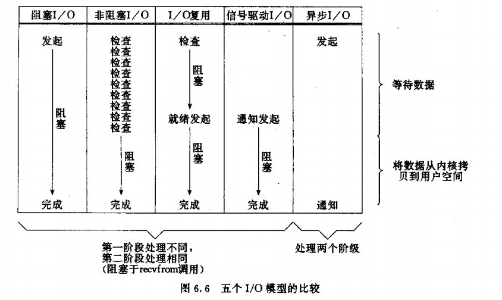


```txt
同步阻塞方式：
    发送方发送请求之后一直等待响应。
    接收方处理请求时进行的IO操作如果不能马上等到返回结果，就一直等到返回结果后，才响应发送方，期间不能进行其他工作。

同步非阻塞方式：
	发送方发送请求之后，一直等待响应。
	接受方处理请求时进行的IO操作如果不能马上的得到结果，就立即返回，取做其他事情。
	但是由于没有得到请求处理结果，不响应发送方，发送方一直等待。
	当IO操作完成以后，将完成状态和结果通知接收方，接收方再响应发送方，发送方才进入下一次请求过程。（实际不应用）

异步阻塞方式：
	发送方向接收方请求后，不等待响应，可以继续其他工作。
	接收方处理请求时进行IO操作如果不能马上得到结果，就一直等到返回结果后，才响应发送方，期间不能进行其他操作。 （实际不应用）

异步非阻塞方式：
	发送方向接收方请求后，不等待响应，可以继续其他工作。
	接收方处理请求时进行IO操作如果不能马上得到结果，也不等待，而是马上返回去做其他事情。
	当IO操作完成以后，将完成状态和结果通知接收方，接收方再响应发送方。（效率最高）
```


同步调用、线程、通信

```
同步就是两种东西通过一种机制实现步调一致，异步是两种东西不必步调一致

一、同步调用与异步调用：
    在用在调用场景中，无非是对调用结果的不同处理。
    同步调用就是调用一但返回，就能知道结果，而异步是返回时不一定知道结果，还得通过其他机制来获知结果，如：
        a. 状态 b. 通知 c. 回调函数

二、同步线程与异步线程：
    同步线程：即两个线程步调要一致，其中一个线程可能要阻塞等待另外一个线程的运行，要相互协商。快的阻塞一下等到慢的步调一致。
    异步线程：步调不用一致，各自按各自的步调运行，不受另一个线程的影响。

三、同步通信与异步通信：
    同步和异步是指：发送方和接收方是否协调步调一致
    同步通信是指：发送方和接收方通过一定机制，实现收发步调协调。
        如：发送方发出数据后，等接收方发回响应以后才发下一个数据包的通讯方式
    异步通信是指：发送方的发送不管接收方的接收状态。
        如：发送方发出数据后，不等接收方发回响应，接着发送下个数据包的通讯方式。

阻塞可以是实现同步的一种手段！例如两个东西需要同步，一旦出现不同步情况，我就阻塞快的一方，使双方达到同步。
同步是两个对象之间的关系，而阻塞是一个对象的状态。
```


```txt
同步阻塞方式：
    发送方发送请求之后一直等待响应。
    接收方处理请求时进行的IO操作如果不能马上等到返回结果，就一直等到返回结果后，才响应发送方，期间不能进行其他工作。

同步非阻塞方式：
	发送方发送请求之后，一直等待响应。
	接受方处理请求时进行的IO操作如果不能马上的得到结果，就立即返回，取做其他事情。
	但是由于没有得到请求处理结果，不响应发送方，发送方一直等待。
	当IO操作完成以后，将完成状态和结果通知接收方，接收方再响应发送方，发送方才进入下一次请求过程。（实际不应用）

异步阻塞方式：
	发送方向接收方请求后，不等待响应，可以继续其他工作。
	接收方处理请求时进行IO操作如果不能马上得到结果，就一直等到返回结果后，才响应发送方，期间不能进行其他操作。 （实际不应用）

异步非阻塞方式：
	发送方向接收方请求后，不等待响应，可以继续其他工作。
	接收方处理请求时进行IO操作如果不能马上得到结果，也不等待，而是马上返回去做其他事情。
	当IO操作完成以后，将完成状态和结果通知接收方，接收方再响应发送方。（效率最高）
```


### ==SELECT POLL EPOLL==

select/poll/epoll的相关文章：

IO多路复用机制详解：https://www.cnblogs.com/yanguhung/p/10145755.html

一文读懂I/O多路复用技术：https://blog.csdn.net/wangxindong11/article/details/78591308

并发编程(IO多路复用)：https://blog.csdn.net/wangxindong11/article/details/78591308https://www.cnblogs.com/cainingning/p/9556642.html

select、poll、epoll之间的区别(搜狗面试)：https://www.cnblogs.com/aspirant/p/9166944.html

并发编程(IO多路复用)：https://www.cnblogs.com/cainingning/p/9556642.html

IO多路复用的视频讲解：https://www.bilibili.com/video/BV1qJ411w7du?from=search&seid=15252085922463125422

- select/epoll、epoll 的作用，能让单个线程处理更多的IO，而线程本身又不用轮训去查看IO是否完毕，从而提高线程运行效率。
- 优势并不是对于单个连接能处理得更快，而是在于能处理更多的连接。
- 典型的应用有：redis，nginx，javaNIO（linux）也是用到epoll的。


#### 从网卡接收数据说起

下图是一个典型的计算机结构图，计算机由CPU、存储器（内存）、网络接口等部件组成。了解epoll本质的**第一步**，要从**硬件**的角度看计算机怎样接收网络数据。


下图展示了网卡接收数据的过程。在①阶段，网卡收到网线传来的数据；经过②阶段的硬件电路的传输；最终将数据写入到内存中的某个地址上（③阶段）。这个过程涉及到DMA传输、IO通路选择等硬件有关的知识，但我们只需知道：**网卡会把接收到的数据写入内存。**


通过硬件传输，网卡接收的数据存放到内存中。操作系统就可以去读取它们。

#### 如何知道接收了数据？

了解epoll本质的**第二步**，要从**CPU**的角度来看数据接收。要理解这个问题，要先了解一个概念——中断。

计算机执行程序时，会有优先级的需求。比如，当计算机收到断电信号时（电容可以保存少许电量，供CPU运行很短的一小段时间），它应立即去保存数据，保存数据的程序具有较高的优先级。

一般而言，由硬件产生的信号需要cpu立马做出回应（不然数据可能就丢失），所以它的优先级很高。cpu理应中断掉正在执行的程序，去做出响应；当cpu完成对硬件的响应后，再重新执行用户程序。中断的过程如下图，和函数调用差不多。只不过函数调用是事先定好位置，而中断的位置由“信号”决定。

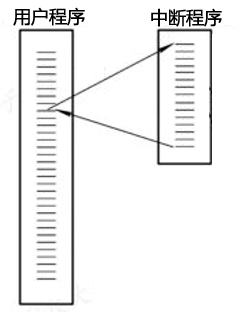

以键盘为例，当用户按下键盘某个按键时，键盘会给cpu的中断引脚发出一个高电平。cpu能够捕获这个信号，然后执行键盘中断程序。下图展示了各种硬件通过中断与cpu交互。


现在可以回答本节提出的问题了：当网卡把数据写入到内存后，**网卡向cpu发出一个中断信号，操作系统便能得知有新数据到来**，再通过网卡**中断程序**去处理数据。

#### 进程阻塞为什么不占用 CPU 资源？

了解epoll本质的**第三步**，要从**操作系统进程调度**的角度来看数据接收。阻塞是进程调度的关键一环，指的是进程在等待某事件（如接收到网络数据）发生之前的等待状态，recv、select和epoll都是阻塞方法。**了解“进程阻塞为什么不占用cpu资源？”，也就能够了解这一步**。

为简单起见，我们从普通的recv接收开始分析，先看看下面代码：

```java
//创建socket
int s = socket(AF_INET， SOCK_STREAM， 0);   
//绑定
bind(s， ...)
//监听
listen(s， ...)
//接受客户端连接
int c = accept(s， ...)
//接收客户端数据
recv(c， ...);
//将数据打印出来
printf(...)
```

这是一段最基础的网络编程代码，先新建socket对象，依次调用bind、listen、accept，最后调用recv接收数据。recv是个阻塞方法，当程序运行到recv时，它会一直等待，直到接收到数据才往下执行。

那么阻塞的原理是什么？

**工作队列**

操作系统为了支持多任务，实现了进程调度的功能，会把进程分为“运行”和“等待”等几种状态。运行状态是进程获得cpu使用权，正在执行代码的状态；等待状态是阻塞状态，比如上述程序运行到recv时，程序会从运行状态变为等待状态，接收到数据后又变回运行状态。操作系统会分时执行各个运行状态的进程，由于速度很快，看上去就像是同时执行多个任务。

下图中的计算机中运行着A、B、C三个进程，其中进程A执行着上述基础网络程序，一开始，这3个进程都被操作系统的工作队列所引用，处于运行状态，会分时执行。

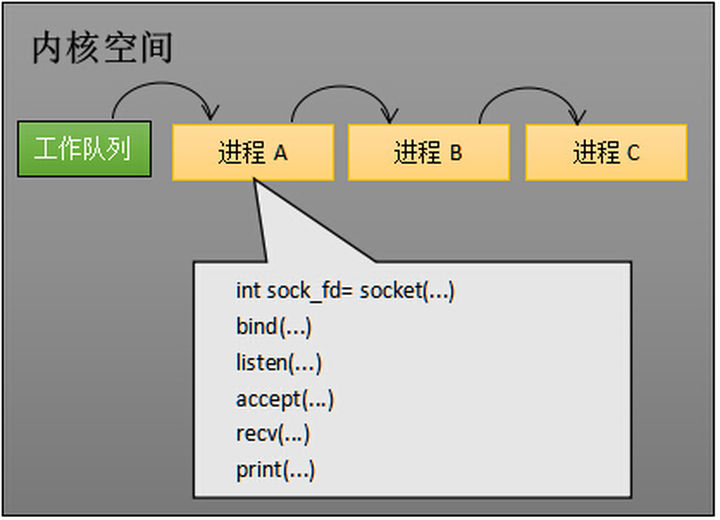

工作队列中有A、B和C三个进程

**等待队列**

当进程A执行到创建socket的语句时，操作系统会创建一个由文件系统管理的socket对象（如下图）。这个socket对象包含了发送缓冲区、接收缓冲区、等待队列等成员。等待队列是个非常重要的结构，它指向所有需要等待该socket事件的进程。


当程序执行到recv时，操作系统会将进程A从工作队列移动到该socket的等待队列中（如下图）。由于工作队列只剩下了进程B和C，依据进程调度，cpu会轮流执行这两个进程的程序，不会执行进程A的程序。**所以进程A被阻塞，不会往下执行代码，也不会占用cpu资源**。

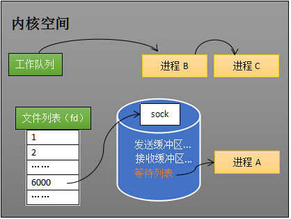

ps：操作系统添加等待队列只是添加了对这个“等待中”进程的引用，以便在接收到数据时获取进程对象、将其唤醒，而非直接将进程管理纳入自己之下。上图为了方便说明，直接将进程挂到等待队列之下。

**唤醒进程**

当socket接收到数据后，操作系统将该socket等待队列上的进程重新放回到工作队列，该进程变成运行状态，继续执行代码。也由于socket的接收缓冲区已经有了数据，recv可以返回接收到的数据。

#### 内核接收网络数据全过程

**这一步，贯穿网卡、中断、进程调度的知识，叙述阻塞recv下，内核接收数据全过程。**

如下图所示，进程在recv阻塞期间，计算机收到了对端传送的数据（步骤①）。数据经由网卡传送到内存（步骤②），然后网卡通过中断信号通知cpu有数据到达，cpu执行中断程序（步骤③）。此处的中断程序主要有两项功能，先将网络数据写入到对应socket的接收缓冲区里面（步骤④），再唤醒进程A（步骤⑤），重新将进程A放入工作队列中。


唤醒进程的过程如下图所示。


**以上是内核接收数据全过程**

这里留有两个思考题，大家先想一想。

其一，操作系统如何知道网络数据对应于哪个socket？

其二，如何同时监视多个socket的数据？

第一个问题：因为一个socket对应着一个端口号，而网络数据包中包含了ip和端口的信息，内核可以通过端口号找到对应的socket。当然，为了提高处理速度，操作系统会维护端口号到socket的索引结构，以快速读取。

第二个问题是**多路复用的重中之重，**是本文后半部分的重点！

#### 同时监视多个socket的简单方法

服务端需要管理多个客户端连接，而recv只能监视单个socket，这种矛盾下，人们开始寻找监视多个socket的方法。epoll的要义是**高效**的监视多个socket。从历史发展角度看，必然先出现一种不太高效的方法，人们再加以改进。只有先理解了不太高效的方法，才能够理解epoll的本质。

假如能够预先传入一个socket列表，**如果列表中的socket都没有数据，挂起进程，直到有一个socket收到数据，唤醒进程**。这种方法很直接，也是select的设计思想。

为方便理解，我们先复习select的用法。在如下的代码中，先准备一个数组（下面代码中的fds），让fds存放着所有需要监视的socket。然后调用select，**如果fds中的所有socket都没有数据，select会阻塞，直到有一个socket接收到数据，select返回，唤醒进程**。用户可以遍历fds，通过FD_ISSET判断具体哪个socket收到数据，然后做出处理。

```c++
int s = socket(AF_INET， SOCK_STREAM， 0);  
bind(s， ...)
listen(s， ...)

int fds[] =  存放需要监听的socket

while(1){
    int n = select(...， fds， ...)
    for(int i=0; i < fds.count; i++){
        if(FD_ISSET(fds[i]， ...)){
            //fds[i]的数据处理
        }
    }
}
```

**select的流程**

select的实现思路很直接。假如程序同时监视如下图的sock1、sock2和sock3三个socket，那么在调用select之后，操作系统把进程A分别加入这三个socket的等待队列中。

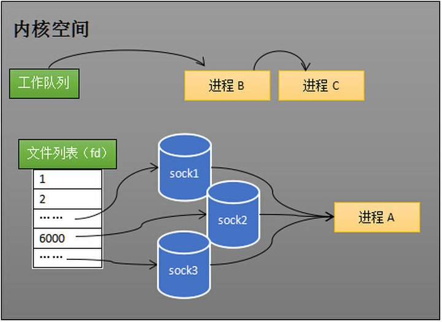

当任何一个socket收到数据后，中断程序将唤起进程。下图展示了sock2接收到了数据的处理流程。

> ps：recv和select的中断回调可以设置成不同的内容。

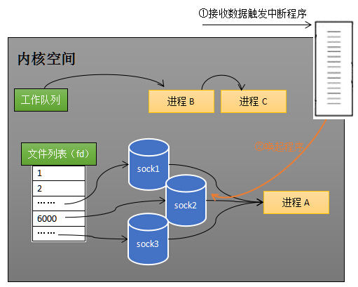

sock2接收到了数据，中断程序唤起进程A

所谓唤起进程，就是将进程从所有的等待队列中移除，加入到工作队列里面。如下图所示。

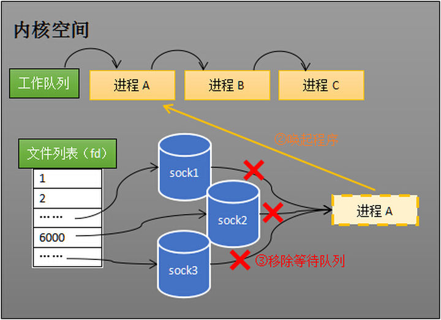

将进程A从所有等待队列中移除，再加入到工作队列里面

经由这些步骤，当进程A被唤醒后，它知道至少有一个socket接收了数据。程序只需遍历一遍socket列表，就可以得到就绪的socket。

这种简单方式**行之有效**，在几乎所有操作系统都有对应的实现。

**但是简单的方法往往有缺点，主要是：**

其一，每次调用select都需要将进程加入到所有监视socket的等待队列，每次唤醒都需要从每个队列中移除。这里涉及了两次遍历，而且每次都要将整个fds列表传递给内核，有一定的开销。正是因为遍历操作开销大，出于效率的考量，才会规定select的最大监视数量，默认只能监视1024个socket。

其二，进程被唤醒后，程序并不知道哪些socket收到数据，还需要遍历一次。

那么，有没有减少遍历的方法？有没有保存就绪socket的方法？这两个问题便是epoll技术要解决的。

#### epoll的设计思路

epoll是在select出现N多年后才被发明的，是select和poll的增强版本。epoll通过以下一些措施来改进效率。

**措施一：功能分离**

select低效的原因之一是将“维护等待队列”和“阻塞进程”两个步骤合二为一。如下图所示，每次调用select都需要这两步操作，然而大多数应用场景中，需要监视的socket相对固定，并不需要每次都修改。epoll将这两个操作分开，先用epoll_ctl维护等待队列，再调用epoll_wait阻塞进程。显而易见的，效率就能得到提升。

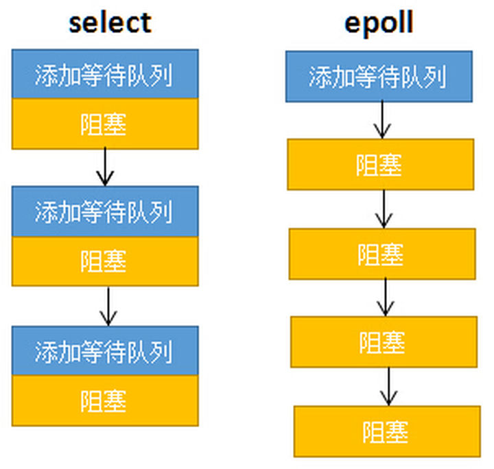

相比select，epoll拆分了功能

为方便理解后续的内容，我们先复习下epoll的用法。如下的代码中，先用epoll_create创建一个epoll对象epfd，再通过epoll_ctl将需要监视的socket添加到epfd中，最后调用epoll_wait等待数据。

```c++
int s = socket(AF_INET， SOCK_STREAM， 0);   
bind(s， ...)
listen(s， ...)

int epfd = epoll_create(...);
epoll_ctl(epfd， ...); //将所有需要监听的socket添加到epfd中

while(1){
    int n = epoll_wait(...)
    for(接收到数据的socket){
        //处理
    }
}
```

功能分离，使得epoll有了优化的可能。

**措施二：就绪列表**

select低效的另一个原因在于程序不知道哪些socket收到数据，只能一个个遍历。如果内核维护一个“就绪列表”，引用收到数据的socket，就能避免遍历。如下图所示，计算机共有三个socket，收到数据的sock2和sock3被rdlist（就绪列表）所引用。当进程被唤醒后，只要获取rdlist的内容，就能够知道哪些socket收到数据。

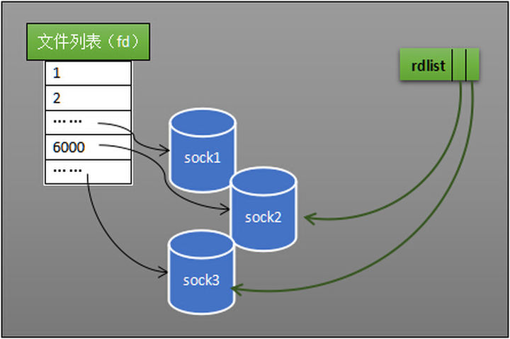

#### epoll的原理和流程

本节会以示例和图表来讲解epoll的原理和流程。

**创建epoll对象**

如下图所示，当某个进程调用epoll_create方法时，内核会创建一个eventpoll对象（也就是程序中epfd所代表的对象）。eventpoll对象也是文件系统中的一员，和socket一样，它也会有等待队列。

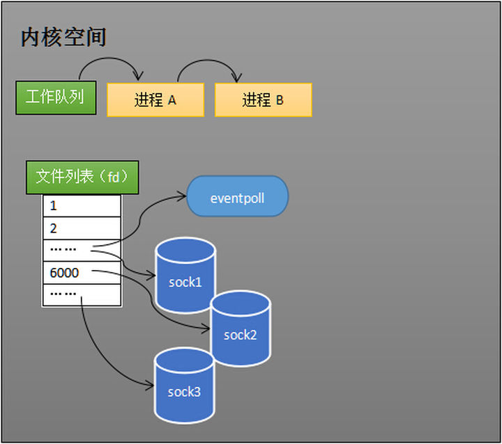

创建一个代表该epoll的eventpoll对象是必须的，因为内核要维护“就绪列表”等数据，“就绪列表”可以作为eventpoll的成员。

**维护监视列表**

创建epoll对象后，可以用epoll_ctl添加或删除所要监听的socket。以添加socket为例，如下图，如果通过epoll_ctl添加sock1、sock2和sock3的监视，内核会将eventpoll添加到这三个socket的等待队列中。


当socket收到数据后，中断程序会操作eventpoll对象，而不是直接操作进程。

**接收数据**

当socket收到数据后，中断程序会给eventpoll的“就绪列表”添加socket引用。如下图展示的是sock2和sock3收到数据后，中断程序让rdlist引用这两个socket。


eventpoll对象相当于是socket和进程之间的中介，socket的数据接收并不直接影响进程，而是通过改变eventpoll的就绪列表来改变进程状态。

当程序执行到epoll_wait时，如果rdlist已经引用了socket，那么epoll_wait直接返回，如果rdlist为空，阻塞进程。

**阻塞和唤醒进程**

假设计算机中正在运行进程A和进程B，在某时刻进程A运行到了epoll_wait语句。如下图所示，内核会将进程A放入eventpoll的等待队列中，阻塞进程。

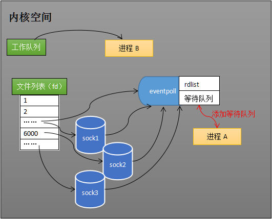

当socket接收到数据，中断程序一方面修改rdlist，另一方面唤醒eventpoll等待队列中的进程，进程A再次进入运行状态（如下图）。也因为rdlist的存在，进程A可以知道哪些socket发生了变化。


#### epoll的实现细节

至此，相信读者对epoll的本质已经有一定的了解。但我们还留有一个问题，**eventpoll的数据结构**是什么样子？

再留两个问题，**就绪队列**应该应使用什么数据结构？eventpoll应使用什么数据结构来管理通过epoll_ctl添加或删除的socket？

如下图所示，eventpoll包含了lock、mtx、wq（等待队列）、rdlist等成员。rdlist和rbr是我们所关心的。


**就绪列表的数据结构**

就绪列表引用着就绪的socket，所以它应能够快速的插入数据。

程序可能随时调用epoll_ctl添加监视socket，也可能随时删除。当删除时，若该socket已经存放在就绪列表中，它也应该被移除。

所以就绪列表应是一种能够快速插入和删除的数据结构。双向链表就是这样一种数据结构，epoll使用双向链表来实现就绪队列（对应上图的rdllist）。

**索引结构**

既然epoll将“维护监视队列”和“进程阻塞”分离，也意味着需要有个数据结构来保存监视的socket。至少要方便的添加和移除，还要便于搜索，以避免重复添加。红黑树是一种自平衡二叉查找树，搜索、插入和删除时间复杂度都是O(log(N))，效率较好。epoll使用了红黑树作为索引结构（对应上图的rbr）。

#### 结论

epoll在select和poll（poll和select基本一样，有少量改进）的基础引入了eventpoll作为中间层，使用了先进的数据结构，是一种高效的多路复用技术。

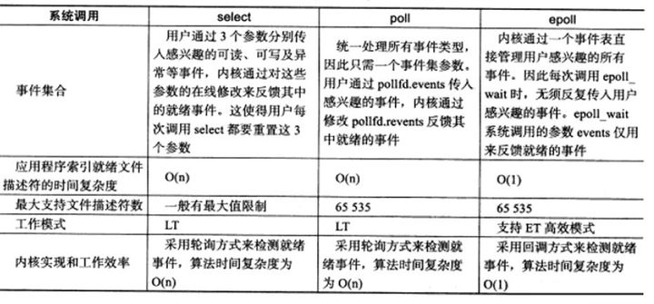


## 网络--------------------

建议：

1. **长连接**多用于操作频繁，点对点的通讯，而且连接数不能太多情况。数据库的连接用长连接， 如果用短连接频繁的通信会造成socket错误，而且频繁的socket 创建也是对资源的浪费。 
2. 短链接：所以并发量大，但每个用户无需频繁操作情况下需用短连好。web服务，用长连接成千上万，长连接顶不住；2太浪费长连接资源。


为什么需要3次握手：

- 第三次握手是为了防止失效的连接请求到达服务器，让服务器错误打开连接。

  客户端发送的连接请求如果在网络中滞留，那么就会隔很长一段时间才能收到服务器端发回的连接确认。客户端等待一个超时重传时间之后，就会重新请求连接。但是这个滞留的连接请求最后还是会到达服务器，如果不进行三次握手，那么服务器就会打开两个连接。如果有第三次握手，客户端会忽略服务器之后发送的对滞留连接请求的连接确认，不进行第三次握手，因此就不会再次打开连接。

- 为什么不需要第4次：没有必要，在确认也不一定能完全确认消息收到；将来会发送消息，如果消息能正常发送，就可以了；


4次挥手的原因：

- **客户端发送了 FIN 连接释放报文之后**，服务器收到了这个报文，就进入了 CLOSE-WAIT 状态。这个状态是为了让服务器端发送还未传送完毕的数据，传送完毕之后，**服务器会发送 FIN 连接释放报文**。


滑动窗口：

- 发送方、和接收方同步发送 数据字节流 指定部分的方式。发送窗口内的字节都允许被发送，接收窗口内的字节都允许被接收。如果发送窗口左部的字节已经发送并且收到了确认，那么就将发送窗口向右滑动一定距离，直到左部第一个字节不是已发送并且已确认的状态；接收窗口的滑动类似，接收窗口左部字节已经发送确认并交付主机，就向右滑动接收窗口。
- 接收方接收到按序到达的，就会对按序列的进行确认，没有确认的，窗口会进行重传。


Web请求页面过程：

- DHCP配置主机，
- ARP解析
- DNS 解析域名
- HTTP请求界面：


## 五层结构

* 物理层：单位是电平信号。主要功能是电平解码和时空复用。
* 数据链路层：单位是帧。主要功能是以太网和MAC层。
* 网络层：单位是IP数据包。主要功能是ARP地址解析，子网划分，ICMP网管，网关协议和NAT。
* 传输层：单位是UCP数据报和TCP数据段。
* 应用层：单位是报文。


## HTTP

https和http的区别。https的通信过程。除了证书之外，https是怎样加密保证通信安全的。

- HTTPS加密，访问速度慢一点，同时收费。。。但他安全
- HTTPS加密过程：browser获取server的public key，browser生成对称的 sessionkey，通过public key加密传输，server收到过后，进行解密，就能得到仅有browser和server知道的sessionkey，以后传输数据就用这个sessionkey生成摘要，保证完整性。

参考：图解HTTP


### [HTTP1.0、HTTP1.1 和 HTTP2.0 的区别](https://mp.weixin.qq.com/s/GICbiyJpINrHZ41u_4zT-A?)

1. **长连接** : **在HTTP/1.0中，默认使用的是短连接**，也就是说每次请求都要重新建立一次连接。HTTP 是基于TCP/IP协议的,每一次建立或者断开连接都需要三次握手四次挥手的开销，如果每次请求都要这样的话，开销会比较大。因此最好能维持一个长连接，可以用个长连接来发多个请求。**HTTP 1.1起，默认使用长连接** ,默认开启Connection： keep-alive。 **HTTP/1.1的持续连接有非流水线方式和流水线方式** 。流水线方式是客户在收到HTTP的响应报文之前就能接着发送新的请求报文。与之相对应的非流水线方式是客户在收到前一个响应后才能发送下一个请求。
2. **错误状态响应码** :在HTTP1.1中新增了24个错误状态响应码，如409（Conflict）表示请求的资源与资源的当前状态发生冲突；410（Gone）表示服务器上的某个资源被永久性的删除。
3. **缓存处理** :在HTTP1.0中主要使用header里的If-Modified-Since,Expires来做为缓存判断的标准，HTTP1.1则引入了更多的缓存控制策略例如Entity tag，If-Unmodified-Since, If-Match, If-None-Match等更多可供选择的缓存头来控制缓存策略。
4. **带宽优化及网络连接的使用** :HTTP1.0中，存在一些浪费带宽的现象，例如客户端只是需要某个对象的一部分，而服务器却将整个对象送过来了，并且不支持断点续传功能，HTTP1.1则在请求头引入了range头域，它允许只请求资源的某个部分，即返回码是206（Partial Content），这样就方便了开发者自由的选择以便于充分利用带宽和连接。


错误码：https://www.jianshu.com/p/218fa50b8f6c

400：请求错误

500：服务器错误

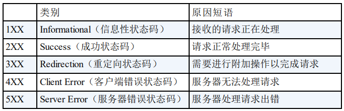

### [HTTP长连接,短连接](https://snailclimb.gitee.io/javaguide/#/docs/network/计算机网络?id=八-http长连接短连接)

[《HTTP长连接、短连接究竟是什么？》](https://www.cnblogs.com/gotodsp/p/6366163.html)

1. 在HTTP/1.0中默认使用短连接。客户端和服务器每进行一次HTTP操作，就建立一次连接，任务结束就中断连接。当客户端浏览器访问的某个HTML或其他类型的Web页中包含有其他的Web资源（如JavaScript文件、图像文件、CSS文件等），每遇到这样一个Web资源，浏览器就会重新建立一个HTTP会话。
2. 从HTTP/1.1起，默认使用长连接，用以保持连接特性。


### Get/Post/Put/Delete

https://juejin.cn/post/6844903815552958477#heading-5

 Post ：请求用于创建新的资源，每次调用都会在系统中产生新的资源，所以非幂等

Delete：方法用于删除资源，第一次和第N次删除操作对系统的作用是相同的，所以幂等的。

Put：必须为幂等，即如果声明为Put协议时就相当于对外声明这个接口是幂等的。所以对于原文举例说`账户中金额减少50元`这种操作在Put协议中是不允许的，只能做类似于`账户中金额改为 1000 元`的操作

Get ：方法用于获取资源，不应当对系统资源进行改变，所以是幂等的。

>  注意幂等指：对系统资源的改变，而不是返回数据的结果，即使返回结果不相同但是该操作本身没有副作用，所以幂等。


## TCP协议

提供可靠控制、流量控制、拥塞控制和连接管理的传输层协议。

### [TCP包头详解](https://blog.51cto.com/u_13854765/2163296)

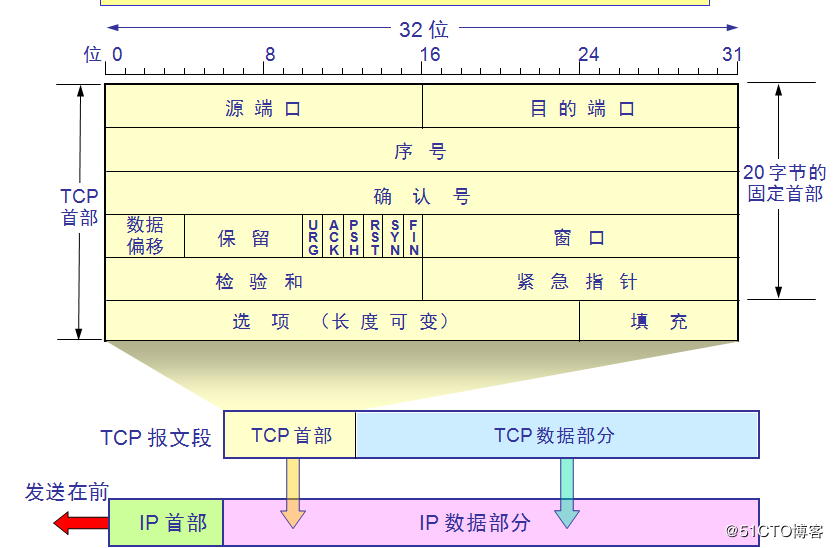


1. 源端口和目的端口

2. **序号(seq)**

   占4字节。序号范围是[0， 2^32 - 1]，共2^32（即4 294 967 296）个序号。序号增加到2^32- 1后，下一个序号就又回到0。也就是说，序号使用mod 232运算。

   TCP是面向字节流的。在一个TCP连接中传送的字节流中的每一个字节都按顺序编号。整个要传送的字节流的起始序号必须在连接建立时设置。首部中的序号字段值则指的是本报文段所发送的数据的第一个字节的序号。例如，一报文段的序号字段值是301，而携带的数据共有100字节。这就表明：本报文段的数据的第一个字节的序号是301，最后一个字节的序号是400。显然，下一个报文段（如果还有的话）的数据序号应当从401开始，即下一个报文段的序号字段值应为401。

3. **确认号 (ack)**

   占4字节，是期望收到对方下一个报文段的第一个数据字节的序号。例如，B正确收到了A发送过来的一个报文段，其序号字段值是501，而数据长度是200字节（序号501～700），这表明B正确收到了A发送的到序号700为止的数据。因此，B期望收到A的下一个数据序号是701，于是B在发送给A的确认报文段中把确认号置为701。总之，应当记住：若确认号 = N，则表明：到序号N - 1为止的所有数据都已正确收到。由于序号字段有32位长，可对4 GB（即4千兆字节）的数据进行编号。在一般情况下可保证当序号重复使用时，旧序号的数据早已通过网络到达终点了。

4. 数据偏移

   占4位，它指出TCP报文段的数据起始处距离TCP报文段的起始处有多远。这个字段实际上是指出TCP报文段的首部长度。由于首部中还有长度不确定的选项字段，因此数据偏移字段是必要的。但应注意，“数据偏移”的单位是32位字（即以4字节长的字为计算单位）。由于4位二进制数能够表示的最大十进制数字是15，因此数据偏移的最大值是60字节，这也是TCP首部的最大长度（即选项长度不能超过40字节）。

5. 保留

   占6位，保留为今后使用，但目前应置为0。

6. 紧急URG (URGent) 

   当URG = 1时，表明紧急指针字段有效。它告诉系统此报文段中有紧急数据，应尽快传送(相当于高优先级的数据)，而不要按原来的排队顺序来传送。

7. **确认ACK (ACKnowlegment)** 

   仅当ACK = 1时确认号字段(ack)才有效。当ACK = 0时，确认号无效。TCP规定，在连接建立后所有传送的报文段都必须把ACK置1。

8. 推送 PSH (PuSH)

   当两个应用进程进行交互式的通信时，有时在一端的应用进程希望在键入一个命令后立即就能够收到对方的响应。在这种情况下，TCP就可以使用推送(push)操作。这时，发送方TCP把PSH置1，并立即创建一个报文段发送出去。接收方TCP收到PSH = 1的报文段，就尽快地（即“推送”向前）交付接收应用进程，而不再等到整个缓存都填满了后再向上交付。虽然应用程序可以选择推送操作，但推送操作还很少使用。

9. 复位RST (ReSeT)

   当RST = 1时，表明TCP连接中出现严重差错（如由于主机崩溃或其他原因），必须释放连接，然后再重新建立运输连接。RST置1还用来拒绝一个非法的报文段或拒绝打开一个连接。RST也可称为重建位或重置位。

10. **同步SYN (SYNchronization)** 

    在连接建立时用来同步序号。当SYN = 1而ACK = 0时，表明这是一个连接请求报文段。对方若同意建立连接，则应在响应的报文段中使SYN = 1和ACK =1。因此，**SYN置为1就表示这是一个连接请求或连接接受报文**。

11. **终止FIN**

    用来释放一个连接。**当FIN = 1时，表明此报文段的发送方的数据已发送完毕，并要求释放运输连接。**

12. 窗口

    占2字节。窗口值是[0， 2^16 - 1]之间的整数。窗口指的是发送本报文段的一方的接收窗口（而不是自己的发送窗口）。窗口值告诉对方：从本报文段首部中的确认号算起，接收方目前允许对方发送的数据量。之所以要有这个限制，是因为接收方的数据缓存空间是有限的。总之，窗口值作为接收方让发送方设置其发送窗口的依据。窗口值是经常在动态变化着。

13. 检验和

    占2字节。检验和字段检验的范围包括首部和数据这两部分。

14. 紧急指针

    占2字节。紧急指针仅在URG = 1时才有意义，它指出本报文段中的紧急数据的字节数（紧急数据结束后就是普通数据）。

15. 选项

    长度可变，最长可达40字节。当没有使用“选项”时，TCP的首部长度是20字节。TCP最初只规定了一种选项，即最大报文段长度 MSS。后续增加了时间戳选项。

#### MSS 最大报文段长度

**MSS是每一个TCP报文段中的数据字段的最大长度。**数据字段加上TCP首部才等于整个的TCP报文段。所以MSS并不是整个TCP报文段的最大长度，而是“TCP报文段长度减去TCP首部长度”。

为什么要规定一个最大报文段长度MSS呢？这并不是考虑接收方的接收缓存可能放不下TCP报文段中的数据。实际上，MSS与接收窗口值没有关系。我们知道，**TCP报文段的数据部分，至少要加上40字节的首部，才能组装成一个IP数据报**。若选择较小的MSS长度，网络的利用率就降低。设想在极端的情况下，当TCP报文段只含有1字节的数据时，在IP层传输的数据报的开销至少有40字节(包括TCP报文段的首部和IP数据报的首部)。这样，对网络的利用率就不会超过1/41。到了数据链路层还要加上一些开销。但反过来，若TCP报文段非常长，那么在IP层传输时就有可能要分解成多个短数据报片。在终点要把收到的各个短数据报片装配成原来的TCP报文段。当传输出错时还要进行重传。这些也都会使开销增大。

因此，**MSS应尽可能大些，只要在IP层传输时不需要再分片就行。**由于IP数据报所经历的路径是动态变化的，因此在这条路径上确定的不需要分片的MSS，如果改走另一条路径就可能需要进行分片。因此最佳的MSS是很难确定的。在连接建立的过程中，双方都把自己能够支持的MSS写入这一字段，以后就按照这个数值传送数据，**两个传送方向可以有不同的MSS值。若主机未填写这一项，则MSS的默认值是536字节长。**因此，所有在因特网上的主机都应能接受的报文段长度是536 + 20= 556字节。


TCP则把数据流分割成适当长度的报文段，

最大传输段大小（MSS）通常受该计算机连接的网络的数据链路层的最大传送单元（MTU）限制。

**MTU和MSS值的关系：MTU=MSS+IP Header+TCPHeader
通信双方最终的MSS值=较小MTU-IP Header-TCP Header**


#### 时间戳

占10字节，其中最主要的字段为**时间戳值字段**（4字节）和**时间戳回送回答字段**（4字节）。

时间戳选项有以下两个功能：

1. 用来计算往返时间RTT。发送方在发送报文段时把当前时钟的时间值放入时间戳字段，接收方在确认该报文段时把时间戳字段值复制到时间戳回送回答字段。因此，发送方在收到确认报文后，可以准确地计算出RTT来。
2. 用于处理TCP序号超过2^32的情况，这又称为防止序号绕回 PAWS (Protect AgainstWrapped Sequence numbers)。我们知道，序号只有32位，而每增加2^32个序号就会重复使用原来用过的序号。当使用高速网络时，在一次TCP连接的数据传送中序号很可能会被重复使用。例如，若用1Gb/s的速率发送报文段，则不到35秒钟数据字节的序号就会重复。为了使接收方能够把新的报文段和迟到很久的报文段区分开，可以在报文段中加上这种时间戳。

### TCP和UDP的区别

1. TCP面向连接，UDP是无连接的；
2. TCP提供可靠的服务。也就是说，通过TCP连接传送的数据，无差错，不丢失，不重复，且按序到达;UDP尽最大努力交付，即不保证可靠交付；Tcp通过校验和，重传控制，序号标识，滑动窗口、确认应答实现可靠传输。如丢包时的重发控制，还可以对次序乱掉的分包进行顺序控制。
3. UDP具有较好的实时性，工作效率比TCP高，适用于对高速传输和实时性有较高的通信或广播通信。
4. 每一条TCP连接只能是点到点的;UDP支持一对一，一对多，多对一和多对多的交互通信
5. TCP对系统资源要求较多，UDP对系统资源要求较少。


- TCP：有链接的；可靠的保证交互的；字节流的；有拥塞控制的；点对点的；
- UDP：无连接的；尽最大努力交付的；面向数据包，报文的；无拥塞的；非点对点的；


### 可靠控制

保证TCP的可靠性，通过**首部检验和、序列号、确认应答机制和超时重传机制**。

### 流量控制

保证TCP的流量控制，通过**停止等待、后退N帧和选择重传算法**。本质都是滑动窗口算法。

#### 停止等待算法

相当于发送窗口和接收窗口都为1的选择重传算法。

“停止等待”就是每发送完一个分组就停止发送，等待对方的确认。在收到确认后再发送下一个分组。

无差错时一切照常，出现差错时有以下考虑：

1. 接收方B在接受数据包M1时检测出了差错，就丢弃M1，其他什么也不做（不通知A收到有差错的分组）。
2. 也可能是M1在传输过程中丢失了，这时B当然什么都不知道。

在这两种情况下，B都不会发送任何信息。

可靠传输协议是这样设计的：A只要超过了一段时间仍然没有收到确认，就认为刚才发送的分组丢失了，因而重传前面发送过的分组。这就叫做**超时重传**。要实现超时重传，就要在每发送完一个分组设置一个超时计时器。如果在超时计时器到期之前收到了对方的确认，就撤销已设置的超时计时器。

这里应注意以下三点:

1. A在发送完一个分组后，必须暂时保留已发送的分组的副本（为发生超时重传时使用）。只有在收到相应的确认后才能清除暂时保留的分组副本。
2. 分组和确认分组都必须进行编号。这样才能明确是哪一个发送出去的分组收到了确认，而哪一个分组还没有收到确认。
3. 超时计时器设置的重传时间应当比数据在分组传输的平均往返时间更长一些。

确认丢失和确认迟到是另一种情况。B所发送的对M1的确认丢失了。A在设定的超时重传时间内没有收到确认，但并无法知道是自己发送的分组出错、丢失，或者是B发送的确认丢失了。因此A在超时计时器到期后就要重传M1。现在应注意B的动作。假定B又收到了重传的分组M1。这时应采取两个行动。

第一，丢弃这个重复的分组M1，不向上层交付。第二，向 A 发送确认。不能认为已经发送过确认就不再发送，因为A之所以重传M1就表示A没有收到对M1的确认。

这种可靠传输协议常称为**自动重传请求ARQ (Automatic Repeat reQuest)**。意思是重传的请求是自动进行的。接收方不需要请求发送方重传某个出错的分组。

#### 后退N帧算法

相当于接收窗口为1的选择重传算法。

在发送完一个数据报后，不用停下来等待确认，而是可以连续发送多个数据报。

如果前一个帧在超时时间内未得到确认，就认为丢失或被破坏，需要重发出错帧及其后面的所有数据帧。这样有可能有把正确的数据帧重传一遍，降低了传送效率。

#### 选择重传算法

也称滑动窗口算法。

连续ARQ协议规定，发送方每收到一个确认，就把发送窗口向前滑动一个分组的位置。

接收方一般都是采用累积确认的方式。这就是说，接收方不必对收到的分组逐个发送确认，而是在收到几个分组后，对按序到达的最后一个分组发送确认，这就表示：到这个分组为止的所有分组都已正确收到了。

累积确认有优点也有缺点。

优点是：容易实现，即使确认丢失也不必重传。

但缺点是不能向发送方反映出接收方已经正确收到的所有分组的信息。

### 拥塞控制

#### 慢开始与快恢复算法

发送方维持一个叫做拥塞窗口cwnd的状态变量。拥塞窗口的大小取决于网络的拥塞程度，并且动态地在变化。发送方让自己的发送窗口等于拥塞窗口，另外考虑到接受方的接收能力，发送窗口可能小于拥塞窗口。

慢开始算法的思路就是，不要一开始就发送大量的数据，先探测一下网络的拥塞程度，也就是说由小到大逐渐增加拥塞窗口的大小。

实时拥塞窗口大小是以字节为单位的。如下图：


一次传输轮次之后拥塞窗口就加倍。这就是乘法增长，和后面的拥塞避免算法的加法增长比较。

为了防止cwnd增长过大引起网络拥塞，还需设置一个慢开始门限ssthresh状态变量。ssthresh的用法如下：

* 当cwnd<ssthresh时，使用慢开始算法。
* 当cwnd>=ssthresh时，改用拥塞避免算法。

拥塞避免算法让拥塞窗口缓慢增长，即每经过一个往返时间RTT就把发送方的拥塞窗口cwnd加1，而不是加倍。这样拥塞窗口按线性规律缓慢增长。

无论是在慢开始阶段还是在拥塞避免阶段，只要发送方判断网络出现拥塞（其根据就是没有收到确认，虽然没有收到确认可能是其他原因的分组丢失，但是因为无法判定，所以都当做拥塞来处理），就把慢开始门限设置为出现拥塞时的发送窗口大小的一半。然后把拥塞窗口设置为1，执行慢开始算法。如下图：


快恢复算法，在出现拥塞之后将拥塞窗口设置为出现拥塞时拥塞窗口的一半，而不是直接降为1.

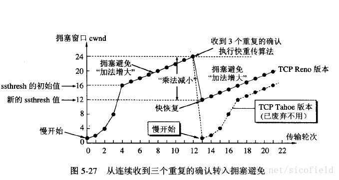

#### 快重传

快重传要求接收方在收到一个失序的报文段后就立即发出重复确认（为的是使发送方及早知道有报文段没有到达对方）而不要等到自己发送数据时捎带确认。快重传算法规定，发送方只要一连收到三个重复确认就应当立即重传对方尚未收到的报文段，而不必继续等待设置的重传计时器时间到期。

## 三次握手

三次握手其实就是指建立一个TCP连接时，需要客户端和服务器总共发送3个包。进行三次握手的主要作用就是为了确认双方的接收能力和发送能力是否正常、指定自己的初始化序列号为后面的可靠性传送做准备。实质上其实就是连接服务器指定端口，建立TCP连接，并同步连接双方的序列号和确认号，交换TCP窗口大小信息。

* 刚开始：客户端处于 Closed 的状态，服务端处于 Listen 状态。

* 第一次握手：客户端给服务端发一个 SYN 报文，并指明客户端的初始化序列号 ISN。此时客户端处于 SYN_SEND 状态。首部的同步位SYN=1，初始序号seq=x，SYN=1的报文段不能携带数据，但要消耗掉一个序号。
* 第二次握手：服务器收到客户端的 SYN 报文之后，会以自己的 SYN 报文作为应答，并且也是指定了自己的初始化序列号 ISN(s)。同时会把客户端的 ISN + 1 作为ACK 的值，表示自己已经收到了客户端的 SYN，此时服务器处于 SYN_REVD 的状态。在确认报文段中SYN=1，ACK=1，确认号ack=x+1，初始序号seq=y。
* 第三次握手：客户端收到 SYN 报文之后，会发送一个 ACK 报文，当然，也是一样把服务器的 ISN + 1 作为 ACK 的值，表示已经收到了服务端的 SYN 报文，此时客户端处于 ESTABLISHED 状态。服务器收到 ACK 报文之后，也处于 ESTABLISHED 状态，此时，双方已建立起了连接。确认报文段ACK=1，确认号ack=y+1，序号seq=x+1（初始为seq=x，第二个报文段所以要+1），ACK报文段可以携带数据，不携带数据则不消耗序号。

发送第一个SYN的一端将执行主动打开（active open），接收这个SYN并发回下一个SYN的另一端执行被动打开（passive open）。

在socket编程中，客户端执行connect()时，将触发三次握手。

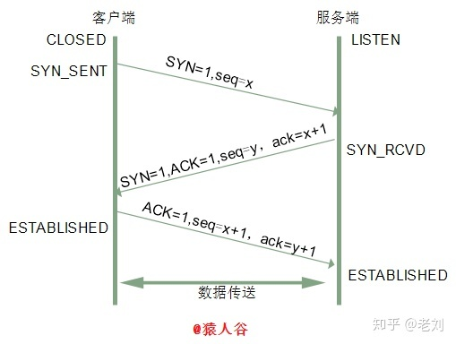


### [为什么要三次握手](https://snailclimb.gitee.io/javaguide/#/docs/network/计算机网络?id=_22-为什么要三次握手)

总结：

**三次握手的目的是建立可靠的通信信道，说到通讯，简单来说就是数据的发送与接收，而三次握手最主要的目的就是双方确认自己与对方的发送与接收是正常的。**

第一次握手：Client 什么都不能确认；Server 确认了对方发送正常，自己接收正常

第二次握手：Client 确认了：自己发送、接收正常，对方发送、接收正常；Server 确认了：对方发送正常，自己接收正常

第三次握手：Client 确认了：自己发送、接收正常，对方发送、接收正常；Server 确认了：自己发送、接收正常，对方发送、接收正常

所以三次握手就能确认双发收发功能都正常，缺一不可。


弄清这个问题，我们需要先弄明白三次握手的目的是什么，能不能只用两次握手来达到同样的目的。

第一次握手：客户端发送网络包，服务端收到了。这样服务端就能得出结论：客户端的发送能力、服务端的接收能力是正常的。

第二次握手：服务端发包，客户端收到了。这样客户端就能得出结论：服务端的接收、发送能力，客户端的接收、发送能力是正常的。不过此时服务器并不能确认客户端的接收能力是否正常。

第三次握手：客户端发包，服务端收到了。这样服务端就能得出结论：客户端的接收、发送能力正常，服务器自己的发送、接收能力也正常。

因此，需要三次握手才能确认双方的接收与发送能力是否正常。

试想如果是用两次握手，则会出现下面这种情况：

如客户端发出连接请求，但因连接请求报文丢失而未收到确认，于是客户端再重传一次连接请求。后来收到了确认，建立了连接。数据传输完毕后，就释放了连接，客户端共发出了两个连接请求报文段，其中第一个丢失，第二个到达了服务端，但是第一个丢失的报文段只是在某些网络结点长时间滞留了，延误到连接释放以后的某个时间才到达服务端，此时服务端误认为客户端又发出一次新的连接请求，于是就向客户端发出确认报文段，同意建立连接，不采用三次握手，只要服务端发出确认，就建立新的连接了，此时客户端忽略服务端发来的确认，也不发送数据，则服务端一致等待客户端发送数据，浪费资源。


### ==半连接队列==

服务器第一次收到客户端的 SYN 之后，就会处于 SYN_RCVD 状态，此时双方还没有完全建立其连接，服务器会把此种状态下请求连接放在一个队列里，我们把这种队列称之为半连接队列。

当然还有一个全连接队列，就是已经完成三次握手，建立起连接的就会放在全连接队列中。如果队列满了就有可能会出现丢包现象。

这里在补充一点关于SYN-ACK 重传次数的问题：

服务器发送完SYN-ACK包，如果未收到客户确认包，服务器进行首次重传，等待一段时间仍未收到客户确认包，进行第二次重传。如果重传次数超过系统规定的最大重传次数，系统将该连接信息从半连接队列中删除。每次重传等待的时间不一定相同，一般会是指数增长，例如间隔时间为 1s，2s，4s，8s…

#### SYN攻击

服务器端的资源分配是在二次握手时分配的，而客户端的资源是在完成三次握手时分配的，所以服务器容易受到SYN洪泛攻击。

SYN攻击就是Client在短时间内伪造大量不存在的IP地址，并向Server不断地发送SYN包，Server则回复确认包，并等待Client确认，由于源地址不存在，因此Server需要不断重发直至超时，这些伪造的SYN包将长时间占用未连接队列，导致正常的SYN请求因为队列满而被丢弃，从而引起网络拥塞甚至系统瘫痪。SYN 攻击是一种典型的 DoS/DDoS 攻击。

检测 SYN 攻击非常的方便，当你在服务器上看到大量的半连接状态时，特别是源IP地址是随机的，基本上可以断定这是一次SYN攻击。

常见的防御 SYN 攻击的方法有如下几种：

- 缩短超时（SYN Timeout）时间
- 增加最大半连接数
- 过滤网关防护
- SYN cookies技术

### ISN(Initial Sequence Number)

当一端为建立连接而发送它的SYN时，它为连接选择一个初始序号。ISN随时间而变化，因此每个连接都将具有不同的ISN。ISN可以看作是一个32比特的计数器，每4ms加1 。这样选择序号的目的在于防止在网络中被延迟的分组在以后又被传送，而导致某个连接的一方对它做错误的解释。

三次握手的其中一个重要功能是客户端和服务端交换 ISN(Initial Sequence Number)，以便让对方知道接下来接收数据的时候如何按序列号组装数据。如果 ISN 是固定的，攻击者很容易猜出后续的确认号，因此 ISN 是动态生成的。


### 三次握手过程中可以携带数据吗

**其实第三次握手的时候，是可以携带数据的。但是，第一次、第二次握手不可以携带数据**

为什么这样呢?大家可以想一个问题，假如第一次握手可以携带数据的话，如果有人要恶意攻击服务器，那他每次都在第一次握手中的 SYN 报文中放入大量的数据。因为攻击者根本就不理服务器的接收、发送能力是否正常，然后疯狂着重复发 SYN 报文的话，这会让服务器花费很多时间、内存空间来接收这些报文。

也就是说，第一次握手不可以放数据，其中一个简单的原因就是会让服务器更加容易受到攻击了。而对于第三次的话，此时客户端已经处于 ESTABLISHED 状态。对于客户端来说，他已经建立起连接了，并且也已经知道服务器的接收、发送能力是正常的了，所以能携带数据也没啥毛病。


- 

  

## 四次挥手

建立一个连接需要三次握手，而终止一个连接要经过四次挥手。这是由TCP的半关闭（half-close）造成的。所谓的半关闭，其实就是TCP提供了连接的一端在结束它的发送后还能接收来自另一端数据的能力。

* 刚开始：双方都处于 ESTABLISHED 状态，假如是客户端先发起关闭请求。

* 第一次挥手：客户端发送一个 FIN 报文，报文中会指定一个序列号。此时客户端处于 FIN_WAIT1 状态。即发出连接释放报文段（FIN=1，序号seq=u），并停止再发送数据，主动关闭TCP连接，进入FIN_WAIT1（终止等待1）状态，等待服务端的确认。
* 第二次挥手：服务端收到 FIN 之后，会发送 ACK 报文，且把客户端的序列号值 +1 作为 ACK 报文的序列号值，表明已经收到客户端的报文了，此时服务端处于 CLOSE_WAIT 状态。即服务端收到连接释放报文段后即发出确认报文段（ACK=1，确认号ack=u+1，序号seq=v），服务端进入CLOSE_WAIT（关闭等待）状态，此时的TCP处于半关闭状态，客户端到服务端的连接释放。客户端收到服务端的确认后，进入FIN_WAIT2（终止等待2）状态，等待服务端发出的连接释放报文段。
* 第三次挥手：如果服务端也想断开连接了，和客户端的第一次挥手一样，发给 FIN 报文，且指定一个序列号。此时服务端处于 LAST_ACK 的状态。即服务端没有要向客户端发出的数据，服务端发出连接释放报文段（FIN=1，ACK=1，序号seq=w，确认号ack=u+1），服务端进入LAST_ACK（最后确认）状态，等待客户端的确认。
* 第四次挥手：客户端收到 FIN 之后，一样发送一个 ACK 报文作为应答，且把服务端的序列号值 +1 作为自己 ACK 报文的序列号值，此时客户端处于 TIME_WAIT 状态。需要过一阵子以确保服务端收到自己的 ACK 报文之后才会进入 CLOSED 状态，服务端收到 ACK 报文之后，就处于关闭连接了，处于 CLOSED 状态。即客户端收到服务端的连接释放报文段后，对此发出确认报文段（ACK=1，seq=u+1，ack=w+1），客户端进入TIME_WAIT（时间等待）状态。此时TCP未释放掉，需要经过时间等待计时器设置的时间2MSL后，客户端才进入CLOSED状态。

收到一个FIN只意味着在这一方向上没有数据流动。客户端执行主动关闭并进入TIME_WAIT是正常的，服务端通常执行被动关闭，不会进入TIME_WAIT状态。

在socket编程中，任何一方执行close()操作即可产生挥手操作。

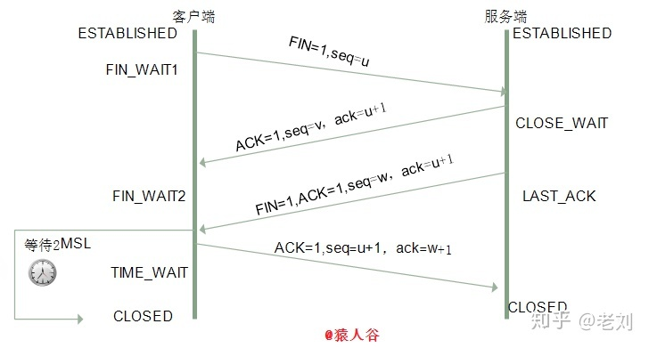


### [为什么要四次挥手](https://snailclimb.gitee.io/javaguide/#/docs/network/计算机网络?id=_25-为什么要四次挥手)

参考：敖丙的内容


[为什么TCP4次挥手时等待为2MSL? - 知乎](https://www.zhihu.com/question/67013338/answer/248375813)

1. 主因：
   1. 如果B没有收到自己的ACK，会超时重传FiN。那么A再次接到重传的FIN，会再次发送ACK。重新启动2MSL
   2. 如果B收到自己的ACK，也不会再发任何消息，包括ACK，所以需要2个MSL，作为A的 wait_time。
2. 另一个原因：TCP连接在2MSL等待期间，定义这个连接的插口（客户的IP地址和端口号，服务器的IP地址和端口号）不能再被使用。这个连接只能在2MSL结束后才能再被使用。
   1. 客户端在发送完最后一个ACK报文段后，再经过2MSL，就可以使本连接持续的时间内所产生的所有报文段都从网络中消失，使下一个新的连接中不会出现这种旧的连接请求报文段。


**第四个消息：A发出ACK，用于确认收到B的FIN**

当B接收到此消息，即认为双方达成了同步：双方都知道连接可以释放了，此时B可以安全地释放此TCP连接所占用的内存资源、端口号。

所以**被动关闭的B无需任何wait time，直接释放资源。**

但，A并不知道B是否接到自己的ACK，A是这么想的：

1）如果B没有收到自己的ACK，会超时重传FiN

那么A再次接到重传的FIN，会再次发送ACK

2）如果B收到自己的ACK，也不会再发任何消息，包括ACK

无论是1还是2，A都需要等待，要取这两种情况等待时间的最大值，**以应对最坏的情况发生**，这个最坏情况是：

去向ACK消息最大存活时间（MSL) + 来向FIN消息的最大存活时间(MSL)。

这恰恰就是**2MSL( Maximum Segment Life)。**等待2MSL时间，A就可以放心地释放TCP占用的资源、端口号，**此时可以使用该端口号连接任何服务器。**


## 面试题

### COOKIE、SESSION、TOKEN

[傻傻分不清之 Cookie、Session、Token、JWT](https://juejin.cn/post/6844904034181070861)


#### Cookie 和 Session 的区别

- **安全性：** Session 比 Cookie 安全，Session 是存储在服务器端的，Cookie 是存储在客户端的。

- **存取值的类型不同**：Cookie 只支持存字符串数据，想要设置其他类型的数据，需要将其转换成字符串，Session 可以存任意数据类型。

- **有效期不同：** Cookie 可设置为长时间保持，比如我们经常使用的默认登录功能，Session 一般失效时间较短，客户端关闭（默认情况下）或者 Session 超时都会失效。

- **存储大小不同：** 单个 Cookie 保存的数据不能超过 4K，Session 可存储数据远高于 Cookie，但是当访问量过多，会占用过多的服务器资源。

  

#### Token 和 Session 的区别

- Session 是一种**记录服务器和客户端会话状态的机制，使服务端有状态化，可以记录会话信息**。而 Token 是**令牌**，**访问资源接口（API）时所需要的资源凭证**。Token **使服务端无状态化，不会存储会话信息。**
- Session 和 Token 并不矛盾，作为身份认证 Token 安全性比 Session 好，因为每一个请求都有签名还能防止监听以及重放攻击，而 Session 就必须依赖链路层来保障通讯安全了。**如果你需要实现有状态的会话，仍然可以增加 Session 来在服务器端保存一些状态。**
- 所谓 Session 认证只是简单的把 User 信息存储到 Session 里，因为 SessionID 的不可预测性，暂且认为是安全的。而 Token ，如果指的是 OAuth Token 或类似的机制的话，提供的是 认证 和 授权 ，认证是针对用户，授权是针对 App 。**其目的是让某 App 有权利访问某用户的信息**。这里的 Token 是唯一的。不可以转移到其它 App上，也不可以转到其它用户上。**Session 只提供一种简单的认证，即只要有此 SessionID ，即认为有此 User 的全部权利**。是需要严格保密的，这个数据应该只保存在站方，不应该共享给其它网站或者第三方 App。所以简单来说：**如果你的用户数据可能需要和第三方共享，或者允许第三方调用 API 接口，用 Token 。如果永远只是自己的网站，自己的 App，用什么就无所谓了。**


总结：

- 安全性：Token>Session。Token是授予某APP某用户的全力，Cookie 里的 Sessionid，谁有此sessionid，即可获取某网站此sessionId的全部权利。
- 位置也不同：Token会让服
- 存储内容不同：Token存用户的权限加密信息，不会存储会话（一次连接）的信息；而Session会存会话信息


### [从输入URL到页面加载发生了什么](https://segmentfault.com/a/1190000006879700)

[javaGuide 输入URL后发生了什么](https://snailclimb.gitee.io/javaguide/#/docs/network/%E8%AE%A1%E7%AE%97%E6%9C%BA%E7%BD%91%E7%BB%9C?id=%e4%ba%94-%e5%9c%a8%e6%b5%8f%e8%a7%88%e5%99%a8%e4%b8%ad%e8%be%93%e5%85%a5url%e5%9c%b0%e5%9d%80-gtgt-%e6%98%be%e7%a4%ba%e4%b8%bb%e9%a1%b5%e7%9a%84%e8%bf%87%e7%a8%8b%e9%9d%a2%e8%af%95%e5%b8%b8%e5%ae%a2)

### 


### 输入网址的过程 —— 偏五层协议

UDP最大报文：65535

TCP包头：


# 8 中间件

## Kafka

kafka的数据是存储在内存中的

- 是存储在磁盘中的

请你说说kafka怎么一个人订阅不同消息，或者多个人订阅一个消息

- 一定订阅不同消息，就处于单独的消费组
- 多人出于同一个消费组，即可实现订阅1个消息


Kafka的两条消息是否允许相同的key：

- 如果 ProducerRecord 中指定了 Partition，则 Partitioner 不做任何事情；否则，Partitioner 根据消息的 key 得到一个 Partition。这是生产者就知道向哪个 Topic 下的哪个 Partition 发送这条消息。

  

查看kafka某topic的partition详细信息时，使用如下哪个命令：

- 查看topic：bin/kafka-topics.sh --list --bootstrap-server node1:9092,node2:9092,node3:9092
- 查看describe：bin/kafka-topics.sh –describe
- kafka常用命令：https://blog.csdn.net/qq_29116427/article/details/80202392


## BigPipe VS Kafka

BigPipe中的 Topic订阅 和 Queue 订阅的区别

- Topic订阅，每个Consumer不属于一个消费组，就是都要消费所有消息的
- Queue订阅，每个Consumer是属于一个消费组，是竞争消费的关系


## Redis

跳跃表：

sun是什么：一个普通的链表，为了能够以log(n)的速率定位，可以在他的上一层加上索引。一个节点是否成为索引，是抛硬币（随机）实现的，这样子就形成了第二层索引，同理可以形成第3层。这时：

插入效率：这时最底层的定位复杂度，就变成了O(log(n)) 。然后抛硬币，要不要提拔这个插入的节点，提拔了再抛硬币，要不要再提拔，等等，直到不能够提拔了。

删除效率：从最上层开始删除，直到最下层，删除的效率为 `O(log(n))` 


分布式锁：书籍+链接：https://www.cnblogs.com/moxiaotao/p/10829799.html

- set mykey True nx ex 5，原子加锁命令。但如果线程到期还没有执行完全
- 可以加入随机数，根据随机数来删除分布式锁。其他线程想要获取锁是获取不到的，只能等

```python
tag = random.nextint()				  # value,tag代表的requesid，自己删自己的锁，别删除别人的锁
if redis.set(key, tag, nx=True, ex=5):
    do_something()
    redis.delequals(key, tag)            #？？ do_something超时，为什么别人获取不到呢？     
```


### **RDB & AOF是什么**

常见问题：

[Redis热点问题总结](https://github.com/ewenliu/Learning_Note/blob/master/Redis热点问题总结.md)

- RDB：按照一定的时间周期策略，把内存中的数据以快照的形式保存到 硬盘中
- AOF：将每一个写命令都追加到一个文件之后，重庆就重新执行这个文件，来回复数据。
- RDB+AOF：是最安全的保存策略，定期备份，在定期和下一个定期之前进行增量备份。


## [Redis](https://snailclimb.gitee.io/javaguide/#/docs/database/Redis/redis-all)

Redis 布隆过滤器：

JavaGuide布隆过滤器：[JavaGuide](https://snailclimb.gitee.io/javaguide/#/docs/dataStructures-algorithms/data-structure/bloom-filter)

[Redis详解(十三)------ Redis布隆过滤器 - YSOcean - 博客园](https://www.cnblogs.com/ysocean/p/12594982.html#_label2_0)

1. 小规模数据，在大规模数据中判定存在：比如判断一个数字是否存在于包含大量数字的数字集中（数字集很大，5亿以上！）、 防止缓存穿透（判断请求的数据是否有效避免直接绕过缓存请求数据库）
2. 去重：比如爬给定网址的时候对已经爬取过的 URL 去重。


### 常见面试题

**五大结构基本命令**

- string 
  - 热点文章访问次数
- list :
  - 发布订阅、消息队列
- hash(hashMap) 
  - 对象数据的存储
- set(hashSet)
  - 不重复、获取交并补时候
- Sorted set
  - 对数据根据某个权重进行排序的场景
- bitmap
  - 统计用户在线状态。key位任务名, offset位用户id偏差位，14亿用户才 175M, 0.175G（1400000000/(8*100^9)
  - setbit mykey 7 1。设置第7位为0


[8. Redis 没有使用多线程？为什么不使用多线程？](https://snailclimb.gitee.io/javaguide/#/docs/database/Redis/redis-all?id=_8-redis-没有使用多线程？为什么不使用多线程？)

**Redis 6.0 之前主要还是单线程处理**，过6以后，删除大键值部分已经开始使用多线程

1. 单线程编程容易并且更容易维护；
2. Redis 的性能瓶颈不再 CPU ，主要在内存和网络；
3. 多线程就会存在死锁、线程上下文切换等问题，甚至会影响性能。


推荐阅读：

1. [Redis 6.0 新特性-多线程连环 13 问！](https://mp.weixin.qq.com/s/FZu3acwK6zrCBZQ_3HoUgw)
2. [为什么 Redis 选择单线程模型](https://draveness.me/whys-the-design-redis-single-thread/)


[10. Redis 给缓存数据设置过期时间有啥用？](https://snailclimb.gitee.io/javaguide/#/docs/database/Redis/redis-all?id=_10-redis-给缓存数据设置过期时间有啥用？)

- 防止OOM，数据不能都存在内存里面。
- 业务需要。数据只需要存在几分钟，比如短信过期时间。


[12. 过期的数据的删除策略了解么？](https://snailclimb.gitee.io/javaguide/#/docs/database/Redis/redis-all?id=_12-过期的数据的删除策略了解么？)

- 惰性删除：先不删，取的时候没发现再删除。

- 定期删除：定时删除一批（没有全部）过期 key.

  那还是有很多堆积没有删除怎么办？


[13. Redis 内存淘汰机制了解么？](https://snailclimb.gitee.io/javaguide/#/docs/database/Redis/redis-all?id=_13-redis-内存淘汰机制了解么？)

- Volatile 4。lru， lfu（热点问题），random，random
- Allkey 3
- No-eviction 1。


**LRU和LFU是不同的**

二种方法的时期T为10分钟,如果每分钟进行一次调页,主存块为3,若所需页面走向为2 1 2 1 2 3 4

注意,当调页面4时会发生缺页中断

LRU是最近最少使用页面置换算法(Least Recently Used),也就是首先淘汰最长时间未被使用的页面!

LFU是最近最不常用页面置换算法(Least Frequently Used),也就是淘汰一定时期内被访问次数最少的页!

若按LRU算法,应换页面1(1页面最久未被使用) 但按LFU算法应换页面3(十分钟内,页面3只使用了一次)

可见LRU关键是看页面最后一次被使用到发生调度的时间长短,

而LFU关键是看一定时间段内页面被使用的频率!


zset 跳跃表：实现对链表的二分访问速度

- 插入时，元素有一定概率上升到第二层，第2层升级第3层
- 查询时，从最高层开始查询，以求达到二分的时间复杂度


### 缓存雪崩、穿透、击穿

因为内存是有限的，如果缓存中的所有数据都是一直保存的话，分分钟直接 Out of memory。

Redis 自带了给缓存数据设置过期时间的功能


 **1. 缓存雪崩** 


问题原因：redis缓存的key同一时间大量失效，导致大量请求全部打到数据库，造成数据库挂掉。 

解决办法 

- 随机设置缓存过期时间 
- 定时刷新（设置3小时的过期时间） 
- 设置多级缓存 


**2. 缓存穿透** 


问题原因：用户请求redis中没有的数据，mysql中也没有，例如请求id=-1的数据，不断请求，使 

mysql崩溃 

解决方法 

- 如果没查到，也设置一个缓存 
- 布隆过滤器（推荐使用） 
- 用户鉴权 

**3. 缓存击穿**


问题原因：持续请求一个热点内容，缓存过期，突然失效，持续请求数据库 

解决方法：

- 热点永不过期 
- 分布式锁（给请求数据库加上锁） 

```
package redis

import java.io.IOException
import java.util.concurrent.locks.ReentrantLock

/**
 * @Description
 * @Author felix 
 * @Date 2021/3/9 0:07 
 * @Version 1.0 
 */

object CacheBreakoutSolution {
  def getDataFromRedis(key: String) = ""
  
  @throws[IOException]
  def getDataFromMySQL(key: String) = ""

  @throws[IOException]
  def setDataToCache(key: String, value: String): Unit = {

  }

  @throws[IOException]

  def getData(key: String): String = { // 从redis获取数据 

    var result = getDataFromRedis(key) // 如果redis数据为空 

    if (result == null) { // 加排他锁 

      val lock = new ReentrantLock

      if (lock.tryLock) {

        result = getDataFromMySQL(key)

        // 更新缓存 

        if (result != null) setDataToCache(key, result)

        lock.unlock()

      }

      else { // 未获取锁 

        try {

          Thread.sleep(100)

          result = getData(key)

        } catch {

          case e: InterruptedException =>

            e.printStackTrace()

        }

      }

    }

    result

  }

}
```


### [如何保证缓存和数据库数据的一致性](https://snailclimb.gitee.io/javaguide/#/docs/database/Redis/redis-all?id=_18-如何保证缓存和数据库数据的一致性？)

guide没有讲的很好，请看：


### **缓存穿透**

是什么：查询一个缓存中不存在的值，数据库中也不存在的值，所以每次请求必定命中数据库。从而可能把数据可也弄挂了。

怎么办：

1. 布隆过滤器。通过几个hash函数，将所有可能的写入过滤器。过滤器说存在的值，Redis中可能存在；过滤器说不存在的值，Redis中就一定不存在

1. 如果查询的结果数据为空，也将空结果写入缓存，并设置1定的过期时间。

### **缓存雪崩**

是什么：缓存集体失效，即缓存集体过期，请求直接打到数据库，容易弄崩数据库。

怎么办：缓存设置随机的过期时间。

### **内存淘汰策略**

是什么：因为Redis数据都是放在内存当中的，Redis内存不足，用什么方式来删除那些key呢？

策略是：

```
# 在设置了过期时间的key中，用LRU算法移除最近使用最少的key
# volatile-lru -> Evict using approximated LRU among the keys with an expire set.

# 在所有key中，移除最近使用最少的key
# allkeys-lru -> Evict any key using approximated LRU.

# 在设置了过期时间的key中，随机移除
# volatile-random -> Remove a random key among the ones with an expire set.

# 全键随机移除
# allkeys-random -> Remove a random key, any key.

# 在设置了过期时间的key中，移除过期时间比较早的key
# volatile-ttl -> Remove the key with the nearest expire time (minor TTL)

# reids配置文件，新写入直接报错，即默认不删除
# noeviction -> Don't evict anything, just return an error on write operations.
```


## MPP数据库 Doris

建议读：https://blog.csdn.net/qq_42189083/article/details/80610092

| 特征     | Hadoop                         | MPPDB      | 传统数据仓库 |
| -------- | ------------------------------ | ---------- | ------------ |
| 数据规模 | PB级别                         | 部分PB     | TB级别       |
| 数据结构 | 机构化、半结构化和非机构化数据 | 结构化数据 | 结构化数据   |
|          |                                |            |              |


## maven

- 依赖路径最短优先原则
- 声明顺序优先原则
- 覆盖优先原则


## IDEA


## Spring

[Spring事务的隔离级别_波波烤鸭的博客-CSDN博客_spring的事务隔离](https://blog.csdn.net/qq_38526573/article/details/87898730)

事务隔离级别指的是一个事务对数据的修改与另一个并行的事务的隔离程度，当多个事务同时访问相同数据时，如果没有采取必要的隔离机制，就可能发生以下问题：脏读、幻读、不可重复读等。

### 

### **IOC 和 AOP**

- IOC：==控制反转是一种通过描述（XML或注解）并通过第三方去生产或获取特定对象的方式。在Spring中实现控制反转的是IoC容器，其实现方法是依赖注入（Dependency Injection,DI）。==
- AOP：AOP意为：面向切面编程，通过预编译方式和运行期动态代理实现程序功能的统一维护的一种技术。


# 9 Linux 

参考教程：

[Linux 教程（菜鸟）](https://www.runoob.com/linux/linux-tutorial.html)

[cyc2018linux教程](https://cyc2018.github.io/CS-Notes/#/notes/Linux?id=一、常用操作以及概念)


  有时候需要配置ubuntu安装的软件，一般安装软件都是使用apt-get install。那么安装完后，软件的安装目录在哪里呢，可执行文件又放在哪里呢。

  A、下载的软件的存放位置：/var/cache/apt/archives

  B、安装后软件的默认位置：/usr/share

  C、可执行文件位置：/usr/bin

  D、配置文件位置：/etc

   E、lib文件位置：/usr/lib


## 启动过程

1. BIOS引导程序启动。首先是BIOS开机自检，按照BIOS中设置的启动设备（通常是硬盘）来启动

1. /boot目录下的读取linux内核。操作系统接管硬件以后，首先读入 /boot 目录下的内核文件

1. init进程启动。init 进程是系统所有进程的起点

1. 根据“运行级别”执行不同的启动程序。启动时根据"运行级别"，确定要运行哪些程序

1. 建立了6个tty终端。在inittab中的以下6行就是定义了6个终端

1. 用户系统登录，tty登录 & 图形界面（ctrl+alt+7）

1. 关机与重启

```
shutdown –h now // 立马关机
reboot //就是重启，等同于 shutdown –r now
```

## 关于目录结构


**/opt**：opt 是 optional(可选) 的缩写，这是给主机额外安装软件所摆放的目录。比如你安装一个ORACLE数据库则就可以放到这个目录下。默认是空的。


**/bin：**bin 是 Binaries (二进制文件) 的缩写, 这个目录存放着最经常使用的命令。


**/usr**： usr 是 unix shared resources(共享资源) 的缩写，这是一个非常重要的目录，用户的很多应用程序和文件都放在这个目录下，类似于 windows 下的 program files 目录。

- - **/usr/bin：****系统用户**使用的应用程序。

- - **/usr/sbin：****超级用户**使用的比较高级的管理程序和系统守护程序。

- - **/usr/src：**内核源代码默认的放置目录。


**/proc**：proc 是 Processes(进程) 的缩写，/proc 是一种伪文件系统（也即虚拟文件系统），存储的是当前内核运行状态的一系列特殊文件，这个目录是一个虚拟的目录，它是系统内存的映射，我们可以通过直接访问这个目录来获取系统信息。这个目录的内容不在硬盘上而是在内存里，我们也可以直接修改里面的某些文件，比如可以通过下面的命令来屏蔽主机的ping命令，使别人无法ping你的机器：


**/etc：**etc 是 Etcetera(等等) 的缩写，**这个目录用来存放所有的系统管理所需要的配置文件和子目录。**


## 文件的基本属性

- 当为 **d** 则是目录

- 当为 **-** 则是文件；

- 若是 **l** 则表示为链接文档(link file)；


文件的属主、属组、根据用户不同对文件的不同的执行权限

```
chgrp [-R] 属组名 文件名

chown [–R] 属主名 文件名
chown [-R] 属主名：属组名 文件名

# 改变文件的权限 user, group, other, all
chmod 777 .bashrc
chmod u=rwx,g=rx,o=r  test1    // 修改 test1 权限
chmod  a-x test1
```

## 文件与目录管理

ls/mkdir/rmdir/cp/rm/mv/rename

```
mkdir -p test1/test2/test3/test4

// -P ：显示出确实的路径，而非使用连结 (link) 路径。

# 备份文件一定要用这个，不然就凉了了
cp -a sourcefilename tofilename
```

### 文件内容的查看

```
// 查看全文 cat filename 

// 查看倒叙文件 tac filename 

// nl查看 nl /etc/issue 

// more 和less的命令一样 空白先后，b向前 q退出（quit) 

// less好用 less filename head filename head -n 10 filename tail filename tail -n 10 filename 
```


### [文件定位](https://zhuanlan.zhihu.com/p/35727707)

1. **which**：常用于查找可直接执行的命令。只能查找可执行文件，该命令基本只在$PATH路径中搜索，查找范围最小，查找速度快。默认只返回第一个匹配的文件路径，通过选项 *-a* 可以返回所有匹配结果。

1. **whereis**：不只可以查找命令，其他文件类型都可以（man中说只能查命令、源文件和man文件，实际测试可以查大多数文件）。在$PATH路径基础上增加了一些系统目录的查找，查找范围比which稍大，查找速度快。可以通过 *-b* 选项，限定只搜索二进制文件。

1. **locate**：超快速查找任意文件。它会从linux内置的索引数据库查找文件的路径，索引速度超快。刚刚新建的文件可能需要一定时间才能加入该索引数据库，可以通过执行updatedb命令来强制更新一次索引，这样确保不会遗漏文件。该命令通常会返回大量匹配项，可以使用 *-r* 选项通过正则表达式来精确匹配。

1. **find**：直接搜索整个文件目录，默认直接从根目录开始搜索，建议在以上命令都无法解决问题时才用它，功能最强大但速度超慢。除非你指定一个很小的搜索范围。通过 *-name* 选项指定要查找的文件名，支持通配符。

```
tarena@tedu:/$ which -a ls
/bin/ls

tarena@tedu:~$ locate -r '\bls$'

tarena@tedu:~$ find ~ /bin/ -name ls
/home/tarena/ls
/bin/ls
```

## 用户和用户组管理

关于linux系统用户的修改

1. 添加删除用户

1. 为用户设置口令

1. 为root设置口令。普通用户修改自己的口令时，passwd命令会先询问原口令，验证后再要求用户输入两遍新口令，如果两次输入的口令一致，则将这个口令指定给用户；而超级用户为用户指定口令时，就不需要知道原口令。


关于linux系统用户组的修改，就是该/etc/group文件的更新

## 磁盘管理

Linux磁盘管理好坏直接关系到整个系统的性能问题。

```
// 列出文件系统的整体磁盘使用量
df -h
```

[linux命令大全](https://www.runoob.com/linux/linux-comm-bunzip2.html)

## 命令求助

[1. --help](https://cyc2018.github.io/CS-Notes/#/notes/Linux?id=_1-help)

指令的基本用法与选项介绍。

[2. man](https://cyc2018.github.io/CS-Notes/#/notes/Linux?id=_2-man)

man 是 manual 的缩写，将指令的具体信息显示出来。

当执行 man date 时，有 DATE(1) 出现，其中的数字代表指令的类型，常用的数字及其类型如下：


[3. info](https://cyc2018.github.io/CS-Notes/#/notes/Linux?id=_3-info)

info 与 man 类似，但是 info 将文档分成一个个页面，每个页面可以跳转。

## 进程详情

### 后台运行程序


### 查看进程状态

```
// all user x(完整的)信息，用管道less显示，
ps -aux | less

// 查看特定进程
ps aux | grep threadx

// 查看进程端口
netstat -anp | grep port

// 查看打开了8080端口的文件
losf -i:8080
```


Systemctl：利用Systemmd来管理linux系统中的服务。启动服务；设置开机启动等

https://blog.csdn.net/skh2015java/article/details/94012643


# 10 设计模式 & 场景

优点：减少内存开支；降低系统开销。

缺点：

* 一般没有接口，扩展很困难。因为接口对单例模式是没有任何意义的，它要求“自行实例化”，接口或抽象类是不可能被实例化的。
* 单例模式对测试是不利的。在并行开发环境中，如果单例模式没有完成，是不能进行测试的，没有接口也不能使用mock的方式虚拟一个对象。

使用场景：

* 在整个项目中需要一个共享访问点或共享数据。
* 创建一个对象需要消耗的资源过多，如要访问IO和数据库等资源。


## 单例模式

> 确保某一个类只有一个实例，而且自行实例化并向整个系统提供这个实例。

```java
//是线程安全的。也被称为饿汉式单例。
public class Singleton{
    private static final Singleton singleton = new Singleton();
    private Singleton(){} //需要{}
    //注意是static方法
    public static Singleton getSingleton(){
        return singleton;
    }
    //类中其它方法尽量是static的
    public static void doSomething(){}
}
```

```java
//也是线程安全的。也被称为懒汉式单例。
public class Singleton{
    private static Singleton singleton = null;
    private Singleton(){} 
    //注意是增加的synchronized关键字，每次获取，都要加锁
    synchronized public static Singleton getSingleton(){
        if(singleton == null){
            singleton = new Singleton();
        }
        return singleton;
    }
}
```

```java
//双重检查加锁
public class Singleton{
    private static violate Singleton instance = null;
    // private final static Object syncLock = new Object();  
    
    private Singleton(){}
    public static Singleton getInstance(){
        // 并不是每次进入getInstance方法都需要同步，而是先不同步
        if(instance == null){
            // 一个静态方法，在它内部不能使用未静态的或者未实例的类对象，不能用this，有2种方式
            // private final static Object syncLock = new Object();  
            // synchronized (syncLock) {  
            
            synchronized(Singleton.class){
                if(instance == null){
                    instance = new Singleton();
                }
            }
        }
        return instance;
    }
}
```

* **饿汉式单例**会消耗更多系统资源，因为即使没有创建一个实例也会在方法区的静态变量表里分配内存。

* **懒汉式单例**每次获取实例都需要进入同步，对性能影响较大。

* **双重检查加锁**既线程安全，又能够使性能不受到大的影响。

所谓双重检查加锁机制，指的是：并不是每次进入getInstance方法都需要同步，而是先不同步，进入方法过后，先检查实例是否存在，如果不存在才进入下面的同步块，这是第一重检查。进入同步块过后，再次检查实例是否存在，如果不存在，就在同步的情况下创建一个实例，这是第二重检查。这样一来，就只需要同步一次了，从而减少了多次在同步情况下进行判断所浪费的时间。

双重检查加锁机制的实现会使用一个关键字volatile，==它的意思是：被volatile修饰的变量的值，将不会被本地线程缓存，编译器也不会进行指令重排。懒汉单例的final也能达到这样的效果，但是由于此处的变量需要后续进行更改故使用volatile关键字。？？？==

这种实现方式既可使实现线程安全的创建实例，又不会对性能造成太大的影响，**它只是在第一次创建实例的时候同步，以后就不需要同步了，从而加快运行速度**。

注意事项：
问题：为什么需要两次判断if(singleTon==null)?

​	分析：第一次校验：由于单例模式只需要创建一次实例，如果后面再次调用getInstance方法时，则直接返回之前创建的实例，因此大部分时间不需要执行同步方法里面的代码，大大提高了性能。如果不加第一次校验的话，那跟上面的懒汉模式没什么区别，每次都要去竞争锁。

​	 第二次校验：如果没有第二次校验，假设线程t1执行了第一次校验后，判断为null，这时t2也获取了CPU执行权，也执行了第一次校验，判断也为null。接下来t2获得锁，创建实例。这时t1又获得CPU执行权，由于之前已经进行了第一次校验，结果为null（不会再次判断），获得锁后，直接创建实例。结果就会导致创建多个实例。所以需要在同步代码里面进行第二次校验，如果实例为空，则进行创建。

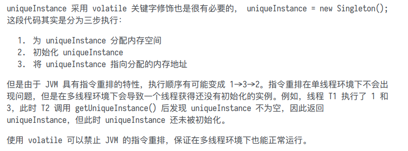

　　需要注意的是，private static volatile SingleTon3 singleTon=null;需要加volatile关键字，否则会出现错误。问题的原因在于JVM指令重排优化的存在。在某个线程创建单例对象时，在构造方法被调用之前，就为该对象分配了内存空间并将对象的字段设置为默认值。此时就可以将分配的内存地址赋值给instance字段了，然而该对象可能还没有初始化。若紧接着另外一个线程来调用getInstance，取到的就是状态不正确的对象，程序就会出错。

　　（4）静态内部类：同样也是利用了类的加载机制，它与饿汉模式不同的是，它是在内部类里面去创建对象实例。这样的话，只要应用中不使用内部类，JVM就不会去加载这个单例类，也就不会创建单例对象，从而实现懒汉式的延迟加载。也就是说这种方式可以同时保证延迟加载和线程安全。


总结为什么需要 volatile 关键字呢？

另外，需要注意 uniqueInstance 采用 volatile 关键字修饰也是很有必要。

uniqueInstance 采用 volatile 关键字修饰也是很有必要的， uniqueInstance = new Singleton(); 这段代码其实是分为三步执行：

1. 为 uniqueInstance 分配内存空间
2. 初始化 uniqueInstance
3. 将 uniqueInstance 指向分配的内存地址

但是由于 JVM 具有指令重排的特性，执行顺序有可能变成 1->3->2。指令重排在单线程环境下不会出现问题，但是在多线程环境下会导致一个线程获得还没有初始化的实例。例如，线程 T1 执行了 1 和 3，此时 T2 调用 getUniqueInstance() 后发现 uniqueInstance 不为空，因此返回 uniqueInstance，但此时 uniqueInstance 还未被初始化。

使用 volatile 可以禁止 JVM 的指令重排，保证在多线程环境下也能正常运行。


## 工厂模式

> 定义一个用于创建对象的接口，让子类决定实例化哪一个类。工厂方法使一个类的实例化延迟到其子类。

**抽象产品类**

```java
public abstract class Product{
    public abstract void doSomething();
}
```

**具体产品类**

```java
public class ConcreteProduct1 extends Product{
    public void doSomething(){}
}

public class ConcreteProduct2 extends Product{
    public void doSomething(){}
}
```

**抽象工厂类**

```java
public abstract class Creatror{
    public abstract <T extends Product> T createProduct(Class<T> c);
}
```

**具体工厂类**

```java
public ConcreteCreator extends Creator{
    public <T extends Product> T createProduct(Class<T> c){
        Product product = null;
        try{
            product = (Product)Class.forName(c.getName()).newInstance();
        }catch(Exception e){
            //异常处理
        }
        return (T)product;
    }
}
```

**场景类**

```java
public class client{
    public static void main(String[] args){
        Creator creator = new ConcreteCreator();
        Product product = creator.createProduct(ConcreteProduct.class);
    }
}
```

### 优点

* 对象创建是有条件约束的，如一个调用者需要一个具体的产品对象，只要知道这个产品的类名（或约束字符串）就可以了，不用知道创建对象的艰辛过程，降低模块间的耦合。
* 扩展性非常优秀。在增加产品类的情况下，只要适当地修改具体的工厂类或扩展一个工厂类，就可以完成“拥抱变化”。
* 屏蔽产品类。这一特点非常重要，产品类的实现如何变化，调用者都不需要关心，它只需要关心产品的接口，只要接口保持不变，系统中的上层模块就不要发生变化。


## 代理模式

> 为其他对象提供一种代理以控制对这个对象的访问。

**抽象主题类**

```java
public interface Subject{
    public void doSomething();
}
```

**真实主题类**

```java
public class RealSubject implements Subject{
    public void doSomething(){}
}
```

**代理类**

```java
public class Proxy implements Subject{
    private Subject subject = null;
    public Proxy(){
        this.subject = new Proxy();
    }
    public Proxy(Subject _subject){
        this.subject = _subject;
    }
    public void doSomething(){
        this.before();
        this.subject.doSomething();
        this.after();
    }
    public void before(){}
    public void after(){}
}
```


## 生产者消费者

```java
import java.util.*;
import java.util.concurrent.atomic.AtomicInteger;

public class SunProducerAndConsumer {
    private static AtomicInteger num = new AtomicInteger();
    private static final int MAX_LEN = 10;
    private Deque<Integer> pool = new LinkedList<>();
    public void produce(){
        while (true){                             // 生产者要一直生产
            try{
                Thread.sleep(3000);               // 控制生产速率
            }catch (InterruptedException e){
                e.printStackTrace();
            }

            synchronized(pool){
                while (pool.size()==MAX_LEN){
                    try {
                        pool.wait();
                    } catch (InterruptedException e) {
                        e.printStackTrace();
                    }
                }

                pool.add(num.incrementAndGet());
                System.out.println(Thread.currentThread() +"] 生产" + num.get() + " [poll size]: " + pool.size());
                pool.notifyAll();
            }
        }
    }
    public void consume(){
        while(true){                             // 消费者要一直消费

            try{
                Thread.sleep(3000);         // 控制消费速率
            }catch (InterruptedException e){
                e.printStackTrace();
            }
            synchronized (pool){
                while (pool.size() == 0){
                    try {
                        pool.wait();
                    } catch (InterruptedException e) {
                        e.printStackTrace();
                    }
                }

                int used = pool.pollFirst();
                System.out.println(Thread.currentThread() +"] 消费" + used + " [poll size]: " + pool.size());
                pool.notifyAll();
            }
        }
    }

    public static void main(String[] args) {
        SunProducerAndConsumer sunProducerAndConsumer = new SunProducerAndConsumer();

        for (int i=0; i<5; i++){
            new Thread(()->{
                sunProducerAndConsumer.produce();
            }, "S"+ i).start();
        }

        for (int i=0; i<3; i++){
            new Thread(()->{
                sunProducerAndConsumer.consume();
            }, "C" + i).start();
        }
    }
```


## 工程Trick

IDEA复制项目Module出现java文件夹source root解决方法：https://www.liqinglin0314.com/article/335

IDEA中maven聚合工程不识别子模块：https://blog.csdn.net/qq_37250199/article/details/103775303

IDEA maven插件使用：https://www.javatt.com/p/85159

[idea] 解决maven刷新后重置Language Level和Java Compiler版本: